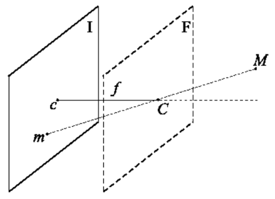
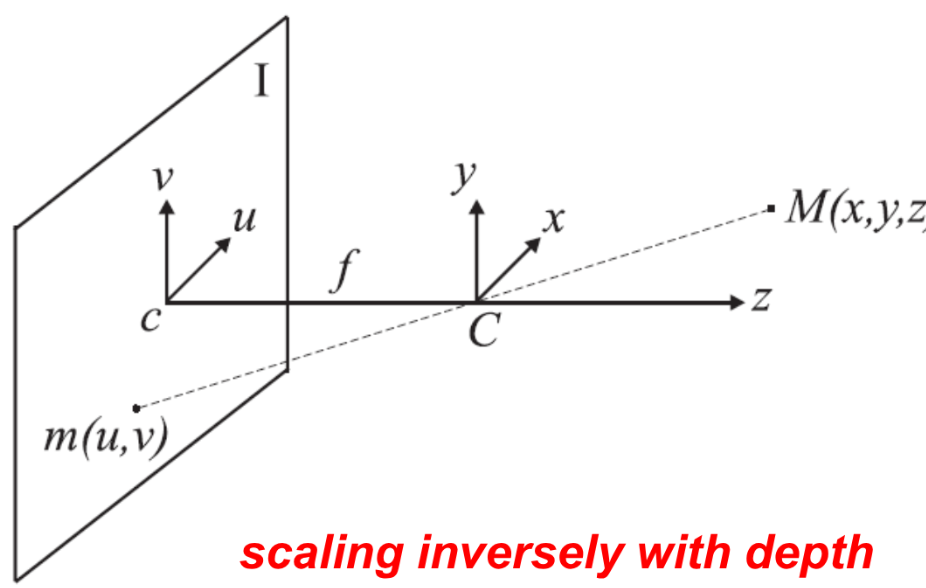

# Image Formation and Acquisition

## Table of Contents
- [Image Formation and Acquisition](#image-formation-and-acquisition)
  - [Table of Contents](#table-of-contents)
  - [Pinhole Camera Model](#pinhole-camera-model)
  - [Prospective Projection](#prospective-projection)
    - [Coordinates](#coordinates)

An imaging device gathers the light reflected by the objects in the 3D world (**scene**) and forms a 2D representation of it (the **image**).

In Computer Vision, we try to invert this process, by inferring information about the 3D world from one or more 2D images.

> Computer Graphics does the opposite: given information on a scene, it generates images of it.
> 
> Computer Vision, instead, given an image, produces information about the scene.

## Pinhole Camera Model

The pinhole camera model is the simplest model of a imaging device. It consists of a box with a small hole on one side (the pinhole) and a photosensitive surface on the opposite side (the image plane). Light rays from the scene pass through the pinhole and project an inverted image on the image plane.

> From every point in the scene, we consider only the light ray from that point that passes through the pinhole.
>
> It turns out that this simple model captures many of the essential properties of real cameras, and is widely used in Computer Vision to understand the geometry of image formation.

## Prospective Projection

The geometric model of image formation in a pinhole camera is known as **perspective projection**.

> We can mathematically model and describe the physical process of image formation using geometric model called perspective projection indeed.

- M: scene point in 3D space with coordinates (X, Y, Z)
- m: corresponding image point on the image plane with coordinates (x, y)
- I: image plane
- C: optical center (pinhole)
- c: intersection between optical axis and image plane (principal point)
- f: focal length (distance between C and I)
- F: focal plane (plane parallel to image plane at distance f from C)

### Coordinates

Considering the reference frame shown in the picture, the equations to map the scene into their corrisponding image points are as follows:

$$
    \frac{u}{x} = \frac{v}{y} = - \frac{f}{z} \ \ \ \  \rarr \ \ \ \  u=-x\ \frac{f}{z} \ \ \ \  v=-y\ \frac{f}{z}
$$

