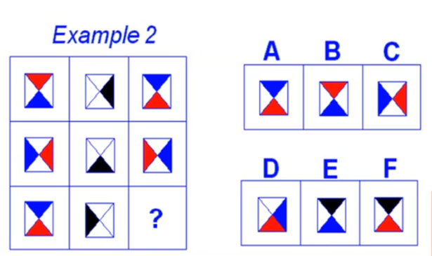

# Introduzione alla Intelligenza Artificiale

[Return](./FondamentiDiAI.md)

# Indice

---

# Blade Runner

"Ho visto cose che voi umani non potreste immaginare" (Roy Batty, replicante)

# Introduzione storica

Formalmente il termine "intelligenza artificiale" nasce nel 1956, in occasione di un workshop tenutosi a Dartmouth, nel New Hampshire, organizzato da John McCarthy, Marvin Minsky, Nathaniel Rochester e Claude Shannon.

"The study is to proceed on the basis of the conjecture that every aspect of learning or any other feature of intelligence can in principle be so precisely described that a machine can be made to simulate it. An attempt will be made to find how to make machines use language, form abstractions and concepts, solve kinds of problems now reserved for humans, and improve themselves."

**Il turco meccanico**

Nel 1770 Wolfgang von Kempelen costruì un automa in grado di giocare a scacchi. L'automa era in realtà un ingegnoso marchingegno, in cui un umano giocava a scacchi all'interno di una struttura meccanica. L'inganno fu svelato solo nel 1820.

**Che cosa è l'intelligenza?**

Noi esseri umani siamo tra le pochissime specie che giocano, quindi il concetto di intelligenza è stata ribaltata sul gioco. 

Esistono diversi tipi di intelligenze, senza una priorità di importanza. Esiste una intelligenza mnemonica per ricordare nozione, una intellligenza logica per elaborare e ragionare secondo schemi logici, intelligena intuitiva, intelligenza empatica per entrare in empatia con il prossimo e di stabilire relazioni. 

Nel 1800 un sinonimo di intelligenza era la capacità di giocare.

**Cartesio**

Cartesio, nel 1637, pubblicò il "Discorso sul metodo", in cui affermava che la mente umana è una macchina, una macchina biologica.

"Qui in particolare mi ero fermato per far vedere che, se vi fosse una macchina, le cui parti fossero fatte e disposte in modo da far vedere, udire e pensare come noi, e che agisse per mezzo di ruote e di pesi, e che mangiasse e digerisse e facesse tutte le altre funzioni proprie della nostra macchina, avremmo nessun modo per riconoscere che essa non fosse di natura simile alla nostra, se non per il fatto che essa non avrebbe alcuna parola e nessun altro segno per dimostrare che essa comprende ciò che dice. Mentre se ce ne fossero di somiglianti a noi che parlassero come noi, dovremmo essere obbligati a riconoscere che esse pensano come noi. Rimangono dunque due metodi per riconoscere la presenza di una mente in una macchina: il primo è che essa risponda alle nostre domande come farebbe un uomo; il secondo è che essa faccia azioni che, se fossero fatte da un uomo, le considereremmo come segni di pensiero. Ma non si deve credere che per questo si possa dire che la macchina pensi, poiché essa non può fare nulla che non sia stato disposto in anticipo da chi l'ha fatta, e non ha alcuna parola per dimostrare che comprende ciò che dice."

# Cos'è l'intelligenza? Come la verifico?

Treccani: "Complesso di facoltà psichiche e mentali che consentono all'uomo di pensare o spiegare i fatti o le azioni, elaborare modelli astratti della realtà, intendere e farsi intendere dagli altri, giudicare, e lo rendono insieme capace di adattarsi a situalizioni nuove e di modificare la situazione stessa quando essa presenta ostacoli all'adattamento."

**Come la verifico?**

Questo test va a misurare una intelligenza logica, non tutto il complesso delle intelligenze umane.

**Il test di Turing**

Il test più famoso per testare l'intelligenza è il test di Turing, che consiste nel far dialogare un umano con un computer e un umano. Se l'umano non riesce a distinguere il computer dall'umano, allora il computer è intelligente.

[Articolo di Turing](): "Computing Machinery and Intelligence", 1950.

**Macchina di Turing**

La macchina di Turing è un modello matematico di calcolatore, in grado di eseguire qualsiasi algoritmo computazionale.

Arriva a definire cosa sia una funzione computabile.

**Eugene Goostman**

Nel 2014 un computer è riuscito a superare il test di Turing, facendo credere a un umano di essere un altro umano.

Il chatbot era programmato per essere un bambino di 13 anni quando non sapeva rispondere a una domanda o era messo in difficoltà diventava aggressivo e volgare, questo comportamento ha ingannato i giudici, più del 70% degli umani ha creduto che il chatbot fosse un bambino.

Non era intelligente, era un evoluzione di un programma scritto del 1966 (Eliza) analizzando pattern matching sulle lettere ogni domanda e aveva una risposta pronta per ogni domanda.

**Oltre il test di Turing**

- Schemi di Winograd

> **Esempio**: "Giovanna aveva ringraziato Maria per il libro che le aveva prestato. Lei lo aveva letto in una sola sera." A chi si riferisce "lei"?

- Giochi Matematici

Una volta che si è modellato programmato un CSP il computer ci mette pochi secondi a risolverlo, mentre un umano ci mette molto più tempo.

Qual è il problema? 

Che è l'umano che converte da grafica e linguaggio naturale in linguaggio per il computer. C'è questo aspetto creativo che il computer non ha.

**Searle e la stanza cinese**

"Ci sono sistemi che passano il test di turing ma non sono intelligenti?"

Per searle si.

Lo scenario della stanza cinese è il seguente: un umano è chiuso in una stanza, e gli vengono passate delle domande in cinese e lui deve rispondere in cinese. L'umano non sa il cinese, ma ha a disposizione un libro con le risposte. L'umano riesce a passare il test di Turing, ma non sa il cinese.

# Intelligenza Artificiale debole e forte

- **Debole**
  - Dovremmo porci il problema di creare macchine in modo che agiscano come se fossero intelligenti?
- **Forte**
  - È possibile costrutire macchine che pensino intelligentemente? che abbiano volontà, sentimenti?

## Approccio ingegneristico

L'aereo dei fratelli Wright non volava come un uccello, ma volava. (Debole)

**Previsione di Turing**

"Prevedo che in circa 50 anni sarà possibile programmare un computer con una capacità di memoria di 10^9 capaci di giocare the Imitation Game"

