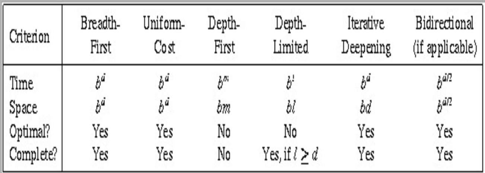

# Strategie di Ricerca Non Informate

[Return](./README.md)

# Indice

- [Strategie di Ricerca Non Informate](#strategie-di-ricerca-non-informate)
- [Indice](#indice)
  - [Cercare Soluzioni](#cercare-soluzioni)
    - [Generare sequenze di azioni](#generare-sequenze-di-azioni)
  - [Stategie di Ricerca](#stategie-di-ricerca)
    - [Strategie non informate (blind)](#strategie-non-informate-blind)
      - [Breadth-first search](#breadth-first-search)
      - [Depth-first search](#depth-first-search)
      - [Depth-first search a profondità limitata](#depth-first-search-a-profondità-limitata)
      - [Iterative deepening search](#iterative-deepening-search)

---

## Cercare Soluzioni

Un agente con diverse opzioni di esito sconosciuto può decidere cosa fare esaminando le sequenzi di azioni possibili che lo portano a stati diversi, scegliendo quella migliore. Questo processo è chiamato **Ricerca**.

È utile pensare al processo di ricerca come la costruzione di un albero i cui nodi sono stati e i cui rami sono operatori.

Un algorirmo di ricerca prende come input un problema e restituiisce una soluzione nella forma di una sequenza di azioni

Realizzare le azioni suggerite è detto **esecuzione**.

### Generare sequenze di azioni

- **Espansione**: si parte da uno stato e si applicano gli operatori generando nuovi stati.
- **Strategia di ricerca**: ad ogni passo scegliere quale stato espandere.
- **Albero di ricerca**: rappresenta l'espansione degli stati a partire dallo stato iniziale.

## Stategie di Ricerca

I problmi risolti dai sistemi basati sulla conoscenza sono non-deterministici. In un certo istante più azioni possono essere svolte.

**Strategia**: è una informazione che sarà applicata potendone invocare molteplici, ci sono due possibilità:
- Non utilizzare alcuna conoscenza sul dominio applicando regole in modo casuale e fare una ricerca ESAUSTIVA.
- Utilizzare **conoscenza euristica** sul problema per la selezione degli operatori applicabili, questo approccio si dice **STRATEGIA INFORMATA**.

Le strategie si valutano in base a quattro criteri:
- **completezza**: "La strategia garantisce di trovare una soliuzione se esiste?"
- **complessità temporale**: "Quanto tempo impiega a trovare una soluzione?"
- **complessità spaziale**: "Quanto spazio di memoria richiede?"
- **ottimalità**: "La soluzione trovata è la migliore possibile?"

### Strategie non informate (blind)

- **Breadth-first search**: Espande i nodi a livello n prima di espandere i nodi a livello n+1. Utilizza una coda FIFO per memorizzare gli stati da esp
- **Depth-first search**: Espande i nodi a livello n prima di espandere i nodi a livello n-1. Utilizza una coda LIFO per memorizzare gli stati da espandere.
- **Depth-first search a profondità limitata**: Espande i nodi a livello n prima di espandere i nodi a livello n-1. Utilizza una coda LIFO per memorizzare gli stati da espandere, ma limita la profondità di ricerca.
- **Iterative deepening search**: Espande i nodi a livello n prima di espandere i nodi a livello n-1. Utilizza una coda LIFO per memorizzare gli stati da espandere, ma aumenta la profondità di ricerca ad ogni iterazione.

#### Breadth-first search

- **Profondità**: la profondità del nodo da cui si parte è uguale a 0, la profondità di un altro nodo è quella del genitore + 1.

**Espande sempre i nodi meno profondi dell'albero**.

Nel caso peggiore se la profondità è $d$ e il fattore di ramificazione $b$, il numero di nodi espanse è $b^d$ (complessità temporale)

$$-1+b+b^2+\dots+(b^d-1)\rArr b^d$$

all'ultimo livello sottraiamo 1 perchè il goal non viene ulteriormente espanso.

Coincide anche con la complessità spaziale.

Garantisce **completezza** ma non permette una efficiente implementazione su sistemi mono-processore.

Il problema della memoria è il più grave, per un problema con profondità 10 e fattore di ramificazione 10, il numero di nodi espansi è 10^10, con 1000 nodi espansi al secondo ci vorrebbero 128 giorni e 1TB di memoria supponendo 100 byte per nodo.

Se il costo coincide con la profondità trova sempre la soluzione a costo minimo.

#### Depth-first search

Espande i nodi più profondi dell'albero, i nodi alla stessa profondità vengono espansi arbitrariamente (quelli più a sinistra).

Richiede una occupazione di memoria più ridotta, in quanto si può memorizzare solo il cammino corrente e i nodi espansi, complessità spaziale $O(bd)$.

La complessità temporale è analoga a breadth-first search $O(b^d)$

È completa se il fattore di ramificazione è finito e il costo delle azioni è limitato.
Se il costo coincide con la profondità trova sempre la soluzione a costo minimo.

#### Depth-first search a profondità limitata

Come depth-first search ma con una profondità massima di ricerca $l$.

Non è detto che si arrrivi a una soluzione, ma se esiste una soluzione a profondità $l$ la trova.

Non è detto che sia ottimale, ma è più efficiente di depth-first search.

La complessità temporale è $O(b^l)$ e la complessità spaziale è $O(bl)$.

#### Iterative deepening search

Espande i nodi più profondi dell'albero, procedendo iterativamente a profondità limitata, prima 0 poi 1 ecc...

È completa e sviluppa un solo ramo alla volta.

È il metodo preferitp quando si ha uno spazio di ricerca molto ampio.

con:

b = fattore di ramificazione
d = profondità del nodo soluzione
m = profondità massima dell'albero
l = profondità massima di ricerca
