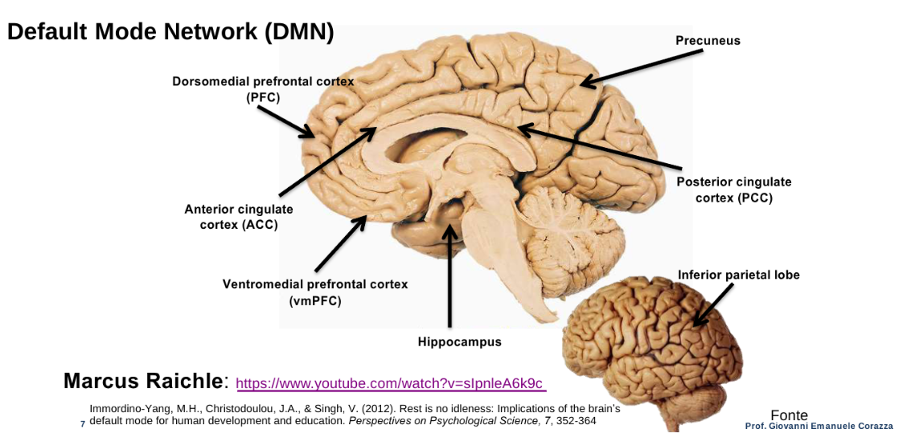
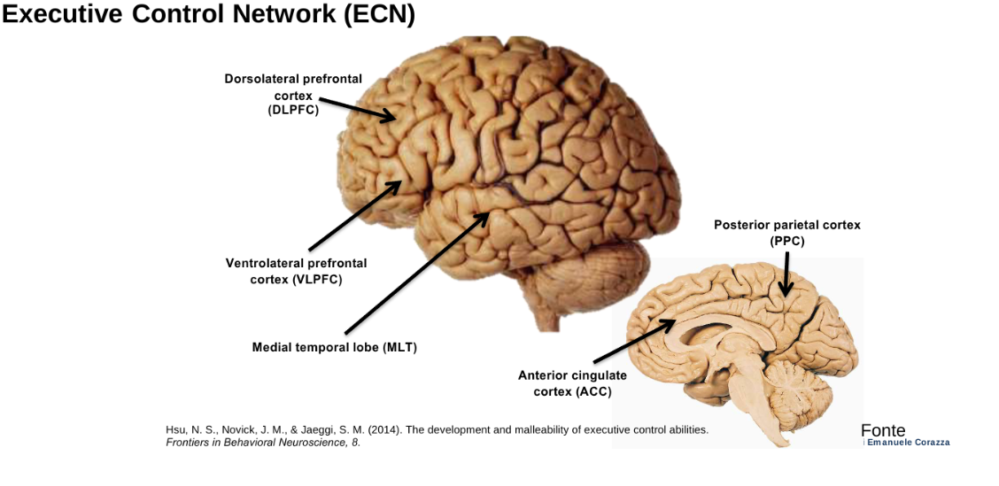
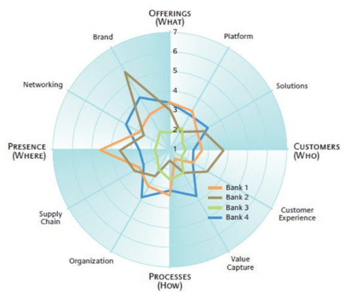
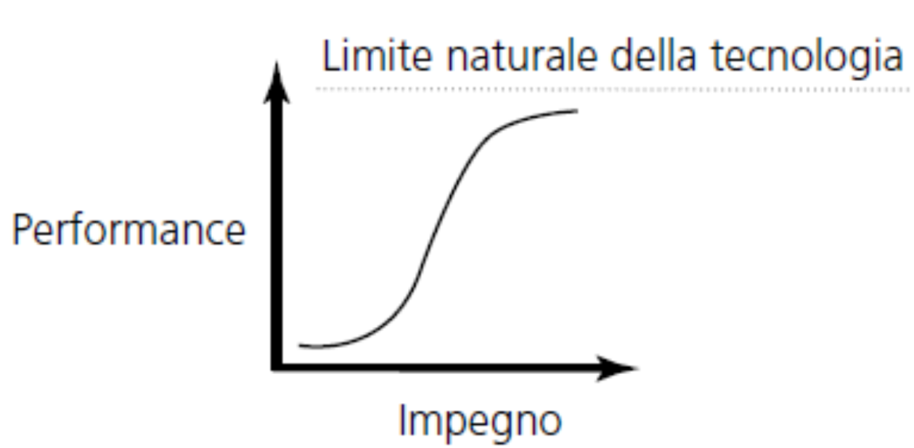
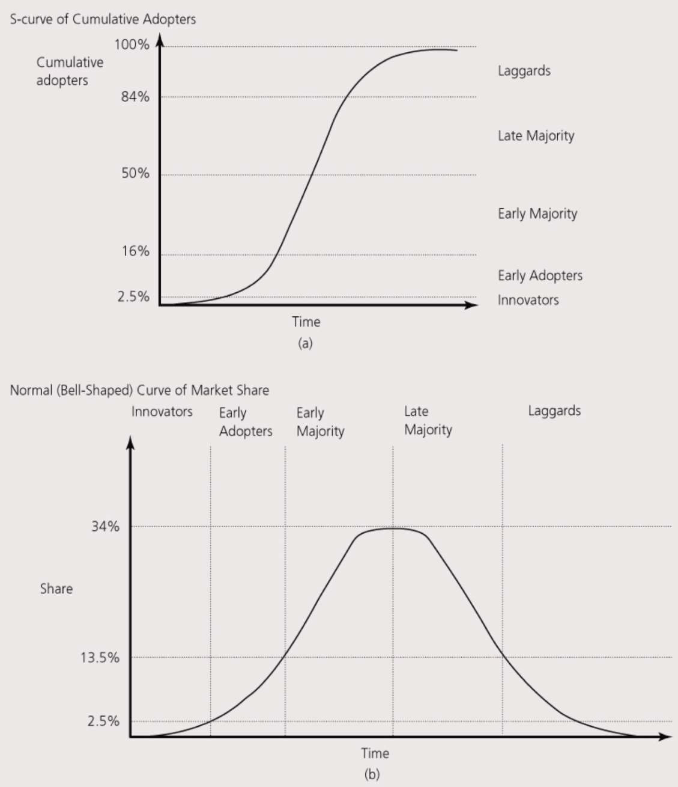
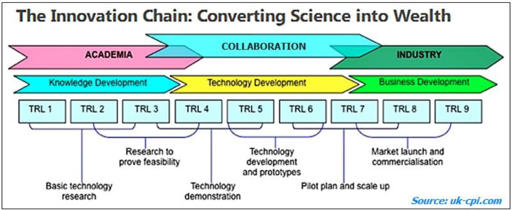

<!-- mathjax -->

# Capitolo 1: Fonti di Innovazione, Forme e Modelli di Innovazione, e Dinamiche Evolutive delle Nuove Tecnologie

## Indice:
- [Capitolo 1: Fonti di Innovazione, Forme e Modelli di Innovazione, e Dinamiche Evolutive delle Nuove Tecnologie](#capitolo-1-fonti-di-innovazione-forme-e-modelli-di-innovazione-e-dinamiche-evolutive-delle-nuove-tecnologie)
  - [Indice:](#indice)
  - [1. Le Fonti di Innovazione](#1-le-fonti-di-innovazione)
    - [Le Imprese come Motore di Innovazione](#le-imprese-come-motore-di-innovazione)
    - [Il Ruolo delle Università e degli Utenti](#il-ruolo-delle-università-e-degli-utenti)
    - [Creatività e Opportunità Innovativa](#creatività-e-opportunità-innovativa)
  - [2. Forme e Modelli di Innovazione](#2-forme-e-modelli-di-innovazione)
    - [Definizione di Innovazione](#definizione-di-innovazione)
    - [Forme di Innovazione](#forme-di-innovazione)
  - [3. Dinamiche Evolutive delle Nuove Tecnologie](#3-dinamiche-evolutive-delle-nuove-tecnologie)
    - [Le Curve a S e la Performance Tecnologica](#le-curve-a-s-e-la-performance-tecnologica)
    - [Ciclo di Vita Tecnologico e Disegno Dominante](#ciclo-di-vita-tecnologico-e-disegno-dominante)
    - [Tecnologia e Diffusione (Curva a S di Rogers)](#tecnologia-e-diffusione-curva-a-s-di-rogers)
  - [4. Protezione dell'Innovazione e Proprietà Intellettuale (IP)](#4-protezione-dellinnovazione-e-proprietà-intellettuale-ip)
    - [Innovare o Imitare: Il Regime di Appropriabilità](#innovare-o-imitare-il-regime-di-appropriabilità)
    - [Gli Strumenti della Proprietà Intellettuale (IP)](#gli-strumenti-della-proprietà-intellettuale-ip)

## 1. Le Fonti di Innovazione

L'innovazione è un fenomeno complesso che si origina da un ecosistema di attori interconnessi, tra cui: **imprese**, **individui**, **università**, **enti pubblici di ricerca** e **organizzazioni non profit/fondazioni private**.

### Le Imprese come Motore di Innovazione

Le imprese sono considerate il motore primario dell'innovazione. Rispetto ai singoli individui, dispongono di maggiori risorse economiche e di un sistema di gestione strutturato per indirizzare tali risorse verso uno scopo collettivo.
La **Ricerca e Sviluppo (R&S)** all'interno delle aziende si suddivide in tre ambiti principali:
1.  **Ricerca di base:** finalizzata unicamente all'aumento della conoscenza scientifica, senza un'immediata applicazione commerciale.
2.  **Ricerca applicata:** volta ad accrescere la conoscenza, ma per rispondere a un'applicazione o un'esigenza specifica.
3.  **Sviluppo:** attività che applicano la conoscenza esistente per produrre materiali, dispositivi o processi utili.

**Approcci alla R&S: *Science Push* e *Demand Pull***
L'innovazione può seguire due percorsi logici distinti:
*   **Approccio *Science Push***: La sequenza è guidata dalla scienza. Si parte dalla scoperta scientifica, che conduce all'invenzione, seguita dalla produzione e infine dal marketing.
*   **Approccio *Demand Pull***: L'innovazione è guidata dal mercato. Il processo inizia con problemi o suggerimenti avanzati dai clienti, che stimolano l'invenzione e la produzione. Questo approccio è oggi molto utilizzato.

### Il Ruolo delle Università e degli Utenti

Le **Università** sostengono attivamente la ricerca che può generare innovazioni utili. Le loro missioni istituzionali sono tre: didattica, ricerca e trasferimento tecnologico. Per rafforzare il legame tra ricerca e sviluppo di innovazioni, molti atenei hanno istituito Uffici di Trasferimento Tecnologico.
Gli **individui (utenti)** sono un'altra fonte cruciale. Spesso sono gli utenti stessi a generare innovazioni creando soluzioni per le proprie esigenze, modificando autonomamente i prodotti esistenti. Lo snowboard, ad esempio, è un caso di invenzione nata da più individui con esigenze personali.

### Creatività e Opportunità Innovativa

La **creatività** è il processo fondamentale per la generazione di idee che siano sia nuove che utili. Il pensiero creativo non è un processo lineare, ma implica **interazioni dinamiche tra sistemi cerebrali su larga scala**. Due reti neurali principali cooperano in questo processo, sebbene possano mostrare relazioni antagoniste:
*   **Default Mode Network (DMN):** Si attiva quando il cervello è a riposo o durante il sonno REM. È associato ad attività come il sognare ad occhi aperti, l'introspezione e il dare un senso al mondo. Disfunzioni del DMN possono essere associate a depressione o insonnia.

    

*   **Executive Control Network (ECN):** Coinvolge funzioni esecutive, come il controllo, la flessibilità, la pianificazione, l'inibizione e la cognizione sociale.
     
    

L'innovazione vera e propria non è solo creatività, ma la realizzazione di un'**opportunità innovativa**, che è intesa come il "senso del possibile" (*sense of possible*).

Un'opportunità (che non è solo una semplice idea creativa) deve essere **attrattiva, tempestiva, durevole e ancorata in un prodotto/servizio**. Inoltre, deve riguardare la **creazione di valore**, e non solo la riduzione dei costi. Le migliori opportunità nascono risolvendo un problema o soddisfacendo un bisogno per cui i clienti sono disposti a pagare.

**Il Processo di Identificazione di Opportunità**
L'identificazione delle opportunità è un processo **graduale e cumulativo**, basato principalmente sul *pattern recognition*. Questo processo si svolge in tre *step*:
1.  **Osservare** diversi eventi nell'ambiente, inclusi cambiamenti sociali, tecnologici e di mercato.
2.  **Identificare la connessione** tra eventi apparentemente non correlati. Gli innovatori spesso usano le proprie conoscenze per cogliere queste connessioni.
3.  La ricerca di opportunità è essenzialmente una **ricerca di modelli** (*patterns*).

Un esempio notevole di creazione di connessioni è l'invenzione del deodorante *roll-on* (1952) mutuando l'idea dalla penna a sfera.

## 2. Forme e Modelli di Innovazione

### Definizione di Innovazione

Una visione limitata dell'innovazione (solo come nuovi prodotti, tecnologie, R&S o digitale) può portare le aziende a ignorare opportunità significative e a rendersi vulnerabili alla concorrenza.
La definizione istituzionale (Oslo Manual, OECD, 3° Edition) è ampia:
> **"Un'innovazione è l'implementazione di un prodotto (bene o servizio) o di un processo nuovo o significativamente migliorato, di un nuovo metodo di marketing, o di un nuovo metodo organizzativo nelle pratiche aziendali, nell'organizzazione del luogo di lavoro o nelle relazioni esterne"**.

La visione chiave nell'ambito della gestione dell'innovazione è che l'innovazione è la **capacità di creare nuovo valore per servire meglio i clienti esistenti e/o nuovi clienti**. Essa risulta dalla combinazione di due dimensioni:

$\text{Innovazione} = \text{Invenzione (dimensione tecnologica)} + \text{Sfruttamento commerciale (dimensione di mercato)}$

**Il Modello Lineare dell'Innovazione**
Questo modello illustra il percorso sequenziale che trasforma la conoscenza in innovazione:
*   Si parte dalla **Ricerca di base** (Scoperta).
*   Si passa alla **Ricerca applicata** (Invenzione/Tecnologia).
*   Si procede con lo **Sviluppo Prodotto** (Invenzione/Prototipo, Prodotto).
*   Si conclude con la **Diffusione**, che rappresenta l'Innovazione nel mercato.
L'aumento del rischio diminuisce man mano che ci si avvicina alla fase di Diffusione.

**La Creazione di Valore (Visione a 360°)**
L'innovazione di business è definita come la **creazione di nuovo valore sostanziale per i consumatori e l’impresa** attraverso il cambiamento creativo di una o più dimensioni del sistema di business. Questa prospettiva ha tre implicazioni fondamentali:
1.  Riguarda il **nuovo valore**, non necessariamente le *nuove cose*.
2.  Si presenta in **molteplici forme** (*many flavors*).
3.  È **sistemica** (*systemic*), il che significa che coinvolge l'intero ecosistema aziendale.

**Innovation Radar**
L'Innovation Radar è uno strumento concettuale che permette di mappare e mettere in relazione le **dodici dimensioni** lungo le quali un'azienda può innovare. Queste dimensioni sono ancorate a quattro pilastri:
*   **Offerings (COSA):** Riguarda la creazione di prodotti innovativi, l'uso di piattaforme comuni, e l'offerta di soluzioni integrate (es. Brand, Platform, Solutions).
*   **Customers (CHI):** Focalizzato sul cliente (es. Customer Segments, Customer Experience).
*   **Processes (COME):** Riguarda i processi interni e la cattura di valore (es. Value Capture, Processes, Organization).
*   **Presence (DOVE):** Riguarda l'ambito esterno e la struttura di interazione (es. Supply Chain, Presence, Networking).

L'utilità del Radar d'Innovazione consiste nel facilitare il confronto strategico con i concorrenti, identificare le lacune strategiche (dove l'azienda non innova) e la possibilità di intervenire prioritariamente su determinate dimensioni. Soprattutto, aiuta a comprendere l'importanza di **innovare congiuntamente lungo più dimensioni**.

### Forme di Innovazione

L'innovazione viene classificata in base al suo impatto, alla sua ampiezza o all'ambito di destinazione:

1.  **Innovazione di Prodotto e di Processo (Abernathy e Utterback)**:
    *   Le **Innovazioni di Prodotto** sono incorporate nei beni o servizi realizzati.
    *   Le **Innovazioni di Processo** sono cambiamenti nelle modalità con cui un'impresa svolge le attività, mirando all'efficienza o all'efficacia.
    *   Un'innovazione può essere di prodotto per un'azienda e di processo per un'altra (ad esempio, un nuovo macchinario per l'azienda produttrice è un prodotto, mentre per l'azienda acquirente è un'innovazione di processo).

2.  **Innovazione Radicale e Incrementale (Tushman e Anderson)**:
    *   Le **Innovazioni Incrementali** consistono in miglioramenti, revisioni o integrazioni degli elementi di base di una proposta di valore, rendendola più economica, rapida o affidabile.
    *   Le **Innovazioni Radicali** implicano una discontinuità assoluta con il passato, creando nuove utilità attraverso cambiamenti significativi (es. materiali, design).
    *   Il carattere radicale o incrementale è relativo e dipende dalla distanza dall'esistente e dalla prospettiva di analisi.

3.  **Innovazione *Competence Enhancing* e *Competence Destroying*** **(Tushman e Anderson)**:
    *   L'innovazione è ***Competence Enhancing*** quando costituisce un'evoluzione o un potenziamento della base di conoscenze preesistenti dell'azienda.
    *   L'innovazione è ***Competence Destroying*** quando non deriva dalle conoscenze attuali o, peggio, le rende inadeguate.

4.  **Innovazione Architetturale e Modulare (Henderson e Clark)**:
    *   L'**Innovazione Modulare** (o di componente) cambia uno o più componenti, ma lascia inalterata la configurazione generale del sistema (es. un sellino di bicicletta in un nuovo materiale).
    *   L'**Innovazione Architetturale** (spesso radicale) modifica la struttura complessiva del sistema o il modo in cui i componenti interagiscono tra loro (es. il passaggio dall'auto tradizionale a quella elettrica).

## 3. Dinamiche Evolutive delle Nuove Tecnologie

L'innovazione, secondo Schumpeter, è un processo di **Distruzione Creatrice** (*creative destruction*). Questo processo è fondamentale in quanto crea nuove opportunità, nuovi settori e mercati, e modifica le strutture esistenti, fungendo da fonte di vantaggio competitivo.

### Le Curve a S e la Performance Tecnologica

Sia il tasso di miglioramento della *performance* di una tecnologia sia la sua diffusione nel mercato tendono a seguire l'andamento di una **curva a S**.

*   **Fase Iniziale (Fermento):** Il miglioramento della performance è lento, in quanto i principi di base sono ancora parzialmente compresi. Per tecnologie emergenti, i miglioramenti possono essere sorprendentemente rapidi.
*   **Fase di Sviluppo (Crescita):** La performance migliora rapidamente man mano che la conoscenza e l'impegno in R&S aumentano.
*   **Fase di Maturità:** La curva si appiattisce quando la tecnologia si avvicina al suo **limite naturale** (determinato da vincoli fisici, come le proprietà chimico-fisiche della materia).

Le tecnologie esistenti spesso vengono rimpiazzate da nuove tecnologie **discontinue** (radicali) prima di raggiungere il loro limite naturale, il che può innescare una nuova curva a S.

**Il Modello di Fisher-Pry per la Previsione Tecnologica**
Questo modello logistico è utilizzato per prevedere l'evoluzione della *performance* e le dinamiche di sostituzione tecnologica (diffusione nel mercato).
Le due formule principali sono:
1.  $y = \frac{L}{[1 + be^{-ct}]}$ per l'evoluzione della performance ($y$) dove $L$ è il limite superiore.
2.  $f = \frac{1}{[1 + be^{-ct}]}$ per l'analisi di sostituzione, dove $f$ è la quota di mercato della nuova tecnologia (con limite superiore pari a 1, o 100%).

I parametri $b$ e $c$ sono incognite da stimare per determinare la forma della curva:
*   $c$ (coefficiente di interazione) modifica la **forma** della curva (all'aumentare di $c$, la curva si fa più verticale).
*   $b$ (legato al tempo $t0$) modifica la **posizione** della curva, in quanto $t0$ è il tempo in cui la diffusione sarà al 50%.

Il modello assume che il progresso della nuova tecnologia sia competitivo rispetto a quella esistente e che, una volta iniziata la sostituzione, essa andrà a completamento.

**I Limiti delle Curve a S**
L'uso delle curve a S presenta dei limiti:
1.  I limiti effettivi di una tecnologia sono spesso sconosciuti.
2.  Cambiamenti inattesi (nel mercato o nelle tecnologie complementari) possono allungare o accorciare il ciclo di vita.
3.  Le imprese rischiano di adottare la nuova tecnologia *troppo presto* o *troppo tardi* se seguono il modello rigidamente.

### Ciclo di Vita Tecnologico e Disegno Dominante

I cambiamenti innescati da una discontinuità tecnologica procedono ciclicamente (Anderson e Tushman):
1.  **Era di Fermento:** Innescata dalla discontinuità, è un periodo di turbolenza e incertezza, caratterizzato da competizione tra diversi disegni tecnologici alternativi.
2.  **Affermazione del Disegno Dominante:** È lo spartiacque. Quando un modello (spesso un'innovazione architetturale) si afferma, la competizione si concentra.
3.  **Era di Cambiamento Incrementale:** Inizia dopo l'affermazione del disegno dominante; le imprese si concentrano sui miglioramenti incrementali.

**I Rischi per gli *Incumbent***
Le aziende storiche (*Incumbent*) falliscono spesso di fronte alle discontinuità a causa di:
*   **Mancanza di incentivi economici:** ad esempio, la paura di cannibalizzare il proprio *business* tradizionale.
*   **Mancanza di competenze e inerzia organizzativa**.
*   **Miopia e limiti cognitivi:** non riconoscere la minaccia o l'opportunità (*“Questi non sono orologi!!!”*).

Per non soccombere alla *disruption*, gli *incumbent* dovrebbero:
*   Mantenere **"sensori" adeguati** sullo sviluppo delle nuove tecnologie (*exploration* vs. *exploitation*).
*   Mantenere **"opzioni" aperte** (ad esempio, tramite collaborazioni o acquisizioni educative).
*   Promuovere autonomia e imprenditorialità interna (organizzazione duale).
*   Sfruttare le **risorse complementari** per colmare un ritardo tecnologico.

### Tecnologia e Diffusione (Curva a S di Rogers)

La diffusione dell'innovazione segue una curva a S e gli adottanti sono suddivisi in categorie, secondo percentuali specifiche:
1.  **Innovatori (*Innovators*, 2.5%):** Amanti delle nuove idee, propensi al rischio e con conoscenze tecniche superiori alla media.
2.  **Adottanti Iniziali (*Early Adopters*, 13.5%):** Hanno reputazione, sono inseriti nel gruppo sociale e fungono da punti di riferimento.
3.  **Maggioranza Anticipatrice (*Early Majority*, 34%):** Adottano a seguito di un processo ponderato di scelta.
4.  **Maggioranza Ritardataria (*Late Majority*, 34%):** Sono scettici e adottano solo per necessità economica o sociale, convinti dall'esperienza altrui.
5.  **Ritardatari (*Laggards*, 16%):** Sono legati alla tradizione e adottano solo quando non è più possibile farne a meno.

**Superare l'Abisso (*The Chasm*)**
Il passaggio cruciale è dagli *Early Adopters* alla *Early Majority*, un divario noto come **"L'Abisso"** (*The Chasm*). Per superarlo, è essenziale (Moore):
*   Fornire una **chiara proposta di valore** e un **sistema completo di prodotto**.
*   Focalizzarsi su una **nicchia di mercato iniziale** (strategia "testa di ponte") per poi diffondersi con una strategia di marketing verticale.
*   Identificare gruppi di clienti con forti motivazioni all'acquisto (es. nuove funzionalità, riduzione costi).

**Technology Readiness Levels (TRL)**
La scala TRL, sviluppata dalla NASA negli anni '90 e adottata in programmi come Horizon 2020, misura la maturità di una tecnologia in 9 livelli, dalla Ricerca di base (TRL 1) alla Prima produzione (TRL 9).

**Alcuni livelli chiave sono**:
*   **TRL 1 (Ricerca di base):** Osservazione dei principi fondamentali.
*   **TRL 3:** *Proof of concept* sperimentale.
*   **TRL 7:** Dimostrazione del prototipo in ambiente operativo reale.
*   **TRL 9:** Dimostrazione completa del sistema in ambiente operativo reale (prova funzionale, applicazione al settore industriale specifico).

## 4. Protezione dell'Innovazione e Proprietà Intellettuale (IP)

### Innovare o Imitare: Il Regime di Appropriabilità

Non sempre essere il *first mover* garantisce il successo; in molti casi, i *follower* (imitatori) hanno prevalso. Il successo dell'innovatore dipende dal **Regime di Appropriabilità**, ovvero la possibilità dell'innovatore di beneficiare in via esclusiva dei ritorni economici del nuovo prodotto o processo.

**Vantaggi e Svantaggi del *First Mover***
Il vantaggio del *first mover* è sostenibile se i concorrenti non riescono a duplicare la tecnologia.
*   **Vantaggi:** Trasformare il *gap* tecnologico in altri benefici (es. reputazione, costi di sostituzione, curva di apprendimento esclusiva), accedere a risorse scarse, definire gli standard e ottenere profitti iniziali.
*   **Costi del Pionierismo (Svantaggi):** Maggiori costi dovuti all'educazione degli acquirenti, allo sviluppo delle infrastrutture e degli input necessari. C'è un rischio maggiore legato all'incertezza della domanda, ai cambiamenti dei bisogni dei clienti, alla possibilità di discontinuità tecnologiche, e alle imitazioni a basso costo da parte dei *follower*.

**Fattori che Influenzano l'Appropriabilità**
La sostenibilità del primato tecnologico è influenzata da:
1.  **Tipologia di innovazione:** Le innovazioni di prodotto sono più facili da imitare di quelle di processo.
2.  **Natura della conoscenza:** La conoscenza **tacita** (non codificabile) non può essere trasferita tramite brevetti ed è più difficile da replicare rispetto alla conoscenza esplicita.
3.  **Caratteristiche della tecnologia:** In settori con tecnologie **discrete** (es. farmaceutica) bastano pochi brevetti per controllare la tecnologia; nei settori con tecnologie **sistemiche** (es. elettronica) sono necessari molti brevetti per controllare tutti i componenti complementari.
4.  **Risorse complementari:** Il *know-how* tecnologico deve essere utilizzato congiuntamente con altre risorse (produzione, distribuzione, servizio, fornitori).

### Gli Strumenti della Proprietà Intellettuale (IP)

Gli strumenti legali di IP sono cruciali per garantire l'appropriazione esclusiva:

*   **Brevetti (*Patents*):**
    *   Riguardano **nuove invenzioni** che implichino un'attività inventiva e siano suscettibili di applicazione industriale.
    *   Conferiscono un **monopolio negativo** (*ius excludendi alios*) limitato nel tempo (in genere 20 anni) e nello spazio.
    *   In cambio del monopolio, l'inventore deve fornire una **sufficiente descrizione** dell'invenzione, portandola a conoscenza del pubblico.
    *   **Esclusioni:** Non sono considerate invenzioni brevettabili (in quanto tali) le scoperte, le teorie scientifiche e i metodi matematici, i metodi per attività intellettuali o commerciali e i **programmi per elaboratore** (*software*).
    *   **Brevettabilità del Software in Europa:** Il software è brevettabile solo se possiede una **natura tecnica**, ovvero risolve un problema tecnico con mezzi tecnici e produce un **"ulteriore effetto tecnico"** che va oltre le interazioni normali tra programma e computer. Esempi di "ulteriore effetto tecnico" includono il controllo di un processo industriale o l'ottimizzazione del funzionamento interno di un computer.

*   **Diritto d'Autore (*Copyright*):**
    *   Riguarda le **forme creative o artistiche originali** (letteratura, musica, codice software).
    *   Esiste **automaticamente** con la creazione e non richiede deposito.
    *   Dura per la vita dell'autore più 70 anni.

*   **Marchi (*Trade Marks*):**
    *   Servono per l'**identificazione distintiva** di prodotti o servizi (parole, disegni, suoni, forme).
    *   I requisiti di validità sono la novità, la capacità distintiva, la liceità e la veridicità.
    *   La durata è potenzialmente **illimitata** (dieci anni rinnovabili).

*   **Disegni Registrati (*Registered Designs*):**
    *   Riguardano l'**aspetto esteriore (estetico)** di un prodotto o di una sua parte, non le caratteristiche tecniche.
    *   Devono essere nuovi e avere carattere individuale.
    *   Durata massima 25 anni.

*   **Segreti Industriali (*Trade Secrets*):**
    *   Riguardano informazioni aziendali o esperienze tecnico-industriali di **valore economico** che sono **segrete** e non facilmente accessibili.
    *   È necessario che il detentore adotti misure ragionevolmente adeguate a mantenerle segrete.

**Uso Strategico dei Brevetti**
I brevetti non servono solo per la difesa e l'esclusione dei concorrenti. Vengono usati strategicamente anche come:
*   **Fonte di entrate:** attraverso accordi di *licensing*. I guadagni possono derivare da una componente fissa (*Down-payment/Milestones Payment*) e da una variabile (*Royalties*).
*   **Strumento di negoziazione:** per accordi di R&S o *cross-licensing*.
*   **Strumento finanziario:** per facilitare l'accesso a finanziamenti (banche, Venture Capital).