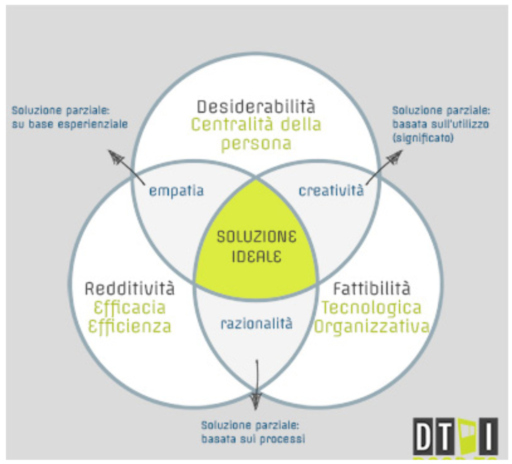
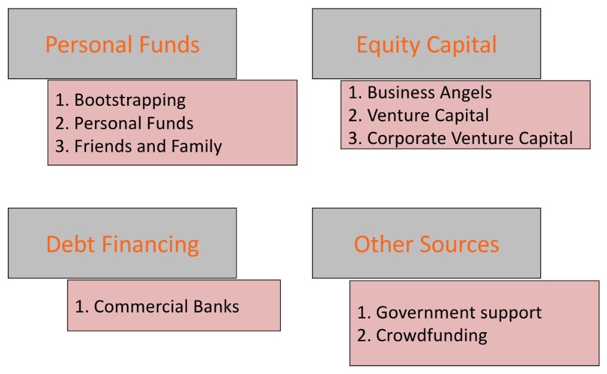
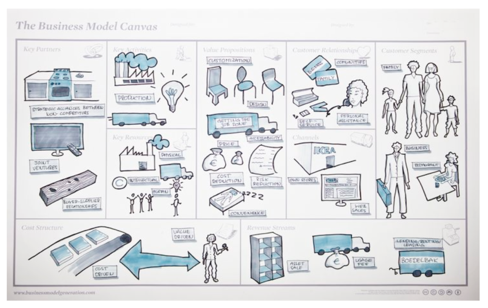
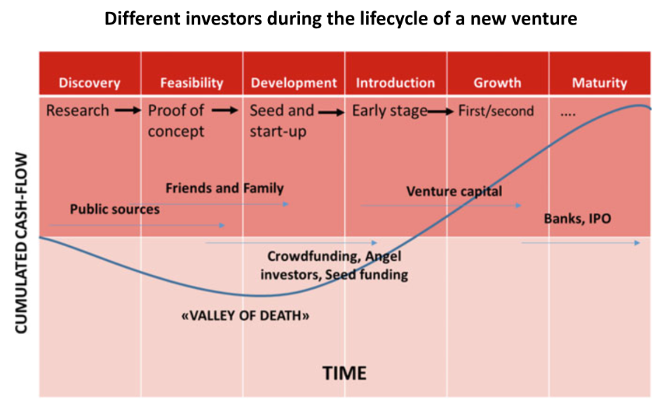

# File 2: Protezione dell'Innovazione, Analisi di Settore, Design Thinking, e Business Model

## Indice:
- [File 2: Protezione dell'Innovazione, Analisi di Settore, Design Thinking, e Business Model](#file-2-protezione-dellinnovazione-analisi-di-settore-design-thinking-e-business-model)
  - [Indice:](#indice)
  - [1. Analisi di Settore e Bisogni dei Clienti](#1-analisi-di-settore-e-bisogni-dei-clienti)
    - [Analisi di Settore](#analisi-di-settore)
    - [Analisi dei Bisogni del Cliente e Design Thinking](#analisi-dei-bisogni-del-cliente-e-design-thinking)
  - [2. Modelli di Business e Finanziamento](#2-modelli-di-business-e-finanziamento)
    - [Business Model (BM)](#business-model-bm)
    - [Finanziamento per le Startup](#finanziamento-per-le-startup)
    - [Il Piano Finanziario](#il-piano-finanziario)
  - [3. Il Pitch e la Comunicazione Efficace](#3-il-pitch-e-la-comunicazione-efficace)
    - [Struttura e Regole del Pitch](#struttura-e-regole-del-pitch)
    - [Come Essere Persuasivi e Stile di Presentazione](#come-essere-persuasivi-e-stile-di-presentazione)
    - [Principi di Comunicazione Efficace](#principi-di-comunicazione-efficace)

## 1. Analisi di Settore e Bisogni dei Clienti

### Analisi di Settore

È cruciale distinguere tra **Settore (*Industry*)** (gruppo di imprese che offrono prodotti/servizi simili) e **Mercato (*Market*)** (l'insieme degli acquirenti attuali e potenziali).

L'analisi di settore si articola in quattro fasi:
1.  **Definizione del Settore:** Identificare il settore in modo puntuale (usando codici ATECO, SIC o NAICS) e identificare tutti i settori in cui l'impresa opera.
2.  **Dimensione e Crescita:** Mostrare la dimensione (in $) e il tasso di crescita (in %) del settore, con proiezioni su un orizzonte pluriennale (3-5 anni). È importante non fornire informazioni distorte sulla crescita.
3.  **Caratteristiche Competitive:** Analizzare la concentrazione/frammentazione del settore (es. Indice di Herfindahl-Hirschman), l'attrattività (barriere all'entrata), la natura dei rivali, i tassi di profitto medio e i fattori critici di successo.
4.  **Trend Macro-Ambientali:** Analizzare i trend PESTEL (Politici, Economici, Sociali, Tecnologici, Ambientali, Legali) che influenzano il settore, oltre ai trend di business (es. accelerazione tecnologica, calo margini).

**Strumenti per l'Analisi Competitiva**
*   **Le 5 Forze Competitive di Porter:** Determinano l'intensità della concorrenza e il livello di profitto nel settore. Le forze sono: concorrenti esistenti, minaccia di nuovi entranti (che dipende dalle barriere all'entrata), minaccia di prodotti sostitutivi (che pongono un tetto al prezzo), potere contrattuale di fornitori e potere contrattuale di clienti.
*   **Analisi SWOT:** Strumento che valuta gli elementi interni (controllabili) come **Forze** e **Debolezze**, e gli elementi esterni (non controllabili) come **Opportunità** e **Minacce**.
*   **Curva di Valore (*Strategy Canvas*):** Strumento chiave della *Blue Ocean Strategy*. Questa strategia mira a creare **Oceani Blu** (spazi di mercato non esistenti e non congestionati). Negli **Oceani Rossi** la competizione è sulla domanda esistente. La *Blue Ocean Strategy* cerca di **rompere il *trade-off* tra valore e costo**, allineando il sistema di attività per ottenere sia differenziazione che basso costo.

### Analisi dei Bisogni del Cliente e Design Thinking

Il tasso di fallimento dei nuovi prodotti è stimato tra il 35% e il 40%. Per ridurlo, è necessario adottare un approccio **incentrato sull'utente** (*user-centered*), partendo dall'analisi del problema prima di proporre soluzioni.

**Design Thinking (DT)**
Il Design Thinking è un processo per la generazione di innovazioni che utilizza i metodi del design per rispondere ai bisogni delle persone (*human-centered approach*). Lo scopo è trovare la **Soluzione Ideale** che soddisfi tre criteri interconnessi, rappresentati come l'intersezione di tre anelli:
1.  **Desiderabilità:** Centralità della persona (attraverso empatia e creatività).
2.  **Fattibilità:** Tecnologica e organizzativa (attraverso la razionalità).
3.  **Redditività:** Economica (efficacia ed efficienza).

**Fasi del Design Thinking (Modello Tim Brown/IDEO)**
Il processo del DT è iterativo e non strettamente sequenziale:
1.  **Esplorazione (*Inspiration* / *Empathize*):** Osservare, ascoltare e ricercare per definire il problema. Si entra in empatia con gli utenti osservandoli nel contesto d'uso, coinvolgendoli (interviste) e immedesimandosi nelle loro esperienze.
2.  **Ideazione (*Ideation* / *Define*):** Generare una grande quantità di idee (attraverso brainstorming) e definire la sfida specifica da affrontare (la Visione). È importante la libertà di espressione e la condivisione delle idee.
3.  **Creazione (*Implementation* / *Prototype* / *Test*):** Le idee migliori vengono convertite in un piano d'azione. Il cuore è la **Prototipazione** (*prototype*), intesa come qualsiasi forma tangibile (storyboard, oggetto, ecc.), anche grezza, utile per ottenere *feedback* e generare apprendimento.

**Tecniche di Raccolta Dati (Ricerca Primaria)**
Per l'analisi dei bisogni si usano dati primari (ricerca sul campo) e qualitativi:
*   **Interviste e *Focus Group***: Metodi qualitativi basati sulla conversazione per capire le esperienze, le motivazioni e i pensieri dei clienti (il *perché*). Nelle interviste è cruciale chiedere spesso *“Perché?”* e concentrarsi su fatti e non opinioni.
*   ***Survey*** **(Analisi Quantitative)**: Modelli strutturati per raccogliere dati statistici su numeri elevati, utili per individuare *trend* e correlazioni (ottime per la validazione).
*   **Osservazioni Etnografiche:** Osservare i clienti in un contesto d'uso reale per individuare bisogni latenti o inconsapevoli (es. *A day in the life of the customer*).
*   ***Beta-testing e Co-creazione***: Coinvolgimento diretto dei clienti, rilasciando un prototipo funzionante preliminare per ricevere *feedback*.

**Strumenti per la Sintesi e Prioritizzazione**
*   **Empathy Map:** Diagramma per sintetizzare le informazioni del cliente, visualizzando cosa l'utente *dice, pensa, vede, sente*, e identificando i ***Pains* (problemi)** e i **Gains (necessità)**.
*   **Personas:** Personaggi immaginari che sintetizzano il comportamento osservato dei clienti con profili estremi, aiutando il team a immedesimarsi negli utilizzatori.
*   **Value Proposition Canvas:** Aiuta a definire la Proposta di Valore (prodotti/servizi) mettendola in relazione con gli *Customer Jobs*, *Pains* e *Gains* del cliente.
*   **Tecnica MoSCoW:** Metodo di prioritizzazione che classifica i requisiti in **M**ust have, **S**hould have, **C**ould have e **W**on't have (per la *release* attuale).
*   **Modello di Kano:** Modello per determinare la soddisfazione, classificando le caratteristiche del prodotto in *Performance* (soddisfazione proporzionale alla funzionalità), *Must-Be* (caratteristiche base date per scontate) e *Attraenti* (sorprendenti).

## 2. Modelli di Business e Finanziamento

### Business Model (BM)

Il Business Model è la **rappresentazione della logica fondamentale attraverso cui l'impresa crea e cattura valore**. Risponde a domande cruciali, come chi è il cliente, cosa desidera, come si crea valore per lui (logica di creazione), perché sceglierà la nostra offerta (competenze distintive) e come si generano i profitti (modello economico).

Il BM si differenzia dalla **Strategia** perché, mentre la strategia riguarda il rapporto con i rivali (*"come fare meglio?"*), il BM è una **rappresentazione sistemica** (*olistica*) di come tutti i componenti fondamentali del business *“fittano”* tra loro (ecosistema).

Il modello economico di una nuova idea è sempre basato su **ipotesi** (*assumptions*) e non su fatti certi. Pertanto, il BM è simile a una **teoria non testata** che deve essere rivista in base ai *feedback* del mercato.

**Business Model Canvas (BMC)**
Il BMC (Osterwalder e Pigneur) è uno strumento per descrivere la logica aziendale, suddiviso in **9 componenti** (le nove ipotesi del business) che devono essere testate.
I componenti sono:
1.  **Value Propositions** (Proposizione di Valore)
2.  **Customer Segments** (Segmenti di Consumatori)
3.  **Channels** (Canali Distributivi)
4.  **Customer Relationships** (Relazioni coi Consumatori)
5.  **Revenue Streams** (Modelli di Redditività)
6.  **Key Resources** (Risorse Chiave)
7.  **Key Activities** (Attività Chiave)
8.  **Key Partners** (Partner Chiave)
9.  **Cost Structure** (Struttura dei Costi)

**Il Modello Lean Startup**
Associato a Eric Ries e al concetto di *Customer Development* (Steve Blank), il Lean Startup Method promuove lo sviluppo rapido, incrementale e iterativo.
Si basa sul ciclo **BUILD-MEASURE-LEARN**, utilizzando un **MVP (Minimum Viable Product)** per testare le ipotesi del BMC e trasformare le supposizioni (*guesses*) in fatti, riducendo gli sprechi di tempo e denaro.

### Finanziamento per le Startup

Le fonti di finanziamento più comuni all'inizio sono informali (risorse personali, FFF: *Friends, Family and Fools*), in quanto è difficile convincere gli investitori professionali in assenza di *track record* o entrate.

**La "Valle della Morte" (*Valley of Death*)**
Nelle fasi iniziali di Discovery, Feasibility e Development (Seed), i flussi di cassa cumulati sono negativi. Questa fase è la "Valle della Morte", che richiede finanziamenti esterni (come *Angel Investors* e *Crowdfunding*) per coprire il fabbisogno finanziario. Le aziende in crescita (*Growth* e *Maturity*) possono poi accedere a *Venture Capital*, Banche o IPO.

**Strategia di *Bootstrapping***
Il *bootstrapping* è la capacità di fare affidamento sulle proprie risorse, ovvero *fare di più con meno*. La scarsità di risorse impone disciplina e parsimonia, stimolando la creatività.

**Angel Investors e Venture Capital (VC)**
*   **Angel Investors:** Investono fino a circa 500.000 € in *early stage start-up*. Offrono supporto gestionale e *network*, e le negoziazioni tendono a essere più rapide e meno formali.
*   **Venture Capital (VC):** Investono fino a 20.000.000 € in imprese più complesse e con elevate risorse tecniche. Richiedono una visione strategica e l'esistenza di specifici vantaggi competitivi. Il processo di selezione è rigoroso e i criteri di valutazione si concentrano sul **rapporto rischio-rendimento**: la potenziale dimensione del successo, la probabilità di successo, e il capitale/tempo necessari per arrivarci.

### Il Piano Finanziario

Il piano finanziario è una proiezione della posizione e dello sviluppo finanziario del *venture*, basata su ipotesi. Per gli investitori, serve soprattutto come **"test di credibilità"** e un'analisi per capire quanto sia *smart* il *team*.

Il processo di creazione del piano finanziario si articola in:
1.  **Assunzioni (*Assumptions*):** Stimare ricavi (variabili, fissi, semi-variabili) e costi, basandosi su ricerche di mercato.
2.  **Calcoli (*Workings*):** Determinare il Fabbisogno di Capitale Circolante Netto (NWCN), gli investimenti e il fabbisogno di finanziamento esterno.
    *   Il **NWCN** sorge a causa delle differenze temporali tra incassi e pagamenti (es. se i clienti pagano tardi e i fornitori devono essere pagati subito). Il **Fabbisogno Finanziario** totale è dato da *NWCN* + *Investimenti necessari*.
    *   Gli **Investimenti** includono *asset* tangibili (attrezzature) e intangibili (costi di IP, sviluppo prodotto).
3.  **Output (*Outputs*):** Produzione del Conto Economico (*P&L*), Stato Patrimoniale (*Balance Sheet*), e Proiezione dei Flussi di Cassa (*Cash Flow*).

**Indicatori Finanziari Chiave**
*   **Break-Even Point (BEP):** Il volume di vendite (in unità) in cui i costi totali e i ricavi totali si equivalgono.
    $$ x = BEP = \frac{\text{Costi Fissi Totali (TFC)}}{\text{Prezzo Unitario (UP)} - \text{Costo Variabile Unitario (UVC)}} $$
*   **Net Present Value (NPV):** La somma attualizzata di tutti i flussi di cassa in entrata e in uscita (inclusi i costi iniziali) legati a un investimento.

**Analisi di Sensibilità (*Sensitivity Analysis*)**
Serve a simulare gli effetti di rischi (es. aumento costi materie prime, calo volumi di vendita) sui ricavi, sui profitti e sul fabbisogno finanziario. Questo aiuta a definire il **margine di sicurezza** del *venture*.

Certamente. Hai ragione, la parte relativa al **Pitch** e alla **Comunicazione Efficace**, sebbene sia presente nelle slide (specificamente in quelle intitolate *2.10_comunicazione e pitch short.pdf*), non era stata inclusa nel *File 2* precedente, che terminava con i finanziamenti.

Ecco l'integrazione di questa sezione, che può essere aggiunta al File 2 o trattata separatamente:

## 3. Il Pitch e la Comunicazione Efficace

Il *pitch* è uno strumento cruciale utilizzato per diversi scopi, tra cui: **attirare l'attenzione**, **ottenere un incontro**, o **ottenere finanziamenti**. Essere persuasivi è fondamentale per il successo della presentazione.

### Struttura e Regole del Pitch

La presentazione del *pitch* segue alcune linee guida fondamentali per massimizzare l'impatto:

*   **La Regola del 10/20/30:** Idealmente, il *pitch* dovrebbe avere un **massimo di 10 slide**, non durare **più di 20 minuti** e il testo dovrebbe essere scritto con un carattere di **30 punti**.
*   **Contenuti:** La struttura tipica del *pitch* include:
    1.  Nome dell'impresa e riferimenti con relative funzioni.
    2.  **Opportunità di mercato** e domanda potenziale (definita chiaramente).
    3.  **Innovazione** e principali benefici offerti (sottolineando gli elementi di **unicità** del prodotto/servizio).
    4.  **Modello di Business** e rischiosità (enfatizzando come si crea profitto).
    5.  Concorrenza e strategie di sviluppo (spiegando perché si ritiene di poter avere successo).
    6.  Processi logistici ed operativi ritenuti rilevanti.
    7.  *Marketing* e distribuzione.
    8.  Competenze direzionali ed esperienze passate del team (dimostrando perché il team è qualificato per realizzare il progetto).
    9.  Sintesi delle proiezioni economiche e finanziarie (giustificando le previsioni e le assunzioni sottostanti, inclusa la struttura di *pricing*).
    10. Fabbisogni di risorse operative e finanziarie.

È consigliato **partire dai punti di forza** del *venture*, che possono essere il prodotto/servizio, il *business model*, il *team*, il mercato, o la tecnologia.

### Come Essere Persuasivi e Stile di Presentazione

Per un *pitch* efficace, lo stile di presentazione deve essere **coerente e semplice**. Si raccomanda di:

*   Mostrarsi **entusiasti, autorevoli ed esperti** del *business*.
*   Presentare un **piano chiaro e coerente** che fluisca in modo lineare e naturale.
*   Utilizzare **termini semplici e concisi** (evitando di essere generici).
*   Utilizzare **molti fatti concreti e dati numerici**, insieme alle loro implicazioni per il futuro.
*   Gesticolare poco.
*   Utilizzare massimo due *font* e due o massimo tre colori che abbiano senso insieme.
*   Utilizzare pittogrammi autoesplicativi e coordinati.

### Principi di Comunicazione Efficace

La comunicazione in generale si basa su due aspetti principali: il **Contenuto** (*che cosa* si dice) e la **Relazione** (*come* lo si dice).

**Il "Come" Prevale sul "Cosa"**
Nella comunicazione, **il *come* prevale sul *che cosa***. Il modo di interpretare una comunicazione è legato in gran parte alla **comunicazione para-verbale** e **non-verbale**:
*   **Comunicazione Verbale (COSA):** Le parole (circa 7% dell'impatto).
*   **Comunicazione Para-Verbale (COME):** La voce (tono, volume, velocità, circa 40% dell'impatto).
*   **Comunicazione Non-Verbale (COME):** Linguaggio del corpo, postura, sguardo, espressioni (circa 53% dell'impatto).

**Regole Fondamentali per una Comunicazione Efficace:**
1.  **Chiarezza:** Selezionare gli argomenti, strutturare logicamente il discorso, semplificare e chiarire.
2.  **Impatto:** Utilizzare i canali non verbali e paraverbali, conoscere la propria voce, parlare con assertività.
3.  **Sintesi:** Individuare i messaggi chiave e gestire la **curva dell'attenzione**.

**Strutturazione del Discorso: Il Potere del 3**
Una comunicazione efficace (come il *pitch*) dovrebbe essere organizzata in **tre parti, non di più**. Il "potere del 3" è efficace perché il numero è facilmente memorizzabile, convincente, forte, pulito ed essenziale. Oltre tre informazioni, le persone tendono a dimenticare.

Le tre parti del discorso e la gestione del tempo sono:
*   **Apertura (10-20% del tempo):** Catturare l'attenzione, mostrare la mappa (struttura), trasmettere *passione*.
*   **Corpo Centrale (55-85% del tempo):** Sviluppare l'argomentazione, concentrarsi sulla *logica*.
*   **Chiusura (5-15% del tempo):** Rafforzare gli obiettivi, fare sintesi, ritrasmettere *passione*.

La **curva dell'attenzione** di un ascoltatore tende a calare dopo l'esordio e risalire verso l'epilogo; è cruciale utilizzare la narrazione all'inizio e mantenere le informazioni essenziali concentrate.

Per preparare una presentazione, è fondamentale conoscere:
*   **Chi** è il destinatario.
*   **Qual è l'obiettivo** della presentazione.
*   **Quali sono le informazioni indispensabili** (utilizzando la tecnica delle 5W + H: *Who, What, Why, Where, When* e *How*).