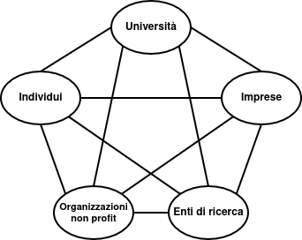

<!-- mathjax -->

# Capitolo 1: Fonti di Innovazione, Forme e Modelli di Innovazione, e Dinamiche Evolutive delle Nuove Tecnologie V2

## Indice:
- [Capitolo 1: Fonti di Innovazione, Forme e Modelli di Innovazione, e Dinamiche Evolutive delle Nuove Tecnologie V2](#capitolo-1-fonti-di-innovazione-forme-e-modelli-di-innovazione-e-dinamiche-evolutive-delle-nuove-tecnologie-v2)
  - [Indice:](#indice)
- [1. Le Fonti di Innovazione](#1-le-fonti-di-innovazione)
  - [Approcci alla R\&S: Science Push vs Demand Pull](#approcci-alla-rs-science-push-vs-demand-pull)
    - [Creatività e Opportunità Innovativa](#creatività-e-opportunità-innovativa)
- [2. Forme e Modelli di Innovazione](#2-forme-e-modelli-di-innovazione)
  - [Definizione di Innovazione](#definizione-di-innovazione)
  - [Modelli di Innovazione](#modelli-di-innovazione)
  - [Innovazione Competence Enhancing e Competence Destroying (Tushman e Anderson)](#innovazione-competence-enhancing-e-competence-destroying-tushman-e-anderson)
- [3. Dinamiche Evolutive delle Nuove Tecnologie](#3-dinamiche-evolutive-delle-nuove-tecnologie)
  - [Modello di Fisher-Pry](#modello-di-fisher-pry)
    - [Limiti delle Curve a S](#limiti-delle-curve-a-s)
  - [Ciclo di Vita Tecnologico e Disegno Dominante](#ciclo-di-vita-tecnologico-e-disegno-dominante)
  - [I Rischi per gli Incumbent](#i-rischi-per-gli-incumbent)
    - [Tecnologia e Diffusione (Curva a S di Rogers)](#tecnologia-e-diffusione-curva-a-s-di-rogers)
  - [Technology Readiness Levels (TRL)](#technology-readiness-levels-trl)
- [4. Protezione dell'Innovazione e Proprietà Intellettuale (IP)](#4-protezione-dellinnovazione-e-proprietà-intellettuale-ip)
  - [Innovare o Imitare: Il Regime di Appropriabilità](#innovare-o-imitare-il-regime-di-appropriabilità)
    - [Gli Strumenti della Proprietà Intellettuale (IP)](#gli-strumenti-della-proprietà-intellettuale-ip)

# 1. Le Fonti di Innovazione

L'innovazione è un fenomeno che nasce in un ecosistema complesso di attori interconnessi. Le principali **fonti di innovazione** sono:

- **Le Imprese**: Sono il motore primario dell'innovazione, grazie alle loro risorse economiche e alla capacità di indirizzare tali risorse verso progetti innovativi. Le aziende sono spesso responsabili della **Ricerca e Sviluppo (R&S)**, che può essere suddivisa in:
    - **Ricerca di base**: Focalizzata sull'espansione della conoscenza scientifica.
    - **Ricerca applicata**: Riguarda lo sviluppo di tecnologie o prodotti per rispondere a specifiche esigenze.
    - **Sviluppo**: Applicazione pratica delle scoperte scientifiche per la produzione di nuovi prodotti.

- **Le Università**: Giocano un ruolo fondamentale nel trasferimento tecnologico. Molte università hanno **Uffici di Trasferimento Tecnologico** che facilitano il passaggio delle scoperte scientifiche dal mondo accademico a quello imprenditoriale. Le università sono spesso anche un luogo di nascita di idee **disruptive**.

- **Gli Individui (Utenti)**: Spesso sono gli utenti stessi che, modificando prodotti esistenti o creando nuove soluzioni per le proprie necessità, generano innovazioni. Un esempio noto è lo **snowboard**, che nasce da una combinazione di esigenze individuali.

## Approcci alla R&S: Science Push vs Demand Pull

- **Science Push**: L'innovazione segue un percorso "spinto dalla scienza", in cui le scoperte scientifiche conducono alla creazione di nuovi prodotti e tecnologie.
- **Demand Pull**: In questo caso, l'innovazione è "spinta dal mercato", dove i bisogni e le richieste dei clienti stimolano la ricerca e lo sviluppo di nuovi prodotti.

### Creatività e Opportunità Innovativa

La **creatività** è essenziale per generare idee nuove e utili. Non si tratta solo di avere idee originali, ma di saper cogliere opportunità **innovative**. Queste opportunità devono essere:
- **Attrattive**: Devono avere un valore per i consumatori.
- **Tempestive**: Devono rispondere ai bisogni immediati del mercato.
- **Durevoli**: Devono avere una durata di vita abbastanza lunga.
- **Ancorate in un prodotto/servizio**: Devono risolversi in una soluzione pratica che porti valore.
  
**Il Processo di Identificazione di Opportunità**  
L'identificazione delle opportunità è un processo **graduale e cumulativo**, basato principalmente sul *pattern recognition*. Questo processo si svolge in tre *step*:
1.  **Osservare** diversi eventi nell'ambiente, inclusi cambiamenti sociali, tecnologici e di mercato.
2.  **Identificare la connessione** tra eventi apparentemente non correlati. Gli innovatori spesso usano le proprie conoscenze per cogliere queste connessioni.
3.  La ricerca di opportunità è essenzialmente una **ricerca di modelli** (*patterns*).

Un esempio notevole di creazione di connessioni è l'invenzione del deodorante *roll-on* (1952) mutuando l'idea dalla penna a sfera.

# 2. Forme e Modelli di Innovazione

## Definizione di Innovazione

Secondo l'**OECD (Oslo Manual, 3° Edizione)**, l'innovazione è:

> "L'implementazione di un prodotto (bene o servizio) o di un processo nuovo o significativamente migliorato, di un nuovo metodo di marketing, o di un nuovo metodo organizzativo nelle pratiche aziendali, nell'organizzazione del luogo di lavoro o nelle relazioni esterne."

In sostanza, l'innovazione si basa sulla **creazione di valore** che serve a soddisfare i bisogni di **nuovi** o **esistenti clienti**.

## Modelli di Innovazione

Le innovazioni possono essere classificate in base alla **loro natura e impatto**. Ecco alcune delle principali **forme di innovazione**:

- **Innovazione di Prodotto e di Processo** (Abernathy e Utterback):
    - **Innovazioni di Prodotto**: Aggiungono nuove caratteristiche o funzionalità ai prodotti esistenti.
    - **Innovazioni di Processo**: Migliorano l'efficienza o l'efficacia dei processi aziendali.

- **Innovazioni Radicali e Incrementali** (Tushman e Anderson):
    - **Radicale**: Introduce cambiamenti significativi e discontinui rispetto al passato (es. il passaggio dal telefono fisso al cellulare).
    - **Incrementale**: Si concentra su miglioramenti graduali, come miglioramenti nelle prestazioni di un prodotto esistente.

- **Innovazione Architetturale e Modulare** (Henderson e Clark):
    - **Modulare**: Cambia uno o più componenti di un sistema senza modificare la sua struttura generale (es. aggiornamenti software).
    - **Architetturale**: Modifica la struttura complessiva di un sistema, come nel caso dell'elettrificazione dei veicoli.

## Innovazione Competence Enhancing e Competence Destroying (Tushman e Anderson)
L'innovazione è **Competence Enhancing** quando costituisce un'evoluzione o un potenziamento della base di conoscenze preesistenti dell'azienda.  
L'innovazione è **Competence Destroying** quando non deriva dalle conoscenze attuali o, peggio, le rende inadeguate.

# 3. Dinamiche Evolutive delle Nuove Tecnologie

Le **curve a S** sono utilizzate per descrivere l'evoluzione tecnologica. Questo modello mostra il **miglioramento della performance** e la **diffusione nel mercato** di una nuova tecnologia. La curva segue tre fasi principali:

- **Fase iniziale (Fermento)**: I miglioramenti sono lenti, poiché i principi di base della tecnologia sono ancora poco compresi.
- **Fase di sviluppo (Crescita)**: Man mano che aumenta la conoscenza, i miglioramenti diventano rapidi.
- **Fase di maturità**: La curva si appiattisce quando la tecnologia si avvicina al suo limite naturale.

## Modello di Fisher-Pry

Il **modello di Fisher-Pry** è uno strumento di previsione per analizzare la diffusione delle innovazioni. Le due equazioni principali sono:

$$
y = \frac{L}{1 + be^{-ct}}
$$

dove \(y\) è la performance e \(L\) è il limite superiore della tecnologia.

$$
f = \frac{1}{1 + be^{-ct}}
$$

dove \(f\) è la quota di mercato della nuova tecnologia.

### Limiti delle Curve a S

L'uso delle curve a S presenta alcuni limiti:
- **Incertezza sui limiti di una tecnologia**.
- **Cambiamenti imprevisti nel mercato**.
- **Rischio di adottare una nuova tecnologia troppo presto o troppo tardi**.

## Ciclo di Vita Tecnologico e Disegno Dominante

I cambiamenti innescati da una discontinuità tecnologica procedono ciclicamente (Anderson e Tushman):
1. **Era di Fermento**: Innescata dalla discontinuità, è un periodo di turbolenza e incertezza, caratterizzato da competizione tra diversi disegni tecnologici alternativi.
2. **Affermazione del Disegno Dominante**: È lo spartiacque. Quando un modello (spesso un'innovazione architetturale) si afferma, la competizione si concentra.
3. **Era di Cambiamento Incrementale**: Inizia dopo l'affermazione del disegno dominante; le imprese si concentrano sui miglioramenti incrementali.

## I Rischi per gli Incumbent
Le aziende storiche (*Incumbent*) falliscono spesso di fronte alle discontinuità a causa di:
- **Mancanza di incentivi economici**: ad esempio, la paura di cannibalizzare il proprio *business* tradizionale.
- **Mancanza di competenze e inerzia organizzativa**.
- **Miopia e limiti cognitivi**: non riconoscere la minaccia o l'opportunità (*“Questi non sono orologi!!!”*).

Per non soccombere alla *disruption*, gli *incumbent* dovrebbero:
- Mantenere **"sensori" adeguati** sullo sviluppo delle nuove tecnologie (*exploration* vs. *exploitation*).
- Mantenere **"opzioni" aperte** (ad esempio, tramite collaborazioni o acquisizioni educative).
- Promuovere autonomia e imprenditorialità interna (organizzazione duale).
- Sfruttare le **risorse complementari** per colmare un ritardo tecnologico.

### Tecnologia e Diffusione (Curva a S di Rogers)

La diffusione dell'innovazione segue una curva a S e gli adottanti sono suddivisi in categorie, secondo percentuali specifiche:
1. **Innovatori (*Innovators*, 2.5%)**: Amanti delle nuove idee, propensi al rischio e con conoscenze tecniche superiori alla media.
2. **Adottanti Iniziali (*Early Adopters*, 13.5%)**: Hanno reputazione, sono inseriti nel gruppo sociale e fungono da punti di riferimento.
3. **Maggioranza Anticipatrice (*Early Majority*, 34%)**: Adottano a seguito di un processo ponderato di scelta.
4. **Maggioranza Ritardataria (*Late Majority*, 34%)**: Sono scettici e adottano solo per necessità economica o sociale, convinti dall'esperienza altrui.
5. **Ritardatari (*Laggards*, 16%)**: Sono legati alla tradizione e adottano solo quando non è più possibile farne a meno.

**Superare l'Abisso (*The Chasm*)**  
Il passaggio cruciale è dagli *Early Adopters* alla *Early Majority*, un divario noto come **"L'Abisso"** (*The Chasm*). Per superarlo, è essenziale (Moore):
- Fornire una **chiara proposta di valore** e un **sistema completo di prodotto**.
- Focalizzarsi su una **nicchia di mercato iniziale** (strategia "testa di ponte") per poi diffondersi con una strategia di marketing verticale.
- Identificare gruppi di clienti con forti motivazioni all'acquisto (es. nuove funzionalità, riduzione costi).

## Technology Readiness Levels (TRL)

La scala TRL, sviluppata dalla NASA negli anni '90 e adottata in programmi come Horizon 2020, misura la maturità di una tecnologia in 9 livelli, dalla Ricerca di base (TRL 1) alla Prima produzione (TRL 9).

**Alcuni livelli chiave sono**:
1. **TRL 1 (Ricerca di base)**: Osservazione dei principi fondamentali.
2. **TRL 3**: *Proof of concept* sperimentale.
3. **TRL 7**: Dimostrazione del prototipo in ambiente operativo reale.
4. **TRL 9**: Dimostrazione completa del sistema in ambiente operativo reale (prova funzionale, applicazione al settore industriale specifico).

# 4. Protezione dell'Innovazione e Proprietà Intellettuale (IP)

## Innovare o Imitare: Il Regime di Appropriabilità

Non sempre essere il *first mover* garantisce il successo; in molti casi, i *follower* (imitatori) hanno prevalso. Il successo dell'innovatore dipende dal **Regime di Appropriabilità**, ovvero la possibilità dell'innovatore di beneficiare in via esclusiva dei ritorni economici del nuovo prodotto o processo.

**Vantaggi e Svantaggi del *First Mover***  
Il vantaggio del *first mover* è sostenibile se i concorrenti non riescono a duplicare la tecnologia.
- **Vantaggi**: Trasformare il *gap* tecnologico in altri benefici (es. reputazione, costi di sostituzione, curva di apprendimento esclusiva), accedere a risorse scarse, definire gli standard e ottenere profitti iniziali.
- **Costi del Pionierismo (Svantaggi)**: Maggiori costi dovuti all'educazione degli acquirenti, allo sviluppo delle infrastrutture e degli input necessari. C'è un rischio maggiore legato all'incertezza della domanda, ai cambiamenti dei bisogni dei clienti, alla possibilità di discontinuità tecnologiche, e alle imitazioni a basso costo da parte dei *follower*.

**Fattori che Influenzano l'Appropriabilità**
La sostenibilità del primato tecnologico è influenzata da:
1. **Tipologia di innovazione**: Le innovazioni di prodotto sono più facili da imitare di quelle di processo.
2. **Natura della conoscenza**: La conoscenza **tacita** (non codificabile) non può essere trasferita tramite brevetti ed è più difficile da replicare rispetto alla conoscenza esplicita.
3. **Caratteristiche della tecnologia**: In settori con tecnologie **discrete** (es. farmaceutica) bastano pochi brevetti per controllare la tecnologia; nei settori con tecnologie **sistemiche** (es. elettronica) sono necessari molti brevetti per controllare tutti i componenti complementari.
4. **Risorse complementari**: Il *know-how* tecnologico deve essere utilizzato congiuntamente con altre risorse (produzione, distribuzione, servizio, fornitori).

### Gli Strumenti della Proprietà Intellettuale (IP)

Gli strumenti legali di IP sono cruciali per garantire l'appropriazione esclusiva:
- **Brevetti**: Proteggono **nuove invenzioni** che implichino un'attività inventiva e siano suscettibili di applicazione industriale.
- **Diritto d'Autore (Copyright)**: Protegge le forme **creative o artistiche originali** (letteratura, musica, codice software).
- **Marchi (Trade Marks)**: Servono per l'**identificazione distintiva** di prodotti o servizi (parole, disegni, suoni, forme).
- **Disegni Registrati (Registered Designs)**: Riguardano l'aspetto **estetico** di un prodotto o di una sua parte.
- **Segreti Industriali (Trade Secrets)**: Riguardano informazioni aziendali o esperienze tecnico-industriali di **valore economico** che sono **segrete** e non facilmente accessibili.

**Uso Strategico dei Brevetti**
I brevetti non servono solo per la difesa e l'esclusione dei concorrenti. Vengono usati strategicamente anche come:
- **Fonte di entrate**: attraverso accordi di *licensing*.
- **Strumento di negoziazione**: per accordi di R&S o *cross-licensing*.
- **Strumento finanziario**: per facilitare l'accesso a finanziamenti (banche, Venture Capital).
