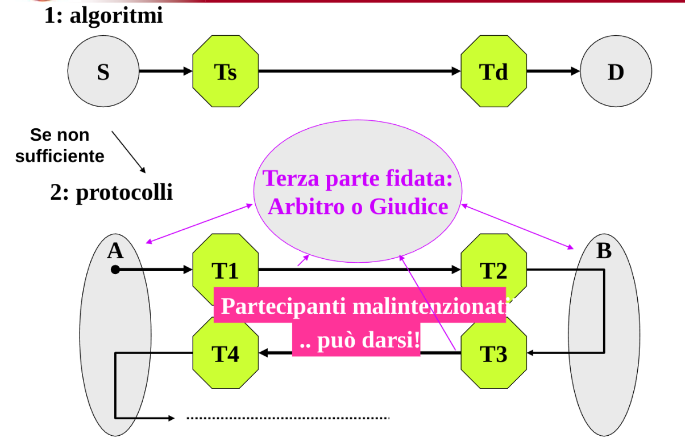
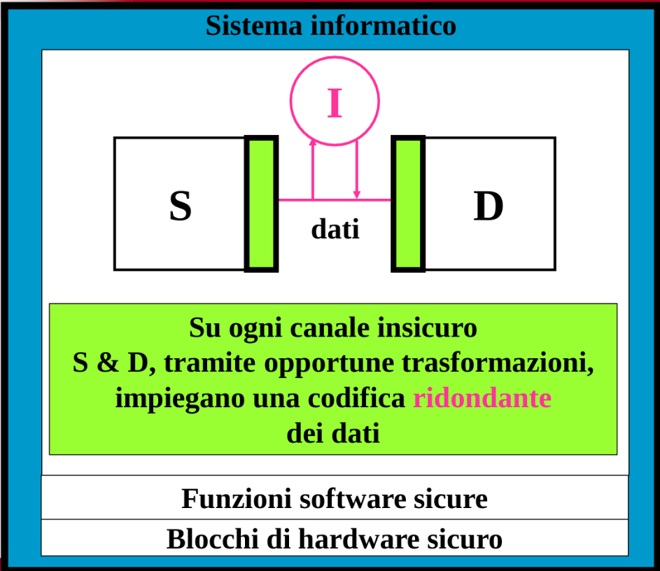
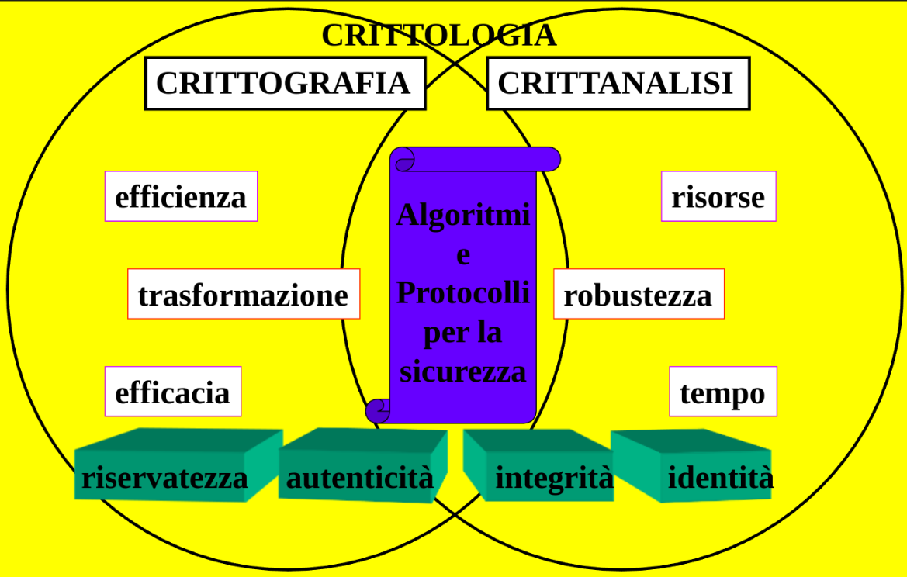
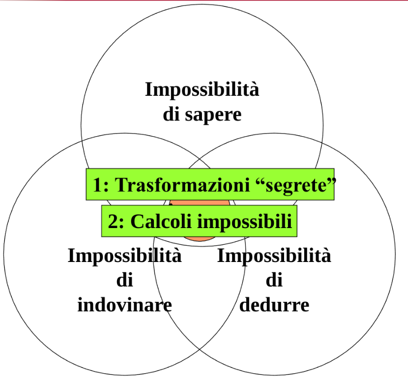

# Dati Sicuri

[Return](./README.md)

---

# Indice

- [Dati Sicuri](#dati-sicuri)
- [Indice](#indice)
  - [Trasformazioni per la sicurezza](#trasformazioni-per-la-sicurezza)
  - [Crittografia e Crittoanalisi](#crittografia-e-crittoanalisi)
    - [Principi della difesa](#principi-della-difesa)
  - [Integrità](#integrità)
  - [Riservatezza](#riservatezza)
  - [Autenticazione](#autenticazione)
  - [Identificazione](#identificazione)
  - [Calcoli Impossibili](#calcoli-impossibili)
  - [Trasformazioni Segrete e Chiavi](#trasformazioni-segrete-e-chiavi)
  - [Crittanalisi](#crittanalisi)
    - [Tre livelli di Gerarchia](#tre-livelli-di-gerarchia)

## Trasformazioni per la sicurezza

**Trasformazione**: Operazione che trasforma un messaggio in un altro messaggio

**Arbitro**: Terzo ente che verifica che le trasformazioni siano corrette

Se Sorgente o Destinazioni sono fidate, potrebbe non servire l'arbitro

## Crittografia e Crittoanalisi

**Crittografia**: Scienza che studia le trasformazioni per la sicurezza
**Crittoanalisi**: Scienza che studia come rompere le trasformazioni per la sicurezza

### Principi della difesa

Le trasformazioni per chi è autorizzato sono calcoli facili da eseguire, per chi non è autorizzato diventano calcoli computazionalmente molto complicati.

## Integrità

## Riservatezza

## Autenticazione

## Identificazione

## Calcoli Impossibili

## Trasformazioni Segrete e Chiavi

## Crittanalisi

### Tre livelli di Gerarchia