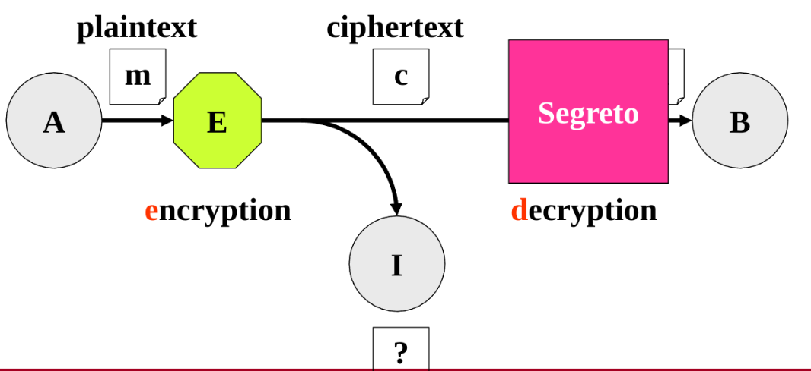
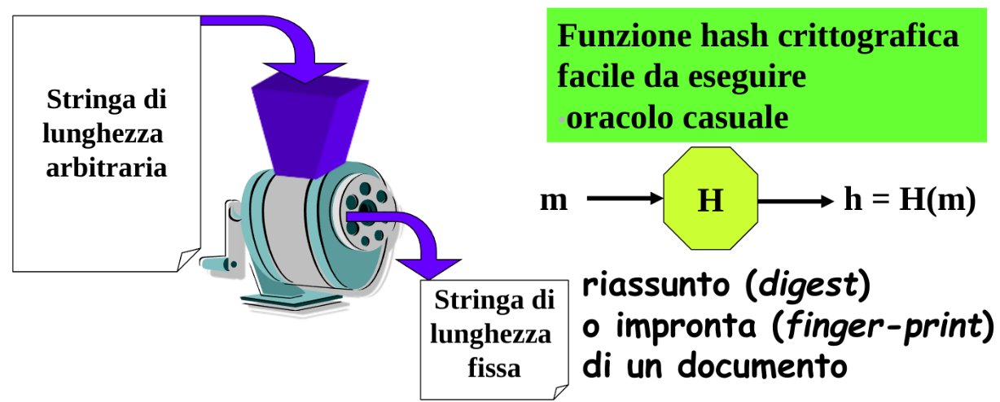
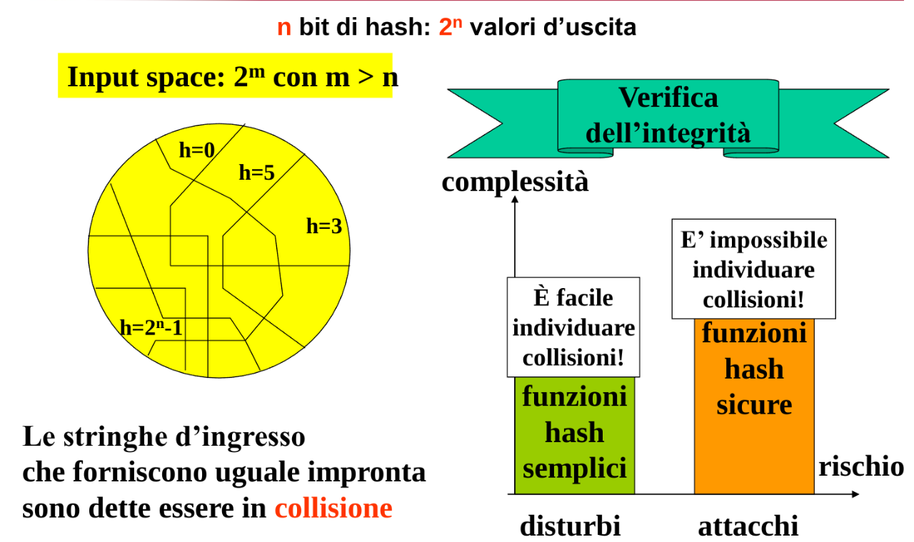
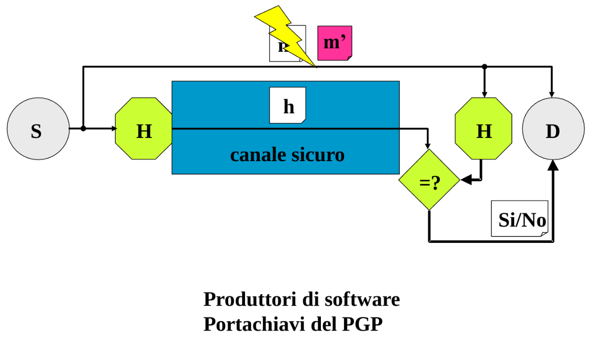
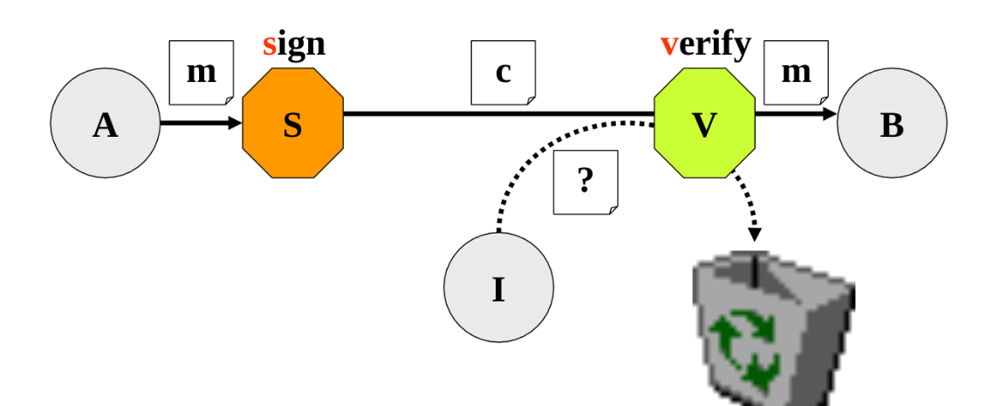

# Dati Sicuri

[Return](../../README.md)

---

# Indice

- [Dati Sicuri](#dati-sicuri)
- [Indice](#indice)
  - [Trasformazioni per la sicurezza](#trasformazioni-per-la-sicurezza)
  - [Crittografia e Crittoanalisi](#crittografia-e-crittoanalisi)
    - [Principi della difesa](#principi-della-difesa)
    - [Riservatezza](#riservatezza)
    - [Integrità](#integrità)
    - [Come combiniamo Integrità e Riservatezza](#come-combiniamo-integrità-e-riservatezza)
    - [Autenticità](#autenticità)

## Trasformazioni per la sicurezza

**Trasformazione**: Operazione che trasforma un messaggio in un altro messaggio

**Arbitro**: Terzo ente che verifica che le trasformazioni siano corrette

Se Sorgente o Destinazioni sono fidate, potrebbe non servire l'arbitro

## Crittografia e Crittoanalisi

**Crittografia**: Scienza che studia le trasformazioni per la sicurezza
**Crittoanalisi**: Scienza che studia come rompere le trasformazioni per la sicurezza

### Principi della difesa

Le trasformazioni per chi è autorizzato sono calcoli facili da eseguire, per chi non è autorizzato diventano calcoli computazionalmente molto complicati.

### Riservatezza

La sorgente trasforma la rappresentazione originaria delle informazioni riservate in una rappresentazione che la renda apparentemente incomprensibile, la destinazione è l'unica a sapere eseguire la trasformazione inversa

Il messaggi **m** viene encripted in un messaggio **c** cifrato, l'algoritmo di decodifica consegna il messagio al destinatario

- **Sicurezza perfetta**: Dal messaggio cifrato c non si impara nulla di più di quello che si sapeva già

- **Sicurezza computazionale**: I calcoli per mettere in chiaro un testo cifrato senza conoscere l'algoritmo di decifrazione devono essere difficilo

### Integrità

La sorgente deve affiancare al documento un riassunto che ne rappresenti in modo pressofìche univoco il contenuto, la destinazione deve ricalcolare il riassunto e confrontare i due dati

La funzione H è una funzione di Hash che ha come input il messaggio e output il messaggio hashato

Resistenza alle collisioni: l'individuazione di due messaggi con la stessa impronta deve essere un calcolo difficile

### Come combiniamo Integrità e Riservatezza

cose...

### Autenticità

La sorgente aggiunge al documento informazioni non imitabili e atte ad attestare chi l'ha predisposto; la destinazione verifica che il documento ricevuto sia stato originato proprio da chi dichiara di averlo fatto.

**Sign**: Firma digitale, è una trasformazione segreta che solo la sorgente può eseguire.

**Verify**: Verifica la firma digitale