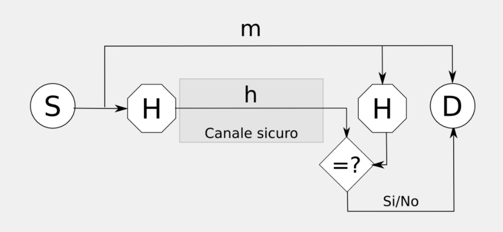

# Dati Sicuri

[Return](./README.md)

---

# Indice

- [Dati Sicuri](#dati-sicuri)
- [Indice](#indice)
  - [Trasformazioni per la sicurezza](#trasformazioni-per-la-sicurezza)
  - [Crittografia e Crittoanalisi](#crittografia-e-crittoanalisi)
    - [Principi della difesa](#principi-della-difesa)
  - [Integrità](#integrità)
  - [Riservatezza](#riservatezza)
  - [Autenticazione](#autenticazione)
  - [Identificazione](#identificazione)
  - [Calcoli Impossibili](#calcoli-impossibili)
  - [Trasformazioni Segrete e Chiavi](#trasformazioni-segrete-e-chiavi)
  - [Crittanalisi](#crittanalisi)
    - [Tre livelli di Gerarchia](#tre-livelli-di-gerarchia)
  - [Generatore di numeri casuali (RNG)](#generatore-di-numeri-casuali-rng)
    - [True Random Number Generator](#true-random-number-generator)
    - [Pseudo Random Number Generator](#pseudo-random-number-generator)
  - [Funzione Hash](#funzione-hash)
    - [Attacco alle funzioni hash](#attacco-alle-funzioni-hash)
    - [Algoritmi di hash](#algoritmi-di-hash)
  - [Servizi di Identificazione](#servizi-di-identificazione)
    - [Identificazione passiva](#identificazione-passiva)
    - [Identificazione attiva](#identificazione-attiva)
    - [One-time password](#one-time-password)
    - [Sfida e risposta](#sfida-e-risposta)
    - [Zero knowledge](#zero-knowledge)

## Trasformazioni per la sicurezza

**Trasformazione**: Operazione che trasforma un messaggio in un altro messaggio

**Arbitro**: Terzo ente che verifica che le trasformazioni siano corrette

Se Sorgente o Destinazioni sono fidate, potrebbe non servire l'arbitro

## Crittografia e Crittoanalisi

**Crittografia**: Scienza che studia le trasformazioni per la sicurezza
**Crittoanalisi**: Scienza che studia come rompere le trasformazioni per la sicurezza

### Principi della difesa

Le trasformazioni per chi è autorizzato sono calcoli facili da eseguire, per chi non è autorizzato diventano calcoli computazionalmente molto complicati.

## Integrità

Preservare il dato da alterazioni accidentali o intenzionali.

Il caso più semplice per proteggere da errori casuali potrebbe essere un checksum o un CRC (Cyclic Redundancy Check, hash semplice), ma non sono sufficienti per proteggere da attacchi intenzionali.

Per proteggere da errori intenzionali si utilizzando **funzioni hash crittografiche**. Producono un riassunto univoco.

Dato un messaggio di lunghezza *m*  producono un hash di lunghezza *n* (dove *n* è molto più piccolo di *m*). Per rendere difficile il compito dell'attaccante l'hash si deve comportare da **oracolo casuale**, utilizzare simboli equiprobabili.

Il messaggio *m* viene inviato da S a D su un canale, il mittente calcola l'hash e lo trasmette su un canale sicuro, il destinatario calcola l'hash e lo confronta con quello ricevuto. Se sono uguali il messaggio è integro.
Un attaccante proverà a mandare un messaggio alterato che produca lo stesso hash, con funzioni hash crittografichè è pressochè impossibile.

## Riservatezza

Per proteggere la riservatezza delle informazioni è necessarrio ricorrere a metodi di cifratura. La sorgente concorda con la destinazione un metodo di rappresentazione.

I calcoli da svolgere devono essere facili per sorgente e destinazione, ma computazionalmente impossibili per un attaccante.

Ally cifra il messaggio con un *segeto* producendo il *ciphertext* e lo invia a Bob. Bob decifra il messaggio con lo stesso *segreto* concordato e ottiene il messaggio originale.

Per proteggere contemporaneamente [riservatezza](#riservatezza) e [integrità](#integrità) si procede:

- producendo *p* concatenando il messaggio *m* e l'hash *h* *(m||H(m))*
- cifrando *p* per produrre il *ciphertext* *c* *(c=E(p))*
Bob riceve *c\** con * perchè non sa se è stato alterato o no
- *p\* = D(c\*) =  m\*||H\*(m)* D = Decrypt
- Si confrontano *H(m*)* e *H\*(m)*, se sono uguali il messaggio è integro, altrimenti è stato alterato.

## Autenticazione

Per certificare che l'autore di un messaggio sia autenticato si utilizzano le firme digitali. Anche in questo caso i calcoli per dimostrare la propria identità devono essere semplici mentre computazionalmente impossibli quelli per creare un falso autentico.

La sorgente trasmette il messaggio *m* su un canale, genera l'hash del messaggio e lo firma, lo cifra e lo trasmette al destinatario mediante un canale sicuro, Il destinatario riconosce la firma, decifra il messaggio e verifica che l'hash sia corretto. Se sono uguali il messaggio è integro e l'autore è autenticato.

## Identificazione

L'identificazione permette di identificare un utente a real time (non come l'autenticazione). Si basa su tre concetti principali:

- **conoscenza**: l'utente deve conoscere un segreto (password, PIN, ecc.)
- **possesso**: l'utente deve possedere un oggetto (carta di credito, smart card, ecc.)
- **conformità** : l'utente deve essere conforme a un modello (impronta digitale, riconoscimento facciale, ecc.)

Un protocollo di identificazione prevede una fase di **registrazione** in cui **identificando** e **verificatore** concordano un segreto. Poi si procede in 3 fasi:
  1. **dichiarazione**: l'utente dichiara di voler essere identificato
  2. **interrogazione**: il verificatore interroga l'utente
  3. **dimostrazione**: l'identificando comunica il segreto e il verificatore lo confronta con quello atteso

## Calcoli Impossibili

Abbiamo parlato di calcoli difficili per un utente malevolo. Definiamo questo concetto.

Una funzione *f* è detta **unidirezionale** o **one-way function** se:
- è invertibile
- facile da calcolare
- per quasi tutti gli *x* appartenenti al dominio è **difficile** calcolare *y = f\*(x)*
  
> esempio: **elenco telefonico** trovare il numero di telefono di una persona ha complessità *O(n)*, mentre trovare il nome di una persona a partire dal numero di telefono ha complessità *O(n^2)*

Non esistono funzioni unidirezionali perfette ma **pseudo unidirezionali** o **trapdoor one-way**.

I problemi vengono classificati in:
- **facili** se esistono algoritmi polinomiali in grado di risolverli su macchine deterministiche
- **difficili** se non sono stati individuati algoritmi che li risolvono in tempo polinomiale su macchine deterministiche.

Definiamo quindi:
- **Tempo di esecuizione di un algoritmo**: numero di operazioni *N* eseguite in funzione della dimensione *n* dell'input.
- **Tempo di esecuzione nel caso peggiore**: è il numero massimo di operazioni $N_{max}$ eseguite in funzione della dimensione *n* dell'input.

Sulla base di queste grandezze si studia l'andamento asintotico del tempo di esecuzione al cresere della dimensione di *n*, lo si definisce **Ordine di grandezza del tempo di esecuzione**: $T(n) = O(g(n))$, dove *g(n)* è una funzione tale che $0<f(n)<c\times g(n)$ per ogni $n>n_0$, dove *c* è una costante positiva e $n_0$ è un numero naturale.

Ogni algoritmo che consente di **difendere** una proprietà critica deve avere tempo polinomiale, metre gli algoritmi che consentono di **rompere** una proprietà critica devono avere tempo esponenziale.

Utilizzeremo quindi funzioni pseudo-unidirezionali la cui risoluzione è polinomiale e la cui inversione è esponenziale o semi-esponenziale.

## Trasformazioni Segrete e Chiavi

La cosa migliore è che la responsabilità del segreto sia dell'utente, utilizzando un algoritmo pubblico ma che funzioni con un parametri privato noto solo all'utente.

Esistono due tipi di algoritmi:
- **a chiavi simmetriche**: le due chiavi $k_s$ e $k_d$ sono uguali, la chiave è nota a sorgente e destinatario, ma non all'attaccante.
- **a chiavi asimmetriche**: le due chiavi $k_s$ e $k_d$ sono diverse, la chiave di cifratura è nota a tutti (**chiave pubblica**), mentre la chiave di decifratura è nota solo al destinatario (**chiave privata**). Ogni soggetto ha una chiave pubblica e una privata.

## Crittanalisi

Studia come decifrare testi cifrati senza conoscere la chiave. Escludendo i calcoli, le chiavi possono essere indovinate, intercettate o dedotte. Questo ovviamente deve essere impossibile.

I segreti possono essere indovinati facendo una ricerca esauriente (brute force), utilizzando dizionari composti con le parole più probabilmente utilizzate, oppure utilizzando le chiavi più comuni (es. 123456, password, ecc.). 

Siamo comunque esposti a diversi tipi di attacco:

- **con solo testo cifrato**: si studia il presunto linguaggio del messaggio e si sfruttano calcoli sulle probabilità di occorrenza, (XOR tra il testo cifrato e il testo in chiaro dedotto)
- **con solo testo in chiaro noto**: se si hanno coppie di testo in chiaro e cifrato si può dedurre la chiave (es. XOR tra il testo in chiaro e il testo cifrato)
- **con testo in chiaro scelto**: se si ha la possibilità di avere la versione in chiaro di un determinato testo cifrato si può ricostruire il segreto.
- **con testo cifrato scelto**: se si ha la possibilità di cifrare un testo a piacere e di ricevere il testo cifrato, si può dedurre la chiave.

### Tre livelli di Gerarchia

Si può strutturare un file system cifrato in tre livelli di gerarchia dei segreti:
- **Primo Livello**: L'utente impara a memoria una password di cui viene memorizzato un hash
- **Terzo Livello**: dove vengono salvati dati sensibili. Sono archiviati facendo uso di una chiave scelta ogni volta da un **RNG**
- **Secondo Livello**: per accedere al terzo livello si utilizza una chiave memorizzata in un portachiavi generata utilizzando un **RNG** e un segreto, al secondo livello.

Serve una forma di recovery.

## Generatore di numeri casuali (RNG)

Alla stringa generata da un RNG sono richieste 2 proprietà:
  - **Casualità:** ogni valore deve avere la stessa probabilità di verificarsi ed essere statisticamente indipendente da tutti gli altri.
  - 

### True Random Number Generator

### Pseudo Random Number Generator

## Funzione Hash

### Attacco alle funzioni hash

### Algoritmi di hash

## Servizi di Identificazione

### Identificazione passiva

### Identificazione attiva

### One-time password

### Sfida e risposta

### Zero knowledge