# Introduzione
[back](./SistemiDigitali.md)

## Info esame

Consultabili nelle prime 9 slide del file **0.0 Introduzione.pdf**

## Il Progresso delle CPU e la Necessità di Calcolo Parallelo

1. **Origini dell'informatica**
   - la ricerca di velocità nel calcolo ha guidato lo sviluppo fino dagli albori.
   - **legge di Moore**: previsione dell'aumento esponenziale della potenza di calcolo.
2. **Crescita dei Dati e Complessità**
   - **Complessità crescente** dei problemi da risolvere (es. simulazioni, analisi dati).
   - **Limite delle architetture sequenziali** tradizionali sempre più evidenti.
3. **Transizione verso Architetture Avanzate**
    - Adozione di **sistemi multi-core** per superare i limiti della frequenza di clock.
    - **Utilizzo di GPU** per calcoli massivamente paralleli.
4. **Calcolo ad Alte Prestazioni (HPC)**
    - **Supercomputer** e **cluster** per affrontare problemi scientifici complessi.
    - Integrazione di tecnologie diverse (CPU, GPU, FPGA) per massimizzare le prestazioni.
5. **Intelligenza Artificiale e Big Data**
    - **Deep Learning** e **Machine Learning** richiedono enormi capacità di calcolo.
    - il **calcolo parallelo** diventa **imprescindibile** per addestrare modelli AI complessi.
  
## Legge di Moore

> Il numero di transistor su un circuito integrato raddoppia ogni due anni con un aumento minimo dei costi.

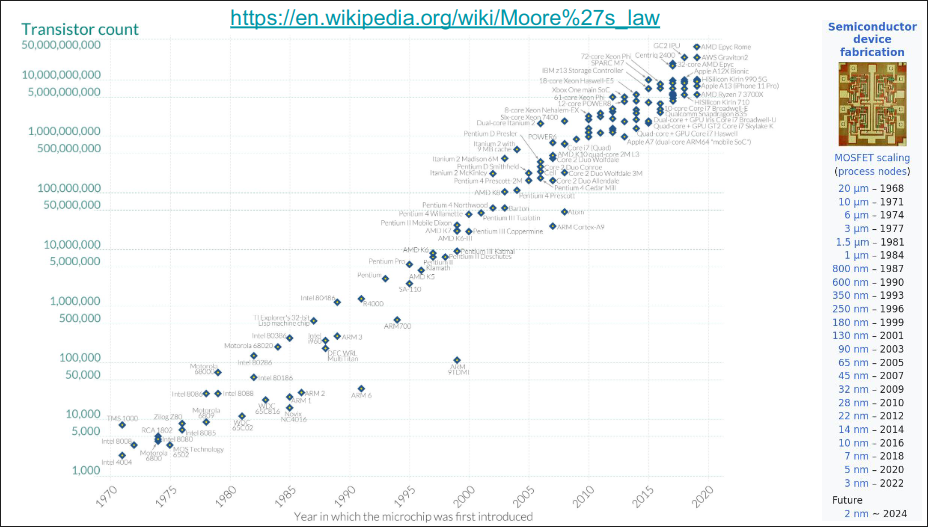

## L'evoluzione dei Microprocessori

>Mentre il numero di transistor e le prestazioni sono cresciuti esponenzialmente, la frequenza di clock e il consumo energetico hanno raggiunto un plateau, portando all'era del multi-core per continuare l'avanzamento delle prestazioni.

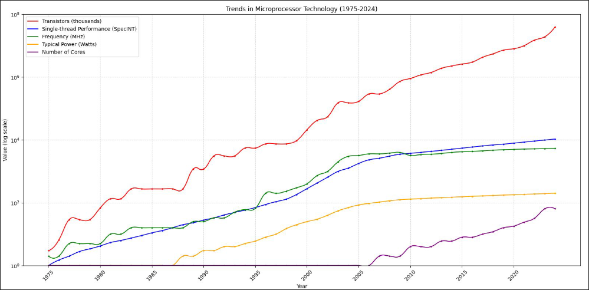

## Limiti strutturali delle CPU

## Obiettivi degli Avanzamenti Architetturali nei Computer

- Ridurre la latenza (Latency)
  - Tempo necessario per completare un'operazione (nano secondi o micro secondi).
- Aumentare la larghezza di banda (Bandwidth)
  - Quantità di dati che possono essere trasferiti in un'unità di tempo (MB/s GB/s Tbps).
- Aumentare il Throughput
  - Numero di operazioni che possono essere completate in un'unità di tempo (MFLOPS o GFLOPS).

> **FLOPs**: Floating Point Operations per Second

## Computazione Parallela

L'interesse per la computazione parallela è cresciuto puntando a migliorare la **velocità di calcolo**.

### Cosa si intende per computazione parallela?

- La computazione parallela è una forma di calcolo in cui **molte operazioni vengono eseguite simultaneamente**.
- L'idea di base è che i problemi complessi possano essere suddivisi in **problemi più piccoli** risolti poi in parallelo contemporaneamente.

### Prospettiva del Programmatore

- La sfida è mappare i calcoli simultanei sulle risorse disponibili (core), risolvendo le parti del problema in parallelo, facendo attenzione all'ordine delle operazioni e alla dipendenza tra i dati.

### Tecnologie Coinvolte
- **Architettura dei Computer (HW)** Supporta il parallelismo a livello architetturale.
- **Programmazione Parallela (SW)** Risolve problemi utilizzando pienamente la potenza dell'hardware.
  
> Per eseguire calcoli paralleli, l'hardware deve supportare l'esecuzione simultanea di più processi o thread o consentire l'elaborazione contemporanea di più dati.

## Legge di Amdahl

La Legge di Amdahl è un principio fondamentale nel calcolo parallelo che descrive il limite delle prestazioni ottenibili quando si parallelizza una parte di un programma.

### Formula

$$ S(N) = \frac{1}{(1-P) + \frac{P}{N}} $$

- $S(N)$: Accelerazione massima ottenibile.
- $P$: Frazione del codice che può essere parallelizzata.
- $N$: Numero di core o processori.

> Se una parte del programma non è parallelizzabile, il **miglioramento è limitato**, anche con molti processori.
> 
> Con processori infiniti, l'accelerazione massima è $1/(1-P)$.

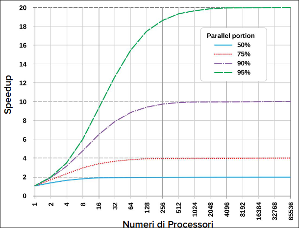

## Programmazione Sequenziale vs Parallela

### Programmazione Sequenziale
- I calcoli vengono eseguiti in un ordine fisso, **uno dopo l'altro**.
- Ogni istruzione dipende dal **completamento dell'istruzione precedente**.
- Rappresentazione tipica di **programmi tradizionali**.

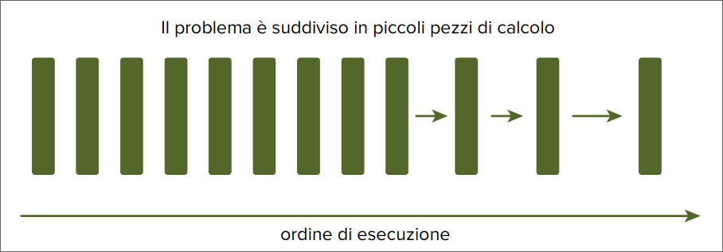

### Programmazione Parallela
- I colcoli vengono **suddivisi in task** che possono essere eseguiti **contemporaneamente**.
- I **task indipendenti**, senza dipendenze di dati, offrono il maggior potenziale di parallelismo.
- I **programmi paralleli** possono contenere anche parti sequenziali.

> **Dipendenze tra Dati:** 
> - Vincolo: Ottenere gli stessi risultati di un programma sequenziale.
> - Una dipendenza di dati si verifica quando una istruzione richiede i dati prodotti da una istruzione precedente
> - Le dipendenze limitano il pralallelismo poichè impongono un ordine di esecuzione.
> - L'analisi delle dipendenze è cruciale per implementare algoritmi paralleli efficienti.

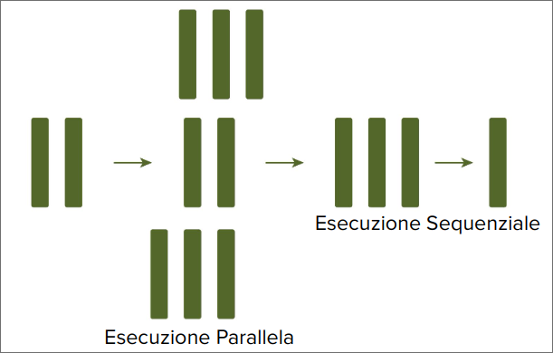

## Single-Core vs Multi-Core Processors

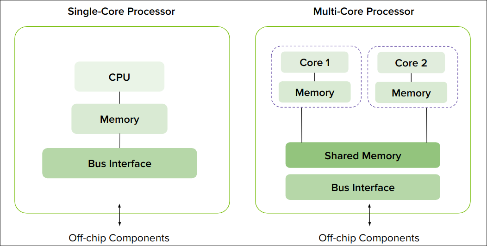

## Multi-Core vs Many-Core Processors

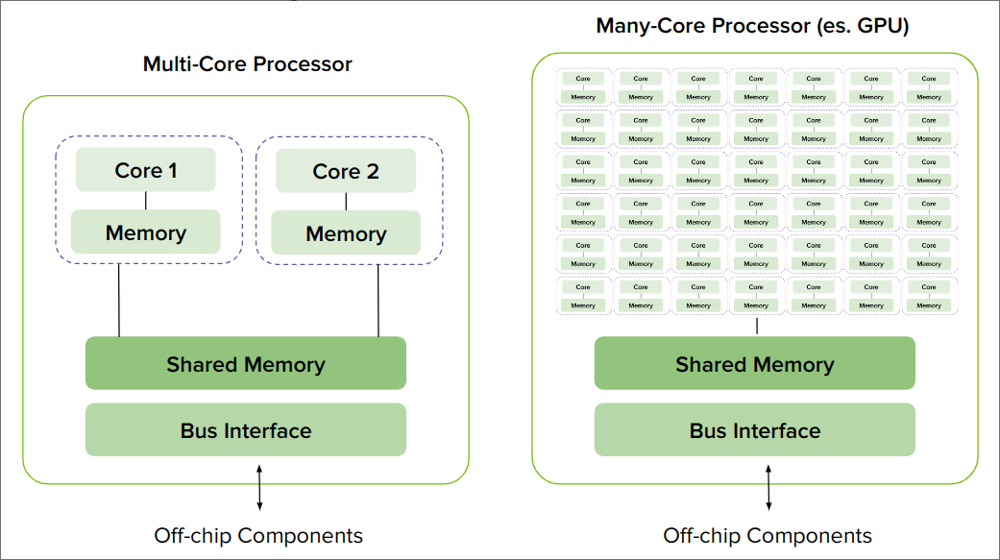

## Core GPU vs Core CPU

Nonostante i termini multicore e many-core siano usati per etichettare le architetture CPU e GPU, un core CPU è molto diverso da un core GPU.

### Core CPU
- Unità di controllo **complessa** per gestire flussi di istruzioni variabili.
- **Amplia cache** per ridurre la latenza di accesso alla memoria
- Unità di predizione dalle **diramazioni sofisticate**
- Esecuzione **fuori ordine** per ottimizzare l'utilizzo delle risorse.

### Core GPU
- Unità di controllo **semplificata** per gestire operazioni ripetitive
- **Cache più piccola**, compensata da alta larghezza di banda di memoria
- Minor enfasi sulla predizione delle diramazioni
- Esecuzione **in ordine** per massimizzare il throughput

## Architetture di Memoria nei Computer

### Multi-nodo con Memoria Distribuita

- Sistemi composti da **molti processori connessi in rete** (cluster).
- Ogni processore ha la propria **memoria locale**.
- La comunicazione avviene **attraverso la rete**.

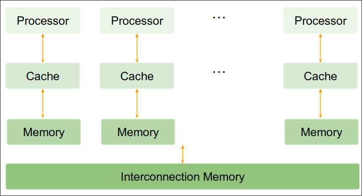

### Multi-core con Memoria Condivisa

- **Dimensioni tipiche:** da dual processor a decine o centinaia di processori.
- Processori **fisicamente connessi dalla stessa memoria** o condividono un link a bassa latenza (es. PCIe).
- Include sistemi multi-core e computer con più chip multi-core.

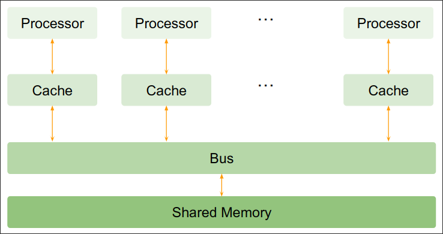

## Architetture Eterogenee

- ### Cosa è una Architettura Eterogenea?
  È una struttura di sistema che **integra diversi tipi di processori** o core di elaborazione all'interno dello stesso computer o dispositivo.
- ### Ruoli
  - **CPU (Host)**: gestisce l'ambiente, il codice e i dati.
  - **GPU (Device)**: co-processore, accelera calcoli intensivi (Hardware accelerato).
- ### Connessione:
  - **PCIe**: Interfaccia standard per collegare dispositivi di espansione al computer.
- ### Struttura del Software:
  - Applicazioni divise in **codice hsot** (CPU) e **device** (GPU).

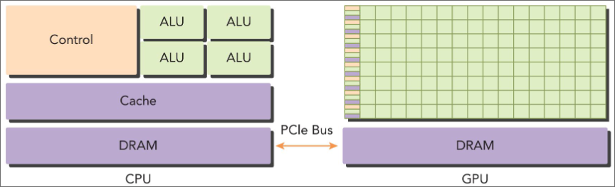

### Perché Architetture Eterogenee?

- #### CPU Multi-Core
  - **Ottimizzato per Latenza:**
    - Eccellente per task sequenziali
    - Meno efficiente per parallelismo massiccio
- #### GPU Many-Core
  - **Ottimizzato per Throughput:**
    - Eccellente per calcoli paralleli
    - Meno efficiente per task sequenziali
  - Speedup (legge di Amdahl): 
  $$S(N) = \frac{1}{(1-P) + \frac{P}{N}}$$

> Una architettura eterogenea (CPU + GPU) può sfruttare al meglio le caratteristiche di entrambi i tipi di core, ottenendo un **miglior bilanciamento tra latenza e throughput**.

## Tassonomia di Flynn

### Classificazione delle Architetture
> La **Tassonomia di Flynn** è un sistema ampiamente utilizzato per classificare le architetture dei computer in base al flusso di istruzioni e dati.
> È ampiamente utilizzato per classificare le architetture dei computer in base al flusso di istruzioni e dati attraverso i core.

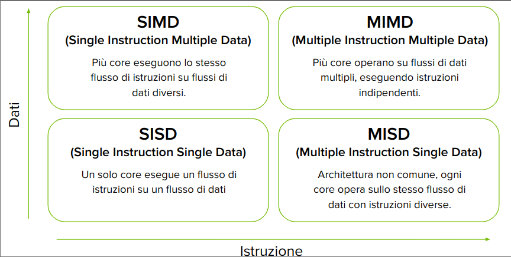

#### SIMD (Single Instruction, Multiple Data)
- Più core eseguono lo stesso flusso di istruzioni su flussi di dati diversi.
- Lo stesso flusso di istruzioni agisce su flussi di dati diversi.
- **Istruzioni SIMD** (SSE, AVX)
- **OpenMP** per direttive SIMD.
- **CUDA** per GPU NVIDIA.

#### MIMD (Multiple Instruction, Multiple Data)
- Più core eseguono su flussi di dati multipli, eseguendo istruzioni indipendenti.
- Più entità agi