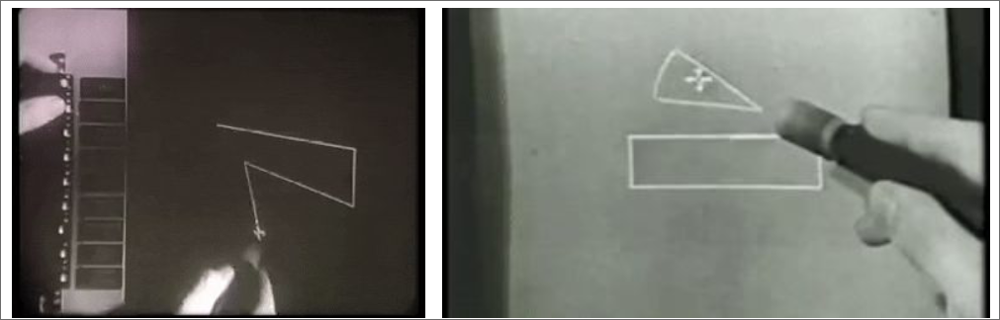
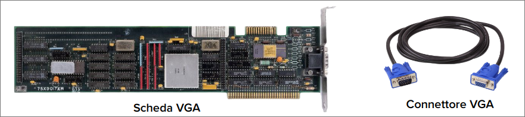
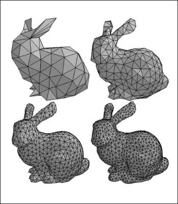
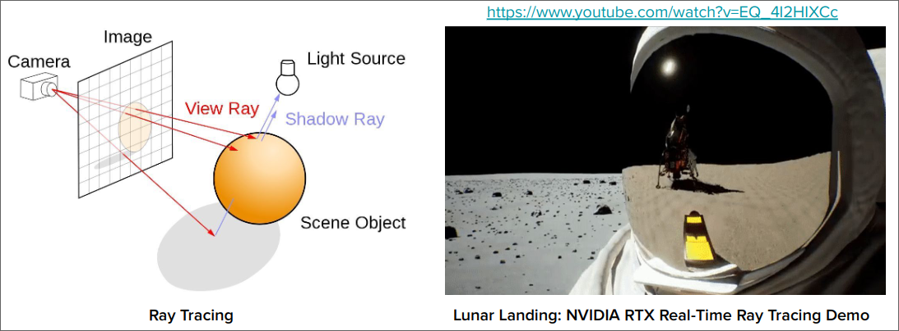

# CUDA
[back](./SistemiDigitali.md)

## Indice

- [CUDAback](#cudaback)
  - [Indice](#indice)
  - [Nascita della Computer Grafica](#nascita-della-computer-grafica)
    - [Ivan Sutherland e Sketchpad (1963)](#ivan-sutherland-e-sketchpad-1963)
    - [Sfida delle risorse computazionali](#sfida-delle-risorse-computazionali)
  - [Primi Passi nell'Accelerazione Grafica](#primi-passi-nellaccelerazione-grafica)
    - [ANTIC di Atari (1977)](#antic-di-atari-1977)
  - [Prime Schede Video Dedicate e Esigenza di Standard](#prime-schede-video-dedicate-e-esigenza-di-standard)
    - [Prime Schede Video:](#prime-schede-video)
  - [VGA (Video Graphics Array) Predecessore delle GPU](#vga-video-graphics-array-predecessore-delle-gpu)
  - [Limitazione delle Prime Schede Video](#limitazione-delle-prime-schede-video)
  - [Funzioni 3D Basilare (metà anni '90)](#funzioni-3d-basilare-metà-anni-90)
    - [Blocchi Fondamentali della Grafica 3D Moderna](#blocchi-fondamentali-della-grafica-3d-moderna)
  - [Il Modello del Ray Tracing](#il-modello-del-ray-tracing)

## Nascita della Computer Grafica

### Ivan Sutherland e Sketchpad (1963)

- **Sketchpad** è considerato il primo programma di **grafica interattiva**, utilizzando una interfaccia basata su una penna ottica per creare immagini su uno schermo.
- Questo progetto ha dimostrato le potenzialità della **grafica computerizzata**, aprendo la strada allo sviluppo della computer grafica come disciplina accademica e industriale.

### Sfida delle risorse computazionali

- Negli anni '60 e '70 la **grafica era gestita direttamente alla CPU** che eseguiva i calcoli sia logici che di generazione delle immagini.
- Questa gestione centralizzata **limitava le capacità di calcolo** della CPU per altri computi, rallentando l'elaborazione e limitando la complessità delle immagini prodotte.
- La **crescente domanda di grafica** più complessa richiedeva una soluzione più efficiente.

## Primi Passi nell'Accelerazione Grafica

### ANTIC di Atari (1977)

- **ANTIC** (Alpha-Numeric Television Interface Circuit) fu uno dei primi esempi di **cooprocessore grafico** introdotto da atari nel 1977 per i suoi **computer a 8-bit**.
- Liberava la CPU dalla gestione della grafica consentendo **giochi e interfacce più complesse.**
- **Gestiva sprite, scolling e diverse modalità grafiche**, migliorando l'esperienza visiva.

## Prime Schede Video Dedicate e Esigenza di Standard

### Prime Schede Video:

- **MDA (Monochrome Display Adapter)**: introdotta da IBM nel 1981, supportava solo testo in modalità monocromatica a una risoluzione di 720x350 pixel.
- **CGA (Color Graphics Adapter)**: introdotta da IBM nel 1981, supportava testo e grafica a colori (fino a 4 colori simultanei scelti da una tavolozza di 16) a una risoluzione di 320x200 pixel o 640x200 pixel.
- **EGA (Enhanced Graphics Adapter)**: introdotta da IBM nel 1984, supportava testo e grafica a colori (fino a 16 colori simultanei scelti da una tavolozza di 64) a una risoluzione di 640x350 pixel.

> **Il bisogno di Standard** era evidente, poiché ogni produttore aveva la propria interfaccia e i propri standard, rendendo difficile la compatibilità tra dispositivi diversi.

## VGA (Video Graphics Array) Predecessore delle GPU

- **VGA** è uno standard introdotto da IBM nel 1987, ha definito le specifiche per video e monitor, standardizzando la grafica su PC.
  - Risoluzione 640x480 pixel
  - Supporto fino a 256 colori simultanei
  - Retrocompatibilità con EGA e CGA
- **Controller VGA**: Chip specializzato che implementa lo standard **gestisce output grafico** ma non i calcoli complessi, gestiti dalla CPU.
- **Scheda Video VGA**: Contiene il controller VGA e la memoria video, destinata a gestire la visualizzazione su monitor.
- **Connettore VGA** Connettore analogico a 15 pin per la connessione ai monitor.

## Limitazione delle Prime Schede Video

- **Grafica 2D**
  - Le prime schede video, incluse VGA, erano progettate per **gestire grafica 2D** supportando operazioni di base come linee, rettangoli e riempimenti di aree.
- **Basse Risoluzioni**
  - Nonostante la VGA offrisse una risoluzione superiore rimaneva ancora **limitata** per visualizzazioni molto dettagliate.
  - L'esperienza grafica era confinata a **semplici interfacce** e giochi con **grafica elementare**.

## Funzioni 3D Basilare (metà anni '90)

Dopo lo standard VGA, la crescente domanda di grafica più realistica nei videogiochi e nelle applicazioni professionali portè allo sviluppo di **funzionalità 3D** nelle schede video.

### Blocchi Fondamentali della Grafica 3D Moderna

- **Triangolazione**
  - Scomposizione di oggetti 3D in triangoli per semplificare la rappresentazione di forme complesse
- **Rasterizzazione**
  - Conversione di forme vettoriali in pixel per renderizzare oggetti 3D su schermo 2D
- **Texture Mapping**
  - Applicazioni di immagini 2D su oggetti 3D per simulare superfici realistiche aggiungedo dettagli.
- **Shading**
  - Calcolo dell'illuminazione e del colore delle superfici per simulare l'interazione della luce con gli oggetti 3D.

## Il Modello del Ray Tracing

- La crescente complessità delle scene e l'alto parallelismo a livello di dati trovano la loro massima espressione nel **ray tracing**, un modello di rendering che simula il comportamento della luce in una scena 3D.
- Ogni pixel richiede il calcolo di più raggi luminosi e delle loro interazioni (**riflessioni, rifrazioni, ombre**).
- Ogni pixel potrebbe essere calcolato **simultaneamente** con un sufficiente parallelismo

