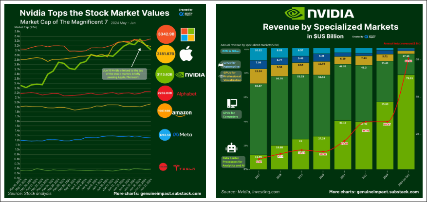

# CUDA
[back](./SistemiDigitali.md)

## Indice

- [CUDAback](#cudaback)
  - [Indice](#indice)
  - [Nascita della Computer Grafica](#nascita-della-computer-grafica)
    - [Ivan Sutherland e Sketchpad (1963)](#ivan-sutherland-e-sketchpad-1963)
    - [Sfida delle risorse computazionali](#sfida-delle-risorse-computazionali)
  - [Primi Passi nell'Accelerazione Grafica](#primi-passi-nellaccelerazione-grafica)
    - [ANTIC di Atari (1977)](#antic-di-atari-1977)
  - [Prime Schede Video Dedicate e Esigenza di Standard](#prime-schede-video-dedicate-e-esigenza-di-standard)
    - [Prime Schede Video:](#prime-schede-video)
  - [VGA (Video Graphics Array) Predecessore delle GPU](#vga-video-graphics-array-predecessore-delle-gpu)
  - [Limitazione delle Prime Schede Video](#limitazione-delle-prime-schede-video)
  - [Funzioni 3D Basilare (metà anni '90)](#funzioni-3d-basilare-metà-anni-90)
    - [Blocchi Fondamentali della Grafica 3D Moderna](#blocchi-fondamentali-della-grafica-3d-moderna)
  - [Il Modello del Ray Tracing](#il-modello-del-ray-tracing)
  - [Evoluzione dei Graphics Accelerator negli anni '90](#evoluzione-dei-graphics-accelerator-negli-anni-90)
    - [Graphics Accelerator](#graphics-accelerator)
  - [Limiti dell'Era Pre GPU: La Sfida dell'Accelerazione 3D](#limiti-dellera-pre-gpu-la-sfida-dellaccelerazione-3d)
    - [Da Accelerazione 2D a 3D](#da-accelerazione-2d-a-3d)
    - [Limitazioni Principali](#limitazioni-principali)
  - [Videogiochi Moderni](#videogiochi-moderni)
    - [Crescente Complessità delle scene](#crescente-complessità-delle-scene)
    - [Evoluzione Annuale](#evoluzione-annuale)
    - [Caratteristiche del Carico di Lavoro](#caratteristiche-del-carico-di-lavoro)
  - [Chi Spinge la Tecnoligia delle GPU](#chi-spinge-la-tecnoligia-delle-gpu)
    - [Industria dei videogiochi](#industria-dei-videogiochi)
    - [Industra Cinematografica](#industra-cinematografica)
    - [Visualizzazione Scientifica](#visualizzazione-scientifica)
    - [Industria Medica](#industria-medica)
  - [Introduzione alle GPU](#introduzione-alle-gpu)
    - [Che cosa è una GPU?](#che-cosa-è-una-gpu)
    - [Funzioni Principali](#funzioni-principali)
    - [Evoluzione verso il GPGPU](#evoluzione-verso-il-gpgpu)
    - [GPU dedicati vs. Integrate](#gpu-dedicati-vs-integrate)
      - [GPU Dedicata](#gpu-dedicata)
      - [GPU Integrate (iGPU)](#gpu-integrate-igpu)
    - [Evoluzione e Impatto delle GPU nel Gaming Moderno](#evoluzione-e-impatto-delle-gpu-nel-gaming-moderno)
    - [Principali Aziende di GPU Oggi](#principali-aziende-di-gpu-oggi)
  - [NVIDIA](#nvidia)
    - [Dominio di Mercato e Crescita dei Ricavi](#dominio-di-mercato-e-crescita-dei-ricavi)
    - [Evoluzione delle Architetture GPU NVIDIA](#evoluzione-delle-architetture-gpu-nvidia)

## Nascita della Computer Grafica

### Ivan Sutherland e Sketchpad (1963)

- **Sketchpad** è considerato il primo programma di **grafica interattiva**, utilizzando una interfaccia basata su una penna ottica per creare immagini su uno schermo.
- Questo progetto ha dimostrato le potenzialità della **grafica computerizzata**, aprendo la strada allo sviluppo della computer grafica come disciplina accademica e industriale.

### Sfida delle risorse computazionali

- Negli anni '60 e '70 la **grafica era gestita direttamente alla CPU** che eseguiva i calcoli sia logici che di generazione delle immagini.
- Questa gestione centralizzata **limitava le capacità di calcolo** della CPU per altri computi, rallentando l'elaborazione e limitando la complessità delle immagini prodotte.
- La **crescente domanda di grafica** più complessa richiedeva una soluzione più efficiente.

## Primi Passi nell'Accelerazione Grafica

### ANTIC di Atari (1977)

- **ANTIC** (Alpha-Numeric Television Interface Circuit) fu uno dei primi esempi di **cooprocessore grafico** introdotto da atari nel 1977 per i suoi **computer a 8-bit**.
- Liberava la CPU dalla gestione della grafica consentendo **giochi e interfacce più complesse.**
- **Gestiva sprite, scolling e diverse modalità grafiche**, migliorando l'esperienza visiva.

## Prime Schede Video Dedicate e Esigenza di Standard

### Prime Schede Video:

- **MDA (Monochrome Display Adapter)**: introdotta da IBM nel 1981, supportava solo testo in modalità monocromatica a una risoluzione di 720x350 pixel.
- **CGA (Color Graphics Adapter)**: introdotta da IBM nel 1981, supportava testo e grafica a colori (fino a 4 colori simultanei scelti da una tavolozza di 16) a una risoluzione di 320x200 pixel o 640x200 pixel.
- **EGA (Enhanced Graphics Adapter)**: introdotta da IBM nel 1984, supportava testo e grafica a colori (fino a 16 colori simultanei scelti da una tavolozza di 64) a una risoluzione di 640x350 pixel.

> **Il bisogno di Standard** era evidente, poiché ogni produttore aveva la propria interfaccia e i propri standard, rendendo difficile la compatibilità tra dispositivi diversi.

## VGA (Video Graphics Array) Predecessore delle GPU

- **VGA** è uno standard introdotto da IBM nel 1987, ha definito le specifiche per video e monitor, standardizzando la grafica su PC.
  - Risoluzione 640x480 pixel
  - Supporto fino a 256 colori simultanei
  - Retrocompatibilità con EGA e CGA
- **Controller VGA**: Chip specializzato che implementa lo standard **gestisce output grafico** ma non i calcoli complessi, gestiti dalla CPU.
- **Scheda Video VGA**: Contiene il controller VGA e la memoria video, destinata a gestire la visualizzazione su monitor.
- **Connettore VGA** Connettore analogico a 15 pin per la connessione ai monitor.

## Limitazione delle Prime Schede Video

- **Grafica 2D**
  - Le prime schede video, incluse VGA, erano progettate per **gestire grafica 2D** supportando operazioni di base come linee, rettangoli e riempimenti di aree.
- **Basse Risoluzioni**
  - Nonostante la VGA offrisse una risoluzione superiore rimaneva ancora **limitata** per visualizzazioni molto dettagliate.
  - L'esperienza grafica era confinata a **semplici interfacce** e giochi con **grafica elementare**.

## Funzioni 3D Basilare (metà anni '90)

Dopo lo standard VGA, la crescente domanda di grafica più realistica nei videogiochi e nelle applicazioni professionali portè allo sviluppo di **funzionalità 3D** nelle schede video.

### Blocchi Fondamentali della Grafica 3D Moderna

- **Triangolazione**
  - Scomposizione di oggetti 3D in triangoli per semplificare la rappresentazione di forme complesse
- **Rasterizzazione**
  - Conversione di forme vettoriali in pixel per renderizzare oggetti 3D su schermo 2D
- **Texture Mapping**
  - Applicazioni di immagini 2D su oggetti 3D per simulare superfici realistiche aggiungedo dettagli.
- **Shading**
  - Calcolo dell'illuminazione e del colore delle superfici per simulare l'interazione della luce con gli oggetti 3D.

## Il Modello del Ray Tracing

- La crescente complessità delle scene e l'alto parallelismo a livello di dati trovano la loro massima espressione nel **ray tracing**, un modello di rendering che simula il comportamento della luce in una scena 3D.
- Ogni pixel richiede il calcolo di più raggi luminosi e delle loro interazioni (**riflessioni, rifrazioni, ombre**).
- Ogni pixel potrebbe essere calcolato **simultaneamente** con un sufficiente parallelismo

## Evoluzione dei Graphics Accelerator negli anni '90

### Graphics Accelerator

- Hardware specializzato progettato per accelerare le operazioni grafiche, riducendo il carico sulla CPU.
- **Furono introdotti per:**
  - Crescente domanda di grafica più complessa e fluida
  - CPU insufficienti per gestire carichi grafici avanzati, specialmente in 3D.
  - Necessità di migliorare le prestazioni nei videogiochi e nelle applicazioni professional
- **Caratteristiche chiave:**
  - Accelerazione 2D hardware (es. blitting (copiare pixel da una posizione all'altra), line drawing) riempimento aree)
  - Verso fine anni '90, accelerazione 3D hardware (es. trasformazioni 3D, rasterizzazione, texture mapping, shading)
  - Memoria dedicata per frame buffer

## Limiti dell'Era Pre GPU: La Sfida dell'Accelerazione 3D

### Da Accelerazione 2D a 3D

- I Graphics Accelerator degli anni '90 introdussero le prime funzionalità 3D, ma il passaggio non fu privo di sfide.

### Limitazioni Principali

- **Prestazioni Insufficienti**
  - La CPU era ancora sovraccarica nel gestire operazioni 3D complesse, limitando le prestazioni grafiche.
  - basso frame rate nelle scene con molti poligoni e texture (< 15 fps).
- **Flessibilità Limitata**
  - Hardware non ottimizzato per le nuove funzioni in 3D
  - Difficoltà nell'implementare algoritmi avanzati di shading e altre tecniche di rendering.
- **Mancanza di Programmabilità**
  - Le pipeline grafiche dell'epoca erano **fisse** (fixed-funtion), cioè predefinite dall'hardware e non modificabili dai programmatori.
  - Questo limitava la capacità di creare nuove tecniche di rendering, bloccando l'innovazione.

## Videogiochi Moderni

### Crescente Complessità delle scene

- Centinaia di migliaia di poligoni per oggetto
- Milioni di pixel da elaborare per frame
- Illuminazione dinamica, particelle, fisica realistica

### Evoluzione Annuale

- Grafica sempre più sofisticata e realistica
- Richiesta di prestazioni in costante aumento
- Mondi di gioco più vasti e dettagliati

### Caratteristiche del Carico di Lavoro

- Enorme quantità di calcoli per frame
- Operazioni per lo più indipendenti tra loro
- Alto parallelismo a livello di dati

## Chi Spinge la Tecnoligia delle GPU

Le esigenze crescenti nei diversi settori hanno superato le capacità delle CPU tradizionali, creando una domanda per hardware più specializzato come le GPU.

### Industria dei videogiochi

Vedi sopra

### Industra Cinematografica

- Esigenza di elaborazione parallela per effetti visivi e simulazioni realistiche, hanno bisogno di Hardare che accelera il rendering e gestiscono una simulazione di grandi quantità di dati

### Visualizzazione Scientifica

- Gestione e visualizzazione di grandi set di dati sceintifici, Hardware per rendering 3D complessi e simulazioni in tempo reale.

### Industria Medica

- Ricostruzioni e visualizzazione di immagini 3D, TAC, e RMN, Hardeare per elaborazione rapitda, rendering volumetrico e analisi di immagini.

## Introduzione alle GPU

L'evoluzione delle tecnologie grafiche ha portato alla creazione delle **GPU (Graphics Processing Unit)**

### Che cosa è una GPU?

Hardware progettato per l'elaborazione parallela, ottimizzato per gestire e accelerare il rendering grafico e le operazioni di calcolo intensivo.

### Funzioni Principali

- **Rendering Grafico**
  - Accelerazione 3D, rasterizzazione, texture mapping, shading
  - Calcolo di illuminazione, ombre, riflessioni, rifrazioni
- **Calcolo Parallelo Massivo**
  - Esecuzione simultanea di migliaia di Operazioni
  - Ottimizzazione per task che richiedono calcoli ripetitivi su grandi set di dati

### Evoluzione verso il GPGPU

- **Dalla Grafica al Calcolo Generale**:
  - Le GPU, nate per l'accelerazione grafica, mostravano un potenziale non sfruttato per altri tipi di calcolo.
  - **Intuzioni chiave**: La struttura parallela delle GPU poteva essere applicata a problemi al di fuori del dominio grafico come il rendering o simulazioni fisiche.
- **Introduzione al GPGPU**:
  - **General Purpose GPU** (GPGPU) è un approccio che sfrutta le GPU per eseguire calcoli generici, non solo grafici.
  - **Primi Approcci**: Complessi e limitati, richiedevano di ingannare la GPU utilizzando API grafiche come OpenGL o DirectX per presentare i calcoli come operazioni grafiche.
  - **Sfide Iniziali**: Programmazione complessa, limiti nell'uso di dati in virgola mobile, mancanza di strumenti di debug e profiling.
  - **Sviluppo di Framework dedicati**: Con la crescente domanda di calcolo GP su GPU, sono stati sviluppati framework e linguaggi specifici come CUDA (nvidia) e OpenCL, che hanno semplificato notevolmente la programmazione GPGPU
  - Applicazioni odierne: Crittografica, Analisi finanziaria, Fluidodinamica copmutazionale, Machine Learning, Deep Learning.

### GPU dedicati vs. Integrate

La classificazione delle GPU si basa principalmente su due architetture distinte: **Dedicate** e **Integrate**.

#### GPU Dedicata

- Prestazioni elevate
- Memoria video (VRAM) separata
- Consumo maggiore
- Costo maggiore
- Ideale per gaming e lavori grafici intensivi
- Utilizzata principalmente in PC da gaming, workstation, server.

#### GPU Integrate (iGPU)

- Prestazioni moderate
- Condivide la memoria di sistema
- Consumo minore
- Costo inferiore
- Ideale per applicazioni di base e portatili
- Utilizzata principalmente in dispositivi portatili, ultrabook, tablet, smartphone.

### Evoluzione e Impatto delle GPU nel Gaming Moderno

Le moderne console utilizzano un SoC (System on Chip) che integra CPU e GPU su un singolo chip, ottimizzando le prestazioni e riducendo i costi.

Questa GPU è dedicata ma integrata nel chip con la CPU condividendo la memoria unificata (RAM)

### Principali Aziende di GPU Oggi

- **NVIDIA** (USA): Leader nel settore delle GPU dedicate, ha introdotto CUDA e ha un'ampia gamma di prodotti per gaming, workstation e server.
- **Qualcomm** (USA): Leader nel settore delle GPU integrate, produce SoC per smartphone e tablet.
- **AMD** (USA): Concorrente di NVIDIA, produce GPU dedicate e SoC per console.
- **Intel** (USA): Leader nel settore dei processori, produce anche GPU integrate per PC e server.
- **Apple** (USA): Produce SoC per i propri dispositivi, con GPU integrate di alta qualità.

## NVIDIA

### Dominio di Mercato e Crescita dei Ricavi

- **Capitalizzazione di Mercato: NVIDIA ha superato brevemente Apple e Microsoft, raggiungendo la vetta della capitalizzazione di mercato tra le aziende tecnologiche a giugno 2024.
- **Crescita dei Ricavi per Settore**: I ricavi di NVIDIA nel settore dei data center per AI e analytics sono aumentati drasticamente, passando dall'11.99% nel 2017 a 75.01% nel 2024.

### Evoluzione delle Architetture GPU NVIDIA 

- **Progressione Tecnologica**: Da Fermi a Blackwell, ogni generazione ha portato signiicativi avanzamenti nelle capacità di calcolo e nell'efficienza energetica.
- **Adattamento al Mercato**: L'evoluzione riflette il passaggio da un focus su grafica e HPC a un'enfasi crescente su AI, deep learning e calcolo ad alte prestazioni.

