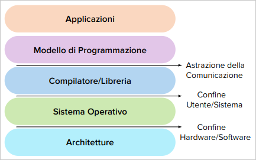
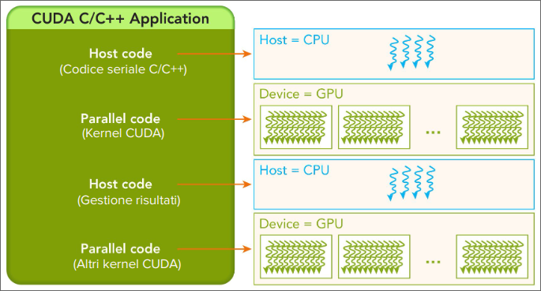

# Modello di Programmazione CUDA<div style="text-align: right">[back](./SistemiDigitali.md)</div>

## Indice


## Introduzione al Modello di Programmazione CUDA

### Struttura stratificata dell'Ecosistema CUDA

**Modello CUDA**
L'ecosistema CUDA nel suo complesso può essere visto come una struttura stratificata per esprimere algoritmi paralleli su GPU, bilanciando semplicità d'uso e controllo hardware per ottimizzare le prestazioni.

 

**Applicazioni**: programmi scritti per risolvere problemi utilizzando CUDA.

**Modello di programmazione**: CUDA, fornisce astrazione per programmare GPU offrendo concetto con thread, blocchi e griglie.

**Compilatore/Librerie**: Strumenti che traducono il codice CUDA in istruzioni eseguibili dalla GPU. 

**Sistema Operativo**: Gestisce le risorse, inclusa l'allocazione della GPU tra diverse applicazioni.

**Architetture**: Le specifiche CPU NVIDIA su cui viene eseguito CUDA.

### Ruolo del Modello e del Programmazione

**Modello di Programmazione:**

Definisce la struttura e le regole per sviluppare applicazioni parallele su GPU. Elementi fondamentali:

- **Gerarchia di Thread:** Organizza l'esecuzione parallela in thread, blocchi e griglie, ottimizzando la scalabilità su diverse GPU.
- **Gerarchia di Memoria:** Offre tipi di memoria (globale, condivisa, locale, costante, texture) con diverse prestazioni e scopi per ottimizzare l'accesso ai dati.
- **API:** Fornisce funzioni e librerie per gestire l'esecuzione del kernel, il trasferimento dei dati e altre opzioni essenziali.

**Il Programma:**

Rappresenta l'implementazione concreta (il codice) che specifica come i thread condividono dati e coordinano le loro attività. Nel programma CUDA si definisce:
- Come i dati verranno suddivisi e elaborati tra i vari thread.
- Come i thread accederanno alla memoria e condivideranno dati.
- Quali operazioni verranno eseguite in parallelo.
- Quando e come i thread si sincornizzeranno per completare un compito.

### Livelli di Astrazione nella Programmazione Parallela CUDA

Il calcolo parallelo si articola in tre livelli di astrazione: dominio, logico e hardware.

**Livello Dominio**:
- Focus sulla decomposizione del problema.
- Definizione della struttura parallela di alto livello.
> **Chiave**: Ottimizza la strategia di parallelizzazione.

**Livello Logico**:
- Organizzazione e gestione dei thread.
- Implementazione della strategia di parallelizzazione.
> **Chiave**: Ottimizza l'efficienza dell'esecuzione parallela.

**Livello Hardware**:
- Mappatura dell'esecuzione sulla archietettura GPU.
- Ottimizzazione delle prestazioni hardware.
> **Chiave**: Sfrutta al meglio le risorse GPU.

### Thread CUDA, Unita Fondamentale di Calcolo

**Thread CUDA**:
- Un thread CUDA rappresenta una unità di esecuzione elementare nella GPU.
- Ogni thread CUDA esegue una porzione di un programma parallelo, chiamato kernel.
- Sebbene migliaia di thread vengano eseguiti concorrentemente sulla GPU, ogni singolo thread segue un precorso di esecuzione sequenziale all'interno del suo contesto.

Un thread CUDA compie:
- **Elaborazione di Dati**: Ogni thread CUDA si occupa di un piccolo pezzo del problema complessivo, eseguendo calcoli su un sottoinsieme di dati.
- **Esecuzione di Kernel**: Ogni tread esegue lo stesso codice del kernel ma opera su dati diversi determinati dai suoi identificatori univoci ```threadIdx``` e ```blockIdx```.
- **Stato del Thread**: Ogni thread ha un proprio stato, compreso un insieme di registri e una piccola quantità di memoria locale.

> **Thread CUDA vs Thread CPU**:
> - GPU: Parallelismo massivo con migliaia di thread. CPU: Parallelismo limitato con pochi thread.
> - Thread CUDA: Efficienza e Basso Overhead. Thread CPU: Maggior Overhead di gestione.

### Struttura di Programmazione CUDA



#### Caratteristiche Principali:

- **Codice Seriale e Parallelo:** Alternanza tra sezioni di codice seriale e parallelo (stesso file).
- **Struttura Ibrida Host-Device:** Codice eseguito su CPU (host) e GPU (device).
- **Esecuzione Asincrona:** Il codice host può continuare l'esecuzione mentre i kernel GPU sono in eecuzione.
- **Kernel CUDA Multipli:** Possibilità di lanciare più kernel GPU all'interno della stessa applicazione.
- **Gestione dei Risultati sull'Host:** Trasferimento dei risultati dal device all'host ed elaborazione finale su CPU.

### Flusso Tipico di Elaborazione CUDA

1. **Inizializzazione e Allocazione Memoria (Host):**
   - Inizializzazione delle variabili e allocazione della memoria su CPU e GPU.
2. **Trasferimento Dati (Host-Device):**
    - Copia dei dati dalla memoria host alla memoria device.
3. **Esecuzione del Kernel (Device):**
    - Lancio del kernel per l'esecuzione parallela su GPU.
4. **Trasferimento Dati (Device-Host):**
   - Copia dei risultati dalla memoria device alla memoria host.
5. **Elaborazione Risultati (Host):**
    - Elaborazione finale dei risultati su CPU.
6. **Rilascio Risorse (Host):**
    - Deallocazione della memoria e rilascio delle risorse.

## Gestione della Memoria in CUDA