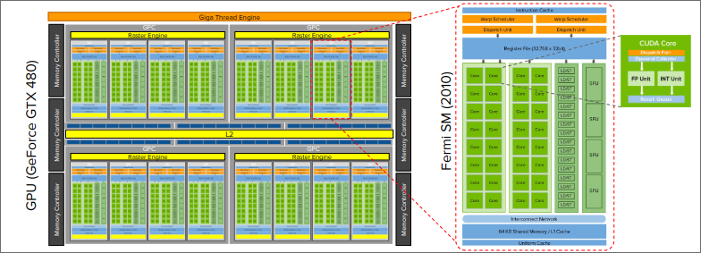
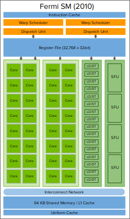
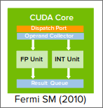
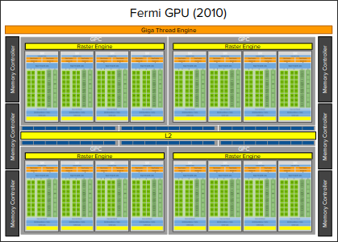
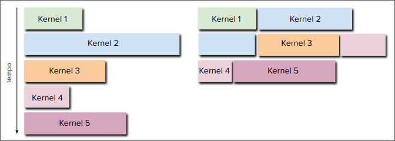
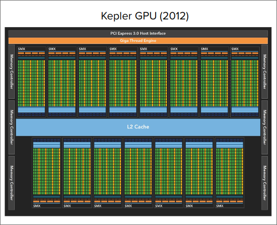
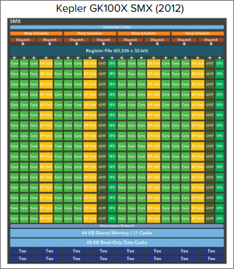
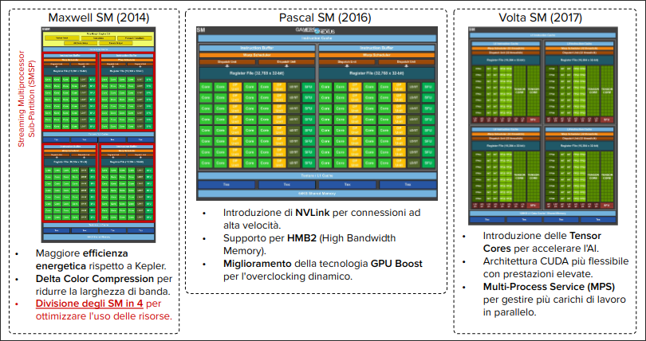
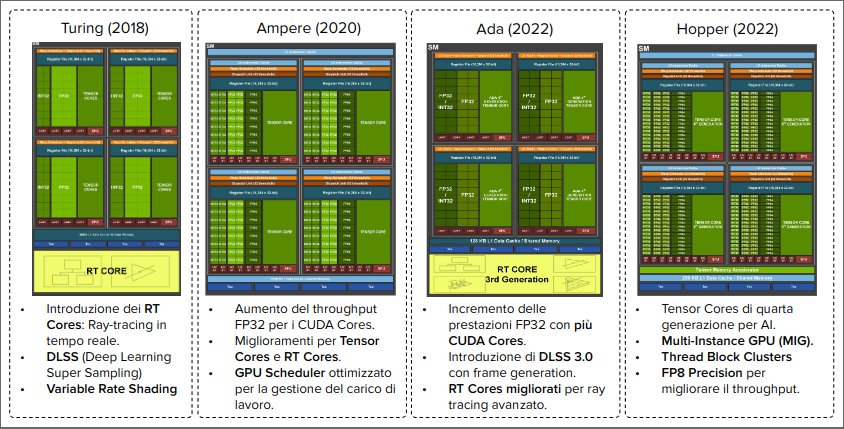

# Modello di Esecuzione CUDA
[back](./SistemiDigitali.md)

## Indice

- [Modello di Esecuzione CUDAback](#modello-di-esecuzione-cudaback)
  - [Indice](#indice)
  - [Architettura Hardware GPU](#architettura-hardware-gpu)
    - [Introduzione al Modello di Esecuzione CUDA](#introduzione-al-modello-di-esecuzione-cuda)
    - [Streaming Multiprocessor (SM)](#streaming-multiprocessor-sm)
      - [CUDA Core](#cuda-core)
    - [Architettura Fermi (2010)](#architettura-fermi-2010)
    - [Architettura Kepler (2012)](#architettura-kepler-2012)
      - [GK100X SMX](#gk100x-smx)
      - [Evoluzione](#evoluzione)
    - [Tensor Core: Acceleratori di Intelligenza Artificiale (Volta +)](#tensor-core-acceleratori-di-intelligenza-artificiale-volta-)

## Architettura Hardware GPU

### Introduzione al Modello di Esecuzione CUDA

In generale un modello di esecuzione fornisce una visione operativa di come le istruzioni vengono eseguite su una specifica architettura di calcolo

**Caratteristiche Principali:**
- Astrazione dell'architettura GPU NVIDIA
- Conservazione dei concetti fondamentali tra le generazioni
- Esposizione delle funzionalità architetturali chiave per la programmazione CUDA
- Basato sul parallelismo massivo e sul modello SIMT (Single Instruction, Multiple Threads)
  
**Importanza:**
- Offre una visione unificata dell'esecuzione su diverse GPU
- Fornisce indicazioni utili per l'ottimizzazione del codice in termini di:
  - Througput delle istruzioni.
  - Accessi alla memoria.
- Facilita la comprensione della relazione tra il modello di programmazione e l'esecuzione effettiva

### Streaming Multiprocessor (SM)

Gli streaming multiprocessor (SM) sono i blocchi di elaborazione principali delle GPU NVIDIA. Ogni SM è composto da:
- Unità di calcolo
- Memoria condivisa
- Risorse (registri, cache, ecc.)

Il parallelismo hardware delle GPU è ottenuto attraverso la replica di questo blocco architetturale

**Caratteristiche Principali:**
1. CUDA Cores: Unità di calcolo che eseguono le istruzioni
2. Shared Memory / L1 Cache: Memoria condivisa tra i thread di uno stesso blocco
3. Register File: Memoria veloce per i registri dei thread
4. Load/Store Units: Unità per l'accesso alla memoria globale
5. Special Function Units: Unità per operazioni speciali (es. funzioni matematiche)
6. Warp Scheduler: Unità per la gestione dei warp
7. Dispatch Unit: Unità per l'assegnazione dei warp ai CUDA Cores
8. Instruction Cache: Memoria per le istruzioni

#### CUDA Core

Un Cuda è l'unità di elaborazione di base all'interno di un SM di una GPU NVIDIA.

**Composizione e Funzionamento (Fermi)**
I CUDA Core erano unità di elaborazione relativamente semplici, in grado di eseguire sia operazioni intere (INT) che in virgola mobile (FP) in un ciclo di clock.
- ALU (Arithmetic Logic Unit): Ogni CUDA Core contiene un'unità logico-aritmetica che esegue operazioni matematiche di base come addizioni, sottrazioni, moltiplicazioni e operazioni logiche.
- FPU (Floating Point Unit): Ogni CUDA Core contiene un'unità in virgola mobile che esegue operazioni in virgola mobile come addizioni, sottrazioni, moltiplicazioni e divisioni.
  
I CUDA Core usano registri condivisi a livello di Streaming Multiprocessor per memorizzare i dati temporanei e i risultati intermedi.

**Evoluzione dell'architettura (da Kepler)**

Dall'architettura Kepler NVIDIA ha introdotto la specializzazione delle unità di calcolo all'interno di un SM:

- **General:**
  - **Unità FP64**: Unità specializzata per operazioni in virgola mobile a doppia precisione
  - **Unità FP32**: Unità specializzata per operazioni in virgola mobile a singola precisione
  - **Unità INT**: Unità specializzata per operazioni intere
- **AI:**
  - **Tensor Core**: Unità specializzata per operazioni di moltiplicazione e accumulo di matrici
- **Graphics:**
  - **Ray Tracing Core (RT Core)**: Unità specializzata per operazioni di ray tracing
  - **Unità di Texture**: Unità specializzata per operazioni di texture mapping
  - **Unità di Rasterizzazione**: Unità specializzata per operazioni di rasterizzazione

Ogni unità di elaborazione esegue un thread in parallelo con altri nel medesimo SM.

### Architettura Fermi (2010)

**Caratteristiche Principali:**
- Prima architettura GPU completa per **applicazioni HPC** ad alte prestazioni.
- Fino a **521 CUDA** cores organizzati in 16 SM.
- Ogni SM contiene:
  - 32 CUDA Cores.
  - 2 unità di scheduling e dispatch.
  - 64KB di Shared Memory/Cache L1.
  - 32.768 registri da 32 bit.
- 768 KB di memoria cache L2 con **coalescenza di memoria**.
- Interfaccia di memoria a **384 bit** con **GDDR5**, supporto fino a **6 GB** di memoria globale.
- GigaThread Engine per la gestione di **migliaia di thread**.
- Interfaccia Host-Device per connessione CPU via PCI Express.

**Esecuzione Concorrente dei Kernel:**
- L'architettura permette l'esecuzione di più kernel in modo concorrente.
- Supporta fino a 16 kernel in esecuzione contemporanea.
- Ottimizza l'uso della GPU per applicazioni con diversi kernel.
- Appare come una architettura MIMD (Multiple Instruction, Multiple Data).
- Le generazioni successive a Fermi supportano un numero ancora maggiore di kernel in esecuzione.

### Architettura Kepler (2012)

**Caratteristiche Principali GPU**
- L'architettura Kepler include 3 importanti novità:
  - Straming Multiprocessors Potenziati (SMX).
  - Dynamic Parallelism: Permette ai kernel di lanciare altri kernel.
  - Hyper-Q: Permette a più CPU di comunicare con la GPU.
  - GPU Boost: Permette di aumentare la frequenza di clock della GPU in base al carico di lavoro.
- 2688 Cuda Corse organizzati in 15 SMX.
- 6 Controller di Memoria a 64 bit.
- 6 GB di Memoria Gloabale DDR5.
- Larghezza di Banda della memoria: 250 GB/s.
- 1536 KB di Cache L2.
- Interfaccia Host-Device PCI Express 3.0.

#### GK100X SMX

**Caratteristiche Principali - Singolo SMX**

- Ogni SMX contiene 192 CUDA Cores, per un totale di 2880 CUDA Cores.
- Unità di precisione:
  - Unità di precisione singla (FP32): 192 CUDA Cores.
  - Unità di precisione doppia (FP64): 64 CUDA Cores.
- 32 Unità di Funzione Speciale (SFU).
- 32 Unità di Load/Store (LD/ST).
- 64 KB di Shared Memory/Cache L1.
- 48 KB di Read-Only Data Cache.
- 65,536 Registri da 32 bit.
- 4 Warp Scheduler.
- 8 Instruction Cache.

#### Evoluzione

### Tensor Core: Acceleratori di Intelligenza Artificiale (Volta +)

I tensor core sono unità di elaborazione specializzata per operazioni tensoriali (array multidimensionali), progettati per accelerari i calcoli di AI e HPC, presenti in GPU NVIDIA RTX da Volta (2017) in poi.

**Caratteristiche Principali:**
- Esegue operazioni matrice-matrice in precisione mista.
- Supporta formati FP16, FP32, FP64, INT8, INT4, BF16 e nuovi formati come TF32.
- Offre un significativo speedup nel calcolo senza compromettere l'accuratezza

