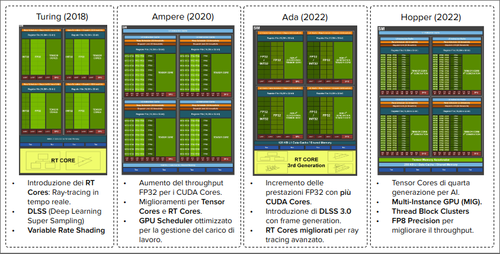
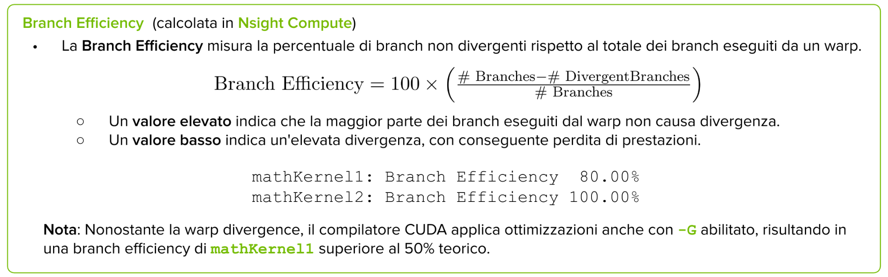
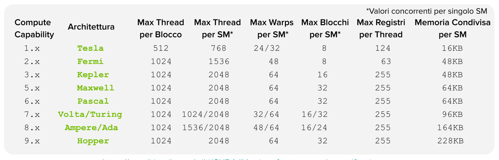

# Modello di Esecuzione CUDA<div style="text-align: right">[back](./SistemiDigitali.md)</div>

## Indice

- [Modello di Esecuzione CUDAback](#modello-di-esecuzione-cudaback)
  - [Indice](#indice)
  - [Architettura Hardware GPU](#architettura-hardware-gpu)
    - [Introduzione al Modello di Esecuzione CUDA](#introduzione-al-modello-di-esecuzione-cuda)
    - [Streaming Multiprocessor (SM)](#streaming-multiprocessor-sm)
      - [CUDA Core](#cuda-core)
    - [Architettura Fermi (2010)](#architettura-fermi-2010)
    - [Architettura Kepler (2012)](#architettura-kepler-2012)
      - [GK100X SMX](#gk100x-smx)
      - [Evoluzione](#evoluzione)
    - [Tensor Core: Acceleratori di Intelligenza Artificiale (Volta +)](#tensor-core-acceleratori-di-intelligenza-artificiale-volta-)
      - [Evoluzione dei NVIDIA Tensor Core](#evoluzione-dei-nvidia-tensor-core)
  - [Organizzazione e Gestione dei Thread](#organizzazione-e-gestione-dei-thread)
    - [SM, Trehad Blocks e Risorse](#sm-trehad-blocks-e-risorse)
    - [Corrispondenza tra Vista Logica e Vista Hardware](#corrispondenza-tra-vista-logica-e-vista-hardware)
      - [Software](#software)
      - [Hardware](#hardware)
    - [Distribuzione dei Blocchi su Streaming Multiprocessor](#distribuzione-dei-blocchi-su-streaming-multiprocessor)
    - [Scalabilità in CUDA](#scalabilità-in-cuda)
  - [Modello di Esecuzione SIMT e Warp (slide 29)](#modello-di-esecuzione-simt-e-warp-slide-29)
    - [Modello di esecuzione SIMD](#modello-di-esecuzione-simd)
    - [Modello di esecuzione SIMT](#modello-di-esecuzione-simt)
    - [Modello di Esecuzione Gerarchico di CUDA](#modello-di-esecuzione-gerarchico-di-cuda)
  - [Warp: Unità fondamentale di Esecuzione nelle SM](#warp-unità-fondamentale-di-esecuzione-nelle-sm)
    - [Organizzazione dei Thread e Warp](#organizzazione-dei-thread-e-warp)
  - [Compute capability (CC) - Limiti su Blocchi e Thread](#compute-capability-cc---limiti-su-blocchi-e-thread)
  - [Warp: Contesto di Esecuzione](#warp-contesto-di-esecuzione)
  - [Classificazione dei Thread Block e Warp](#classificazione-dei-thread-block-e-warp)
  - [Classificazione degli Stati dei Thread](#classificazione-degli-stati-dei-thread)
  - [Scheduling dei warp](#scheduling-dei-warp)
    - [Warp Scheduler e Dispatch Unit](#warp-scheduler-e-dispatch-unit)
    - [Scheduling dei Warp: TLP e ILP](#scheduling-dei-warp-tlp-e-ilp)
  - [Esecuzione parallela dei warp (FERMI SM)](#esecuzione-parallela-dei-warp-fermi-sm)
  - [Scheduling Dinamico delle Istruzioni (FERMI SM)](#scheduling-dinamico-delle-istruzioni-fermi-sm)
    - [Latency, Throughput e Concurrency](#latency-throughput-e-concurrency)
  - [Latency Hiding nelle GPU](#latency-hiding-nelle-gpu)
    - [Esempio di esecuzione di Blocchi e Warp su un SM](#esempio-di-esecuzione-di-blocchi-e-warp-su-un-sm)
  - [Legge di Little](#legge-di-little)
  - [Warp Divergence](#warp-divergence)
    - [CPU vs GPU: Gestione del Brancing e della Warp Divergence](#cpu-vs-gpu-gestione-del-brancing-e-della-warp-divergence)
    - [Analisi del flusso di esecuzione](#analisi-del-flusso-di-esecuzione)
  - [Serializzazione nella Warp Divergence](#serializzazione-nella-warp-divergence)
  - [Confronto delle condizione di Branch (saltabile slide 64)](#confronto-delle-condizione-di-branch-saltabile-slide-64)
  - [Architetture Pre-Volta](#architetture-pre-volta)
  - [Architettura Volta e Indipendent Thread Scheduling](#architettura-volta-e-indipendent-thread-scheduling)
    - [Introduzione di ```__syncwarp()``` in Volta](#introduzione-di-__syncwarp-in-volta)
  - [Confronto Pre-Volta vs Post-Volta](#confronto-pre-volta-vs-post-volta)
    - [ITS: Limitazioni](#its-limitazioni)
  - [Sincronizzazione e comunicazione](#sincronizzazione-e-comunicazione)
    - [Race Condition (Hazard)](#race-condition-hazard)
      - [Tipi di Race Condition:](#tipi-di-race-condition)
    - [Deadlock in CUDA](#deadlock-in-cuda)
    - [Operazioni Atomiche in CUDA](#operazioni-atomiche-in-cuda)
  - [Ottimizzazione delle risorse](#ottimizzazione-delle-risorse)
    - [Resource Partitioning in CUDA](#resource-partitioning-in-cuda)
    - [Anatomia di un thread block](#anatomia-di-un-thread-block)
    - [Compute Capability (CC) - limiti SM](#compute-capability-cc---limiti-sm)
    - [Occuppancy](#occuppancy)
    - [Occupancy Teorica VS Effettiva](#occupancy-teorica-vs-effettiva)
      - [Wave](#wave)
  - [Parallelismo avanzato](#parallelismo-avanzato)
    - [CUDA Dynamic Parallelism](#cuda-dynamic-parallelism)
    - [Esecuzione Nidificata con CUDA dynamic parallelism](#esecuzione-nidificata-con-cuda-dynamic-parallelism)
    - [Memoria in CUDA Dynamic Parallelism](#memoria-in-cuda-dynamic-parallelism)
    - [Consistenza della Memoria nel Parallelismo Dinamico](#consistenza-della-memoria-nel-parallelismo-dinamico)
    - [Sincronizzazione con ```cudaDeviceSynchronize()```](#sincronizzazione-con-cudadevicesynchronize)
      - [Limiti](#limiti)
    - [Esempi](#esempi)

## Architettura Hardware GPU

### Introduzione al Modello di Esecuzione CUDA

In generale un modello di esecuzione fornisce una visione operativa di come le istruzioni vengono eseguite su una specifica architettura di calcolo

**Caratteristiche Principali:**
- Astrazione dell'architettura GPU NVIDIA
- Conservazione dei concetti fondamentali tra le generazioni
- Esposizione delle funzionalità architetturali chiave per la programmazione CUDA
- Basato sul parallelismo massivo e sul modello SIMT (Single Instruction, Multiple Threads)
  
**Importanza:**
- Offre una visione unificata dell'esecuzione su diverse GPU
- Fornisce indicazioni utili per l'ottimizzazione del codice in termini di:
  - Througput delle istruzioni.
  - Accessi alla memoria.
- Facilita la comprensione della relazione tra il modello di programmazione e l'esecuzione effettiva

### Streaming Multiprocessor (SM)

Gli streaming multiprocessor (SM) sono i blocchi di elaborazione principali delle GPU NVIDIA. Ogni SM è composto da:
- Unità di calcolo
- Memoria condivisa
- Risorse (registri, cache, ecc.)

Il parallelismo hardware delle GPU è ottenuto attraverso la replica di questo blocco architetturale


**Caratteristiche Principali:**
1. CUDA Cores: Unità di calcolo che eseguono le istruzioni
2. Shared Memory / L1 Cache: Memoria condivisa tra i thread di uno stesso blocco
3. Register File: Memoria veloce per i registri dei thread
4. Load/Store Units: Unità per l'accesso alla memoria globale
5. Special Function Units: Unità per operazioni speciali (es. funzioni matematiche)
6. Warp Scheduler: Unità per la gestione dei warp
7. Dispatch Unit: Unità per l'assegnazione dei warp ai CUDA Cores
8. Instruction Cache: Memoria per le istruzioni


#### CUDA Core

Un Cuda è l'unità di elaborazione di base all'interno di un SM di una GPU NVIDIA.


**Composizione e Funzionamento (Fermi)**
I CUDA Core erano unità di elaborazione relativamente semplici, in grado di eseguire sia operazioni intere (INT) che in virgola mobile (FP) in un ciclo di clock.
- ALU (Arithmetic Logic Unit): Ogni CUDA Core contiene un'unità logico-aritmetica che esegue operazioni matematiche di base come addizioni, sottrazioni, moltiplicazioni e operazioni logiche.
- FPU (Floating Point Unit): Ogni CUDA Core contiene un'unità in virgola mobile che esegue operazioni in virgola mobile come addizioni, sottrazioni, moltiplicazioni e divisioni.
  
I CUDA Core usano registri condivisi a livello di Streaming Multiprocessor per memorizzare i dati temporanei e i risultati intermedi.

**Evoluzione dell'architettura (da Kepler)**

Dall'architettura Kepler NVIDIA ha introdotto la specializzazione delle unità di calcolo all'interno di un SM:

- **General:**
  - **Unità FP64**: Unità specializzata per operazioni in virgola mobile a doppia precisione
  - **Unità FP32**: Unità specializzata per operazioni in virgola mobile a singola precisione
  - **Unità INT**: Unità specializzata per operazioni intere
- **AI:**
  - **Tensor Core**: Unità specializzata per operazioni di moltiplicazione e accumulo di matrici
- **Graphics:**
  - **Ray Tracing Core (RT Core)**: Unità specializzata per operazioni di ray tracing
  - **Unità di Texture**: Unità specializzata per operazioni di texture mapping
  - **Unità di Rasterizzazione**: Unità specializzata per operazioni di rasterizzazione

Ogni unità di elaborazione esegue un thread in parallelo con altri nel medesimo SM.

### Architettura Fermi (2010)

**Caratteristiche Principali:**
- Prima architettura GPU completa per **applicazioni HPC** ad alte prestazioni.
- Fino a **521 CUDA** cores organizzati in 16 SM.
- Ogni SM contiene:
  - 32 CUDA Cores.
  - 2 unità di scheduling e dispatch.
  - 64KB di Shared Memory/Cache L1.
  - 32.768 registri da 32 bit.
- 768 KB di memoria cache L2 con **coalescenza di memoria**.
- Interfaccia di memoria a **384 bit** con **GDDR5**, supporto fino a **6 GB** di memoria globale.
- GigaThread Engine per la gestione di **migliaia di thread**.
- Interfaccia Host-Device per connessione CPU via PCI Express.


**Esecuzione Concorrente dei Kernel:**
- L'architettura permette l'esecuzione di più kernel in modo concorrente.
- Supporta fino a 16 kernel in esecuzione contemporanea.
- Ottimizza l'uso della GPU per applicazioni con diversi kernel.
- Appare come una architettura MIMD (Multiple Instruction, Multiple Data).
- Le generazioni successive a Fermi supportano un numero ancora maggiore di kernel in esecuzione.


### Architettura Kepler (2012)

**Caratteristiche Principali GPU**
- L'architettura Kepler include 3 importanti novità:
  - Straming Multiprocessors Potenziati (SMX).
  - Dynamic Parallelism: Permette ai kernel di lanciare altri kernel.
  - Hyper-Q: Permette a più CPU di comunicare con la GPU.
  - GPU Boost: Permette di aumentare la frequenza di clock della GPU in base al carico di lavoro.
- 2688 Cuda Corse organizzati in 15 SMX.
- 6 Controller di Memoria a 64 bit.
- 6 GB di Memoria Gloabale DDR5.
- Larghezza di Banda della memoria: 250 GB/s.
- 1536 KB di Cache L2.
- Interfaccia Host-Device PCI Express 3.0.


#### GK100X SMX

**Caratteristiche Principali - Singolo SMX**

- Ogni SMX contiene 192 CUDA Cores, per un totale di 2880 CUDA Cores.
- Unità di precisione:
  - Unità di precisione singla (FP32): 192 CUDA Cores.
  - Unità di precisione doppia (FP64): 64 CUDA Cores.
- 32 Unità di Funzione Speciale (SFU).
- 32 Unità di Load/Store (LD/ST).
- 64 KB di Shared Memory/Cache L1.
- 48 KB di Read-Only Data Cache.
- 65,536 Registri da 32 bit.
- 4 Warp Scheduler.
- 8 Instruction Cache.


#### Evoluzione




### Tensor Core: Acceleratori di Intelligenza Artificiale (Volta +)

I tensor core sono unità di elaborazione specializzata per operazioni tensoriali (array multidimensionali), progettati per accelerari i calcoli di AI e HPC, presenti in GPU NVIDIA RTX da Volta (2017) in poi.

**Caratteristiche Principali:**
- Esegue operazioni matrice-matrice in precisione mista.
- Supporta formati FP16, FP32, FP64, INT8, INT4, BF16 e nuovi formati come TF32.
- Offre un significativo speedup nel calcolo senza compromettere l'accuratezza

- **Fused Multiply-Add (FMA):** Un'operazione che combina una moltiplicazione e una addizione di scalari in un unico passo eseguendo $d=a*b+c$. Un CUDA core esefue 1 FMA per ciclo di clock in FP32.
- **Matrix Multiply and Accumulate (MMA):** Un'operazione che combina una moltiplicazione e una addizione di matrici in un unico passo eseguendo $D+=A*B$. Un Tensor Core esegue 64 FMA per ciclo di clock in FP16.
- Una MMA di dimensione $m*n$ richiede $m*n*k$ operazioni FMA dove $k$ è il numero di colonne di $A$ e il numero di righe di $B$.


> Esecuazione Parallela
> - ogni tensor core esegue 64 FMA in un singolo ciclo
> - Per operazioni su matrici più grandi, queste vengono decomposte in sottomatrici 4x4
> - più operazioni 4x4 vengono eseguite in parallelo su diversi Tensor Core

#### Evoluzione dei NVIDIA Tensor Core

Le generazioni più recenti di CPU hanno ampliato la flessibilità e le prestazioni dei Tensor Core, supportando dimensioni di matrici più grandi con un maggiore numero di formati numerici


- **Acelerazione** significativa dei calcoli
- **Riduzione del consumo** di memoria e energia.
- **Perdita di Precisione**: Si è dimostrato che ha un impatto minimo sulla accuratezza finale dei modelli di deep learning.

## Organizzazione e Gestione dei Thread

### SM, Trehad Blocks e Risorse

- **Parallelismo Hardware**
  - Più SM per GPU permettono l'esecuzione simultanea di migliaia di thread (anche da kernel differenti).
- **Distribuzione dei Thread Block**
  - Quando un kernel viene lanciato, i blocchi vengono distribuiti dal GigaThread Engine ai SM.
  - Le variabili di identificazione e dimensione ```gridDim```, ```blockIdx```, ```blockDim``` e ```threadIdx``` sono rese disponibili ad ogni thread e condivise nello stesso SM.
  - Una volta assegnati a un SM, i thread di un blocco eseguono esclusivamente su quell'SM.
- **Gestione delle Risorse**
  - Più blocchi di Thread possono essere assegnati allo stesso SM contemporaneamente.
  - Lo scheduling dei blocchi dipende dalla disponibilità delle risorse dell'SM e dai limiti architetturali di ciascun SM.
- **Parallelismo Multi-Livello**
  - Parallelismo a livello di istruzioni: Le istruzioni all'interno di un singolo thread sono eseguite in pipeline.
  - Parallelismo a livello di Thread: Esecuzione concorrente di gruppi di threads (warp) su un SM.

### Corrispondenza tra Vista Logica e Vista Hardware


#### Software

- **Thread**:
  - ha uno spazio di memoria privato (registri nell'SM e Memoria locale) per indifie, variabili, e risultati intermedi.

- **Thread Block**:
  - Gruppo di thread eseguiti concorrentemente.
  - Cooperazione tramite barriere di sincronizzazione
  - Usa shared memory per comunicazione inter-thread.
  - Un blocco di thread viene assegnato esclusivamente ad un solo SM.
  - Una volta che un blocco di thread è stato assegnato ad un SM, vi rimane fino al completamento dell'esecuzione.

- **Grid**:
  - Insieme di thread block che eseguono lo stesso kernel.
  - Accesso comune alla global memory.
  - I thread block non possono sincronizzarsi direttamente tra di loro.

#### Hardware

- **SM**:
  - Un SM più contenere più blocchi di thread contemporaneamente.
  - Ogni SM ha un limite massimo di thread block gestibili, determinato dalla sua compute capability.

### Distribuzione dei Blocchi su Streaming Multiprocessor

Supponiamo  di dovere realizzare un algoritmo parallelo che effettuio il calcolo parallelo su una immagine


- Il gigathread Engine smista i blocchi di thread agli SM in base alle risorse disponibili.
- CUDA non garantisce l'ordine e non è possibile scambiare dati tra i blocchi.
- Ogni blocco viene elaborato in modo indipendente.


- Quando un blocco completa l'esecuzione e libera le risorse, un nuovo blocco può essere assegnato allo SM. Questo processo continua fino a quando tutti i blocchi del grid non sono stati elaborati.

### Scalabilità in CUDA

Per scalabilità in CUDA ci si riferisce alla capacità di una applicazione di migliorare le prestazioni proporzionalmente all'aumentodelle risorse hardware disponibili.

Più SM disponibili = più blocchi eseguiti contemporaneamente = Maggiore Parallelismo.

Nessuna modifica al codice richiesta per sfrittare hardware più potente.


## Modello di Esecuzione SIMT e Warp (slide 29)

### Modello di esecuzione SIMD

- È un modello di esecuzione parallela comunemente utilizzato dalle CPU dove una singola istruzione opera simultaneamente su più elementi usando unità di elaborazione vettoriale.
- Utilizza registri vettoriali che possono contenere più elementi
- Il programma segue un flusso di controllo centralizzato (unico thread).
- Limitazioni:
  - Larghezza vettoriale fissa nell'hardware, limitando gli elementi per istruzione.
  - Tutti gli elementi vettoriali in un vettore vengono eseguiti insieme in un gruppo sincrono unificato.
  - Divergenza non è ammessa in SIMD, se sono richieste condizioni, si usano maschere esplicite che indicano su quali elementi il calcolo deve essere eseguito.


### Modello di esecuzione SIMT

- Modello ibrido adottato in CUDA che combina parallelismo a livello di più thread con esecuzione tipo SIMD.
- **Caratteristiche chiave:**
  - A differenza del SIMD, non ha un controllo centralizzato delle istruzioni.
  - Ogni thread possiede un proprio **Program Counter (PC)**, **registri** e **stato** indipendenti.
  - Supporta divergenza del flusso di controllo tra i thread.
- **Implementazione:**
  - In CUDA, i thread sono organizzati in gruppi di 32 chiamati **warp**.
  - I thread in un warp iniziano insieme allo stesso indirizzo del programma (PC), ma possono divergere.
  - Divergenza in un warp causa esecuzione seriale dei percorsi divesi, riducendo l'efficienza.
  - La divergenza è gestita automaticamente dall'hardware, ma con un impatto nevativo sulle prestazioni.
  


> **Perchè 32 thread in un warp CUDA?**
> - **Efficienza Hardware:** Massimizza l'utilizzo delle risorse hardware.
>   - Un warp troppo piccolo sarebbe inefficiente, uno troppo grande complicherebbe lo cheduling e potrebbe sovraccaricare gli SM / la memoria.
> - **Efficienza della Memoria:** Un warp di 32 thread accede a indirizzi di memoria consecutivi, permettendo aggregazioni in poche transazioni e massimizzando l'efficienza delle linee di connessione per evitare accessi parziali.
> - **Flessibilità Software:** Offre una granularità gestibile per il parallelismo e la divergenza dei thread.
> - **Adattabilità:** Questa dimensione si è dimostrata efficace per varie generazioni di GPU NVIDIA, pur rimanendo aperta a future evoluzioni.


### Modello di Esecuzione Gerarchico di CUDA

**Livello di Programmazione**


**Livello di Esecuzione**


## Warp: Unità fondamentale di Esecuzione nelle SM

- **Distribuzione dei Thread Block**:
  - Quando si lancia una griglia di thread block, questi vengono distribuiti tra i diversi SM disponibili.
- **Partizionamento in Warp**:
  - I thread di un thread block venngono suddivisi in warp di 32 thread (con ID consecutivi).
- **Esecuzione SIMT**:
  - I thread in un warp eseguono la stessa istruzione su dati diversi, con possibilità di divergenza.
- **Esecuzione Logica vs Fisica**:
  - Thread eseguiti in parallelo logicamente, ma non sempre fisicamente.
- **Scheduling Dinamico (Warp Scheduler)**
  - L'SM gestisce dinamicamente l'esecuzione di un numero limitato di warp, switchando efficientemente tra essi.
- **Sincronizzazione**
  - Possibile all'interno di un thread block, ma non tra blocchi diversi.
  


### Organizzazione dei Thread e Warp

**Thread Blocks e Warp**

- **Punto di vista logico:** Un blocco di thread è una collezione di thread organizzati in un layout 1D, 2D o 3D.
- **Punto di vista hardware:** Un blocco di thread è una collezione 1D di warp. I thread in un blocco sono organizzati in un layout 1D e ogni insieme di 32 thread consecutivi forma un warp.


---

- Un warp viene assegnato a una sub-partition, solitamente in base al lsuo ID, dove rimane fino al completamento.
- Una sub-partition gestisce un "pool" di warp concorrenti di dimensione fissa.
  


## Compute capability (CC) - Limiti su Blocchi e Thread

- **Compute Capability (CC):** di NVIDIA indica le caratteristiche e la capacità di una GPU in termini di funzionalità supportate e limiti hardware
- È composta da due numeri: il numero principale indica la generazione dell'architettura, il numero secondario indica la versione specifica.


## Warp: Contesto di Esecuzione

- il contesto di esecuzione locale di un warp in SM contiene:
  - Program counter: indica l'indirizzo della prossima istruzione da eseguire.
  - Call stack: struttura dati che memorizza le informazioni sulle chiamate di funzione.
  - Registri: memoria veloce per i dati temporanei e i risultati intermedi.
  - Memoria condivisa: memoria condivisa tra i thread di un blocco.
  - Thread Mask: indica quali thread di un warp sono attivi.
  - Stato di esecuzione: informazioni sullo stato di esecuzione del warp.
  - Warp ID: identificatore che consente di distinguere i warp all'interno di uno SM.
- L'SM mantiene on-chip il contesto di ogni warp per tutta la sua durata, il cambio di contesto è senza costo.

## Classificazione dei Thread Block e Warp

**Thread Block Attivo**
- Un thread block viene considerato attivo quando gli vengoono allocate risorse di calcolo di un SM come registri e memoria condivisa
- I warp contenuti in un thread block attivo sono chiamati warp attivi
- Il numero di blocchi attivi in ciascun istante è limitato dalle risorse dell'SM

**Tipi di Warp Attivi**
- Warp Selezionato
  - Un warp in esecuzione attiva su una unità di elaborazione (FP32, INT32, Tensor Core, ecc.)
- Warp in Stallo
  - Un warp in attesa di dati o risorse, impossibilitato a proseguire l'esecuzione
  - Può essere dovuto a:
    - Latenza di memoria
    - Dipendenze da istruzioni
    - Sincronizzazione
- Warp Eleggibile/Candidato
  - Un warp pronto per l'esecuzione, con risorse necessarie disponibili.
  - Condizioni:
    - Dispobilità di risorse
    - Prontezza dei dati
    - Nessuna dipendenza da istruzioni precedenti bloccante
  
## Classificazione degli Stati dei Thread

**Thread all'interno di un Warp**
- Un warp contiene sempre 32 thread, ma non tutti potrebbero essere logicamente attivi.
- Lo stato di ogni thread è tracciato attraverso una thread mask o maschera di attività

**Stati dei Thread**
- Thread attivo
  - Esegue l'istruzione corrente del warp
  - Contribuisce attivamente all'esecuzione SIMT
- Thread inattivo
  - Divergenza: Ha seguito un percorso diverso nel warp per istruzioni di controllo flusso, come salti condizionali.
  - Terminazione: Ha completato la sua esecuzione prima di altri thread nel warp.
  - Padding: I thread di padding sono utilizzati in situazioni in cui il numero totale dei thread del blocco non è un multiplo di 32, per garantire che il warp sia completamente riempito.

 ## Scheduling dei warp

 **Warp Scheduler**
 - Unità hardware presente in più copie all'interno di ogni SM, responsabile della selezione e assegnazione dei warp alle unità di calcolo CUDA.
 - Obiettivo: Massimizzare l'utilizzo delle risorse di calcolo dell'SM, selezionando in modo efficiente i warp pronti e minimizzando i tempi di inattività.
 - Latency hiding: Contribuiscono a nascondere la latenza eseguendo warp alternativi quando altri sono in stallo, garantendo un utilizzo efficace delle risorse.
  
**Funzionamento Generale**
- Processo di chedulazione:
  - I warp scheduler all'interno di un SM selezionano i warp eleggibili ad ogni ciclo di clock e li inviano alle dispatch unit, responsabili della assegnazione effettiva alle unità di esecuzione.
- Gestione degli stalli:
  - Se un warp è in stallo, il warp scheduler seleziona un altro waep eleggibile per l'esecuzione, garantendo l'esecuzione continua e l'uso ottimale delle risorse di calcolo.
- Cambio di contesto:
  - Il cambio di contesto tra warp è estremamente rapido grazie alla partizione delle risorse di calcolo e alla struttura hardware della GPU.  

### Warp Scheduler e Dispatch Unit

**WARP Scheduler**
- Cervello strategico che decide quali warp mandare in esecuzione
- Monitora continuamente lo stato dei warp per identificare quelli eleggibili
- Gestisce la priorità e l'ordine di esecizione dei warp, cercando di minimizzare le latenze

**Dispatch Unit**
- Ente esecutivo che si occupa di come eseguire i warp selezionati
- Si occupa:
  - Decodificare le istruzioni del warp
  - Distribuire i thread del warp alle unità di calcolo appropriate
  - Recuperare i dati dai registri e dalla memoria necessaria per l'esecuzione
  - Assegnare fisicamente le risorse hardware ai thread


### Scheduling dei Warp: TLP e ILP

- **Thread Level Parallelism (TLP)**
  - Esecuzione simultanea di più warp per sfruttare il parallelismo tra thread.
  - Quando un warp è in attesa, un altro warp viene selezionato ed eseguito aumentando l'occupazione delle unità di calcolo.
- **Instruction Level Parallelism (ILP)**
  - Esecuzione simultanea di più istruzioni indipendenti all'interno di un warp.
  - Ogni warp esegue istruzioni in modo indipendente, sfruttando il parallelismo tra istruzioni.
  - L'ILP è limitato dalla presenza di dipendenze tra le istruzioni, che possono causare stalli.

## Esecuzione parallela dei warp (FERMI SM)

**Componenti chiave per il parallelismo**:
- Due scheduler di warp pronti da eseguire dai thread block assegnati all'SM
- Due Unità di Dispatch delle istruzioni: inviano le istruzioni dei warop selezionati alle unità di esecuzione.

**Flusso di esecuzione**:
- I blocchi vengono assegnati all'SM e divisi in warp
- Due scheduler selezionano warp pronti per l'esecuzione
- Ogni dispatch unit invia un istruzione per warp a 16 CUDA core, 16 unità di caricamento, 4 unità di funzioni speciali
- Questo processo si ripete ciclicamente consentendo l'esecuzione parallela di più warp da più blocchi.


## Scheduling Dinamico delle Istruzioni (FERMI SM)

- Ad ogni ciclo di clock, un warp scheduler emette un'istruzione pronta per l'esecuzione
- L'istruzione può provenire dallo stesso warp (ILP) se indipendente, o più spesso da un warp diverso (TLP)
- Se le risorse sono occupate, lo scheduler passa a un altro warp pronto (latency hiding)


### Latency, Throughput e Concurrency

- **Mean Latency (ML)**
  - La latenza media è la media delle latenze degli elementi individuali. La latenza di un singolo elemento è la differenza tra il suo tempo di inizio e il suo tempo di fine
- **Throughput**
  - Rappresenta la velocità di elaborazione. È definito come il numero degli elementi completati entro un dato intervallo di tempo, diviso per la durata dell'intervallo stesso.
- **Concurrency**
  - Misura quanti elementi vengono processati contemporaneamente in un determinato momento. Si può definire sia istantaneamente che come media su un intervallo di tempo.


## Latency Hiding nelle GPU

- È una tecnica che permette di mascherare i tempi di attesa dovuti ad operazioni ad alta latenza attraverso l'esecuzione concorrente di più warp all'interno di un SM.
- Si ottiene intercambiando la computazione tra warp, per massimizzare l'utilizzo delle unità di calcolo di ogni SM.

**Funzionamento**
- Ogni SM può gestire decine di warp concorrentemente da più blocchi.
- Quando un warp è in stallo l'SM passa immediatamente all'esecuzione di altri warp pronti.
- I warp scheduler dell'SM selezionano costantemente i warp pronti all'esecuzione

**Vantaggi del latency hiding**
- Miglior utilizzo delle risorse: Le unità di elaborazione della GPU sono mantenute costantemente occupate, massimizzando il throughput.
- Maggiore Throughput: Completamente di un maggior numero di operazioni nella stessa unità di tempo.
- Minore latenza Effettiva: Minimizza l'impatto delle operazioni ad alta latenza.

**Meccanismo dei Warp Scheduler**
- L'immagine mostra due warp scheduler che gestiscono l'esecuzione di diversi warp nel tempo.
- Warp scheduler 0 e 1 alternano l'esecuzione di warp diversi per mantenere le unità di elaborazione occupate.
- Quando un warp è in attesa, altri warp vengono eseguiti per nascondere la latenza.
- I periodi di inattività sono minimizzati.
- Questo approccio permette di mascherare i tempi di latenza e aumentare l'efficienza complessiva.
- Risorse pienamente utilizzate quando ogni scheduler ha un warp eleggibile ad ogni ciclo di clock.


### Esempio di esecuzione di Blocchi e Warp su un SM

**Contesto**
- Esecuzione di un kernel con 1000 blocchi ciascuno composto da 128 thread.

**Fasi principali**
- Allocazione ai SM
  - Ogni SM può gestire simultaneamente un numero limitato di blocchi attivi
  - All'interno di ogni blocco attivo, i thread sono suddivisi in warp
- Warp Attivi per SM
  - Se un SM ad esempio gestisce 12 blocchi, vuol dire che saranno presenti 28 warp attibi in esecuzione smistati poi fra i var SM Sub-partition (SMSP)
- Funzionamento del Warp Scheduler
  - I warp scheduler selezionano un warp eleggibile ad ogni ciclo di clock per l'esecuzione
  - In presenza di un warp in stallo, gli scheduler assegnano un warp alternativo pronto all'esecuzione, garantendo la conntinuità operativa.

## Legge di Little

La legge di Little (o teoria delle code) ci aiuta a capire **quanti warp devono essere in esecuzione concorrente** per ottimizzare il latency hiding e mantenere le unità di elaborazione della GPU occupate.

> Warp Richiesti = Latenza x Throughput

- **Latenza:** Tempo medio necessario per completare un'operazione
- **Throughput:** Numero di operazioni completate in un determinato intervallo di tempo
- **Warp Richiesti:** Numero di warp necessari per mantenere le unità di elaborazione della GPU occupate

Indica che per nascondere la latenza è necessario avere un numero sufficiente di warp in esecuzione o pronti per l'esecuzione, in modo che mentre uno è in attesa, altri possano essere eseguiti.

## Warp Divergence

- In in warp, idealmente tutti i thread eseguono la stessa istruzione contemporaneamente per massimizzare il parallelismo SIMT,.
- Tuttavia se una istruzione condizionale porta thread diversi a percorrere rami diversi del codice, si verifica la Warp Divergence.
- In questo caso il warp esegue serialmente ogni ramo, utilizzando una maschera di attività per abilitare/disabilitare i thread.
- La divergenza termina quando i thread riconvergono alla fine del costrutto condizionale.
- La warp divergence può significativamente degradare le prestazioni perchè i thread non vengono eseguiti in parallelo durante la divergenza
- Notare che il fenomeno della divergenza occorre solo all'interno di un warp, non tra warp diversi.

### CPU vs GPU: Gestione del Brancing e della Warp Divergence


### Analisi del flusso di esecuzione


## Serializzazione nella Warp Divergence

- **Divergenza**
  - Quoando i thread di un warp seguono percorsi diversi a causa di un'istruzione condizionale, il warp esegue il ramo in serie, disabilitando i thread non attivi.
- **Località**
  - La divergenza si verifica solo all'interno di un singolo warp.
  - I warp diversi operano indipendentemente
  - I passi condizionali in differenti warp non causano divergenza
- **Impatto**
  - La divergenza può ridurre il parallelismo fino a 32 volte


```c
__global__ void WorstDivergence(int* x) {
   int i = threadIdx.x + blockDim.x * blockIdx.x;
   switch (i % 32) {
       case 0 :
           x[i] = a(x[i]);
           break;
       case 1 :
           x[i] = b(x[i]);
           break;
       . . .
       case 31:
           x[i] = v(x[i]);
           break;
   }
}
```

## Confronto delle condizione di Branch (saltabile slide 64)





## Architetture Pre-Volta


- **Program Counter Singolo e Call Stack** condiviso per tutti i 32 thread del warp (puntano alla stessa istruzione).
- Il warp agisce come una unità di esecuzione coesa/sincrona (stato dei thread è tracciato a livello di warp intero).
- **Mascheda di Attività (Active Mask)** per specificare i thread attivi nel warp.
- La maschera viene salvata fino alla riconvergenza del warp poi ripristinata per riesecuzione sincrona.

**Limitazioni**
- Quando c'è divergenza i thread che prendono branch diverso perdono concorrenza fino alla riconvergenza.
- Possibili deadlock tha thread in un warp, se i thread dipendono l'uno dall'altro in modo circolare.


## Architettura Volta e Indipendent Thread Scheduling

**Concetto chiave**
- L'indipendent thread scheduling (ITS) consente piena concorrenza tra tutti i thread indipendentemente dal warp.


- **Stato di Esecuzione per Thread**
  - Ogni thread mantiene il proprio stato di esecuzione, inclusi program counter e stack di chiamate.
  - Permette di cedere l'esecuzione a livello di singolo thread, migliorando l'uso delle risorse.
- **Attesa per Dati**
  - Un thread può attendere che un altro thread produca dati, facilitando la comunicazione e la sincronizzazione tra di essi.
- **Ottimizzazione della Pianificazione**
  - Un ottimizzatore di scheduling raggruppa i thread aattivi dello stesso warp in unità SIMT
  - Si mantiene l'alto throughput dell'esecuzione SIMT, come nelle GPU NVIDIA precedenti
- **Flessibilità maggiore**
  - I thread possono ora divergere e riconvergere con granularità sub-warp


### Introduzione di ```__syncwarp()``` in Volta

**Scopo**:
- Introdotta da Volta per supportare ITS e migliorare la gestionde della divergenza dei thread.
- Sincronizza esplicitamente e riconverge i thread all'interno di un warp.
- Blocca l'esecuzione del thread corrente finchè tutti i thread specificati nella maschera non hanno raggiunto il punto di sincronizzazione

```c
void __syncwarp(unsigned mask=0xffffffff);
```

**Vantaggi**:
- Permette a un ramo di attendere un altro rampo all'interno del warp, garantendo ceh tutti i thread specificati siano sincronizzati prima di proseguire
- Abilita l'esecuzione di algoritmi paralleli a grana fine in modo più sicuro

> **Esempuo di Utilizzo**
> ```c
> if(threadIdx.x < 16) {
>   // codice primi 16 thread
> } else {
>   // codice ultimi 16 thread
> }
> __syncwarp(); // sincronizza i thread
> ```

## Confronto Pre-Volta vs Post-Volta

||Pre-Volta|Post-Volta|
|---|---|---| 
|**Gestione dei thread**|Singolo PC per warp|PC individuale per thread|
|**Scheduling**|Sincrono all'interno del warp|Indipendente tra i thread|
|**Sincronizzazione**|Implicita all'interno del warp|Esplicita con ```__syncwarp()```|
|**Divergenza**|Serializzazione all'interno del warp|Esecuzione interlacciata possibile|
|**Deadlock Intra-Warp**|Possibili in certi scenari|Largamente mitigati|
|**Prestazioni con Divergenza**|Potenzialmente compromesse|Migliorate grazie a scheduling flessibile|
|**Complessità del Codice**|Workaround necessari per certi algoritmi|Codice più pulito e flessibile|

### ITS: Limitazioni

- ITS non può esonerare gli sviluppatori da una programmazione parallela impropria. Nessuno scheduling hardware può salvare dal livelick (ovvero thread che sono tecnicamente in esecuzione ma non fanno progressi)
- Il progresso è farantito solo per i warp residenti al momemnto. I thread rimarranno in attesa infinita se il loro progresso dipende da un warp che non lo è.
- Non garantisce la riconvergenza, quindi le assunzioni relative alla programmazione a livello di warp potrebbero non essere valide (usare esplicitamente  ```__syncwarp()```)
- Bisogna prestare più attenzione per garantire il comportamento SIMD dei warp.
- ITS introduce overhead per la gestione separata di program counter e call stack per ogni thread, aumentando la flessiiblità ma richiedendo più risorse.

## Sincronizzazione e comunicazione

1. **Asincronia tra Host e Device**
  - Comportamento di base: host e device operano in modo asincrono.
  - Senza sincronizzazione, l'host potrebbe tentare di utilizzare risultati non ancora pronti o modificare dati ancora in uso dalla GPU.
2. **Sincronizzazione tra Thread all'interno di un Blocco**
  - Copmortamento di base: I thread all'interno di un blocco possono eseguire in ordine arbitrario e a velociità diverse.
  - Quando i thread dello stesso blocco necessitano di condividere dati o coordinare le loro azioni, è necessaria una sincronizzazione esplicita.
3. **Coordinazione all'interno dei Warp**
  - Comportamento di base:
    - Pre-Volta: I thread all'interno di un warp eseguivano sempre la stessa istruzione contemporaneamente e in modo non sincronizzato alla stessa locazione di memoria causando risultati imprevedibili ed errori.
    - Post-Volta: I thread all'interno di un warp possono divergere e riconvergere, richiedendo una sincronizzazione esplicita per garantire che tutti i thread siano pronti prima di procedere.
  - Con l'esecuzione indipendente dei thread la sincronizzazionen esplicita diventa necessaria per garantire la coerenza nelel operazione intra-warp. 

### Race Condition (Hazard)

Una **Race condition** si verifica quando più thread accedono conocorrentemente e in modo non sincronizzato alla stessa locazione di memoria causando risultati imprevedibili ed errori.

#### Tipi di Race Condition:
- **Read-After-Write (RAW)**
  - Un thread legge un valore prima che un altro thread abbia finito di scriverlo.
- **Write-After-Read (WAR)**
  - Un thread scrive un valore prima che un altro thread abbia finito di leggerlo.
- **Write-After-Write (WAW)**
  - Due thread scrivono contemporaneamente alla stessa locazione di memoria.
  
Si verificano quando:
- I thread in un blocco sono logicamente paralleli ma non sempre fisicamente simultanei.
- Senza sincronizzazione, l'ordine di esecuzione tra thread è imprevedibile.

> Prevenzione delle race Condition:
> - All'interno di un thread block:
>   - Utilizzare ```__syncthreads()``` per sincronizzare i thread all'interno di un blocco.
> - Tra Thread Block diversi:
>   - Non esiste sincronizzazione diretta, l'unico modo è terminare il kernel e avviare un nuovo kernel.

### Deadlock in CUDA

Un deadlock in CUDA si verifica quando i thread di un blocco si bloccano reciprocamente in attesa di sincronizzazioni o risorse non raggiungibili, causando il blocco permanente dell'esecuzione del kernel.

Può  insorgere in presenza di sincronizzazioni condizionali o dipendenze non gestite correttamente.

**condizioni per il deadlock**

- **Sincronizzazione condizionale:** Uso di ```__syncthreads()``` all'interno di condizioni (```if```,```else```), dove solo una parte dei thread del blocco raggiunge il punto di sincronizzazione.
- **Dipendenze Circolari:** situazioni in cui gruppi di thread attendono reciprocamente il completamento di operazioni, creado un ciclo di dipendenze irrisolvibile.
- **Risorse Condivise**: Gestione non corretta dell'accesso alla memoria condivisa o ad altre risorse comuni.

> **Prevenzione dei Deadlock**
> - **Sincronizzazione Completa:** Evitare di utilizzare ```__syncthreads()``` all'interno di rami condizionali divergenti, assicurarsi che tutti i thread del clocco raggiungano i punti di sincronizzazione.
> - **Ristrutturazione del Codice:** Rimuovere le dipendenze condizionali organizzando le operazioni in modo che tutti i thread completino una fase prima di passare alla successiiva
> - **Indipendent Thread Scheduling:** Coon architetture Volta e successive, i thread di un warp possono avanzare in modo più indipendente, grazie all'indipendent Thread Scheduling ed alleviare il problema.
---

La sincronizzazione è il meccanismo che permette di coordinare l'esecuzione di thread paralleli e garantire la correttezza dei risultati, evitando race condition e deadlock e accessi concorrenti non sicuri alla memoria.

> **Livelli di Sincronizzazione in CUDA**
> - Livello di sistema:
>   - Blocca l'applicazione host finchè tutte le operazioni sul device non sono completate.
>   - Garantisce che il device abbia terminato l'esecuzione prima che l'host proceda.
>   - **Frima**: ```cudaError_t cudaDeviceSynchronize(void); //può causare overhead bloccando l'host
> - Livello di Blocco:
>   - Sincronizza tutti i thread all'interno di un singolo thread block
>   - Ogni thread attente che tutti gli altri thread nel clocco raggiungano il punto di sincronizzazione
>   - Garantisce la visibilità delle modifiche alla memoria globale e condivisa tra i thread del blocco.
>   - **Firma**: ```__device__ void __syncthreads(void); //riduce le prestazioni se usato troppo```
> - Livello di Warp:
>  - Sincronizza i thread all'interno di un warp
>  - Ottimizza le operazioni in un warp e permette comunicazioni efficienti tra thread dello stesso warp.
>  - **Frima**: ```__device__ void __syncwarp(unsigned mask =0xffffffff);


 ### Operazioni Atomiche in CUDA

 Perchè sono necessarie le operazioni atomiche?
 - Race conditions in operazioni Read Modify Write (RMW)
  - Più thread accedono e modificano la stessa locazione di memoria contemporaneamente
  - Risultati imprevedibili e inconsistenti
  
Scenario Tipico
```c
__global__ void increment(int *counter){
  int old = *counter; //legge il valore dalla memoria
  old = old + 1; //incrementa il valore
  *counter = old; //scrive il valore nuovo nella stessa locazione
}
```

Conseguenze:
- Conteggi errati: il vaoolre finale potrebbe non riflettere correttamente il numero di incrementi eseguiti
- Aggiornamenti di dati persi: le modifiche apportate da alcuni thread potrebbero essere sovrascritte da altri.
- Comportamento non deterministico: L'applicazione potrebbe produrre risultati diversi a ogni esecuzione.

Soluzioone
- Operazioni Atomiche: Operazioni che garantiscono l'accesso esclusivo a una locazione di memoria

**Operazioni Atomiche in CUDA** sono operazioni Read-Modify-Write eseguite come singola istruzione hardware indivisibile.

**Caratteristiche**
- Esclusività dell'accesso alla memoria: L'hardware assicura che solo un thread alla volta può eseguire l'operazione sulla stessa locazione di memoria. I thrad che eseguono operazioni atomiche sulla stessa posizione vengono messi in coda ed eseguiti in serie.
- Prevenzione delle interferenze: Evitano che i thread interferiscano tra loro durante la modifica dei dati.
- Compatibilità con memoria globale e condivisa: Operano su word di 32, 64 o 128 bit
- Riduzione del parallelismo effettivo: poichè i thread devono aspettare il proprio turno per accedere alla memoria.

**Tipiche operazioni atomiche**:
- Matematiche: ```atomicAdd()```, ```atomicSub()```, ```atomicMin()```, ```atomicMax()```, ```atomicInc()```, ```atomicDec()```
- Bitwise: ```atomicAnd()```, ```atomicOr()```, ```atomicXor()``` 
- Swap: ```atomicExch()``` (scambio di valori)

## Ottimizzazione delle risorse

### Resource Partitioning in CUDA

Il resource partitioning riguarda la suddivisione e la gestione delle risorse hardware limitate all'interno di una GPU, in particolare all'interno di ogni SM.

L'obiettivo è ottimizzare la distribuzione delle risorse limitate tra thread e blocchi, massimizzando l'occupazione degli SM e l'efficienza dell'esecuzione delle applicazioni CUDA.

**Partizionamento delle Risorse nell'**SM**
- Ogni SM ha una quantità limitata di registri e memoria condivisa:
  - Register file: Un insieme di registri a 32 bit, partizionati tra i thread attivi.
  - Memoria condivisa: una quantità fissa di memoria condivisa, partizionata tra i blocchi di thread attivi.
- Il numero di thread block e warp che possono risiedere simultaneamente su un SM dipende dalla:
  - Disponibilità di Risorse: Quantità di registri e memoria condivisa richiesti dal kernel per l'esecuzione.
  - Richiesta del chernel: Quantità di registri e memoria condivisa richiesti dal kernel per l'esecuzione
- Se le risorse di uno SM sono insufficienti per elaborare almeno un blocco di thread, il lancio del kernel fallisce.
  
### Anatomia di un thread block

**Requisiti di risorse per SM:**

Tutti  i blocchi in una griglia eseguono lo stesso programma usando lo stesso numero di thread portanto a 3 requisiti di risorse fondamentali:

1. Dimensione del blocco: Il numero di thread che devono essere concorrenti.
2. Memoria condivisa: È comune a tutti i thread dello stesso blocco
3. Registri: Dipendono dalla complessita del programma (thread-per-blocco x registri-per-thread)

### Compute Capability (CC) - limiti SM

- **Compute Capability (CC):** di NVIDIA indica le caratteristiche e la capacità di una GPU in termini di funzionalità supportate e limiti hardware
- È composta da due numeri: il numero principale indica la generazione dell'architettura, il numero secondario indica la versione specifica.
  


### Occuppancy

- **Occupancy:** Misura la quantità di risorse di un SM utilizzate da un kernel rispetto al massimo disponibile.
- Rapporto tra i warp attivi e il numero massimo di warp supportati per SM
$$
\text{Occupancy [\%]} = \frac{\text{Active Warps}}{\text{Max Warps}}
$$

**Punti chiave**:
- misura l'efficacia nell'uso delle risorse dell'SM:
  - Occupancy ottimale: Quando raggiunge un livello sufficiente per nascondere la latenza. Un ulteriore aumento potrebbe degradare le prestazioni a causa della riduzione delle risorse disponibili per thread.
  - Occupancy bassa: Risulta in una scarsa efficienza nell'emissione delle istruzioni, poichè non ci sono abbastanza warp eleggibili per nascondere la latenza tra istruzioni dipendenti.
- Una occupancy elevata non garantisce sempre prestazioni migliori: Oltre certa soglia, fattori come pattern di caccesso alla memoria e parallelismo delle istruzioni possono diventare più rilevanti per l'ottimizzazione.

> **Strumenti per l'Ottimizzazione**
> - Strumenti di profiling: Nsight Compute consente di recuperare l'occupancy, offrendo dettagli sul numero di warp attivi per SM e sull'efficienza delle risorse di calcolo.
> - Suggerimento: Osservare gli effetti sul tempo di esecuzione del kernel a diversi livelli di occupancy.

**Misure di Occupancy**:
- L'occupancy di un kernel CUDA si divide in teorica, basata sui limiti hardware, ed effettiva, misurata a runtime.

**Occupancy Teorica**
- Ha un limite superiore determinato dalla configurazione di lancio e limiti dell'SM.
- $\text{Limite massimo warp attivi} = \text{Limite massimo blocchi attivi}* \text{Warp per blocco}$
- È possibile aumentare il limite incrementando il numero di warp per blocco o modificando i fattori limitanti per aumentare i blocchi attivi per SM.

**Occupancy Effettiva**
- Misura il numero reale di warp attivi durante l'esecuzione del kernel.
- Il numero reale di warp attivi varia durante l'esecuzione del kernel, man mano che i warp iniziano e terminano.
- Calcolo dell'occupazione effettiva:
  - L'occupazione ottenuta è misurata su ciascun scheduler di warp utilizzando contatori di prestazioni hardware che registrano i warp attivi ad ogni ciclo di clock.
  - I conteggi cengono sommati su tutti i warp scheduler di ogni SM e divisi per i cicli di clock attivi dell'SM per calcolare la media dei warp attivi.
  - Dividendo per il numero massimo di warp attivi supportati dall'SM si ottiene l'occupazione effettiva media per SM durante l'esecuzione del kernel.

### Occupancy Teorica VS Effettiva

**Obiettivi di ottimizzazione**
- L'occupazione effettiva non può superare l'occupazione teorica.
- Pertanto il primo passo per aumentare l'occupazione è incrementare quella teorica, modificando i fattori limitanti.
- Successivamente è necessario verificare se il valore ottenuto è vicino a quello teorico per ridurre il gap.

**Cause di bassa Occupancy Effettiva**
- L'occupancy effettiva sarà inferiore a quella teorica quando il numero teorico di warp attivi non viene mantenuto durante l'attività dello SM. Ciò può accedere nelle seguenti situazioni:
  - Carico di lavoro sbilanciato nei blocchi: Quando i warp all'interno di un blocco hanno tempi di esecuzione diversi, si crea un tail effect che riduce l'occupazione. **Soluzione**: bilanciare il carico tra i warp.
  - Carico di lavoro sbilanciato tra blocchi: Se i blocchi della grid hanno del massimo supportato abbassa l'occupazione. Ad esempio, una configurazione che richiederebbe 16 blocchi per il 100% di occupazione scende al 75% con soli 12 blocchi lanciati.
  - Wave Parziale: Si verifica quando l'ultimo insieme di blocchi attivi non riesce a utilizzare completamente le capacità del dispositivo. Ad esempio se un SM può supportare 64 warp attivi ma l'ultima ondata di esecuzione ha solo 48 warp attivi, l'occupazione effettiva sarà inferiore al massimo possibile.

#### Wave

In CUDA, un wave rappresenta l'insieme di blocchi che possono essere eseguiti concorrentemente su tutti gli SM della GPU. Una full wave è calcolata come:
$$\text{Full Wave} = \text{Max Blocks per SM} * \text{SM Count}$$

Dove il massimo dei blocchi attivi per SM è determinato dall'occupancy teorica.

## Parallelismo avanzato

### CUDA Dynamic Parallelism

**Problema**
- Algoritmi complessi possono richiedere strutture di parallelismo più flessibili.
- la suddivisione dei problemi in kernel sperati da lanciare in sequenza dalla CPU creano un collo di bottiglia.

**La soluzione: Dynamic Parallelism**
- Introdotto in CUDA 5.0, è disponibile su dispositivi con una Compute Capability >= 3.5.
- Permette creazione e sincronizzazione dinamica di nuovi kernel direttamente dalla GPU.
- È possibile porticipare a runtime la decisione su quanti blocchi e griglie creare sul device.
- Supporta un approccio gerarchico e ricorsivo al parallelismo evitando continui passaggi tra CPU e GPU.

**Possibili Applicazioni**
- Algoritmi ricorsivi: Quicksort, Merge Sort => Ricorsione con profondità sconosciuta.
- Strutture dati ad albero: Alberi di ricerca, Alberi decisionali => Elaborazione parallela nidificata irregolare
- Elaborazione di immagini e segnali: Region growing => Decomposizione dinamica delle aree di elaborazione.
  
> **Vantaggi:**
> - Flessibilità: Adattamento dinamico del parallelismo in base ai dati elaborati, senza dover prevedere tutto a priori.
> - Scalabilità: Sffruttamento ottimale delle risorse GPU, ceeando nuovi blocchi solo quando necessario.
> - Efficienza: Riduzione del collo di bottiglia CPU-GPU, spostando parte del controllo dell'esecuzione sulla GPU.

### Esecuzione Nidificata con CUDA dynamic parallelism

**Funzionamento**:
- Un thread, un blocco di thread o una griglia (**parent**) lancia una nuova griglia (**child**)
- Una child grid lanciata con dynamic parallelism eredita dal kernel padre certi attributi e limiti come la configurazione della cache L1 e dimensione dello stack.
- I blocchi della griblia child possono essere eseguiti in parallelo e in modo indipendente rispetto al kernel padre
- Il kernel parent continua immediatamente dopo il lancio del kernel child (asincronicità)
- Il child deve sempre completare prima che il thread/blocco/griglia padre sia considerato completo
- Un parent si considera completo solo quando tutte le griglie child create dai suoi thread hanno terminato l'esecuzione.

**Visibilità e Sincronizzazione**:
- Ogni child grid lanciata da un thread è visibile a tutti i thread dello stesso blocco.
- Se i thread di un blocco terminanon prima che tutte le loro griglie child abbiano completato, il sistema attiva automaticameente una sincronizzazione implicita per attendere il copmletamento di queste griglie.
- Un thread può sincronizzaesi esplicitamente con le proprie griglie child e con quelle lanciate da altri thread nel suo blocco utilizzando primitive di sincronizzazione (```cudaDeviceSynchronize()```).
- Quando un thread parent lancia una child grid, l'esecuzione della griglia figlio non è garantita immediatamente, a meno che il blocco di thread genitore non esegua una sincroonizzazione esplicita.

### Memoria in CUDA Dynamic Parallelism

**Memoria Globale e costante**
- Le griglie parent e child condividono lo stesso spazio di memoria globale (accesso concorrente) e memoria costante. Tuttavia, la memoria locale e condivisa sono distinte fra parent e child.
- La coerenza della memoria globale non è garantita tra parent e child, tranne che:
  - All'avvio della griglia child.
  - Quando la griglia child completa.
**Visibilità della Memoria**
- Tutte le operazioni sulla memoria globale eseguite dal thread parent prima di lanciare una griglia child osno garantite essere visibili e accessibili ai thread della griglia child.
- Tutte le operazioni di memoria eseguite dalla griglia child sono garantite essere visibili al thread genitore dopo che il genitore si è sincronizzato con il completamento della griglia child.

> **Limitazioni**
> - Non è valido passare un puntatore a memoria locale o shared come argomento quando si lancia una griglia child
> - È possibile passare variabili per copia

### Consistenza della Memoria nel Parallelismo Dinamico

**Scenario sicuro:**
- Quando il thread parent scrive in memoria globale prima di lanciare la griglia child.
- Il thread figlio vedrà coorrettamente il valore scritto dal padre
**Scenario problematico:**
- Scrittura da parte del child:
  - Il thread parent potrebbe non vedere i valori scritti dal child
- Scrittura del parent dopo il lancio:
  - Se il padre scrive dopo aver lanciato il figlio, si crea una race condition.
  - Non si può sapere quale valore verrà letto

### Sincronizzazione con ```cudaDeviceSynchronize()```

**Funzione Principale**
- ```cudaDeviceSynchronize()``` attende il completamento di tutte le griglie precedentemente lanciate da qualsiasi thread del blocco corrente, includento tutti i kernel discendenti nella gerarchia.
- Se chiamata da un singolo thread, gli altri thread del blocco continueranno l'esecuzione.

**Sincronizzazione a Livello di Blocco**
- Attenzione: ```cudaDeviceSynchronize()``` non implica una sincronizzazione tra thread, sia facendo seguire la chiamata di ```cudaDeviceSynchronize()``` da ```__syncthreads()``` per sincronizzare i thread all'interno di un blocco.

#### Limiti

- ```cudaDeviceSynchronize()``` è una operazione computazionalmente costosa perchè:
  - può causare la sospensione del blocco in esecuzione
  - In caso di sospensione, richiede il trasferimento dell'intero stato del blocco nella memoria del device.
  - Il blocco dovrà poi essere ripristinato quando i kernel child saranno completati.
- non dovrebbe essere chiamato al termine di un kernel genitore, poichè la sincronizzazione implicita viene già eseguita automaticamente.

### Esempi