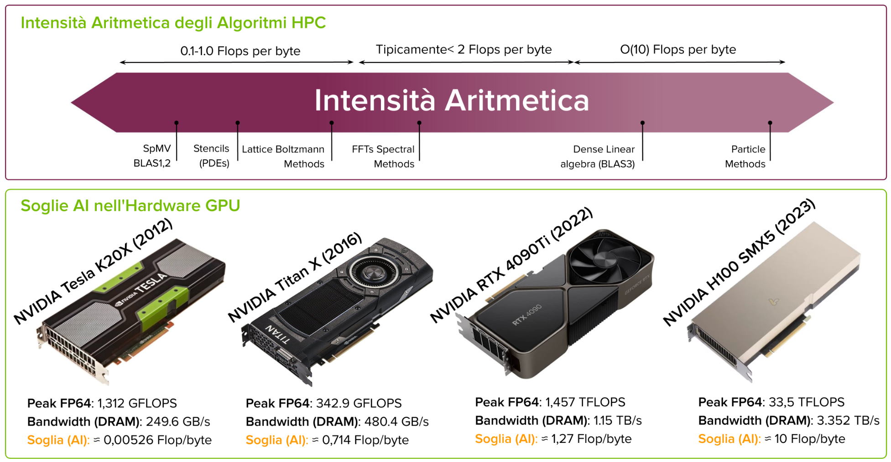

# Modello di Memoria CUDA<div style="text-align: right">[back](./SistemiDigitali.md)</div>

## Indice

- [Modello di Memoria CUDAback](#modello-di-memoria-cudaback)
  - [Indice](#indice)
- [Modelli di Performance](#modelli-di-performance)
  - [Differenze tra Memory bound e Compute bound](#differenze-tra-memory-bound-e-compute-bound)
  - [Kernel Performance](#kernel-performance)
    - [Memory Bandwidth: Teorica vs Effettiva](#memory-bandwidth-teorica-vs-effettiva)
  - [Il modello di Performance Roofline](#il-modello-di-performance-roofline)
  - [Intensità Aritmetica: Algoritmi e Hardware](#intensità-aritmetica-algoritmi-e-hardware)
  - [Diagramma Roofline](#diagramma-roofline)
- [Gerarchia di Memoria CUDA](#gerarchia-di-memoria-cuda)
  - [DDR vs GDDR](#ddr-vs-gddr)
  - [GDDR vs HBM](#gddr-vs-hbm)
  - [Gerarchia di memoria](#gerarchia-di-memoria)
  - [Modelli di Memoria CUDA](#modelli-di-memoria-cuda)
    - [Registri GPU](#registri-gpu)
    - [Memoria Locale](#memoria-locale)
    - [Shared Memory (SMEM) e Cache L1](#shared-memory-smem-e-cache-l1)
    - [Memoria Costante](#memoria-costante)
    - [Memoria Globale](#memoria-globale)
    - [Cache GPU: Struttura e funzionamento](#cache-gpu-struttura-e-funzionamento)
  - [Caratteristiche Gerarchia di Memoria](#caratteristiche-gerarchia-di-memoria)
  - [Qualificatori di Variabili e Tipi CUDA](#qualificatori-di-variabili-e-tipi-cuda)
- [Gestione delle Memoria Host-Device](#gestione-delle-memoria-host-device)
  - [Allocazione della Memoria sul Device](#allocazione-della-memoria-sul-device)
  - [Connettività Host-Device e Throughput di Memoria](#connettività-host-device-e-throughput-di-memoria)
  - [Memoria pinned in CUDA](#memoria-pinned-in-cuda)
- [Global Memory](#global-memory)
- [Shared Memory](#shared-memory)

# Modelli di Performance

## Differenze tra Memory bound e Compute bound

**Limiti Prestazionali**
- Per ottimizzare un kernel CUDA è cruciale comprendere se il collo di bottiglia risiede negli accessi alla memoria o nella capacità computazionale della GPU. Questa distinzione determina le strategie di ottimizzazione da adottare.

**Memory Bound**
- Un kernel è memory bound quando il tempo di esecuzione è limitato dalla velocità di accesso alla memoria piuttosto che dalla capacità di elaborazione dei core.
- La GPU trascorre più tempo in attesa dei dati rispetto a eseguire calcoli
- Cause comuni:
  - Accessi frequenti alla memoria con latenza elevata.
  - Banda di memoria insufficiente rispetto ai requisiti del kernel

**Compute Bound**
- Un'operazione è compute bound quando il tempo di esecuzione è limitato dalla capacità di calcolo della GPU con sufficiente larghezza di banda per i dati.
- La GPU trascorrei più tempo a eseguire calcoli rispetto all'attesa dei dati.
- Cause comuni:
  - Operazione aritmetiche intensive, come moltiplicazioni di matrici dense o convoluzioni, che richiedono elevati FLOP rispetto agli accessi in memoria

## Kernel Performance

Quale metrica utilizzare per misurare le performance?

|**FLOPS**|**Bandwidth**|
|:--:|:--:|
|Floating Point Operations per Second|Dati trasferiti al secondo|
| $\text{FLOPS} = \frac{N_{\text{Floting Point Operations}}}{\text{Tempo Trascorso}}$ | $\text{Bandwidth} = \frac{N_{\text{Bytes}}}{\text{Tempo Trascorso}}$|
|Utilizzata per valutare compute-bound kernel, dove il tempo è dominato dai calcoli.|Utilizzata per valutare memory-bound kernel dove il tempo è dominato dagli accessi in memoria|
|Unità di misura: MFLOPs, GFLOPs, TFLOPs|Unità di misura: GB/s TB/s|
|La Peak Performance della GPU rappresenta il limite teorico massimo|La Peak Bandwidth dell'hardware rappresenta il limite teorico massimo raggiungibile|

### Memory Bandwidth: Teorica vs Effettiva

**Prestazione del Kernel**:
- Memory Latency: Tempo richiesto per soddisfare una richiesta di dati dalla memoria della GPU, inclusi i ritardi di trasferimento fino ai core.
- Memory Bandwidth: La quantità massima di dati che può essere trasferita tra la memoria della GPU e gli altri componenti in una unità di tempo.
- Kernel Memory Bound: Un kernel è vincolato dalla memoria quando le sue prestazioni sono limitate dalla velocità di trasferimento dei dati piuttosto che dalla capacità di calcolo.

**Tipologie di Larghezze di Banda**:
- Banda Teorica:
  - Massima larghezza di banda raggiungibile con l'hardware disponibile.
  - **Esempio**: Fermi M2090 ha una banda teorica di 177 GB/s, Ampere A100 ha una banda teorica di 1.6 TB/s., Hopper H100 ha una banda teorica di 3.5 TB/s.
- Banda Effettiva:
  - Larghezza di banda realmente raggiunta da un kernel in esecuzione.
    $$
    \text{Banda Effettiva(GB/s)} ) = \frac{(\text{byte letti}+\text{byte scritti})x10^{-9}}{\text{tempo trascorso (ns)}}
    $$
  - **Esempio**: Copia di una matrice 2048 x 2048 contenente interi di 4 byte:
    $$
    \text{Banda Effettiva} = \frac{(2048x2048x4x2)x10^{-9}}{tempo}
    $$

## Il modello di Performance Roofline

**Modello Roofline**
- Il modello roofline è un metodo grafico utilizzato per rappresentare le prestazioni di un algoritmo in relazione alle capacità di calcolo e memoria di un sistema.
- Utilie per capire se un algoritmo viene limitato da problemi di calcolo o da problemi di accesso alla memoria.

**Intensità Aritmetica (AI)**
- L'intensità aritmetica misura il rapporto tra la quantità di operazioni di calcolo e il volume di dati trasferiti dalla/verso la memoria di un algoritmo/kernel:

$$
AI = \frac{\text{FLOP}}{\text{Byte Trasferiti}}
$$

- FLOPs: Numero di operazioni in virgola mobile o operazioni aritmetiche in generale
- Byte Trasferiti: Numero di byte trasferiti dalla/verso la memoria

**Soglia di Intensità Aritmetica**
- La soglia diipende dall'hardware specifico ed è definito dal seguente rapporto:
  $$
    \text{Soglia AI} = \frac{\text{Theoretical Computational Peak Performance}}{\text{Bandwidth Peak Performance}}
- Computational Peak Performance: Massima capacità di calcolo della GPU
- Bandwidth Peak Performance: Massima capacità di trasferimento dati della GPU

## Intensità Aritmetica: Algoritmi e Hardware



## Diagramma Roofline

**Curve nel Diagramma**
- Bandwidth Roof: Una linea retta inclinata che rappresenta il limite imposto dalla banda di memoria. La pendenza di questa retta è pari alla bandwidth della memoria del device (DRAM)
- Computational Roof: Una linea orizzontale che rappresenta il limite massimo di prestazioni computazionali in doppia precisione. Questa è la massima velocità a cui la GPU può eseguire operazioni in FP64.


**Multiple Roofline**
- Roofline di Memoria GPU: Diversi limiti tra le memorie della gerarchia (DRAM, Cache, Shared Memory). Migliori prestazioni spostando i dati nelle memorie più veloci.
- Roofline di Calcolo GPU: Diversi limiti prestazionali tra FP16/BF16, FP32, FP64. Migliori prestazioni utilizzando tipi di dati con precisione inferiore.


 
# Gerarchia di Memoria CUDA

Le applicazioni seguono spesso il principio di località, accedendo a una porzione relativamente piccola e localizzata del loro spazio di indirizzamento in un dato momento:
- Temporale: Dati usati di recente hanno più probabilità di essere riutilizzati a breve
- Spaziale: Dati vicini a quelli usati di recente hanno più probabilità di essere necessari.

> **Gerarchia di Memoria**
> - La gerarchia di memoria offre livelli di memoria con differenti latenze, larghezze di banda e capacità:
>   - Livelli Bassi (registri, cache): Bassa latenza, bassa capacità, elevato costo per bit, accesso frequente.
>   - Livelli alti (disco): Alta latenza, alta capacità, costo ridotto per bit, accessi meno frequenti.
> - CPU e GPU usano DRAM per la memoria principale, SRAM per registri e cache, Dischi e Flash per la memoria lenta e capiente
> - CUDA espone più livelli della gerarchia rispetto ai modelli CPU, offrendo un controllo più esplicito per ottimizzare le prestazioni. 


## DDR vs GDDR

||**DDR (Double Data Rate)**|**GDDR (Graphics DDR)***|
|---|---|---|
|Target|CPU|GPU|
|Utilizzo|sistemi operativi, applicazioni, DB|Gaming, Rendering 3D, AI|
|Architettura|Ottimizzata per bassa latenza, bus a 64 bit, accessi rapidi nelle operazioni di sistema|Memoria ottimizzata per massimo Throughput con bus ampi (e.g. 384 bit) per garantire banda elevata|
|Memory clock| Fino a 3600MHz|Fino a 1500 MHz|
|Larghezza di banda|Fino a 100 GB/s | Fino a 1TB/s|
|Consumo|Basso consumo|Elevato anche in idle|
|Costo per GB| 10€-20€ | 30€-60€
|capacità massima per modulo| Fino a 256GB | fino a 48 GB|

## GDDR vs HBM

||**GDDR (Graphics DDR)**|**HBM (High Bandwidth Memory)**|
|---|---|---|
|Esempio GPU|RTX 4090| H100|
|Utilizzo| Grafica, AI piccola scala, rendering|HPC, Traning AI, Inferenze AI real time|
|Achitettura| Chip su PCB|Moduli impilati sul die della GPU|
|Bus Wigth| 384 bit| fino a 5120 bit|
|Banda Passante| Fino a 1TB/s| Fino a 3.5 TB/s|
|Latenza| più bassa rispetto a HBM| più alta rispetto a GDDR|
|Capacità massima| fino a 24 GB| Fino a 80-144 GB|
|Efficienza energetica| consumi maggiori rispetto a HBM | più efficiente, ottimizzato per HPC|
|Costo| accessibile | elevato|

## Gerarchia di memoria 

1. registri
   - Mimoria più veloce, privata per ogni thread, variabili temporanee.
2. Shared Memory
   - Memoria condivisa tra i thread di uno stesso blocco, utilizzata per la comunicazione e la cooperazione tra i thread.
3. Caches (L1, L2, Texture, Constant, Instruction)
   - Memoria intermedia automatica che riduce i tempi di accesso ai dati utilizzati frequentemente.
4. Memoria Locale
   - Privata per ogni thread, usata per variabili grandi o register spill (registri non sufficienti).
5. Memoria Costante
   - Memoria read-only, per dati che non cambiano durante l'esecuzione del kernel.
6. Memoria Texture
   - Memoria read-only, ottimizzata per accessi spazialmente coerenti (e.g. immagini)
7. Memoria Globale
   - Memoria più grande e lenta, accessibile da tutti i thread e dalla CPU

## Modelli di Memoria CUDA

Due tipi di memoria:
- Programmabile: Controllo esplicito del posizionamento dati, CUDA ne espone diverse tipologie.
- Non Programmabile: Nessun controllo, gestione automatica (e.g. L1, L2)


### Registri GPU

- Memoria on chip più veloce sulla GPU (accesso ~1 ciclo)
- Tipicamente 32 bit per registro
- In un kernel, le variabili automatiche senza altri qualificatori di tipo vengono generalmente allocate nei registri
- Allocati automaticamente per variabili locali e array con indici costanti nei kernel
- Strettamente privati per thread con durata limitata all'esecuzione del kernel
- Una volta che il kernel ha completato l'esecuzione non è più possible accedere a una variabile di registro

**Limiti**
- Limite di 63 (Fermi) o 255(kepler e successive) registri per thread
- Allocati dinamicamente tra warp attivi in un SM, influenzando l'occupancy.
- Minor uso di registri permette di avere più blocchi concorrenti per SM
- Register Spilling: Eccedere il limite hardware sposta automaticamente le variabili dei registri alla memoria locale (~100-300 cicli) riducendo le prestazioni

> **Ottimizzazione**
> - Euristiche del compilatore: ```nvcc``` utilizza euristiche per minimizzare l'uso dei registri evitando register spilling.
> - Launch bounds: ```__launch_bounds__(maxThreadsPerBlock, minBlocksPerMultiprocessor)``` aiuta il compilatore nell'allocazione efficiente per ciascun kernel se inserito prima della chiamata
> - Direttive compilatore per analisi e controllo:
>   - ```-Xptxas -v```: Visualizza l'uso dei registri e la memoria locale
>   - ```-maxrregcount=n```: Limita il numero di registri per thread
>   - ```-abi=no```: Disabilita l'allocazione di registri per le variabili automatiche

### Memoria Locale

- Memoria off-chip (DRAM), fisicamente collocata nella stessa posizione della memoria globale.
- Privata per thread, non condivisa tra thread.
- Utilizzata per variabili che non possono essere allocate nei registri a causa di limiti di spazio
- Alta latenza e bassa larghezza di banda, stessa della memoria del device
- Per GPU con compute capability 2.0 o superiore, i dati sono posti in cache L1 a livello di SM e L2 a livello di device

**Variabili poste in memoria locale**
- Array locali referenziati con indici il cui valore non può essere determinato a tempo di copmilazioni
- Grandi strutture o array locali che consumerebbero troppo spazio nei registri
- Variabili che eccedono il limite dei registri del kernel
  - Register spill

> **Prestazioni**
> - Preferire uso di registri dove possibile
> - Ristrutturare il codice per ridurre variabili locali di grandi dimensioni
> - Utilizzare shared memory per dati frequentementi acceduti

### Shared Memory (SMEM) e Cache L1

- Ogni SM ha memoria on-chip limitata, condivisa tra shared memory e cache L1
- Partizionata fra i thread block residenti in un SMEM
- Questa memoria è ad alta velocità con elevata bandwidth e bassa latenza rispetto a memoria locale e globale
- La shared memory è organizzata in memory banks di uguale dimensione che permettono l'accesso simultaneo a più dati, a condizione che i thread leggano da indirizzi diversi su banchi distinti
- La shared memory è programmabile con controllo esplicito da parte del programmatore, mentre la cache L1 è automatica per ridurre la latenza alla memoria globale.
- Shared memory è condivisa tra thread di un blocco, cache L1 serve tutti i thread di un S;
- La quantità di memoria assegnata alla cache L1 e alla memoria condivisa è configurabile per ogni chiamata al kernel

**Utilizzo**
- Shared Memory: Per variabili dichiarate con ```__shared__``` in un kernel. Ottimizza la condivisione e comunicazone tra thread di un blocco. Cliclo di cita legato al blocco di thread, rilasciata al completamento del blocco.
- Cache L1: Gestisce automaticamente la coerenza dei dati, senza bisogno di sincronizzazione esplicita.

### Memoria Costante

- Spazio di memoria di sola lettura off-chip (DRAM), accessibile a tutti i thread di un kernel.
- Dimensione totale limitata a 64KB per tutte le copmute capability
- Una porzione della constant memory è cachata on chip per ogni SM, offrendo un accesso a bassa latenza.
- Dichiarata con scope globale, visibile a tutti i kernel nella stessa unità di compilazione
- Inizializzata dall'host (readable and writable) e non modificabile durante l'esecuzione del kernel
  
**Dichiarazione e Inizializzazione**
- Dichiarata con l'attributo ```__constant__```
- Inizializzata dall'host usando:
    ```cudaError_t cudaMemcpuToSymbol(const void* symbol, const void* src, size_t count);```
- L'operazione di copia è generalmente sincrona

> **Utilizzo Ottimale**
> - Ideale per dati letti frequentemente e condivisi tra tutti i thread, come coefficienti, costanti matematiche o parametri di kernel usati uniformemente.
> - Offre prestazioni elevate quando tutti i thread di un warp leggono da indirizzi diversi, poichè gli accessi vengono serializzati e ogni lettura viene comunque trasmessa a tutti i thread del warp, potenzialmente sprecando lunghezza di banda.

### Memoria Globale

- Memoria più grande con latenza più alta e più comunemente usata sulla GPU
- Memoria principale off-chip (DRAM) della GPU, accessibile tramite transazione da 32, 64 o 128 byte.
- Scope e lifetime globale, Accessibile da ogni thread in ogni SM per tutta la durata della applicazione.

**Dichiarazione e Allocazione**
- Statica: Usando il qualificatore ```__device__``` nel codice server
- Dinamica: Allocata dall'host con ```cudaMalloc()``` e rilasciata con ```cudaFree()```
  - Puntatori passati ai kernel come parametri 
  - Le allocazioni persistono per l'intera applicazione e sono accessibili ai thread di tutti i kernel

**Prestazioni**
- Fattori chiave per l'efficienza:
  - Coalescenza: Raggruppare accessi di thread adiacenti a indirizzi contigui
  - Allineamento: Indirizzi di memoria allineati a 32, 64, 128 byte

> **Uso**
> - Accessibile da tutti i thread di tutti i kernel, ma richiede attenzione per la sincronizzazione
> - Potenziali problemi di coerenza con accessi concorrenti da blocchi diversi
> - l'efficienza dipende dalla copmute capability del device
> - I dispositivi beneficiano di caching delle transizioni sfruttando la località dei dati.

### Cache GPU: Struttura e funzionamento

- Le cache GPU, come quelle CPU, sono memorie on chip non programmabili cruciali per accelerare l'accesso ai dati.
- La cache viene utilizzata per memorizzare temporaneamente porzioni della memoria principale per accessi più veloci..

**Tipi di cache**
- L1
  - più veloce e ogni SM ne ha una propria garantendo accesso rapido ai dati
  - Memorizza dati dia dalla memoria locale che globale, inclusi i dati che non trovano spazio nei registri
- L2
  - Unica e condivisa tra SM, ponte tra le L1 e la memoria globale
  - Memorizza dati provenienti dalla memoria locale, inclusi dati derivanti da register spills
- Constant Cache
  - Presente in ogni SM, memorizza dati che non cambiano durante l'esecuzione del kernel
  - Ottimizzata per l'accesso rapido a dati immutabili come tabelle di lookup o parametri costanti.
- Texture Cache
  - Specializzata per dati di texture, cruciale per rendereing e accessi 2D/3D
  - Supporta funzionalità hardware come interpolazione e filtraggio
  - Nelle ultime architettura NVIDIA, unificata con cache L1

> Su alcune GPU, è possibile configurare se i dati vengono cachati solo sia in L1 che L2 o solo in L2, per ottimizzare le prestazioni in base al pattern di accesso ai dati.

## Caratteristiche Gerarchia di Memoria


## Qualificatori di Variabili e Tipi CUDA


# Gestione delle Memoria Host-Device

**Somiglianze con C**
- Come in C il prorgammatore deve allorare e deallocare manualmente
- In più è necessario getstire esplicitamente il trasferimento dei dati tra host e device, operazione cruciale per il corretto funzionamento delle applicazioni CUDA
**Operazione Chiave per la Gestione della Memoria**
- CUDA offre strumenti per preparare la memoria del device nel codice host, gestendo le risorse necessarie al kernel.
- Allocazione/Deallocazione sul Device: Richiede ```cudaMalloc()``` e ```cudaFree()```
- Trasferimento Dati: Movimentazione esplicita dei dati tramita il bus PCIe, utilizzando ```cudaMemcpy()```

**Limiti della Gestione Manuale**
- Overhead nei trasferimenti: la comunicazione tra host e device via PCIe può essere lenta e introduce latenza
- Codice Complesso: Necessità di gestire manualmente ogni fase, aumentando la complessità e il rischio di errori.
- Sincronizzazioni: Garantire la coerenza tra le memorie può essere non banale
  
> Evoluzione verso memoria unificata
> NVIDIA ha gradualmente unificato nel tempo gli spazi di memoria di host e device
> Tuttavia il trasferimento dei dati manueale rimane un requisito

## Allocazione della Memoria sul Device

```cudaMalloc``` è una funzione CUDA utilizzata per allocare memoria sulla GPU

```c
cudaError_t cudaMalloc(void** devPtr, size_t size);
```
```cudaMemset``` è una funzione CUDA utilizzata per inizializzare la memoria allocata con un valore specifico

```c
cudaError_t cudaMemset(void* devPtr, int value, size_t count);
```

```cudaFree``` è una funzione CUDA utilizzata per deallocare la memoria sulla GPU

```c
cudaError_t cudaFree(void* devPtr);
```

```cudaMemcpy``` è una funzione CUDA utilizzata per trasferire dati tra host e device

```c
cudaError_t cudaMemcpy(void* dst, const void* src, size_t count, cudaMemcpyKind kind);
```

## Connettività Host-Device e Throughput di Memoria

- La memoria GDDR della GPU offre una larghezza di banda teorica più alta
- Il collegamento PCIe ha una larghezza di banda teorica massima di 64GB/s
- Significativa differenza tra la larghezza di banda della memoria GPU e quella del PCIe
- I trasferimenti di dati tra host e dispositivo possono rappresentare un collo di bottiglia
- Essenziale ridurre al minimo i trasferimenti di dati tra host e dispositivo


## Memoria pinned in CUDA

```cudaMallocHost``` alloca memoria host pinned che non può essere spostata dal sistema operativo


# Global Memory

# Shared Memory