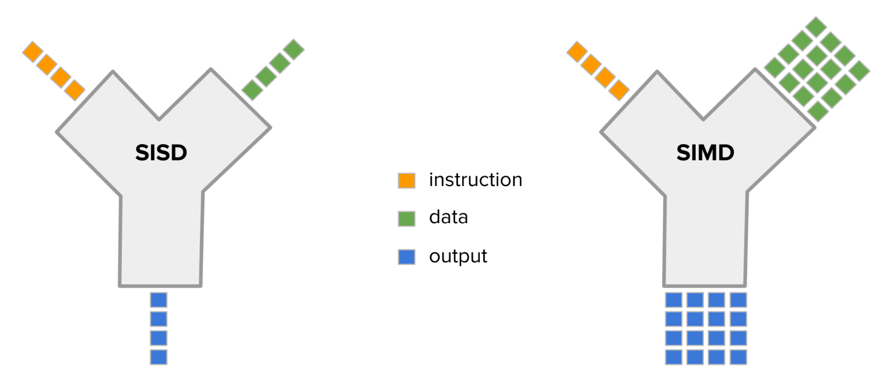
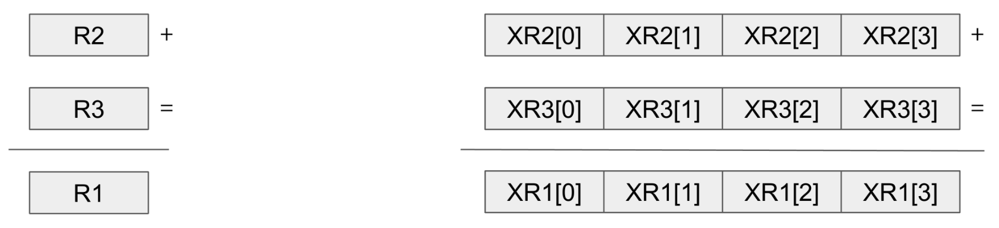
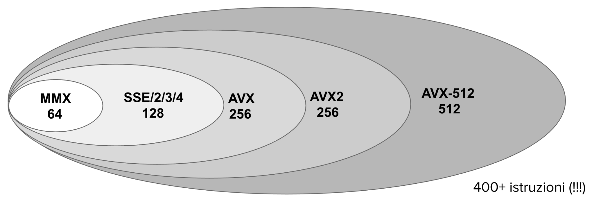
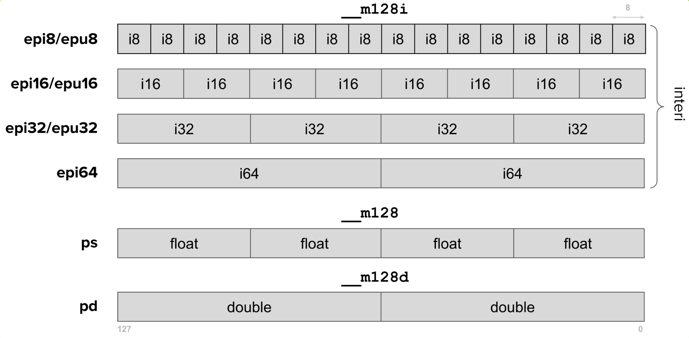
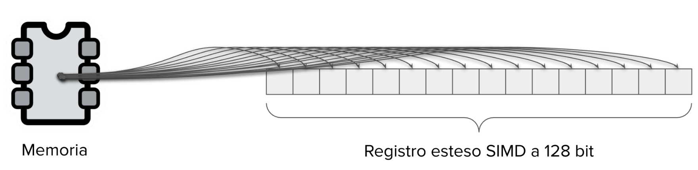
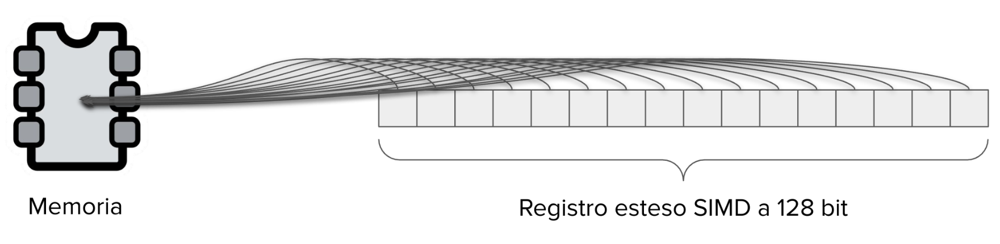

# SIMD Integer

[Return](./SistemiDigitali.md)

---

# Indice

- [SIMD Integer](#simd-integer)
- [Indice](#indice)
  - [\[\[00.Introduzione\]\]](#00introduzione)
  - [Strategie per velocizzare l'esecuzione](#strategie-per-velocizzare-lesecuzione)
    - [Pipelining](#pipelining)
  - [Paradigma di elaborazione SIMD (Single Instruction Multiple Data)](#paradigma-di-elaborazione-simd-single-instruction-multiple-data)
  - [x86](#x86)
  - [ARM](#arm)
  - [RISC-V](#risc-v)
  - [Operazioni SIMD](#operazioni-simd)
    - [Istruzioni Assembly vs Intrinsics](#istruzioni-assembly-vs-intrinsics)
    - [Tipi di dati presenti in x86 SSE](#tipi-di-dati-presenti-in-x86-sse)
  - [Lettura dalla memoria](#lettura-dalla-memoria)
  - [Scrittura in memoria](#scrittura-in-memoria)
  - [Letture/scritture e allineamento](#letturescritture-e-allineamento)
  - [Allocazione dinamica della memoria](#allocazione-dinamica-della-memoria)
  - [Gestione cache](#gestione-cache)
  - [Istruzioni stream](#istruzioni-stream)
  - [Istruzioni logiche](#istruzioni-logiche)
    - [Tipi:](#tipi)
  - [Operazioni di Shift](#operazioni-di-shift)
    - [Tipi:](#tipi-1)
  - [Shuffling](#shuffling)
    - [Esempio:](#esempio)
  - [Packing e Unpacking](#packing-e-unpacking)
  - [Conversioni (CVT)](#conversioni-cvt)
    - [Esempio:](#esempio-1)
  - [Blending](#blending)
  - [Copia con inserimento di un valore](#copia-con-inserimento-di-un-valore)
  - [Istruzioni di confronto](#istruzioni-di-confronto)
    - [Confronti SIMD](#confronti-simd)
    - [Tipi di confronto:](#tipi-di-confronto)
    - [Utilizzo di maschere](#utilizzo-di-maschere)
    - [Minimi e massimi](#minimi-e-massimi)


## [[00.Introduzione]]

**Paradigma di elaborazione di un microprocessore single core, scalare**

- Prevede esecuzione sequenziale di una singola istruzione e l'elaborazione dei dati previsti dalla medesima istruzione

    ```assembly
    LW R2,0X8000(R10);
    ADD R1,R2,R3;
    XOR R5,R1,R3;
    ...
    ```
- Possiamo definire questo paradigma Single Instruction Single Data (SISD), le istruzioni 1,2,3,etc sono eseguite in sequenza elaborando ciascuna i dati necessari.
- Esistono microprocessori (superscalari) che leggono ed eseguono contemporaneamente più istruzioni, aumentando le unità funzionali di elaborazione.

## Strategie per velocizzare l'esecuzione

### Pipelining

- Aumenta il throughput mantenendo inalterata la latenza
- Sono contemporaneamente in esecuzioni più istruzioni in differenti fasi di elaborazione in base alla lunghezza della pipeline

**Effetti collaterali**

- L'esecuzione contemporanea di più istruzioni genera problemi come dipendenze tra i dati elaborati, che però possono essere gestiti (e.g. forwarding)
- A supporto del pipelining è necessario accedere ai dati rapidamente, mediante cache per non stallare la pipeline
- Esistono altre strategie per aumentare il throughput come Out Of Order Execution

## Paradigma di elaborazione SIMD (Single Instruction Multiple Data)

- Una singola istruzione SIMD elabora multipli dati (eseguendo sugli stessi dati la medesima operazione) memorizzati in registri estesi della CPU.



- I registri della CPU sono di taglia estesa rispetto ai registri dell'architettura base e contengono più dati compattati


```
 ADD R1,R2,R3 ; //R1 = R2 + R3
```
```
 XADD XR1,XR2,XR3 ; //XR1[i] = XR2[i] + XR3[i]
```



- Incrementa il parallelismo agendo a livello dei dati
- può essere utilizzata con tutte le strategie menzionate (e.g. pipelining)
- Richiede un numero di modifice limitato, come l'intergrazione di ALU addizionali
- Supportato dalle ISA più diffuse (e.g. x86, ARM e RISC-V)
- ISA diverse hanno set di istruzioni SIMD differenti sebbene spesso con funzionalità simili
- Anche all'interno della stessa ISA, possono esserci diversi set di istruzioni SIMD
- In alcuni casi le estensioni SIMD iniziali sono deprecate (e.g. x86)

## x86

- SIMD è stato proposto per la prima volta negli anni '60
- L'ampia diffusione mediante CPU gp si è avuta solo nei primi anni 90 con massiccio uso di dati multimediali e operazioni intensive su tali dati
- l'estensione MMX (MultiMedia eXtension) proposta da Intel è stata la prima ad avere larga diffusione
- MMX consiste in 57 istruzioni, per l'elaborazione di dati interi che estendono l'ISA x86 utilizzando registri multimediali a 64bit ricavati dai registri floating della CPU.



- 2016: Intel AVX-512 (Advanced Vector eXtension) con registri a 512bit

**Tipi di dati supportati**

- I tipi di dati possono essere byt, interi a 16 bit, insteri a 32 bit, single precision floating-point (32 bit), double precision floating-point (64 bit)
- Per i tipi byte e interi sono supportate operazioni con dati signed e unsigned
- Non tutte le istruzioni o estensioni supportano tutti i tipi di dato
- In genereale non c'è molta ortogonalità nell'ISA x86
- Estensione MMX è attualmente considerata deprecata

## ARM

- I microprocessori ARM supportano SIMD con l'estensione NEON
- Inizialmente i registri erano da 32 o 64 bit
- Attualmente arrivano fino 128 bit
- Tipi di dato: interi a 8 bit, 16 bit, 32 bit e 64 bit signed e unsigned, floating-point a 32 bit e 64 bit
- Estensione per HPC con dati di dimensioni variabili da 128 a 2048 bit con step di 128 bit

## RISC-V

- L'ISA prevede un estensione SIMD chiamata RISC-V Vector Extension (RVV)
- RVV definisce 32 registri di dimensione pari a una potenza di 2 configurabile dai progettisti della CPU
- I dati possono essere di taglia pari a una potenza di 2 maggiore di 8 bit

## Operazioni SIMD

- Ogni estensione prevede le proprie istruzioni SIMD senza uniformità tra le implementazioni
- Le operazioni supportate sono simili come:
  - rendere agevole lettura/scrittura, packing/unpacking e interleaving/de-interleaving di dati
  - Eseguire operazioni comuni nell'ambito del Image/signal processing, come somme, sottrazioni, prodotti, ecc...
  - Individuare massimi e minimi, replicare elementi all'interno dei registri estesi, consentire operazioni con saturazione e operazioni come SAD (Sum of Absolute Differences)

### Istruzioni Assembly vs Intrinsics

- Le operazioni SIMD sono disponibili sia come istruzioni assembly che come intrinsics
- Gli intrinsic sono funzioni che corrispondono a singole o sequenze di istruzioni SIMD in assembly
- Rendono il codice più leggibile e facile da scrivere
- In alcune situazioni non si ha il controllo che si avrebbe con istruzioni assembly

--- 

### Tipi di dati presenti in x86 SSE



## Lettura dalla memoria

- Operazioni strettamente necessarie riguardano la lettura di blocchi di dati contigui dalla memoria verso i registri estesi SIMD



- L'istruzione ```__m128i_mm_load_si128(__m128i const* mem_addr)``` carica dalla memoria 128 bit a partire dall'indirizzo ```mem_addr``` che deve essere allineato con la taglia del registri (16 byte)
- Esistono istruzioni (SSE) per leggere float e double

## Scrittura in memoria

- La scrittura di un registro esteso SIMD in posizioni contigue della memoria è un'operazione comune



- L'istruzione ```void_mm_store_si128(__m128i* mem_addr, __m128i a)``` scrive 128 bit a partire dall'indirizzo ```mem_addr``` che deve essere allineato con la taglia del registro (16 byte)

## Letture/scritture e allineamento

- Il trasferimento dati tra memoria e registri estesi avviene attraverso delle cache
- Le cache organizzano i dati per linee che contengono porzioni della memoria (pari a una potenza di 2) a partire da un indirizzo allineato con la taglia delle linee
- È fondamentale leggere e scrivere indirizzi allineati con la taglia dei registri per non incorrere in penalità o fault.
- Il problema è facilmente risolvibile memorizzando i dati in memoria a indirizzi allineati con la taglia dei registri estesi
- Anche l'accesso ai dati dovrebbe avvenire con lo stesso vincolo e questo potrebbe richiedere qualche accorgimento in più nella scrittura del codice
- Alcune estensioni SIMD non consentono accessi disallineati: tuttavia anche in questi casi si potrebbe incorrere in maggior tempo di esecuzione
- I linguaggi di programmazione consentono di forzare l'allineamento dei dati
- In C/C++ un array allineato a un indirizzo multiplo di 16 può essere dichiarato con
  ```c
  int A[8] __attribute__(aligned(16)); //16 byte (128 bit) aligned
  ```
- È sempre bene memorizzare ed accedere ai dati in modo allineato, anche se non sempre è possibile
- È sempre possibile accedere ai dati in modo allineato e poi combinare le informazioni con istruzioni predisposte per questa finalità
- Tale approccio potrebbe introdurre un certo grado di inefficienza dovuto alle operazioni di manipolazione dei dati
- Esistono poche istruzioni per accedere a dati non allineati
    ``` __m128i_mm_loadu_si128(__m128i const* mem_addr)```
    ``` void_mm_storeu_si128(__m128i* mem_addr, __m128i a)```

## Allocazione dinamica della memoria
- SSE dispone funzioni per allocare e deallocare dinamicamente memoria
- È possibile specificare il tipo di allineamento desiderato
  ```void* _mm_malloc(size_t size, size_t align)```
  ```void _mm_free(void* ptr)```

## Gestione cache

- È possibile invalidare in tutti i livelli di una cache la linea che contiene un determinato indirizzo
  ```void_mm_clflush(void const* p)```
- Può avere impatto negativo sulle prestazioni
- È possibile suggerire al compilatore di eseguire un prefetch di dati nella cache in accordo a 4 strategie
  ```void_mm_prefetch(void const* p, int i)```

## Istruzioni stream

- in x86 (SSE) sono disponibili istruzioni (stream) che eseguono operazioni con la memoria senza modificare il contenuto della cache
- Questo per evitare di inserire nella cache dati che non saranno utilizzati in seguito
  ```
  __m128i_mm_stream_load_si128(void* mem_addr)
  ```
- Carica 128 bit senza modificare il contenuto della cache
- L'istruzione richiede che i dati siano allineati con la taglia del registro

## Istruzioni logiche

- Le operazioni logiche SIMD permettono di combinare i dati nei registri estesi con operazioni bitwise.

### Tipi:
1. **AND:**
    ```c
    __m128i _mm_and_si128(__m128i a, __m128i b);
    ```

2. **OR:**
    ```c
    __m128i _mm_or_si128(__m128i a, __m128i b);
    ```

3. **XOR:**
    ```c
    __m128i _mm_xor_si128(__m128i a, __m128i b);
    ```

## Operazioni di Shift

- Gli shift SIMD spostano i bit nei registri estesi a sinistra o a destra.

### Tipi:
1. **Shift a sinistra:**
    ```c
    __m128i _mm_slli_epi32(__m128i a, int imm);
    ```

2. **Shift a destra con segno:**
    ```c
    __m128i _mm_srai_epi32(__m128i a, int imm);
    ```

3. **Shift a destra senza segno:**
    ```c
    __m128i _mm_srli_epi32(__m128i a, int imm);
    ```

## Shuffling

- Le operazioni di shuffling riorganizzano gli elementi nei registri estesi secondo un pattern specificato.

### Esempio:
    ```c
    __m128i _mm_shuffle_epi32(__m128i a, int imm);
    ```

## Packing e Unpacking

- **Packing:** comprime elementi a precisione più bassa.
    ```c
    __m128i _mm_packs_epi16(__m128i a, __m128i b);
    ```

- **Unpacking:** espande elementi a precisione più alta.
    ```c
    __m128i _mm_unpacklo_epi16(__m128i a, __m128i b);
    ```

## Conversioni (CVT)

- Le istruzioni CVT convertono tra tipi di dato differenti nei registri SIMD.

### Esempio:
    ```c
    __m128 _mm_cvtepi32_ps(__m128i a);
    ```

## Blending

- Combina dati da due registri basandosi su una maschera.
    ```c
    __m128i _mm_blend_epi16(__m128i a, __m128i b, const int imm8);
    ```

## Copia con inserimento di un valore

- Copia un registro inserendo un valore in una posizione specifica.
    ```c
    __m128i _mm_insert_epi16(__m128i a, int i, const int imm8);
    ```

## Istruzioni di confronto

### Confronti SIMD

- Le istruzioni SIMD eseguono confronti tra elementi allineati nei registri generando maschere di output (valori 0 o -1 per indicare false/true).

### Tipi di confronto:
1. **Uguale (EQ):**
    ```c
    __m128i _mm_cmpeq_epi8(__m128i a, __m128i b);
    ```
    Restituisce 0xFF per ogni elemento uguale, altrimenti 0x00.

2. **Maggiore (GT):**
    ```c
    __m128i _mm_cmpgt_epi16(__m128i a, __m128i b);
    ```
    Restituisce 0xFF per ogni elemento di `a` maggiore di `b`, altrimenti 0x00.

3. **Minore (LT):**
    ```c
    __m128i _mm_cmplt_epi32(__m128i a, __m128i b);
    ```
    Restituisce 0xFF per ogni elemento di `a` minore di `b`, altrimenti 0x00.

### Utilizzo di maschere

- **Filtraggio dei dati:** Utilizzare `AND` logico tra una maschera e i dati.
    ```c
    __m128i result = _mm_and_si128(mask, data);
    ```

- **Selezione condizionale:** Combinare dati con `ANDNOT` e `OR`.
    ```c
    __m128i temp = _mm_andnot_si128(mask, data1);
    __m128i result = _mm_or_si128(temp, data2);
    ```

### Minimi e massimi

- **Ricerca minima:**
    ```c
    __m128i _mm_min_epi16(__m128i a, __m128i b);
    ```
    Restituisce un registro contenente i valori minimi tra `a` e `b`.

- **Ricerca minima con posizione:** (solo `unsigned` 16-bit)
    ```c
    __m128i _mm_minpos_epu16(__m128i a);
    ```
    Contiene il valore minimo nei bit [15..0] e la posizione nei bit [18..16].
