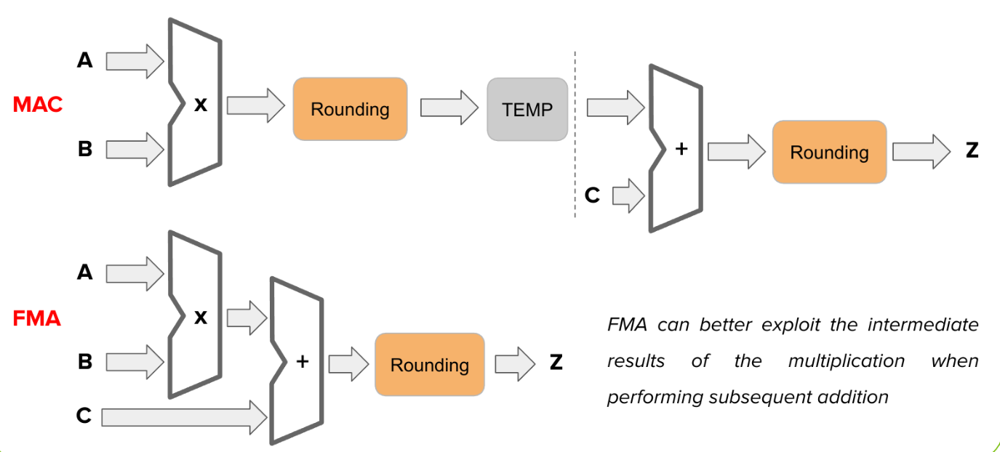
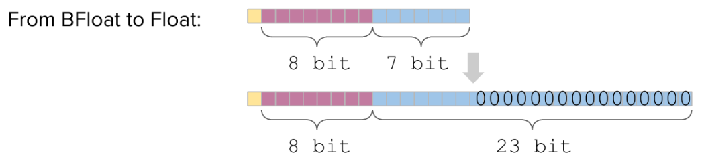

# Dealing wit Real Numbers

[Return](./SistemiDigitali.md)

---

# Indice

- [Dealing wit Real Numbers](#dealing-wit-real-numbers)
- [Indice](#indice)
  - [\[\[00.Introduzione\]\]](#00introduzione)
    - [Precision e Accurancy](#precision-e-accurancy)
  - [Fixed Point](#fixed-point)
  - [Floating Point](#floating-point)
    - [ULP (Unit in Last Place)](#ulp-unit-in-last-place)
  - [MAC vs FMA](#mac-vs-fma)
  - [Standard IEEE 754](#standard-ieee-754)
    - [Possibili dimensioni:](#possibili-dimensioni)
  - [Brain Float (BFloat)](#brain-float-bfloat)
  - [Tensor Float (NVIDIA)](#tensor-float-nvidia)
  - [Minifloat (FP8)](#minifloat-fp8)
  - [L-Mul](#l-mul)
  - [Memory Footprint](#memory-footprint)
    - [Quantizzzazione (Data reduction)](#quantizzzazione-data-reduction)
    - [Weight Sharing o Pallettuzation](#weight-sharing-o-pallettuzation)
  - [Cordic](#cordic)

---

## [[00.Introduzione]]

### Precision e Accurancy

- **Precision**: Stesso risultato ottenuto da misure ripetute.
- **Accurancy**: Capacità di misurare con fedeltà una grandezza.
  

Nell'utilizzo di una codifica binaria per rappresentare un numero reale avremo sempre un errore (+ bit => + accurancy).

Il lfloating point sono dati onerosi (computazionale, memoria), quindi usiamo nuove rappresentazioni meno precise ma più leggere.

## Fixed Point

Numero di cifre intere e decimali costante.

Minor capacità di rappresentazione rispetto al floating point, ma più leggero.

## Floating Point

La virgola può spostarsi a sinistra o destra.

- **Segno (S)**: 1 se negativo, 0 se positivo.
- **Mantissa (VAL_base)**: Valore decimale normalizzato.
- **Esponente (BASE^exp)**: exp determina di quanto scalare la mantissa:
  - Se exp > 0, la virgola si sposta a destra.
  - Se exp < 0, la virgola si sposta a sinistra. 

> **Esempio**:
> N = -12,5
> 1) Segno: S = 1 (negativo)
> 2) Mantissa: -12,5 = -1,25 * 10^1 => VAL_base = 1,25
> 3) Esponente: exp = 1, (10^1), la virgola si sposta a destra.
> 4) Base: 10 o 2, a seconda della rappresentazione.

Sono definiti anche dei numeri speciali utili nel calcolo scientifico:
- **Zero**: Mantissa e esponente a 0.
- **Infinito**: Mantissa a 0, esponente a *Valore Massimo*.
- **NaN**: Not a Number, esponente a *Valore Massimo* e mantissa diversa da 0.

### ULP (Unit in Last Place)

è la cifra meno significativa, indica quanto due numeri siano vicini.

è anche l'errore massimo tra due numeri consecutivi.

> Per trovare il numero massimo rappresentabile: 2^(exp - 1) - ULP * 2^exp.

In **Floating Point** più grande è il numero da rappresentare, più è grande l'exp, quindi anche l'errore dovuto a ULP.

Nel calcolo scientifico si normalizza (si portano i numero tra -1 e 1) così da poter ottenere la migliore accurancy dalla rappresentazione floating point.

---

Per gestire meglio gli arrotondamenti lo standar IEEE aggiunge tre bit alla matissa durante i calcoli:

- **Guard Bit**: Primo bit a destra del meno significativo
- **Round Bit**: Secondo bit a destra del meno significativo
- **Sticky Bit**: OR tra tutti i bit a destra del meno significativo

Durante un calcolo vengono usati più bit, quindi una volta terminato è necessario effettuare un troncamento, per tornare al numero di bit previsti, si controlla il **Guard Bit**, se è =0 non si è superata la soglia, se è =1 si controllano **Round Bit** e **Sticky Bit**, se sono entrambi a zero non si fa nulla, altrimenti si arrotonda verso l'alto.

## MAC vs FMA

- **MAC (Multiply and Accumulate)**: Moltiplica due numeri e somma il risultato ad un terzo.
- **FMA (Fused Multiply-Add)**: Moltiplica due numeri e somma il risultato ad un terzo, il risultato è arrotondato una sola volta.

a * b + c è un calcolo ricorrente a cui è stato riservato HW apposito realizzato in modo differete.

MAC: Approsimazioni intermedie, più istruzioni (più lento), hw meno complesso.
FMA: Precisione maggiore, minor tempo, hw più complesso.

## Standard IEEE 754

Immagazziniamo S, X e Y, S è il segno, X è la mantissa e Y è l'esponente.

### Possibili dimensioni:

## Brain Float (BFloat)

Meno preciso rispetto a FP16 (meno bit per la mantissa), stesso range di rappresentazione.

## Tensor Float (NVIDIA)

Stessa rappresentazione di FP32, ma meno preciso (meglio di BFloat).

## Minifloat (FP8)

## L-Mul

È una tecnica per il calcolo delle moltiplicazioni FP utilizzando solo addizioni tra interi. Si va a perdere in accuratezza ma si guadanga in consumo energetico.

## Memory Footprint

Le reti neurali necessitano di memorizzare un gran numero di wights, reti di grandi dimensioni possono creare difficoltà anche in HW dedicato.

### Quantizzzazione (Data reduction)
Una soluzione a quest problema può essere passare ad una rappresentazione numerica più piccola.

FP322 -> E5M2 => 1/4 della memoria.

Nei casi più estremi si possono untilizzare interi o delle reti neurali binarie (Logic Gate Neural Network).

### Weight Sharing o Pallettuzation

Per ridurre l'impatto in memoria dei pese della rete possiamo rappresentarli attraverso un insieme di valori di dimensioni minori, contenuti in delle lookup table.

Di ogni peso conserviamo solo l'ID del valore contenuto in una lookup table.

Andiamo a sostituire diversi pesi con il loro varlore medio (centroide).

## Cordic

È un algoritmo che permette di calcolare funzioni matematiche con solo operazioni intere.

Algoritmo iterativo -> Approssimazioni successive

Funziona come un albero binario.

> **Esempio**:
> Calcolare il seno di alpha:
> Esprimiamo alpha come somma di angoli di cui conosciamo seno e coseno, i cui valori sono vicini a potenze di 2.
> 