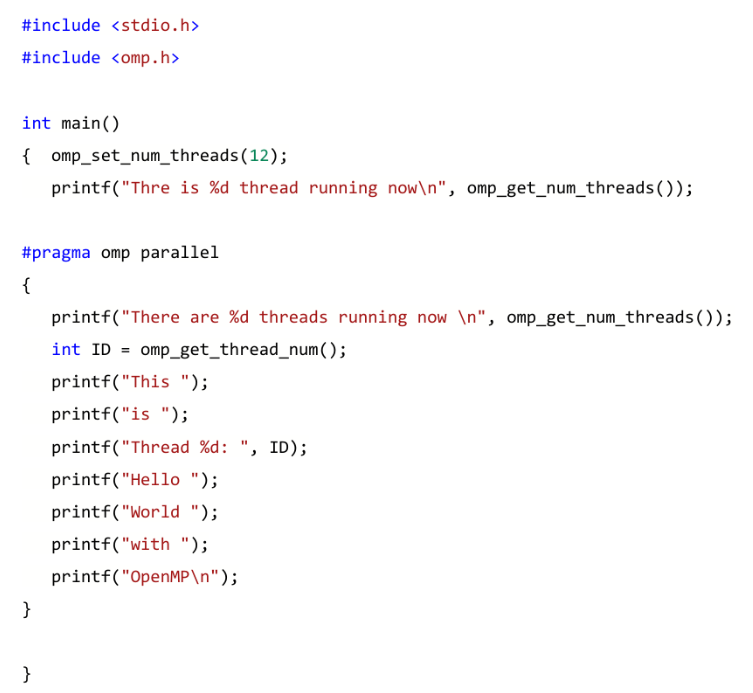

# Multirhreading con OpenMP

[Return](./SistemiDigitali.md)

---

# Indice

- [Multirhreading con OpenMP](#multirhreading-con-openmp)
- [Indice](#indice)
  - [\[\[00.Introduzione\]\]](#00introduzione)
  - [CPU multicore](#cpu-multicore)
    - [Thread](#thread)
  - [OpenMP](#openmp)

## [[00.Introduzione]]

- **Instruction Level Parallelism (ILP)**: il processore esegue più di una istruzione alla volta, implementato dalle CPU che hanno più pipeline (e.g. Processori superscalari).
- **Data Level Parallelism (DLP)**: Processa più dati con una singola esecuzione stream, con istruzioni SIMD su CPU.
- **Thread Level Parallelism (TLP)**: Esegue più istruzioni stream, su più processing units, utilizzando i core di una CPU multicore.

Non sono mutualmente esclusive, possono essere utilizzate insieme per ottenere un miglioramento delle prestazioni.

## CPU multicore

Cerca di migliorare le performance mantenendo una basso consumo energetico, utilizzando frequenze di clock più basse e più core.

Una tipica CPU multicore possiede diversi core, ognuno con le proprie cache L1 e L2, solitamente una cache L3 condivisa.

### Thread

- Un thread è un processo leggero creato per eseguire concorrentemente con altri thread sulle risorse di un processo.
- Quando una o più CPU sono disponibili, i thread possono essere eseguiti in parallelo in ognuna CPU comunicando attraverso la memoria condivisa.
- I thread concorrenti possono portare a condizioni non deterministiche e a problemi di sincronizzazione, dovuti all'accesso concorrente alla memoria condivisa.

## OpenMP

- **OpenMP (Open Multi-Processing)** è una API per la programmazione parallela su piattaforme con memoria condivisa.
- permette l'esecuzione di codice parallelo su più threads, utilizzando direttive di compilazione, senza modificare in modo estremo il codice sorgente.

