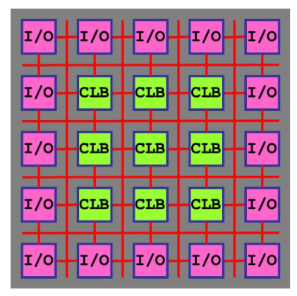
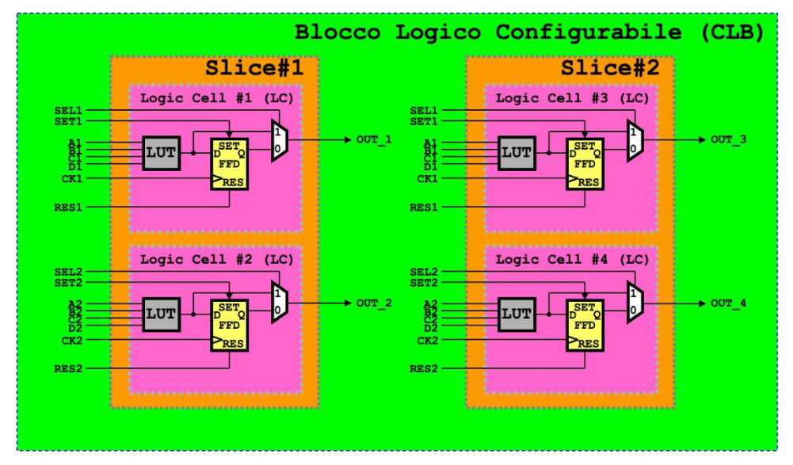
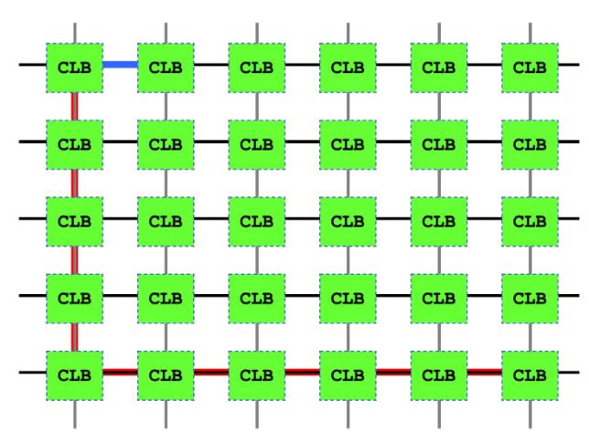
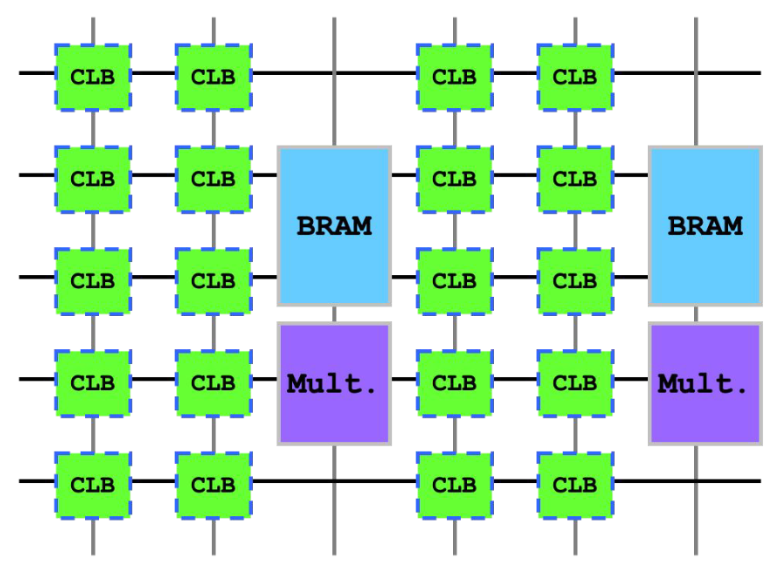

# Field Programmable Gate Array (FPGA)

[Return](./README.md)

---

# Indice

- [Field Programmable Gate Array (FPGA)](#field-programmable-gate-array-fpga)
- [Indice](#indice)
  - [\[\[00.Introduzione\]\]](#00introduzione)
  - [Tipologie di FPGA](#tipologie-di-fpga)
  - [Logic Cell (elemento base di un FPGA)](#logic-cell-elemento-base-di-un-fpga)
    - [Connessioni](#connessioni)
    - [Moduli addizionali](#moduli-addizionali)
  - [Linguaggi di programmazione](#linguaggi-di-programmazione)

## [[00.Introduzione]]

- Gli FPGA sono composti da blocchi logici configurabili (CLB) che possono essere interconnessi tra loro utilizzando linguaggi di programmazione come VHDL o Verilog. (anche C tradotto in VHDL).

- Numero elevato di CLB e di interconnessioni
- Generalmente è disponibile della RAM interna
- Alcuni blocchi sono dedicati a I/O
- Alcuni blocchi sono dedicati a moltiplicazioni, somme, etc.

## Tipologie di FPGA

**Tecnologia utilizzata per le connessioni**:
- Fusibili
- Memorie flash
- Memorie SRAM

## Logic Cell (elemento base di un FPGA)

- Usare troppi CLB può portare a difficoltà di routing (interconnessione tra i vari blocchi).

### Connessioni

- Le connessionin sono molte ma non illimitate, possono sorgere problemi di routing causati da percorsi differenti che possono portare a ritardi diversi.

### Moduli addizionali

- Tra i vari CLB sono presenti altre unità funzionali come:
  - **Block RAM**: memorie RAM dedicate
  - **Multiplier**: moltiplicatori
  - **Adder**: sommatori

---

- Le frequenze di funzionamento di un FPGA sono tendenzialmente minori rispetto a una CPU.
- Diventano competitive quando si configurano in modo da sfruttare al massimo il parallelismo.
- Riducendo la frequenza, inoltre, si riduce l'assorbimento di potenza.

## Linguaggi di programmazione
- Per connettere i vari CLB di una FPGA si utilizzano linguaggi come HDL o tool di sintesi come HLS e compilatori che generano i dati di configurazione (bitstream) per la FPGA.
- Il **bitstream** è un software che configura la FPGA per svolgere un determinato compito/rete.
  - È generato a partire dal codice HDL o di un tool di sintesi senza l'intervento del progettista/programmatore.

- Il linugaggio HDL (VHDL e Verilog) consente di modellare il comportamento dell'hardware.
- Tipicamente utilizzati per programmare FPGA, reallizzare ASIC.