# CUDA

[Return](./README.md)

---
# Indice

- [CUDA](#cuda)
- [Indice](#indice)
  - [\[\[FondamentiDiAI\]\]](#fondamentidiai)
  - [\[\[2.0\_Cuda\_Introduction\_GC\]\]](#20_cuda_introduction_gc)
    - [Ivan Sutherland e Sketchpad (1963)](#ivan-sutherland-e-sketchpad-1963)
    - [Sfida delle risorse computazionali](#sfida-delle-risorse-computazionali)
  - [\[\[2.0\_Cuda\_Introduction\_GC\]\]](#20_cuda_introduction_gc-1)
    - [ANTIC di Atari (1977)](#antic-di-atari-1977)
  - [Prime Schede Video Dedicate e Esigenza di Standard](#prime-schede-video-dedicate-e-esigenza-di-standard)
    - [Prime Schede Video:](#prime-schede-video)
  - [VGA (Video Graphics Array) Predecessore delle GPU](#vga-video-graphics-array-predecessore-delle-gpu)
  - [Limitazione delle Prime Schede Video](#limitazione-delle-prime-schede-video)
  - [Funzioni 3D Basilare (metà anni '90)](#funzioni-3d-basilare-metà-anni-90)
    - [Blocchi Fondamentali della Grafica 3D Moderna](#blocchi-fondamentali-della-grafica-3d-moderna)
  - [Il Modello del Ray Tracing](#il-modello-del-ray-tracing)
  - [Evoluzione dei Graphics Accelerator negli anni '90](#evoluzione-dei-graphics-accelerator-negli-anni-90)
    - [Graphics Accelerator](#graphics-accelerator)
  - [Limiti dell'Era Pre GPU: La Sfida dell'Accelerazione 3D](#limiti-dellera-pre-gpu-la-sfida-dellaccelerazione-3d)
    - [Da Accelerazione 2D a 3D](#da-accelerazione-2d-a-3d)
    - [Limitazioni Principali](#limitazioni-principali)
  - [Videogiochi Moderni](#videogiochi-moderni)
    - [Crescente Complessità delle scene](#crescente-complessità-delle-scene)
    - [Evoluzione Annuale](#evoluzione-annuale)
    - [Caratteristiche del Carico di Lavoro](#caratteristiche-del-carico-di-lavoro)
  - [Chi Spinge la Tecnoligia delle GPU](#chi-spinge-la-tecnoligia-delle-gpu)
    - [Industria dei videogiochi](#industria-dei-videogiochi)
    - [Industra Cinematografica](#industra-cinematografica)
    - [Visualizzazione Scientifica](#visualizzazione-scientifica)
    - [Industria Medica](#industria-medica)
  - [Introduzione alle GPU](#introduzione-alle-gpu)
    - [Che cosa è una GPU?](#che-cosa-è-una-gpu)
    - [Funzioni Principali](#funzioni-principali)
    - [Evoluzione verso il GPGPU](#evoluzione-verso-il-gpgpu)
    - [GPU dedicati vs. Integrate](#gpu-dedicati-vs-integrate)
      - [GPU Dedicata](#gpu-dedicata)
      - [GPU Integrate (iGPU)](#gpu-integrate-igpu)
    - [Evoluzione e Impatto delle GPU nel Gaming Moderno](#evoluzione-e-impatto-delle-gpu-nel-gaming-moderno)
    - [Principali Aziende di GPU Oggi](#principali-aziende-di-gpu-oggi)
  - [NVIDIA](#nvidia)
    - [Dominio di Mercato e Crescita dei Ricavi](#dominio-di-mercato-e-crescita-dei-ricavi)
    - [Evoluzione delle Architetture GPU NVIDIA](#evoluzione-delle-architetture-gpu-nvidia)
    - [NVIDIa nell'AI Generativa](#nvidia-nellai-generativa)
    - [Large Language Models (LLM)](#large-language-models-llm)
  - [Differenze tra CPU e GPU](#differenze-tra-cpu-e-gpu)
    - [Esempio di CPU vs GPU](#esempio-di-cpu-vs-gpu)
  - [\[\[2.0\_Cuda\_Introduction\_GC\]\]](#20_cuda_introduction_gc-2)
    - [Sistemi Multi-GPU](#sistemi-multi-gpu)
    - [Struttura del Software](#struttura-del-software)
  - [CUDA, Piattaforma per il calcolo parallelo](#cuda-piattaforma-per-il-calcolo-parallelo)
      - [CUDA (Computer Unified Device Architecture)](#cuda-computer-unified-device-architecture)
      - [Obiettivo](#obiettivo)
      - [Ecosistema CUDA](#ecosistema-cuda)
      - [Come si accede a CUDA?](#come-si-accede-a-cuda)
      - [Vantaggio Chiave](#vantaggio-chiave)
    - [CUDA Toolkit](#cuda-toolkit)
      - [Componenti chiave](#componenti-chiave)
    - [API CUDA](#api-cuda)
    - [Programma CUDA](#programma-cuda)
  - [Hello World in CUDA](#hello-world-in-cuda)


## [[FondamentiDiAI]]

- [CUDA](#cuda)
- [Indice](#indice)
  - [\[\[FondamentiDiAI\]\]](#fondamentidiai)
  - [\[\[2.0\_Cuda\_Introduction\_GC\]\]](#20_cuda_introduction_gc)
    - [Ivan Sutherland e Sketchpad (1963)](#ivan-sutherland-e-sketchpad-1963)
    - [Sfida delle risorse computazionali](#sfida-delle-risorse-computazionali)
  - [\[\[2.0\_Cuda\_Introduction\_GC\]\]](#20_cuda_introduction_gc-1)
    - [ANTIC di Atari (1977)](#antic-di-atari-1977)
  - [Prime Schede Video Dedicate e Esigenza di Standard](#prime-schede-video-dedicate-e-esigenza-di-standard)
    - [Prime Schede Video:](#prime-schede-video)
  - [VGA (Video Graphics Array) Predecessore delle GPU](#vga-video-graphics-array-predecessore-delle-gpu)
  - [Limitazione delle Prime Schede Video](#limitazione-delle-prime-schede-video)
  - [Funzioni 3D Basilare (metà anni '90)](#funzioni-3d-basilare-metà-anni-90)
    - [Blocchi Fondamentali della Grafica 3D Moderna](#blocchi-fondamentali-della-grafica-3d-moderna)
  - [Il Modello del Ray Tracing](#il-modello-del-ray-tracing)
  - [Evoluzione dei Graphics Accelerator negli anni '90](#evoluzione-dei-graphics-accelerator-negli-anni-90)
    - [Graphics Accelerator](#graphics-accelerator)
  - [Limiti dell'Era Pre GPU: La Sfida dell'Accelerazione 3D](#limiti-dellera-pre-gpu-la-sfida-dellaccelerazione-3d)
    - [Da Accelerazione 2D a 3D](#da-accelerazione-2d-a-3d)
    - [Limitazioni Principali](#limitazioni-principali)
  - [Videogiochi Moderni](#videogiochi-moderni)
    - [Crescente Complessità delle scene](#crescente-complessità-delle-scene)
    - [Evoluzione Annuale](#evoluzione-annuale)
    - [Caratteristiche del Carico di Lavoro](#caratteristiche-del-carico-di-lavoro)
  - [Chi Spinge la Tecnoligia delle GPU](#chi-spinge-la-tecnoligia-delle-gpu)
    - [Industria dei videogiochi](#industria-dei-videogiochi)
    - [Industra Cinematografica](#industra-cinematografica)
    - [Visualizzazione Scientifica](#visualizzazione-scientifica)
    - [Industria Medica](#industria-medica)
  - [Introduzione alle GPU](#introduzione-alle-gpu)
    - [Che cosa è una GPU?](#che-cosa-è-una-gpu)
    - [Funzioni Principali](#funzioni-principali)
    - [Evoluzione verso il GPGPU](#evoluzione-verso-il-gpgpu)
    - [GPU dedicati vs. Integrate](#gpu-dedicati-vs-integrate)
      - [GPU Dedicata](#gpu-dedicata)
      - [GPU Integrate (iGPU)](#gpu-integrate-igpu)
    - [Evoluzione e Impatto delle GPU nel Gaming Moderno](#evoluzione-e-impatto-delle-gpu-nel-gaming-moderno)
    - [Principali Aziende di GPU Oggi](#principali-aziende-di-gpu-oggi)
  - [NVIDIA](#nvidia)
    - [Dominio di Mercato e Crescita dei Ricavi](#dominio-di-mercato-e-crescita-dei-ricavi)
    - [Evoluzione delle Architetture GPU NVIDIA](#evoluzione-delle-architetture-gpu-nvidia)
    - [NVIDIa nell'AI Generativa](#nvidia-nellai-generativa)
    - [Large Language Models (LLM)](#large-language-models-llm)
  - [Differenze tra CPU e GPU](#differenze-tra-cpu-e-gpu)
    - [Esempio di CPU vs GPU](#esempio-di-cpu-vs-gpu)
  - [\[\[2.0\_Cuda\_Introduction\_GC\]\]](#20_cuda_introduction_gc-2)
    - [Sistemi Multi-GPU](#sistemi-multi-gpu)
    - [Struttura del Software](#struttura-del-software)
  - [CUDA, Piattaforma per il calcolo parallelo](#cuda-piattaforma-per-il-calcolo-parallelo)
      - [CUDA (Computer Unified Device Architecture)](#cuda-computer-unified-device-architecture)
      - [Obiettivo](#obiettivo)
      - [Ecosistema CUDA](#ecosistema-cuda)
      - [Come si accede a CUDA?](#come-si-accede-a-cuda)
      - [Vantaggio Chiave](#vantaggio-chiave)
    - [CUDA Toolkit](#cuda-toolkit)
      - [Componenti chiave](#componenti-chiave)
    - [API CUDA](#api-cuda)
    - [Programma CUDA](#programma-cuda)
  - [Hello World in CUDA](#hello-world-in-cuda)


## [[2.0_Cuda_Introduction_GC]]

### Ivan Sutherland e Sketchpad (1963)

- **Sketchpad** è considerato il primo programma di **grafica interattiva**, utilizzando una interfaccia basata su una penna ottica per creare immagini su uno schermo.
- Questo progetto ha dimostrato le potenzialità della **grafica computerizzata**, aprendo la strada allo sviluppo della computer grafica come disciplina accademica e industriale.

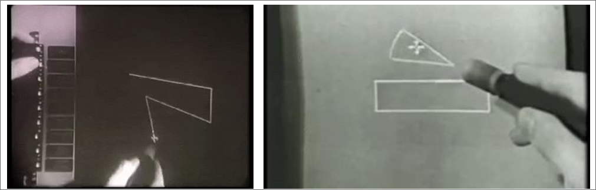

### Sfida delle risorse computazionali

- Negli anni '60 e '70 la **grafica era gestita direttamente alla CPU** che eseguiva i calcoli sia logici che di generazione delle immagini.
- Questa gestione centralizzata **limitava le capacità di calcolo** della CPU per altri computi, rallentando l'elaborazione e limitando la complessità delle immagini prodotte.
- La **crescente domanda di grafica** più complessa richiedeva una soluzione più efficiente.

## [[2.0_Cuda_Introduction_GC]]

### ANTIC di Atari (1977)

- **ANTIC** (Alpha-Numeric Television Interface Circuit) fu uno dei primi esempi di **cooprocessore grafico** introdotto da atari nel 1977 per i suoi **computer a 8-bit**.
- Liberava la CPU dalla gestione della grafica consentendo **giochi e interfacce più complesse.**
- **Gestiva sprite, scolling e diverse modalità grafiche**, migliorando l'esperienza visiva.

## Prime Schede Video Dedicate e Esigenza di Standard

### Prime Schede Video:

- **MDA (Monochrome Display Adapter)**: introdotta da IBM nel 1981, supportava solo testo in modalità monocromatica a una risoluzione di 720x350 pixel.
- **CGA (Color Graphics Adapter)**: introdotta da IBM nel 1981, supportava testo e grafica a colori (fino a 4 colori simultanei scelti da una tavolozza di 16) a una risoluzione di 320x200 pixel o 640x200 pixel.
- **EGA (Enhanced Graphics Adapter)**: introdotta da IBM nel 1984, supportava testo e grafica a colori (fino a 16 colori simultanei scelti da una tavolozza di 64) a una risoluzione di 640x350 pixel.

> **Il bisogno di Standard** era evidente, poiché ogni produttore aveva la propria interfaccia e i propri standard, rendendo difficile la compatibilità tra dispositivi diversi.

## VGA (Video Graphics Array) Predecessore delle GPU

- **VGA** è uno standard introdotto da IBM nel 1987, ha definito le specifiche per video e monitor, standardizzando la grafica su PC.
  - Risoluzione 640x480 pixel
  - Supporto fino a 256 colori simultanei
  - Retrocompatibilità con EGA e CGA
- **Controller VGA**: Chip specializzato che implementa lo standard **gestisce output grafico** ma non i calcoli complessi, gestiti dalla CPU.
- **Scheda Video VGA**: Contiene il controller VGA e la memoria video, destinata a gestire la visualizzazione su monitor.
- **Connettore VGA** Connettore analogico a 15 pin per la connessione ai monitor.

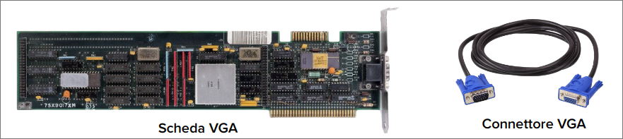

## Limitazione delle Prime Schede Video

- **Grafica 2D**
  - Le prime schede video, incluse VGA, erano progettate per **gestire grafica 2D** supportando operazioni di base come linee, rettangoli e riempimenti di aree.
- **Basse Risoluzioni**
  - Nonostante la VGA offrisse una risoluzione superiore rimaneva ancora **limitata** per visualizzazioni molto dettagliate.
  - L'esperienza grafica era confinata a **semplici interfacce** e giochi con **grafica elementare**.

## Funzioni 3D Basilare (metà anni '90)

Dopo lo standard VGA, la crescente domanda di grafica più realistica nei videogiochi e nelle applicazioni professionali portè allo sviluppo di **funzionalità 3D** nelle schede video.

### Blocchi Fondamentali della Grafica 3D Moderna

- **Triangolazione**
  - Scomposizione di oggetti 3D in triangoli per semplificare la rappresentazione di forme complesse
- **Rasterizzazione**
  - Conversione di forme vettoriali in pixel per renderizzare oggetti 3D su schermo 2D
- **Texture Mapping**
  - Applicazioni di immagini 2D su oggetti 3D per simulare superfici realistiche aggiungedo dettagli.
- **Shading**
  - Calcolo dell'illuminazione e del colore delle superfici per simulare l'interazione della luce con gli oggetti 3D.

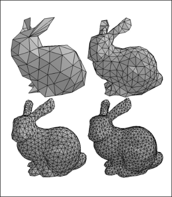

## Il Modello del Ray Tracing

- La crescente complessità delle scene e l'alto parallelismo a livello di dati trovano la loro massima espressione nel **ray tracing**, un modello di rendering che simula il comportamento della luce in una scena 3D.
- Ogni pixel richiede il calcolo di più raggi luminosi e delle loro interazioni (**riflessioni, rifrazioni, ombre**).
- Ogni pixel potrebbe essere calcolato **simultaneamente** con un sufficiente parallelismo

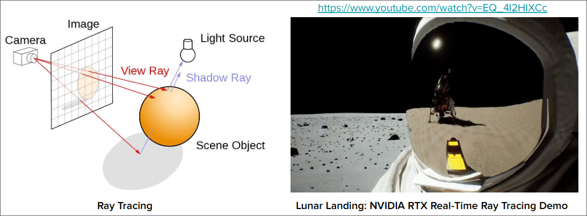

## Evoluzione dei Graphics Accelerator negli anni '90

### Graphics Accelerator

- Hardware specializzato progettato per accelerare le operazioni grafiche, riducendo il carico sulla CPU.
- **Furono introdotti per:**
  - Crescente domanda di grafica più complessa e fluida
  - CPU insufficienti per gestire carichi grafici avanzati, specialmente in 3D.
  - Necessità di migliorare le prestazioni nei videogiochi e nelle applicazioni professional
- **Caratteristiche chiave:**
  - Accelerazione 2D hardware (es. blitting (copiare pixel da una posizione all'altra), line drawing) riempimento aree)
  - Verso fine anni '90, accelerazione 3D hardware (es. trasformazioni 3D, rasterizzazione, texture mapping, shading)
  - Memoria dedicata per frame buffer

## Limiti dell'Era Pre GPU: La Sfida dell'Accelerazione 3D

### Da Accelerazione 2D a 3D

- I Graphics Accelerator degli anni '90 introdussero le prime funzionalità 3D, ma il passaggio non fu privo di sfide.

### Limitazioni Principali

- **Prestazioni Insufficienti**
  - La CPU era ancora sovraccarica nel gestire operazioni 3D complesse, limitando le prestazioni grafiche.
  - basso frame rate nelle scene con molti poligoni e texture (< 15 fps).
- **Flessibilità Limitata**
  - Hardware non ottimizzato per le nuove funzioni in 3D
  - Difficoltà nell'implementare algoritmi avanzati di shading e altre tecniche di rendering.
- **Mancanza di Programmabilità**
  - Le pipeline grafiche dell'epoca erano **fisse** (fixed-funtion), cioè predefinite dall'hardware e non modificabili dai programmatori.
  - Questo limitava la capacità di creare nuove tecniche di rendering, bloccando l'innovazione.

## Videogiochi Moderni

### Crescente Complessità delle scene

- Centinaia di migliaia di poligoni per oggetto
- Milioni di pixel da elaborare per frame
- Illuminazione dinamica, particelle, fisica realistica

### Evoluzione Annuale

- Grafica sempre più sofisticata e realistica
- Richiesta di prestazioni in costante aumento
- Mondi di gioco più vasti e dettagliati

### Caratteristiche del Carico di Lavoro

- Enorme quantità di calcoli per frame
- Operazioni per lo più indipendenti tra loro
- Alto parallelismo a livello di dati

## Chi Spinge la Tecnoligia delle GPU

Le esigenze crescenti nei diversi settori hanno superato le capacità delle CPU tradizionali, creando una domanda per hardware più specializzato come le GPU.

### Industria dei videogiochi

Vedi sopra

### Industra Cinematografica

- Esigenza di elaborazione parallela per effetti visivi e simulazioni realistiche, hanno bisogno di Hardare che accelera il rendering e gestiscono una simulazione di grandi quantità di dati

### Visualizzazione Scientifica

- Gestione e visualizzazione di grandi set di dati sceintifici, Hardware per rendering 3D complessi e simulazioni in tempo reale.

### Industria Medica

- Ricostruzioni e visualizzazione di immagini 3D, TAC, e RMN, Hardeare per elaborazione rapitda, rendering volumetrico e analisi di immagini.

## Introduzione alle GPU

L'evoluzione delle tecnologie grafiche ha portato alla creazione delle **GPU (Graphics Processing Unit)**

### Che cosa è una GPU?

Hardware progettato per l'elaborazione parallela, ottimizzato per gestire e accelerare il rendering grafico e le operazioni di calcolo intensivo.

### Funzioni Principali

- **Rendering Grafico**
  - Accelerazione 3D, rasterizzazione, texture mapping, shading
  - Calcolo di illuminazione, ombre, riflessioni, rifrazioni
- **Calcolo Parallelo Massivo**
  - Esecuzione simultanea di migliaia di Operazioni
  - Ottimizzazione per task che richiedono calcoli ripetitivi su grandi set di dati

### Evoluzione verso il GPGPU

- **Dalla Grafica al Calcolo Generale**:
  - Le GPU, nate per l'accelerazione grafica, mostravano un potenziale non sfruttato per altri tipi di calcolo.
  - **Intuzioni chiave**: La struttura parallela delle GPU poteva essere applicata a problemi al di fuori del dominio grafico come il rendering o simulazioni fisiche.
- **Introduzione al GPGPU**:
  - **General Purpose GPU** (GPGPU) è un approccio che sfrutta le GPU per eseguire calcoli generici, non solo grafici.
  - **Primi Approcci**: Complessi e limitati, richiedevano di ingannare la GPU utilizzando API grafiche come OpenGL o DirectX per presentare i calcoli come operazioni grafiche.
  - **Sfide Iniziali**: Programmazione complessa, limiti nell'uso di dati in virgola mobile, mancanza di strumenti di debug e profiling.
  - **Sviluppo di Framework dedicati**: Con la crescente domanda di calcolo GP su GPU, sono stati sviluppati framework e linguaggi specifici come CUDA (nvidia) e OpenCL, che hanno semplificato notevolmente la programmazione GPGPU
  - Applicazioni odierne: Crittografica, Analisi finanziaria, Fluidodinamica copmutazionale, Machine Learning, Deep Learning.

### GPU dedicati vs. Integrate

La classificazione delle GPU si basa principalmente su due architetture distinte: **Dedicate** e **Integrate**.

#### GPU Dedicata

- Prestazioni elevate
- Memoria video (VRAM) separata
- Consumo maggiore
- Costo maggiore
- Ideale per gaming e lavori grafici intensivi
- Utilizzata principalmente in PC da gaming, workstation, server.


#### GPU Integrate (iGPU)

- Prestazioni moderate
- Condivide la memoria di sistema
- Consumo minore
- Costo inferiore
- Ideale per applicazioni di base e portatili
- Utilizzata principalmente in dispositivi portatili, ultrabook, tablet, smartphone.

### Evoluzione e Impatto delle GPU nel Gaming Moderno

Le moderne console utilizzano un SoC (System on Chip) che integra CPU e GPU su un singolo chip, ottimizzando le prestazioni e riducendo i costi.

Questa GPU è dedicata ma integrata nel chip con la CPU condividendo la memoria unificata (RAM)

### Principali Aziende di GPU Oggi

- **NVIDIA** (USA): Leader nel settore delle GPU dedicate, ha introdotto CUDA e ha un'ampia gamma di prodotti per gaming, workstation e server.
- **Qualcomm** (USA): Leader nel settore delle GPU integrate, produce SoC per smartphone e tablet.
- **AMD** (USA): Concorrente di NVIDIA, produce GPU dedicate e SoC per console.
- **Intel** (USA): Leader nel settore dei processori, produce anche GPU integrate per PC e server.
- **Apple** (USA): Produce SoC per i propri dispositivi, con GPU integrate di alta qualità.

## NVIDIA

### Dominio di Mercato e Crescita dei Ricavi

- **Capitalizzazione di Mercato: NVIDIA ha superato brevemente Apple e Microsoft, raggiungendo la vetta della capitalizzazione di mercato tra le aziende tecnologiche a giugno 2024.
- **Crescita dei Ricavi per Settore**: I ricavi di NVIDIA nel settore dei data center per AI e analytics sono aumentati drasticamente, passando dall'11.99% nel 2017 a 75.01% nel 2024.

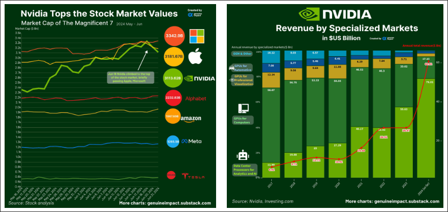

### Evoluzione delle Architetture GPU NVIDIA 

- **Progressione Tecnologica**: Da Fermi a Blackwell, ogni generazione ha portato signiicativi avanzamenti nelle capacità di calcolo e nell'efficienza energetica.
- **Adattamento al Mercato**: L'evoluzione riflette il passaggio da un focus su grafica e HPC a un'enfasi crescente su AI, deep learning e calcolo ad alte prestazioni.

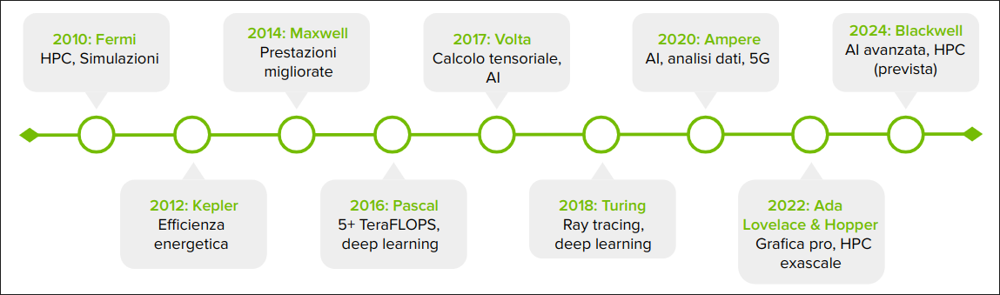

### NVIDIa nell'AI Generativa

**NVIDIA** possiede il 92% del mercato delle GPU per data center, cruciali per le applicazioni di **AI generativa**

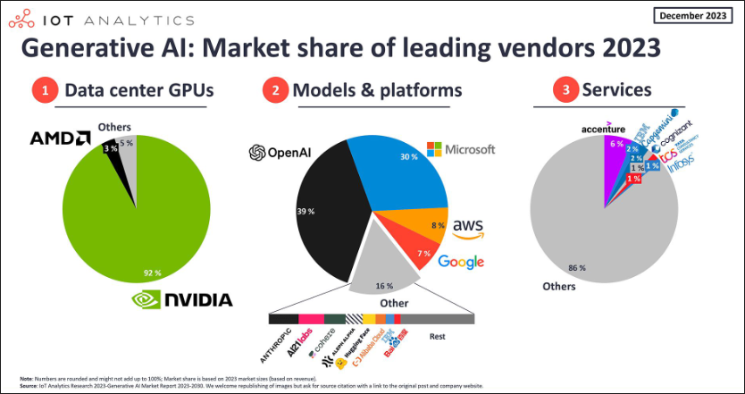

### Large Language Models (LLM)

- **Modelli**: ChatGPT, Gemini, Claude, Grok, Perplexity, Bard, LLaMA, Mistral
- **Dataset**: Decine di trilioni di token
> **Esempio:**
> - **ChatGPT**: 1.8 trilioni di parametri
>   - **Infrastruttura**: Cluster di 25.000 GPU NVIDIA A100 (cloud Azure di Microsoft)
>   - **Tempo di Training**: 90-100 giorni, Oltre un milione di GPU ore (circa 41.667 giorni su una singlo GPU)
>   - **Consumo energetico**: 2,5 milioni di kWh, 2.5 GWh (170-200 case americane per un anno)
>
> - **Grok 3**:
>   - **GPU utilizzate:** 100.000 NVIDIA H100 (40k $ ciascuna)
>   - **Costo totale**: 3 miliardi per l'addestramento
>   - **Tempistiche di Addestramento**: 22 Luglio 2024 - Dicembre 2024
>   - **Cluster di Addestramento**: Considerato come il più potente per addestramento AI al mondo
>  - **Consumo Energetico**: 128,52 milioni di kWh

## Differenze tra CPU e GPU

| **CPU (Central Processing Unit)** | **GPU (Graphics Processing Unit)** |
| --- | --- |
| Esegue il sistema operativo e la maggior parte dei programmi generali) | Inizialmente progettata per il rendering grafico |
| Adatta per compiti che richiedono calcoli complessi e operazioni logiche| Ora utilizzata per applicazioni di calcolo parallelo |
| Core da 2 a 16 (fino a 128 nel caso di server) | Core da 256 a 10.000 |
| Frequenze tra i 2.5 GHz a 5 GHz | Frequenze tra i 1 GHz e 2 GHz |
|Gestione delle istruzioni tramite branch prediction e out-of-order execution, lunga pipeline di elaborazione | Architettura parallela con design SIMT (Single Instruction, Multiple Threads) per gpu NVIDIA |
| Memorie DDR4 o DDR5 | Memorie GDDR6 o HBM2 |
| Larghezza di banda fino a 100 GB/s con DDR5 | Fino a 1000 GB/s con HBM2 |
| Cache di grandi dimensioni, fino a 72MB di L3 | Memoria dedicata solo alla CPU seprata dalla RAM del sistema |
|Accesso diretto e condiviso con OS e altre applicazioni | dimensioni da 4 a 24 GB fino a 48 o più per GPU professionali|
| Maggiore velocità per singolo thread | Maggiore capacità di calcolo parallelo massivo. |
| Eccellente per carichi di lavoro **sequenziali** | Eccellente per carichi altamente **Parallelizzabili** |
| **Bassa latenza** per operazioni singole e accesso alla memoria | **Throughput superiore** per operazioni numeriche semplici e ripetitive |
| Parallelismo limitato | Versatilità limitata |
| Scalabilità: Difficoltà nell'aumentare il numero di core | Latenza più alta per operazioni singole rispetto alla CPU |
| Costose per ottenere alte prestazioni in task paralleli | Complessità di programmazione|
| | Consumo energetico elevato sotto carichi intensivi |
|  |  |

### Esempio di CPU vs GPU

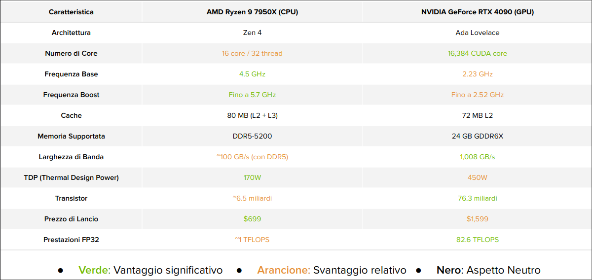

## [[2.0_Cuda_Introduction_GC]]

Una **Architettura Eterogenea** è una struttura di sistema che integra diversi tipi di processori o core di elaborazione all'interno dello stesso computer o dispositivo.

- **Ruoli**:
  - **CPU**: Gestisce l'ambiente, il codice e i dati
  - **GPU**: co processore, accelera calcoli intensivi (Hardware accelerator)
- **Connessione**: GPU collegate alla CPU tramite bus **PCI-Express**
- **Struttura del Software**: Applicazioni divise in codice host (CPU) e device (GPU)

### Sistemi Multi-GPU

Sono sistemi che integrano più GPU all'interno della stessa architettura eterogenea, permettendo di distribuire e parallelizzare il carico di lavoro su diverse unità di elaborazione.

| **Livello di parallelismo** | **Dimensione dei dati** |
| --- | --- |
| **CPU:** Basso (pochi thread) | **CPU:** Piccola-Media (KB-MB) |
| **GPU:** Alto (migliaia di thread) | **GPU:** Media-Grande (GB-TB) |

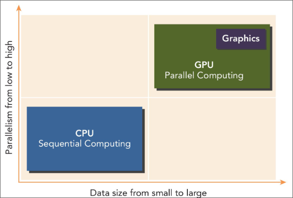

**Approccio Ottimale:**
- Combinare CPU e GPU per massimizzare le prestazioni
- Basso parallelismo + dati limitati $\rarr$ CPU
- Alto parallelismo + grandi set di dati $\rarr$ GPU

### Struttura del Software

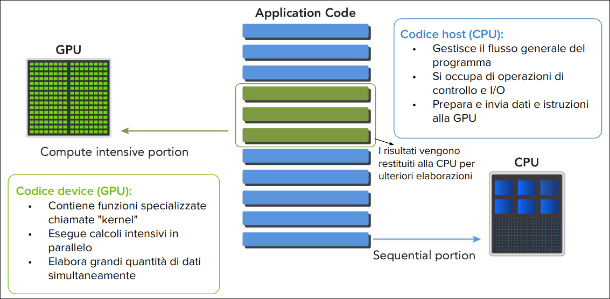

## CUDA, Piattaforma per il calcolo parallelo

#### CUDA (Computer Unified Device Architecture)
  - Piattaforma di calcolo parallelo general-purpose ideato da NVIDIA
  - Modello di programmazione per GPU NVIDIA

#### Obiettivo
  - Sfruttare la potenza di calcolo parallelo delle GPU
  - Semplificare lo sviluppo per sistemi CPU-GPU eterogenei
  
#### Ecosistema CUDA
  - Compilatore (nvcc), Profiler/Debugger (Nsight), Librerie Ottimizzate, Strumenti di sviluppo (CUDA Toolkit)

#### Come si accede a CUDA?
  - API (CUDA runtime API, CUDA driver API)
  - Estensioni a C, C++, Fortran
  - Integrazioni con framework di alto livello (TensorFlow, PyTorch)

#### Vantaggio Chiave
  - Accesso alla GPU per calcoli generali, non solo grafica

### CUDA Toolkit

È un insieme completo di strumenti di sviluppo fornito da NVIDIA per creare applicazioni accelerate dalla GPU.
È essenziale per lo sviluppo di applicazioni CUDA, poichè fornisce tutti gli strumenti necessari per scrivere compilare e ottimizzare codice CUDA.

#### Componenti chiave

- **Driver NVIDIA**
  - Fondamento invisibile
  - Fanno da ponte tra OS e GPU, gestendo l'hw e le risorse
- **CUDA Runtime**
  - Livello di astrazione più alto, semplice da utilizzare
- **CUDA Driver API**
  - Livello di astrazione più basso, offre un controllo più granulare sulle operazioni
- **Compilatore CUDA**
  - Traduzione del codice, da CUDA (c, c++, fortran) a codice macchina GPU.
  - **Fasi:**
    - Separazione: Codice host e device
    - Compilazione: Codice device in PTX (Parallel Thread Execution) o in codice macchina per la GPU tenendo conto della Compute Capability e della CUDA version
    - Linking: Unione del codice host e device in un eseguibile
- **Librerie CUDA**
  - Funzionalità ottimizzate: Offrono un'ampia gamma di funzioni di alto livello
  - **Esempi**:
    - **cuBLAS**: Libreria di algebra lineare
    - **cuFFT**: Libreria di trasformata di Fourier
    - **cuDNN**: Libreria di deep learning
    - **cuRAND**: Generazione di numeri casuali
    - **cuSPARSE**: Algebra lineare sparsa
    - **Thrust**: Algoritmi paralleli generici

### API CUDA

Per sfruttare appieno le capacità delle GPU, è essenziale avere strumenti che facilitino la programmazione.
Le API forniscono questi strumenti, permettendo ai programmatori di interagire con la CPU in modo efficiente.

API (Application Programming Interface) è un set di funzione e procedure che permettono ai programmatori di:
- Comunicare con la GPU
- Gestire le risorse della GPU
- Eseguire calcoli paralleli sulla GPU

CUDA fornisce due API principali:
- **CUDA Runtime API**: Interfaccia ad alto livello, facile da usare
- **CUDA Driver API**: Interfaccia a basso livello, più complessa ma più flessibile

Per bilanciare semplicità e controllo, le due API sono mutualmente esclusive, non è possibile utilizzarle contemporaneamente.

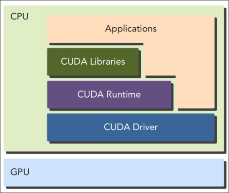

### Programma CUDA

**File Sorgente**: Estensione .cu
Codice host + Codice device

**Componenti principali**:
- Codice Host
  - Codice c o c++ che viene eseguito sulla CPU
  - Gestisce la logica dell'applicazione
  - Alloca memoria sulla GPU
  - Trasferisce dati tra CPU e GPU
  - Lancia i kernel GPU
  - Gestisce sincronizzazione
- Codice Device
  - Codice CUDA C eseguito sulla GPU
  - Contiene i **kernel**, funzioni eseguite in parallelo su più thread
  - Esegue operazioni computazionali intensive in parallelo

**Flusso di Compilazione**:
- Separazione del codice host e device
- Compilazione del codice host (c, c++) con il compilatore host
- Compilazione del codice device (CUDA C)
  - Compilato da nvcc in formato intermedio **PTX (Parallel Thread Execution)**
  - Il driver NVIDIA poi traduce il PTX in codice macchina specifico per la GPU (**SASS - Shader Assembly?**) al momento della esecuzione usando un compilatore JIT (Just-In-Time)
- Linking del codice host e device in un eseguibile
  - Aggiunta delle librerire CUDA
  - Supporto per chiamate ai kernel e manipolazione esplicita della GPU
- Eseguibile unico con codice per CPU e GPU

| 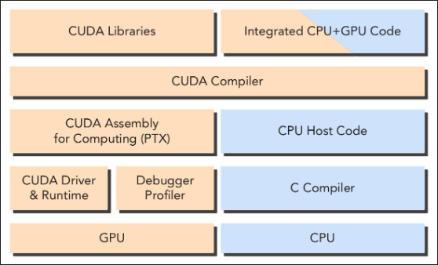 | 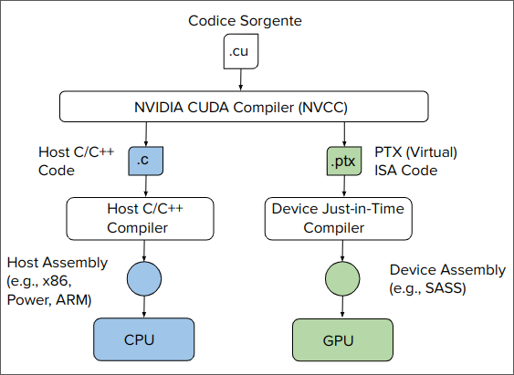 |
| --- | --- |

## Hello World in CUDA

**File sorgente:** hello.cu

Linguaggio C (CPU)
```c
#include <stdio.h>

int main() {
  printf("Hello, World!\n");
  return 0;
}
```

Linguaggio CUDA C (GPU)

```c
#include <stdio.h>

//kernel
__global__ void helloFronGPU() {
  printf("Hello, World from GPU thread %d!\n", threadIdx.x);
}

int main(){
  //lancio del kernel
  helloFromGPU<<<1, 10>>>();

  //attesa della fine del kernel
  cudaDeviceSynchronize();

  return 0;
}
```

- ```__global__``` Qualificatore CUDA per funzioni eseguite sulla GPU e chiamate dalla CPU. Non è prenente in C standard.
- ```threadIdx.x``` Variabile CUDA che restituisce l'indice del thread corrente all'interno del blocco.
Funzione ```main``` punto di ingresso del programma eseguito su CPU.

Lancio del kerner ```<<1, 10>>``` configurazione di esecuzione, 1 blocco 10 kernel, Avvia 10 istanze parallele del kernel sulla GPU.

Sinconizzazione ```cudaDeviceSynchronize()``` aspetta la fine di tutte le operazioni della GPU.

Salva il codice in ```hello.cu```
- un file .cu pu; contenere sia codice C/C++ che CUDA C
- Permette di mescolare codice CPU e GPU nello stesso file

Compilo con ```nvcc hello.cu -o hello```

Eseguo con ```./hello```

Output CPU:
```
Hello, World!
```
Output GPU:
```
Hello, World from GPU thread 0!
Hello, World from GPU thread 1!
Hello, World from GPU thread 2!
Hello, World from GPU thread 3!
Hello, World from GPU thread 4!
Hello, World from GPU thread 5!
Hello, World from GPU thread 6!
Hello, World from GPU thread 7!
Hello, World from GPU thread 8!
Hello, World from GPU thread 9!
```


