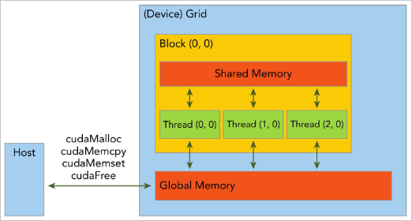
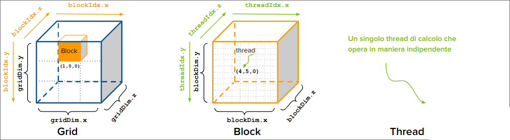
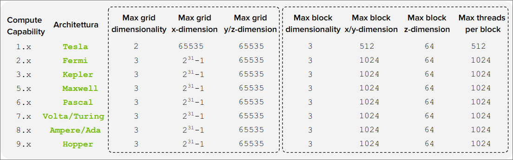
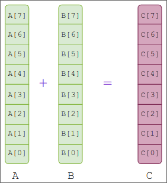
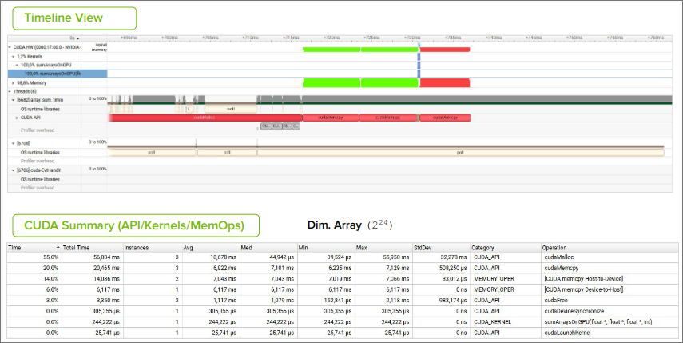
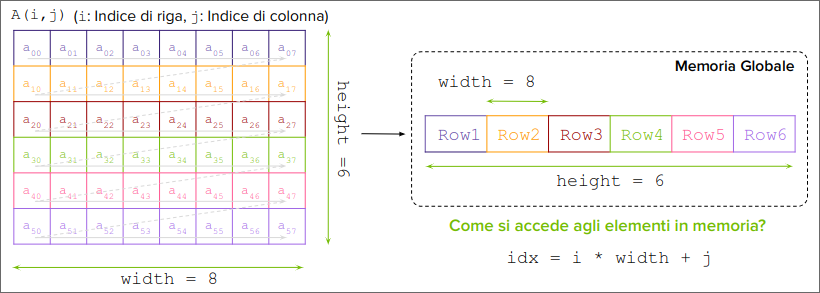
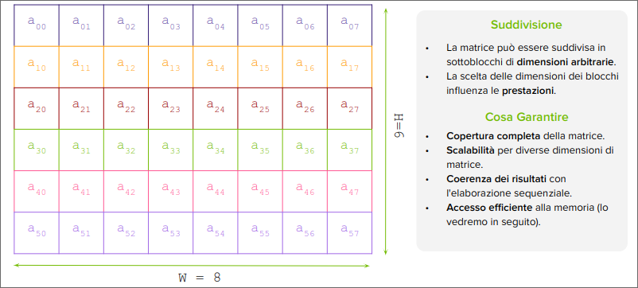
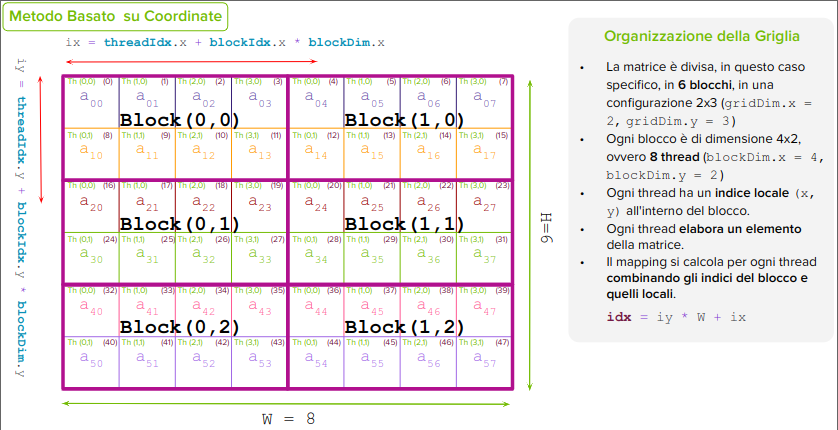

# [[2.1_Modello_di_Programmazione_Cuda_GC]]

[Return](./README.md)

---

# Indice

- [\[\[2.1\_Modello\_di\_Programmazione\_Cuda\_GC\]\]](#21_modello_di_programmazione_cuda_gc)
- [Indice](#indice)
  - [\[\[2.1\_Modello\_di\_Programmazione\_Cuda\_GC\]\]](#21_modello_di_programmazione_cuda_gc-1)
    - [Struttura stratificata dell'Ecosistema CUDA](#struttura-stratificata-dellecosistema-cuda)
    - [Ruolo del Modello e del Programmazione](#ruolo-del-modello-e-del-programmazione)
    - [Livelli di Astrazione nella Programmazione Parallela CUDA](#livelli-di-astrazione-nella-programmazione-parallela-cuda)
    - [Thread CUDA, Unita Fondamentale di Calcolo](#thread-cuda-unita-fondamentale-di-calcolo)
    - [Struttura di Programmazione CUDA](#struttura-di-programmazione-cuda)
      - [Caratteristiche Principali:](#caratteristiche-principali)
    - [\[\[2.1\_Modello\_di\_Programmazione\_Cuda\_GC\]\]](#21_modello_di_programmazione_cuda_gc-2)
  - [\[\[2.1\_Modello\_di\_Programmazione\_Cuda\_GC\]\]](#21_modello_di_programmazione_cuda_gc-3)
    - [\[\[Q\&A\]\]](#qa)
    - [Gerarichi di Memoria in CUDA](#gerarichi-di-memoria-in-cuda)
    - [\[\[2.3\_Modello\_di\_Memoria\_Cuda\]\]](#23_modello_di_memoria_cuda)
    - [Trasferimento Dati](#trasferimento-dati)
    - [Deallocazione della Memoria sul Device](#deallocazione-della-memoria-sul-device)
    - [Allocazione e Trasferimento Dati sul Device](#allocazione-e-trasferimento-dati-sul-device)
  - [\[\[2.1\_Modello\_di\_Programmazione\_Cuda\_GC\]\]](#21_modello_di_programmazione_cuda_gc-4)
    - [Struttura Gerarchica](#struttura-gerarchica)
    - [Identificazione dei Thread in CUDA](#identificazione-dei-thread-in-cuda)
  - [\[\[2.1\_Modello\_di\_Programmazione\_Cuda\_GC\]\]](#21_modello_di_programmazione_cuda_gc-5)
    - [Qualificatori di Funzione in CUDA](#qualificatori-di-funzione-in-cuda)
    - [Restrizioni dei Kernel CUDA](#restrizioni-dei-kernel-cuda)
    - [Configurazioni di un Kernel CUDA](#configurazioni-di-un-kernel-cuda)
      - [Numero di Thread per Blocco](#numero-di-thread-per-blocco)
    - [Compute Capability](#compute-capability)
    - [Identificazione dei Thread in CUDA](#identificazione-dei-thread-in-cuda-1)
  - [\[\[2.1\_Modello\_di\_Programmazione\_Cuda\_GC\]\]](#21_modello_di_programmazione_cuda_gc-6)
    - [Somma di Array in CUDA](#somma-di-array-in-cuda)
    - [Mapping degli Indici ai Dati in CUDA](#mapping-degli-indici-ai-dati-in-cuda)
      - [Esempio](#esempio)
    - [Identificazione dei Thread e Mapping dei Dati in CUDA](#identificazione-dei-thread-e-mapping-dei-dati-in-cuda)
      - [Calcolo dell'indice Globale Grid 1D, Block 1D](#calcolo-dellindice-globale-grid-1d-block-1d)
      - [Claclolo dell'indice Globale Grid 1D, Block 2D](#claclolo-dellindice-globale-grid-1d-block-2d)
        - [Metodo Lineare](#metodo-lineare)
        - [Metodo Basato su Coordinate](#metodo-basato-su-coordinate)
  - [Analisi delle Prestazioni](#analisi-delle-prestazioni)
    - [Verifica del Kernel CUDA](#verifica-del-kernel-cuda)
    - [Gestione degli Errori in CUDA](#gestione-degli-errori-in-cuda)
    - [Profiling delle prestazioni dei Kernel CUDA](#profiling-delle-prestazioni-dei-kernel-cuda)
    - [Timer CPU per Profiling](#timer-cpu-per-profiling)
    - [NVIDIA Profiler da CUDA 5.0 a CUDA 8.0](#nvidia-profiler-da-cuda-50-a-cuda-80)
    - [NVIDIA Nsight System](#nvidia-nsight-system)
      - [Ottimizzazione della Gestione della Memoria in CUDA](#ottimizzazione-della-gestione-della-memoria-in-cuda)
    - [NVIDIA Nsight Compute](#nvidia-nsight-compute)
  - [\[\[2.1\_Modello\_di\_Programmazione\_Cuda\_GC\]\]](#21_modello_di_programmazione_cuda_gc-7)
    - [Operazioni su Matrici in CUDA](#operazioni-su-matrici-in-cuda)
      - [Somma di matrici in CUDA](#somma-di-matrici-in-cuda)
        - [Mapping degli indici](#mapping-degli-indici)
        - [Suddivisione della Matrice](#suddivisione-della-matrice)
        - [Calcolo dell'indice globale](#calcolo-dellindice-globale)


## [[2.1_Modello_di_Programmazione_Cuda_GC]]

### Struttura stratificata dell'Ecosistema CUDA

**Modello CUDA**
L'ecosistema CUDA nel suo complesso può essere visto come una struttura stratificata per esprimere algoritmi paralleli su GPU, bilanciando semplicità d'uso e controllo hardware per ottimizzare le prestazioni.

 

**Applicazioni**: programmi scritti per risolvere problemi utilizzando CUDA.

**Modello di programmazione**: CUDA, fornisce astrazione per programmare GPU offrendo concetto con thread, blocchi e griglie.

**Compilatore/Librerie**: Strumenti che traducono il codice CUDA in istruzioni eseguibili dalla GPU. 

**Sistema Operativo**: Gestisce le risorse, inclusa l'allocazione della GPU tra diverse applicazioni.

**Architetture**: Le specifiche CPU NVIDIA su cui viene eseguito CUDA.

### Ruolo del Modello e del Programmazione

**Modello di Programmazione:**

Definisce la struttura e le regole per sviluppare applicazioni parallele su GPU. Elementi fondamentali:

- **Gerarchia di Thread:** Organizza l'esecuzione parallela in thread, blocchi e griglie, ottimizzando la scalabilità su diverse GPU.
- **Gerarchia di Memoria:** Offre tipi di memoria (globale, condivisa, locale, costante, texture) con diverse prestazioni e scopi per ottimizzare l'accesso ai dati.
- **API:** Fornisce funzioni e librerie per gestire l'esecuzione del kernel, il trasferimento dei dati e altre opzioni essenziali.

**Il Programma:**

Rappresenta l'implementazione concreta (il codice) che specifica come i thread condividono dati e coordinano le loro attività. Nel programma CUDA si definisce:
- Come i dati verranno suddivisi e elaborati tra i vari thread.
- Come i thread accederanno alla memoria e condivideranno dati.
- Quali operazioni verranno eseguite in parallelo.
- Quando e come i thread si sincornizzeranno per completare un compito.

### Livelli di Astrazione nella Programmazione Parallela CUDA

Il calcolo parallelo si articola in tre livelli di astrazione: dominio, logico e hardware.

**Livello Dominio**:
- Focus sulla decomposizione del problema.
- Definizione della struttura parallela di alto livello.
> **Chiave**: Ottimizza la strategia di parallelizzazione.

**Livello Logico**:
- Organizzazione e gestione dei thread.
- Implementazione della strategia di parallelizzazione.
> **Chiave**: Ottimizza l'efficienza dell'esecuzione parallela.

**Livello Hardware**:
- Mappatura dell'esecuzione sulla archietettura GPU.
- Ottimizzazione delle prestazioni hardware.
> **Chiave**: Sfrutta al meglio le risorse GPU.

### Thread CUDA, Unita Fondamentale di Calcolo

**Thread CUDA**:
- Un thread CUDA rappresenta una unità di esecuzione elementare nella GPU.
- Ogni thread CUDA esegue una porzione di un programma parallelo, chiamato kernel.
- Sebbene migliaia di thread vengano eseguiti concorrentemente sulla GPU, ogni singolo thread segue un precorso di esecuzione sequenziale all'interno del suo contesto.

Un thread CUDA compie:
- **Elaborazione di Dati**: Ogni thread CUDA si occupa di un piccolo pezzo del problema complessivo, eseguendo calcoli su un sottoinsieme di dati.
- **Esecuzione di Kernel**: Ogni tread esegue lo stesso codice del kernel ma opera su dati diversi determinati dai suoi identificatori univoci ```threadIdx``` e ```blockIdx```.
- **Stato del Thread**: Ogni thread ha un proprio stato, compreso un insieme di registri e una piccola quantità di memoria locale.

> **Thread CUDA vs Thread CPU**:
> - GPU: Parallelismo massivo con migliaia di thread. CPU: Parallelismo limitato con pochi thread.
> - Thread CUDA: Efficienza e Basso Overhead. Thread CPU: Maggior Overhead di gestione.

### Struttura di Programmazione CUDA


#### Caratteristiche Principali:

- **Codice Seriale e Parallelo:** Alternanza tra sezioni di codice seriale e parallelo (stesso file).
- **Struttura Ibrida Host-Device:** Codice eseguito su CPU (host) e GPU (device).
- **Esecuzione Asincrona:** Il codice host può continuare l'esecuzione mentre i kernel GPU sono in eecuzione.
- **Kernel CUDA Multipli:** Possibilità di lanciare più kernel GPU all'interno della stessa applicazione.
- **Gestione dei Risultati sull'Host:** Trasferimento dei risultati dal device all'host ed elaborazione finale su CPU.

### [[2.1_Modello_di_Programmazione_Cuda_GC]]

1. **Inizializzazione e Allocazione Memoria (Host):**
   - Inizializzazione delle variabili e allocazione della memoria su CPU e GPU.
2. **Trasferimento Dati (Host-Device):**
    - Copia dei dati dalla memoria host alla memoria device.
3. **Esecuzione del Kernel (Device):**
    - Lancio del kernel per l'esecuzione parallela su GPU.
4. **Trasferimento Dati (Device-Host):**
   - Copia dei risultati dalla memoria device alla memoria host.
5. **Elaborazione Risultati (Host):**
    - Elaborazione finale dei risultati su CPU.
6. **Rilascio Risorse (Host):**
    - Deallocazione della memoria e rilascio delle risorse.

## [[2.1_Modello_di_Programmazione_Cuda_GC]]

### [[Q&A]]
- Il modello CUDA presuppone un sistema con un host e un device, ognuno con la propria memoria.
- La comunicazione tra la memoria dell'host e quella del device avviene tramite il bus seriale **PCIe (Peripheral Component Interconnect Express)** che permette di trasferire dati tra CPU e GPU.

**Caratteristiche PCIe**

- **Lane**: Ogni lane è costituito da due coppie di segnali differenziali (4 fili), una per ricevere e una per trasmettere.
- **Full Duplex**: Permette la trasmissione simultanea in entrambe le direzioni.
- **Scalabilità**: La larghezza di banda varia a seconda del numero di lane: x1, x4, x8, x16.
- **Bassa Latenza**: Garantisce comunicazione rapide e reattive nei trasferimenti frequenti.
- **Bottleneck**: Il bus PCIe può diventare un collo di bottiglia per applicazioni con elevato traffico di dati.


- I kernel CUDA operano sulla **memoria del device**
- CUDA runtime fornisce funzioni per:
  - **Allocazione Memoria** sul device.
  - **Rilascio Memoria** dal device quando non più necessaria.
  - **Trasferimento Dati** tra host e device bidirezionale.

|Standard C|CUDA C|Funzione|
|---|---|---|
|```malloc()```|```cudaMalloc()```|Allocazione Dinamica Memoria|
|```memcpy()```|```cudaMemcpy()```|Copia dati tra aree di memoria|
|```memset()```|```cudaMemset()```|Inizializzazione Memoria ad uno specifico valore|
|```free()```|```cudaFree()```|Libera Memoria|

> È responsabilità del programmatore gestire correttamente l'allocazione, il trasferimento e la deallocazione della memoria per ottimizzare le prestazioni.

### Gerarichi di Memoria in CUDA

In CUDA esistono diversi tipi di memoria, ciascuno con caratteristche specifiche in termini di accesso, velocità e visibilità.

| **Global Memory** | **Shared Memory** |
|---|---|
| - Accessibile da tutti i thread. | - Condivisa tra i thread all'interno di un singolo blocco. |
| - Più grande e lenta. | - Più piccola e veloce. |
| - Persiste per tutta la durata del programma CUDA. | - Esiste solo per la durata del blocco di thread. |
| - È adatta per memorizzare dati grandi e persistenti. | - Utilizzata per dati temporanei e intermedi. |

> **Funzioni**:
> - ```cudaMalloc```: **Alloca** memoria sulla GPU.
> - ```cudaMemcpy```: **Copia** dati tra host e device.
> - ```cudaMemset```: **Inizializza** la memoria con un valore specifico.
> - ```cudaFree```: **Dealloca** memoria sulla GPU.
>
> Queste funzioni operano principalmente sulla Global Memory



### [[2.3_Modello_di_Memoria_Cuda]]

**Firma della Fuznione:** [Online Doc](https://docs.nvidia.com/cuda/cuda-runtime-api/group__CUDART__MEMORY.html#group__CUDART__MEMORY_1g37d37965bfb4803b6d4e59ff26856356)
```c
cudaError_t cudaMalloc(void **devPtr, size_t size);
```
**Parametri:**
- ```devPtr```: Puntatore alla memoria allocata.
- ```size```: Dimensione in byte della memoria da allocare.

**Valore di Ritorno:**
- ```cudaError_t```: Codice di errore (```cudaSuccess``` se l'allocazione è avvenuta con successo).

> **Note Importanti:**
> - **Allocazione**: Riserva memoria lineare contigua sulla GPU e runtime.
> - **Puntatore**: Aggiorna puntatore CPU con indirizzo memoria GPU.
> - **Stato iniziale**: La memoria allocata non è inizializzata.

**Firma della Funzione:** [Online Doc](https://docs.nvidia.com/cuda/cuda-runtime-api/group__CUDART__MEMORY.html#group__CUDART__MEMORY_1gf7338650f7683c51ee26aadc6973c63a)
```c
cudaError_t cudaMemset(void *devPtr, int value, size_t count);
```
**Parametri:**
- ```devPtr```: Puntatore alla memoria da inizializzare.
- ```value```: Valore con cui inizializzare la memoria.
- ```count```: Numero di byte da inizializzare.
  
**Valore di Ritorno:**
- ```cudaError_t```: Codice di errore (```cudaSuccess``` se l'inizializzazione è avvenuta con successo).

> **Note Importanti:**
> - **Utilizzo**: Comunemente utilizzata per azzerare la memoria (impostando ```value``` a 0).
> - **Gestione**: L'inizializzazione deve avvenire dopo l'allocazione della memoria tramite ```cudaMalloc```.
> - **Efficienza**: È preferibile usare ```cudaMemset``` rispetto a ```cudaMemcpy``` per inizializzare la memoria per ridurre l'overhead.

**Esempio di Allocazione di memoria sulla GPU:**
```c
#include <cuda_runtime.h>
#include <stdio.h>

int main() {
    int *d_data;
    size_t size = 1024 * sizeof(int);
    cudaError_t err = cudaMalloc(&d_data, size);
    if (err != cudaSuccess) {
        fprintf(stderr, "Errore di allocazione della memoria: %s\n", cudaGetErrorString(err));
        return -1;
    }
    return 0;
}
```

### Trasferimento Dati

**Firma della Funzione:** [Online Doc](https://docs.nvidia.com/cuda/cuda-runtime-api/group__CUDART__MEMORY.html#group__CUDART__MEMORY_1g7b1b3)

```c
cudaError_t cudaMemcpy(void *dst, const void *src, size_t count, cudaMemcpyKind kind);
```

**Parametri:**
- ```dst```: Puntatore alla destinazione della copia.
- ```src```: Puntatore all'origine della copia.
- ```count```: Numero di byte da copiare.
- ```kind```: Direzione della copia

**Valore di Ritorno:**

- ```cudaError_t```: Codice di errore (```cudaSuccess``` se la copia è avvenuta con successo).

**Tipi di Trasferimento (kind):**
- ```cudaMemcpyHostToHost```: Host -> Host.
- ```cudaMemcpyHostToDevice```: Host -> Device.
- ```cudaMemcpyDeviceToHost```: Device -> Host.
- ```cudaMemcpyDeviceToDevice```: Device -> Device.

> **Note Importanti:**
> - **Funzione Sincrona**: Blocca l'esecuzione del thread host finché la copia non è completata.
> PEr prestazioni ottimali, minimizzare il numero di trasferimenti dati tra host e device.

**Spazi di Memoria Differenti**

**! ATTENZIONE**: I puntatori del device non devono essere dereferenziati nel codice host (spazi di memoria CPU e GPU differenti).

**Esempio**: Assegnazione errata come ```host_array = dev_ptr``` invece di
``` cudaMemcpy(host_array, dev_ptr, nBytes, cudaMemcpyDeviceToHost)```.

**Conseguenza dell'errore**: L'applicazione potrebbe cloccarsi durante l'esecuzione a causa del tentativo di accesso a uno spazio di memoria non valido.

**Soluzione**: CUDA 6 ha introdotto la Memoria Unificata che consente di accedere sia alla memoria CPU che GPU utilizzando un unico puntatore.

### Deallocazione della Memoria sul Device

**Firma della Funzione:** [Online Doc](https://docs.nvidia.com/cuda/cuda-runtime-api/group__CUDART__MEMORY.html#group__CUDART__MEMORY_1g7b1b3)

```c
cudaError_t cudaFree(void *devPtr);
```

**Parametri:**
- ```devPtr```: Puntatore alla memoria da deallocare.

**Valore di Ritorno:**
- ```cudaError_t```: Codice di errore (```cudaSuccess``` se la deallocazione è avvenuta con successo).

> **Note Importanti:**
> - **Gestione:** È responsabilità del programmatore assicurarsi che ogni blocco di memoria allocato con ```cudaMalloc``` sia liberato per evitare memory leaks sulla GPU.
> - **Efficienza:** La deallocazione della memoria è un'operazione veloce e non richiede la sincronizzazione tra host e device.

### Allocazione e Trasferimento Dati sul Device

**Esempio Completo:**
```c

#include <cuda_runtime.h>
#include <stdio.h>

int main() {
    int *h_data, *d_data;
    size_t size = 1024 * sizeof(int);
    h_data = (int *)malloc(size);
    for (int i = 0; i < 1024; i++) {
        h_data[i] = i;
    }

    // Allocazione della memoria sul device
    cudaError_t err = cudaMalloc(&d_data, size);
    if (err != cudaSuccess) {
        fprintf(stderr, "Errore di allocazione della memoria: %s\n", cudaGetErrorString(err));
        return -1;
    }

    // Trasferimento dei dati da host a device
    err = cudaMemcpy(d_data, h_data, size, cudaMemcpyHostToDevice);
    if (err != cudaSuccess) {
        fprintf(stderr, "Errore di copia della memoria: %s\n", cudaGetErrorString(err));
        return -1;
    }
    free(h_data);
    err = cudaFree(d_data);
    if (err != cudaSuccess) {
        fprintf(stderr, "Errore di deallocazione della memoria: %s\n", cudaGetErrorString(err));
        return -1;
    }
    return 0;
}
```

## [[2.1_Modello_di_Programmazione_Cuda_GC]]

CUDA adotta una gerarchia a due livelli per organizzare i thread basata su blocchi di thread e griglie di blocchi.

### Struttura Gerarchica

1. Grid (Gliglia):
    - Array di thread blocks.
    - Orgnaizzata in una struttura 1D, 2D o 3D.
    - Rappresenta l'intera computazione di un kernel.
    - Contiene tutti i thread che eseguono il singolo kernel.
    - Condivide lo stesso spazio di memoria globale.
2. Block (Blocco):
    - Un thread block è un gruppo di thread eseguiti logicamente in parallelo.
    - Ha un ID univoco all'interno della sua griglia.
    - I blocchi sono organizzati in una struttura 1D, 2D o 3D.
    - I thread di un blocco possono sincronizzarsi e condividere memoria.
    - I thread di blocchi diversi non possono cooperare.
3. Thread:
   - Ha un proprio ID univoco all'interno del blocco.
   - Ha accesso alla propria memoria privata (registri).

> **Perchè una Gerarchia di Thread?**
> - **Mappatura Intuitiva**: permette di scomporre problemi complessi in unità di lavoro parallele più piccole e gestibili, rispecchiando spesso la struttura intrinseca del problema stesso.
> - **Organizzazione e Ottimizzazione**: Il programmatore può controllare la dimensione dei blocchi e della griglia per adattare l'esecuzione alle caratteristiche specifiche dell'hardware e del problema, ottimizzando l'utilizzo delle risorse.
> - **Efficienza nella Memoria**: I thread di un blocco condividono dati tramte memoria on-chip veloce, riducendo gli accessi alla memoria globale più lenta, migliorando le prestazioni.
> - **Scalabilità e Portabilità**: La gerarchia è scalabile e permette di adattare l'esecuzione a GPU con diverse capacità e numero di core. Il codice CUDA, quindi, risultà più portabile e può essere eseguito su diverse architetture GPU.
> - **Sincronizzazione Granulare**: I thread possono essere sincronizzati solo all'interno del proprio blocco, evitando costose sincronizzazioni globali che possono creare colli di bottiglia.

### Identificazione dei Thread in CUDA

Ogni thread ha una identità unica definita da coordinate specifiche all'interno della gerarchia grid-block. Queste coordinate, private per ogni thread, sono essenziali per l'esecuzione del kernel e l'accesso corretto ai dati.



```uint3``` è un built-in vector type di CUDA con tre campi (x,y,z) gnuno di tipo ```unsigned int```

> **Variabili di Identificazione (Coordinate):**
> 1. ```blockIdx``` : Coordinate del blocco all'interno della griglia (```blockIdx.x```, ```blockIdx.y```, ```blockIdx.z```).
> 2. ```threadIdx``` : Coordinate del thread all'interno del blocco (```threadIdx.x```, ```threadIdx.y```, ```threadIdx.z```).
> Entrambi sono variabili **built-in** di tipo ```uint3``` e sono disponibili in ogni kernel CUDA.
>
> **Variabili di Dimensioni:**
> 1. ```blockDim``` : Dimensioni del blocco (```blockDim.x```, ```blockDim.y```, ```blockDim.z```), di tipo ```dim3``` (lato host), ```uint3``` (lato device, built-in).
> 2. ```gridDim``` : Dimensioni della griglia (```gridDim.x```, ```gridDim.y```, ```gridDim.z```), di tipo ```dim3``` (lato host), ```uint3``` (lato device, built-in).

**Dimensioni delle Griglie e dei Blocchi:**

- La scelta delle dimensioni ottimali dipende dalla struttura dati del task e dalle capacità dell'hardware.
- Le variabili per le dimensioni di griglie e blocchi vengono definite nel codice host prima di lanciare un kernel.
- Sia le griglie che i blocchi utilizzano il tipo ```dim3``` con tre campi ```usnigned int```. I campi non utilizzati vengono inizializzati a 1 e ignorati.
- 9 possibili configurazioni in tutto anche se in genere si usa la stessa per grid e block.

## [[2.1_Modello_di_Programmazione_Cuda_GC]]

Un kernel CUDA è una funzione che viene eseguita in parallelo sulla GPU da migliaia o milioni di thread.

Rappresenta il nucleo computazionale di un programma CUDA.

Nei kernel viene definita la logica di calcolo per un singolo thread e l'accesso ai dati associati a quel thread.

Ogni thread esegue lo stesso codice kernel, ma opera su diversi elementi dei dati.

**Sintassi della chiamata Kernel CUDA:**
```c
kernel_name <<<gridSize,blockSize>>>(argument list);
```
**gridSize**: Diensioni della griglia (numero di blocchi).
**blockSize**: Dimensione del blocco (numero di thread per blocco)
**argument list**: Lista degli argomenti passati al kernel.

con ```gridSize``` e ```blockSize``` si definisce il numero totale di thread per un kernel e il layout dei thread che si vuole utilizzare.

```c
function_name (argument list);
```

### Qualificatori di Funzione in CUDA

I qualificatori di funzione in CUDA sono essenziali per specificare dove una funzione verrà eseguita e da dove può essere chiamata.

| **Qualificatore** | **Esecuzione** | **Chiamata** | **Note** |
|---|---|---|---|
| ```__global__``` | Device (GPU) | Host (CPU) | Funzione eseguita su GPU e chiamata da CPU, sempre di tipo ```void```|
| ```__device__``` | Device (GPU) | Device (GPU) | Funzione eseguita e chiamata su GPU |
| ```__host__``` | Host (CPU) | Host (CPU) | Funzione eseguita e chiamata su CPU |

```c
__global__ void kernel_name (int *d_data, int size) {
    // Codice del kernel
}

__device__ int device_function (int a, int b) {
    // Codice della funzione device
}

__host__ int host_function (int a, int b) {
    // Codice della funzione host
}
```

**Combinazione qualificatori host e device**:

- ```__host__ __device__```: Funzione eseguita sia su CPU che su GPU, chiamata da entrambi.

Permette di scrivere una sola volta funzioni che possono essere eseguite in entrambi i contesti.

### Restrizioni dei Kernel CUDA

1. **Esclusivamente Memoria Device**:
    - I kernel CUDA possono accedere solo alla memoria del device.
    - I puntatori passati ai kernel devono fare riferimento alla memoria del device.
2. **Ritorno Void**:
    - I kernel CUDA non possono restituire valori.
    - I risultati devono essere scritti nella memoria del device.
3. **Nessun Supporto per Argomenti Variabili**:
   - Il numero di argomenti del kernel deve essere definito staticamente a compile time.
4. **Nessun Supporto per Variabili Statiche**:
   - Tutte le ariabili devono essere passate come argomenti o allocate dinamicamente.
5. **Nessun Supporto per Puntatori a Funzione**:
   - Non è possibili utilizzare puntatori a funzione all'interno di un kernel.
6. **Comportamento Asincrono**:
    - I kernel vengono lanciati in modo asincrono rispetto al codice host, salvo sincronizzazioni esplicite.
  
### Configurazioni di un Kernel CUDA

**Grigle e Blocchi 1D, 2D e 3D**:

La configurazione di griglia e blocchi può essere 1D, 2D, o 3D, permettendo una mappatura efficiente ed intuitiva su array, matrici o dati volumetrici.

**Esempio di Configurazione 1D**:
```c
dim3 gridSize(2); // 2 blocchi
dim3 blockSize(256); // 256 thread per blocco
kernel_name <<<gridSize, blockSize>>>(argument list);
```

**Esempio di Configurazione 2D**:
```c
dim3 gridSize(2, 2); // 4 blocchi
dim3 blockSize(16, 16); // 256 thread per blocco
kernel_name <<<gridSize, blockSize>>>(argument list);
```

**Esempio di Configurazione 3D**:
```c
dim3 gridSize(2, 2, 2); // 8 blocchi
dim3 blockSize(4, 4, 4); // 64 thread per blocco
kernel_name <<<gridSize, blockSize>>>(argument list);
```

> **Adatta per**:
>
>   Ottimale per problemi con dati volumetrici, come simulazioni fisiche o rendering 3D, dove ogni thread può operare su un voxel o una porzione dello spazio 3D.
>
> **Nota**: L'efficienza di una configurazione dipende da vari fattori come la dimensione dei dati, architettura della GPU e la natura del problema.

#### Numero di Thread per Blocco

- Il numero massimo totale di thread per blocco è 1024 per la maggior parte delle GPU.
- Un blocco può essere organizzato in 1, 2,o 3 dimensioni, ma non ci sono limiti per ciascuna dimensione. Il prodotto delle dimensioni non deve superare 1024.
  - Esempi 1D: 1024 thread, 2D: 32x32=1024 thread, 3D: 8x8x16=1024 thread.

### Compute Capability

La Compute Capability di NVIDIA è un numero che identifica le caratteristiche e le capacità di una GPU NVIDIA in termini di funzionalità supportate e limiti hardware.

È composta da due numeri: il numero principale indica la generazione della architettura, il secondo indica revisioni e miglioramenti.



### Identificazione dei Thread in CUDA

```C

#include <cuda_runtime.h>

//kernel
__global__ void kernel(int *d_data) {
    int blockId_x = blockIdx.x, blockId_y = blockIdx.y, blockId_z = blockIdx.z;
    int threadId_x = threadIdx.x, threadId_y = threadIdx.y, threadId_z = threadIdx.z;
    int totalThreads_x = blockDim.x, totalThreads_y = blockDim.y, totalThreads_z = blockDim.z;
    int totalBlocks_x = gridDim.x, totalBlocks_y = gridDim.y, totalBlocks_z = gridDim.z;

    //logica del kernel...
}

int main(){
    //configurazione griglia e blocchi
    dim3 gridSize(2, 2, 2);
    dim3 blockSize(4, 4, 4);

    //allocazione memoria
    int *d_data;
    cudaMalloc(&d_data, 1024 * sizeof(int));

    //chiamata al kernel
    kernel <<<gridSize, blockSize>>>(d_data);

    //deallocazione memoria
    cudaFree(d_data);

    return 0;
}
```

## [[2.1_Modello_di_Programmazione_Cuda_GC]]

### Somma di Array in CUDA

Vogliamo sommare due array elemento per elemento in parallelo utilizzando CUDA.



**Approccio Tradizionale (CPU)**:
- Gli elementi degli array vengono sommati uno alla volta.
- Questo approccio è inefficiente per array di grandi dimensioni.
- Utilizza solo un core della CPU, rallentando il processo.
  
**Approccio Parallelo (CUDA)**:
- Gli elementi degli array vengono sommati contemporaneamente.
- La GPU è profettata per eseguire calcoli paralleli su larga scala.
- Migliaia di core della GPU lavorano insieme, accelerando enormemente il calcolo.


```C
// Approccio sequenziale (CPU)

#include <stdio.h>

void add(int *a, int *b, int *c, int n) {
    for (int i = 0; i < n; i++) {
        c[i] = a[i] + b[i];
    }
}

int main() {
    int n = 1024;
    int a[n], b[n], c[n]; //inizializzati

    add(a, b, c, n);

    for (int i = 0; i < 10; i++) {
        printf("%d + %d = %d\n", a[i], b[i], c[i]);
    }

    return 0;
}
```


```C
// Approccio parallelo (CUDA)

#include <cuda_runtime.h>
#include <stdio.h>

__global__ void add(int *a, int *b, int *c, int n) {
    int idx = ????; //calcolare l'indice del thread

    if (idx < n) { //per evitare accessi non consentiti in memoria
        c[idx] = a[idx] + b[idx];
    }
}

int main(){
    int n = 1024;
    int a[n], b[n], c[n]; //inizializzati

    int *d_a, *d_b, *d_c;

    cudaMalloc(&d_a, n * sizeof(int));

    //trasferimento dati da host a device
    cudaMemcpy(d_a, a, n * sizeof(int), cudaMemcpyHostToDevice);

    //configurazione griglia e blocchi
    dim3 gridSize(2, 2, 2);
    dim3 blockSize(4, 4, 4);

    //chiamata al kernel
    add <<<gridSize, blockSize>>>(d_a, d_b, d_c, n);

    //trasferimento dati da device a host
    cudaMemcpy(c, d_c, n * sizeof(int), cudaMemcpyDeviceToHost);

    for (int i = 0; i < 10; i++) {
        printf("%d + %d = %d\n", a[i], b[i], c[i]);
    }

    cudaFree(d_a);
    
    return 0;
}
```

| **Approccio Sequenziale** | **Approccio Parallelo** |
|---|---|
| **Caratteristiche:** Esecuzione sequenziale, Iterazione con loop esplicito, Indice variabile di loop, Scalabilità limitata alla CPU | **Caratteristiche:** Esecuzione parallela, Iterazione implicita con thread paralleli, Indice: ??, Scalabilità su GPU con migliaia di thread |
| **Vantaggi**: Portabilità su qualsiasi sistema, Facilità di debugging | **Vantaggi**: Altamente parallelo, Eccellenti prestazioni su grandi dataset, Sfrutta la potenza di calcolo delle GPU |

### Mapping degli Indici ai Dati in CUDA

#### Esempio
Come mappare gli indici dei thread agli elementi dell'array?


**Proprietà Chiave:**
- Copertura completa: Tutti i 12 thread sono utilizzati per elaborare i 12 elementi degli array.
- Mapping corretto: Ogni thread è associato a un unico elemento degli array
- Nessuna ripetizione: l'indice idx, univoco, assicura che ogni elemento dell'array venga elaborato esattamente una volta
- Parallelismo massimizzato: La formula idx permette di sfruttare appieno il parallelismo della GPU, assegnando un copmito specifico ad ogni thread disponibile.
- Scalabilità: Questa formula si adatta bene a dimensioni di array diverse, purché si adegui il numero di blocchi.
- Bilanciamento del carico: Il lavoro è distribuito uniformemente tra tutti i thread, garantendo un utilizzo efficiente delle risorse.
- Accessi coalescenti: I thread adiacenti in un blocco accedono a elementi di memoria adiacenti, favorendo accesso coalescenti e migliorando l'efficienza della memoria.

### Identificazione dei Thread e Mapping dei Dati in CUDA

**Accesso alle Variabili di Identificazione**

- Le variabili di identificazione sono accessibili solo all'interno del kernel e permettono ai thread di conoscere la propria posizione all'interno della gerarchia e di adattare il proprio comportamento di conseguenza.

**Perché Identificare i Threads?**

- L'indice globale del thread identifica univocamente quale parte dei dati deve essere elaborata.
- Essenziale per gestire l'accesso alla memoria e coordinare l'esecuzione di algoritmi complessi.

**Struttura dei Dati e Calcolo dell'indice Globale**

- Anche le strutture più complesse, come matrici 2D o array tridimensionali 3D, vengono memorizzate come una sequenza di elementi contigui in memoria nella GPU, tiipicamente organizzati in array lineari.
- Ogni thread elabora uno o più elementi di questi array basandosi sul suo indice globale.
- Esistono diversi metodi per calcolare l'indice globale di un thread
- Metodi diversi possono produrre indici globali differenti per lo stesso thread.
- Metodi diversi possono produrre indici globali differenti per lo stesso thread e la leggibilità del codice.

#### Calcolo dell'indice Globale Grid 1D, Block 1D

In CUDA ogni thread ha un indice globale (```gloabl_idx```) che lo identifica nell'esecuzione del kernel. Il programmatore lo calcola usando l'indice del thread nel blocco e l'indice del blocco nella griglia.


#### Claclolo dell'indice Globale Grid 1D, Block 2D

##### Metodo Lineare


##### Metodo Basato su Coordinate


## Analisi delle Prestazioni

### Verifica del Kernel CUDA

Il controllo dei kernel CUDA mira a conermare l'affidabilità dei calcolo eseguiti sulla GPU.

```c

void checkResult(float *hostRef, float *gpuRef, const int N) {
    double epsilon = 1.0E-8;
    bool match = 1;
    for (int i = 0; i < N; i++) {
        if (abs(hostRef[i] - gpuRef[i]) > epsilon) {
            match = 0;
            printf("Arrays do not match!\n");
            printf("host %5.2f gpu %5.2f at current %d\n", hostRef[i], gpuRef[i], i);
            break;
        }
    }
    if (match) printf("Arrays match.\n\n");
}

```

**Suggerimenti per la Verifica:**

- Confronto sistematico: Verifica ogni elemento degli array per assicurarsi che i risultati del kernel corrispondano ai valori attesi.
- Tolleranza: Utilizza una tolleranza per confrontare i valori float e ridurre l'impatto degli errori di arrotondamento.
- Configurazione <<1,1>>:
  - Forza l'esecuzione del kernel con un solo blocco e un thread.
  - Emula una implementazione sequenziale per confrontare i risultati.

### Gestione degli Errori in CUDA

Problemi:

- **Asincronicità**: Molte chiamate CUDA sono asincrone, rendendo difficile associare un errore alla specifica chiamata che lo ha causato.
- **Complessità di debugging**: Gli errori possono manifestarsi in punti del codice distanti da dove sono stati generati.
- **Gestione Manuale**: Controllare ogni chiamata CUDA manualmente è tedioso e soggetto a errori.

```c

#define CHECK(call){
    const cudaError_t error = call;
    if (error != cudaSuccess) {
        printf("Error: %s:%d, ", __FILE__, __LINE__);
        printf("code:%d, reason: %s\n", error, cudaGetErrorString(error));
        exit(1);
    }
}

```

### Profiling delle prestazioni dei Kernel CUDA

- Misurare e ottimizzare le prestazioni dei kernel CUDA è cruciale per garantire l'efficienza del codice.
- Il profiling permette di analizzare l'uso delle risorse e identificare le aree di miglioramento.

- Identificazione dei colli di bottiglia: Identificare le parti del codice che rallentano l'esecuzione, Generalmente una implementazione inefficiente o un accesso alla memoria lento.
- Analisi degli effetti delle modifiche: Valutare come le modifiche del codice influenzano le prestazioni.
- Confronto tra implementazioni: Valutare le prestazioni tra diverse strategie di implementazione.
- Analisi del Bilanciamento Carico/Calcolo: Verificare se il carico di lavoro è distribuito in modo efficiente tra i ithread e i blocchi CUDA.

> **Metodi Principalo:**
> 1. Timer CPU: Semplice e diretto, utilizza funzioni di sistema per ottenere il tempo di esecuzione.
> 2. Nvidia Nsight System e Nsight Compute: Strumenti di profilazione avanzati per analizzare le prestazioni dei kernel CUDA.
> 3. Nvidia profiler (deprecato).

### Timer CPU per Profiling

```c
#include <time.h>

double cpuSecond() {
    struct timespec ts;
    timespec_get(&ts, TIME_UTC);
    return (double)ts.tv_sec + (double)ts.tv_nsec * 1.0e-9;
}

double iStart = cpuSecond(); // Registra il tempo di inizio
kernel <<<gridSize, blockSize>>>(d_data); // Chiamata al kernel
cudaDeviceSynchronize(); // Sincronizza il device
double iElaps = cpuSecond() - iStart; // Calcola il tempo trascorso
printf("Tempo di esecuzione: %f\n", iElaps); // Stampa il tempo di esecuzione
```

La chiamata a ```cudaDeviceSynchronize()``` è necessaria per sincronizzare il device e assicurarsi che il kernel sia completato prima di calcolare il tempo trascorso.
Il tempo misurato include l'overhead di lancio del kernel e la sincronizzazione.

|Pro|Contro|
|---|---|
| Facile da implementare e utilizzare. | Impreciso per kernel molto brevi (millisecondi). |
| Non richiede librerie CUDA specifiche per il timing. | Include overhead non relativo all'esecuzione del kernel. |
| Funziona su qualsiasi sistema con supporto CUDA. | Non fornisce dettagli sulle fasi interne del kernel. |
| Efficace per kernel lunghi e misure approssimative. | Precisione influenzata dal carico dell'host. |

### NVIDIA Profiler da CUDA 5.0 a CUDA 8.0

``` $ nvprof ./my_app ```

Disponibile su Google Colab (GPU NVIDIA Tesla T4, Compute Capability 7.5)

### NVIDIA Nsight System

È uno strumento di profilazione e analisi delle prestazioni a livello di sistema. Fornisce una visione di insieme delle prestazioni dell'applicazione, inclusi CPU, GPU e interazioni di sistema.
Permette di: 
- Identificare i colli di bottiglia.
- Analizzare l'overhead delle chiamate API.
- Esaminare le operazioni di input/output.
- Ottimizzare il flusso di lavoro dell'applicazione.

Si ha una visualizzazione grafica delle timeline di esecuzione, monitoraggio dell'utilizzo di memoria e cache e Supporto per sistemi multi-GPU.

- Genera report dettagliati in vari formati.
- Fornisce grafici
- Evidenzia aree di potenziale ottimizzazione.

``` $ nsys profile --stats=true ./my_app ```



#### Ottimizzazione della Gestione della Memoria in CUDA

**Sfide:**
- Trasferimenti lenti: I trasferimenti di dati tra host e device attraverso il bus PCIe rappresentano un collo di bottiglia
- Allocazione sulla GPU: L'allocazione di memoria sulla GPU è un'operazione relativamente lenta.

**Best Practices:**
- Minimizzare i Trasferimenti di Memoria
  - I trasferimenti di dati tra host e device hanno un'alta latenza.
  - Raggruppare i dati in buffer più grandi per ridurre i trasferimenti e sfruttare la larghezza di banda.
- Allocazione e Deallocazione efficiente
  - L'allocazione di memoria sulla GPU tramite ```cudaMalloc``` è un'operazione lenta.
  - Allocare al memoria una volta all'inizio dell'applicazione e riutilizzarla quando possibile.
  - Liberare la memoria con ```cudaFree``` quando non è più necessaria.
- Sfruttare la Shared Memory
  - La shared memory è una memoria on chip a bassa latenza accessibile a tutti i thread di un blocco.
  - Utilizzare la shared memory per i dati frequentemente acceduti e condivisi tra i thread di un blocco per ridurre l'accesso alla memoria globale.

### NVIDIA Nsight Compute

È uno strumento di analisi delle prestazioni dei kernel CUDA che fornisce una visione dettagliata delle prestazioni dei kernel CUDA.

Permette di:
- Analizzare l'utilizzo delle risorse GPU.
- Identificare colli di bottiglia.
- Offre report dettagliati che possono essere utilizzati per ottimizzare il codice a livello di kernel.

``` $ ncu --set full -o test_report ./my_app ```

Utilizzando NVIDIA Nsight Copmute si può esaminare il tempo di esecuzione del kernel, evidenziando dettagli cruciali sull'uso della memoria e delle unità di calcolo.


## [[2.1_Modello_di_Programmazione_Cuda_GC]]

### Operazioni su Matrici in CUDA

Le operazioni su matrici sono il cuore di molti algoritmi. CUDA permette di eseguire queste operazioni in modo molto veloce sfruttado la potenza delle GPU.

In CUDA come in altri contesti di programmazione, le matrici sono tipicamente memorizzate in modo lineare nella memoria globale utilizzando un approccio **row-major** o **column-major**.



#### Somma di matrici in CUDA

**Obiettivo**: Realizzare in CUDA la somma parallela di due matrici A e B per ottenere una matrice C.

##### Mapping degli indici

Nell'elaborazione di matrici con CUDA, è fondamentale definire come i thread vengono mappati agli elementi della matrice. Questo processo di mapping incide direttamente sulle prestazioni dell'algoritmo.

**Problema Generale**:
- Le matrici vengono linearizzate in memoria, quiindi ogni elemento della matrice 2D deve essere mappato a un indice lineare: ```idx = i * width + j```.

**Impatto della Configurazione**:
- La configurazione scelta per la griglia e i blocchi (1D o 2D) influenza come i thread sono associati agli elementi della matrice.
  - Una configurazione adueguata permette a ogni thread di gestire porzioni ben definite dei dati.
  - Una configurazione non ottimale può portare a inefficienze, come thread che gestiscono intere colonne o righe della matrice, oppure che elaborano dati in modo non bilanciato.

##### Suddivisione della Matrice



##### Calcolo dell'indice globale



> Prosegue con esempi