# Virtualizzazione

[Return](./SistemiOperativi.md)

---

# Indice

- [Virtualizzazione](#virtualizzazione)
- [Indice](#indice)
  - [\[\[00.Introduzione\]\]](#00introduzione)
  - [Esempi di Virtualizzazione](#esempi-di-virtualizzazione)
  - [Emulazione](#emulazione)
  - [Interpretazione](#interpretazione)
  - [Compilazione Dinamica](#compilazione-dinamica)
  - [Livelli di virtualizzazione](#livelli-di-virtualizzazione)
  - [Macchine Virtuali](#macchine-virtuali)
    - [Esempi di VMM:](#esempi-di-vmm)
  - [Vantaggi della Virtualizzazione](#vantaggi-della-virtualizzazione)
- [Realizzazione del VMM](#realizzazione-del-vmm)
  - [Parametri e classificazione](#parametri-e-classificazione)
  - [VMM di Sistema](#vmm-di-sistema)
  - [VMM Ospitato](#vmm-ospitato)
- [Ring di Protezione](#ring-di-protezione)
- [Realizzazione VMM](#realizzazione-vmm)
  - [Problemi: Ring deprivileging](#problemi-ring-deprivileging)
    - [Possibile soluzione: trap \& emulate](#possibile-soluzione-trap--emulate)
  - [Problemi: Ring compression](#problemi-ring-compression)
    - [Possibile soluzione: ring di protezione aggiuntivi](#possibile-soluzione-ring-di-protezione-aggiuntivi)
  - [Supporto HW alla virtualizzazione](#supporto-hw-alla-virtualizzazione)
  - [Realizzazione del VMM in architetture non virtualizzabili](#realizzazione-del-vmm-in-architetture-non-virtualizzabili)
    - [Soluzione: Fast binary translation](#soluzione-fast-binary-translation)
    - [Soluzione: Paravirtualizzazione](#soluzione-paravirtualizzazione)
- [Architetture Virtualizzabili](#architetture-virtualizzabili)
- [Gestione di VM](#gestione-di-vm)
  - [Stati di una VM](#stati-di-una-vm)
  - [Migrazione di VM](#migrazione-di-vm)
    - [Suspend / Resume](#suspend--resume)
    - [Realizzazione della live migration](#realizzazione-della-live-migration)
      - [Soluzione: Precopy](#soluzione-precopy)
- [XEN](#xen)
  - [Architettura di Xen](#architettura-di-xen)
  - [Organizzazione](#organizzazione)
  - [Realizzazione](#realizzazione)
  - [Caratteristiche](#caratteristiche)
  - [Gestione della memoria e paginazione](#gestione-della-memoria-e-paginazione)
  - [Protezione](#protezione)
  - [Gestione della memoria](#gestione-della-memoria)
  - [Creazione di un processo](#creazione-di-un-processo)

## [[00.Introduzione]]

La **virtualizzazione** consente di separare il comportamento delle risorse di un sistema dalla loro realizzazione fisica. In pratica, l'utente vede una versione "virtuale" delle risorse hardware e software che può differire dalle risorse fisiche reali.

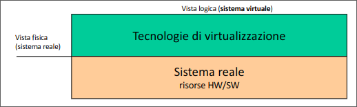

- **Obiettivo**: disaccoppiare il comportamento delle risorse di un sistema di elaborazione offerte all’utente dalla loro realizzazione fisica.

Le risorse virtualizzate appaiono all'utente con caratteristiche in generale diverse e indipendenti da quelle reali

- **Esempio**: macchine virtuali, che permettono l'esecuzione di sistemi operativi indipendenti su uno stesso hardware.

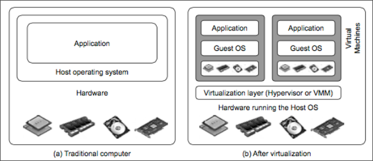

## Esempi di Virtualizzazione

1. **Virtualizzazione a livello di processo**: I sistemi multitasking permettono l'esecuzione contemporanea di più processi, ognuno dei quali dispone di una VM dedicata.
2. **Virtualizzazione della memoria**: In presenza di memoria virtuale, ogni processo vede uno spazio di indirizzamento di dimensioni indipendenti dallo spazio fisico effettivamente a disposizione.

La virtualizzazione è realizzata dal kernel de SO. Il kernel crea un'astrazione delle risorse fisiche e le rende disponibili ai processi.

- **Astrazione**: in generale un oggetto astratto (risorsa virtuale) è la rappresentazione di un oggetto fisico (risorsa reale):
  - esibisce le proprietà significative per l'utilizzatore
  - nasconde i dettali realizzativi non necessari.
  
> **EG**: tipi di dato vs. rappresentazione binaria nella cella di memoria.

Il disaccoppiamento è realizzato dalle operazioni () con le quali è possibile utilizzare l'oggetto

- **Linguaggi di Programmazione**: La capacità di portare lo stesso programma su architetture diverse è possibile grazie alla definizione di una macchina virtuale in grado di interpretare ed eseuguire ogni istruzione del linguaggio, indipendentemente dall'architettura del sistema.
  - Interpreti
  - compilatori

La virtualizzazione è una forma di astrazione. Nasconde i dettagli fisici e mostra solo le proprietà rilevanti.  
Esempi:
- I tipi di dato nei linguaggi di programmazione (es. il tipo `int` in C) sono un'astrazione della rappresentazione binaria nelle celle di memoria.
- La **Java Virtual Machine** è una macchina virtuale che consente di eseguire codice Java indipendentemente dall'hardware.

## Emulazione

L'emulazione consente l'esecuzione di programmi compilati per un'architettura in particolare su un sistema di elaborazione dotato di un diverso insieme di istruzioni.
Le istruzioni della vecchia architettura vengono emulate su una nuova.

- **Vantaggi**: permette l'esecuzione di sistemi operativi e applicazioni su hardware diverso.
- **Svantaggi**: riduzione delle prestazioni.

- L'approccio dell'emulazione ha seguito nel tempo due stade:
  - Interpretazione
  - ricompilazione dinamica
  
> **Curiosità**: QEMU è un esempio famoso di emulatore, originariamente nato per emulare processori x86 su Linux.

## Interpretazione

Il modo più diretto per emulare è l'**interpretazione**, in cui ogni istruzione della macchina ospitata viene tradotta in tempo reale in istruzioni per la macchina host.

Presenta grande flessibilità perchè consente di emulare i meccanismi propri delle varie architetture.
Normalemente sono utilizzate parti di memoria per salvare il contenuto dei registri della CPU emulata, registri che potrebbero non essere presenti nella CPU emulante.

Produce un sovraccarico generalmente elevato poichè possono essere necessarie molte istruzioni dell'host per interpretare una singola istruzione sorgente.

## Compilazione Dinamica

La **compilazione dinamica** traduce blocchi di codice dell'architettura ospitata in codice eseguibile per l'architettura host, migliorando le prestazioni rispetto all'interpretazione.

- **Vantaggio**: maggiori prestazioni rispetto all'interpretazione poichè il codice viene tradotto e ottimizzato.
- **Tecniche**: bufferizzazione dei blocchi di codice usati frequentemente per evitare traduzioni ripetute.

Viene utilizzata dagli emulatori più noti (QEMU, Virtual PC, Mame).

## Livelli di virtualizzazione

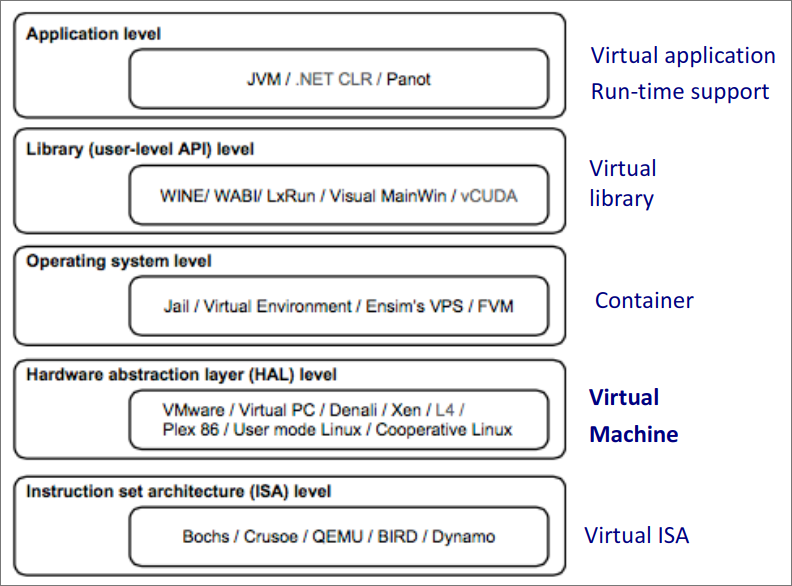

## Macchine Virtuali

Le **macchine virtuali (VM)** sono ambienti isolati che condividono lo stesso hardware fisico. Ogni VM ha un proprio sistema operativo ed è gestita da un **Virtual Machine Monitor (VMM)** o **hypervisor**.

- **VMM**: garantisce l'isolamento delle VM e la stabilità del sistema.

### Esempi di VMM:
- **Xen**: open source, usa la paravirtualizzazione per ottimizzare le performance.
- **VMware ESX**: supporta la virtualizzazione su hardware x86 con supporto nativo.

> **Curiosità**: Xen è stato sviluppato presso l'Università di Cambridge ed è oggi parte integrante di molte soluzioni di cloud computing.

## Vantaggi della Virtualizzazione

- **Uso di più S.O.**: consente di eseguire più sistemi operativi su una singola macchina fisica.
- **Isolamento**: ogni VM è indipendente dalle altre, utile per testing e sicurezza.
- **Consolidamento hardware**: riduce i costi di hardware e manutenzione centralizzando le risorse.
- **Facilità di gestione**: le VM possono essere facilmente create, migrate tra server fisici, o sospese/riprese.

# Realizzazione del VMM

In generale, il VMM deve offrire alle diverse macchine virtuali le risorse che sono necessarie per il loro funzionamento:
- CPU
- Memoria
- Dispositivi di I/o

**Reqisiti**:
- Ambiente di eseczione per i programmi identico a quello della macchina reale (programmi che eseguono sulla architettura non virtualizzata possono essere eseguiti nelle VM senza modifiche).
- Garantire efficienza nell'esecuzione dei programmi (il VMM deve permettere l'esecuzione diretta delle istruzioni impartite dalle macchine virtuali).
- Garantire stabilità e sicurezza del sistema (il VMM deve rimanere sempre nel pieno controllo delle risorse HW, i programmi in esecuzione nelle VM non possono accedere all'HW in modo privilegiato). 

## Parametri e classificazione

- **Livello di collocazione del VMM**:
  - **VMM di sistema**: eseguono direttamente sopra l'HW dell'host.
    > **Esempio**: VMware ESX, xen, kvm
  - **VMM ospitati**: eseguiti come applicazioni sopra un S.O.
    > **Esempio**: VirtualBox, parallels
- **Modalità di dialogo** per l'accesso alle risorse fisiche tra VM e VMM
  - **Virtualizzazione Pura**: le macchine virtuali usano la stessa interfaccia della architettura fisica.
    > **Esempio**: VMware
  - **Paravirtualizzazione**: il VMM presenta una interfaccia diversa da quelle dell'architettura HW.
    > **Esempio**: Xen

In un VMM di sistema le funzionalità di virtualizzazione vengono integrate in un sistema operativo leggero posto direttamente sopra l'HW della macchina host.
È necessario corredare il VMM di tutti i driver necessari per pilotere le periferiche.

## VMM di Sistema

- **Host**: piattaforma di base sulla quale si realizzano le VM. Comprende macchina fisica e VMM.
- **Guest**: macchine virtuali che eseguono sopra il VMM. Comprende applicazioi e SO

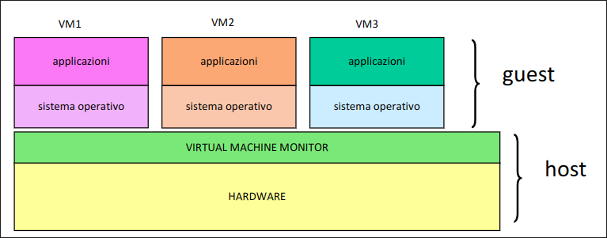

## VMM Ospitato

Il VMM viene installato come una applicazione sopra a un SO esistente.
Il VMM opera nello spazio utente e accede all'HW tramite le system call del SO su cui è installato

- Installazione più semplice
- Può fare riferimento al SO sottostante per la gestione delle periferiche e utilizzare alti servizi del SO.
- Prestazioni inferiori rispetto ai VMM di sistema

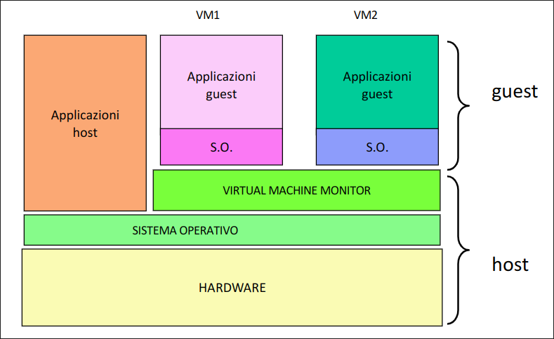

# Ring di Protezione

L'architettura della CPU prevede almeno due livelli di protezione (**ring**):
- supervisore (kernel). **LIVELLO 0**
- utente. **LIVELLO > 0**

Ogni ring corrisponde a una diversa modalità di funzionamento del processore.
- a livello 0 è possibile eseguire le istruzioni privilegiate della CPU
- nei ring di livello superiore le istruzioni privilegiate non possono essere eseguite

Vi sono programmi progettati per eseguire nel ring 0, ad esempio il Kernel del SO

# Realizzazione VMM

In un sistema virtualizzato il VMM deve essere l'unica componente in grado di mantenere il controllo completo dell'hardware.

> solo il VMM opera nello stato di supervisore, mentre il sistema operativo e le applicazione eseguono inun ring di livello superiore.

## Problemi: Ring deprivileging

**ring deprivileging**: il sistema operativo della VM esegue in un ring che non gli è proprio (esecuzione di system call).

Le istruzioni privilegiate richieste dal sistema operativo nell'ambiente guest non possono essere eseguite (richiederebbero il ring 0 e il kernel della VM esegue a livello superiore).

### Possibile soluzione: trap & emulate

Se il guest tenta di eseguire una istruzione privilegiata:

- La CPU notifia un'eccezione al VMM (**trap**) e gli trasferisce il controllo
- il VMM controlla la correttezza dell'operazione richiesta e ne emula il comportamento (**emulate**).

## Problemi: Ring compression

se i ring utilizzati sono solo 2, applicazioni e sistema operativo della VM eseguono allo stesso livello (scarsa protezione tra spazio del sistema operativo e delle applicazioni)

### Possibile soluzione: ring di protezione aggiuntivi

Aggiungere ulteriori livelli di protezione per garantire la separazione tra sistema operativo e applicazioni.

## Supporto HW alla virtualizzazione

L'architettura della CPU si dice naturalmente virtualizzabile se prevede l'invio di trap allo stato supervisore per ogni istruzione privilegiata invocata da un livello di protezione diverso dal supervisore.

Se l'architettura della CPU è naturalmente virtualizzabile:

- la realizzazione del VMM è semplificata:
  - per ogni trap generato dal tentativo di esecuzione di istruzione privilegiata dal guest viene eseguita una routine di emulazione (trap & emulate).
  - Supporto nativ all'esecuzione diretta.

**Problema**: non tutte le architetture sono naturalmente virtualizzabili
> **Esempio**: Intel IA32

Alcune istruzioni privilegiate di questa architettura invocate a livello user non provocano una trap, ma:

- vengono ignorate non consentendo quindi l'intervento trasparente del VMM
- in alcuni casi provocano il crash del sistema

**Problema**: Ring Aliasing

Alcune istruzioni non privilegiate, eseguite in modo user, permettono di accedere in lettura ad alcuni registri la cui gestione dovrebbe essere riservata al VMM portando a possibili inconsistenze.

> **Esempio**: registro CS che consente il livello di privilegio corrente (CPL)

## Realizzazione del VMM in architetture non virtualizzabili

Se il processore non fornisce alcun supporto alla virtualizzazione, è necessario ricorrere a soluzioni software.

### Soluzione: Fast binary translation

Il VMM scansiona dinamicamente il codice dei SO guest prima dell'esecuzione per sostituire a run time i blocchi contenenti istruzioni privilegiate in blocchi equivalenti dal punto di vista funzionali e contenenti chiamate al VMM.

- I blocchi tradotti sono eseguiti e conservati in cache per eventuali riusi futuri (e.g. Vmware).

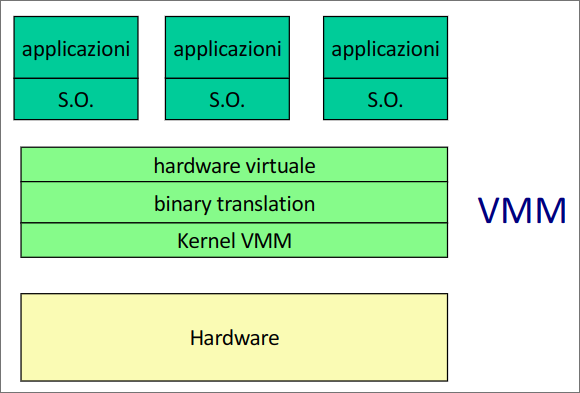

- **Pro:** ogni macchina virtuale è una esatta replica della macchina fisica
  - possibilità di installare gli stessi SO di architetture non virtualizzate (virtualizzazione pura)
- **Contro:** la traduzione dinamica è costosa.
  
### Soluzione: Paravirtualizzazione

Il VMM offre al sistema operativo guest una interfaccia virtuale alla quale i sistemi operativi guest devono riferirsi per aver accesso alle risorse:

- per ottenere un servizio che richiede l'esecuzione di istruzioni privilegiate non vengono generate interruzioni al CMM, ma viene direttamente invocata la hypercall corrispondente.
- I kernel dei sistemi operativi guest devono quindi essere modificati per aver accesso all'interfaccia del particolare VMM
- La struttura del VMM è semplificata perchè non deve più preoccuparsi di tradurre dinamicamente i tentativi di operazioni privilegiate dei Sistemi operativi guest

> **Esempio**: xen

- **Pro**: prestazioni migliori rispetto a fast binary translation
- **Contro**: necessità di porting dei sistemi operativi guest, soluzione preclusa a molti sistemi proprietari non open source.

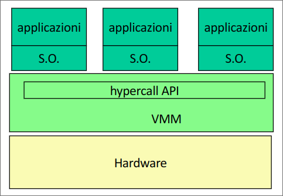

# Architetture Virtualizzabili

L'uscita sul mercato di processori con supporto nativo alla virtualizzazione (Intel VT e AMD-V) ha dato l'impulso allo sviluppo di VMM semplificati basati su virtualizzazione pura:

- **no ring compression/aliasing**: il sistema operativo guest esegue in un ring separato da quello delle applicazioni
- **Ring deprivileging**: ogni istruzione privilegiata richiesta dal sistema operativo guest genera un trap gestito dal VMM

**Pro:**

- **efficienza**: non c'è bisogno di binary translation
- **trasparenza**: L'API presentata dall'hypervisor è la stessa offerta dal processore.

> **Esempi:**
> 
> **Xen e Vmware**: hanno rilasciato versioni compatibili con supporto nativo alla virtualizzazione.
> 
> **Kvm**: modulo di virtualizzazione integrato nel kernel linux.

# Gestione di VM

Compito fondamentale del VMM è la gestione delle macchine virtuali

- Creazione
- Spegnimento/Accensione
- Eliminazione
- Migrazione live

## Stati di una VM

Una macchina virtuale può trovarsi nei seguenti stati:

- **Running**: la macchina è accesa e occupa memoria della ram del server sul quale è allocata
- **Inactive**: la macchina è spenta ed è rappresentata nel file system tramite un file immagine
- **Paused**: la macchina virtuale è in attesa di un evento.
- **Suspended**: la macchina virtuale è stata sospesa dal VMM, il suo stato e le risorse utilizzate sono salvate nel file system. L'uscita dallo stato di sospensione avviene tramite resume da parte del VMM.
  
**Diagramma degli stati**

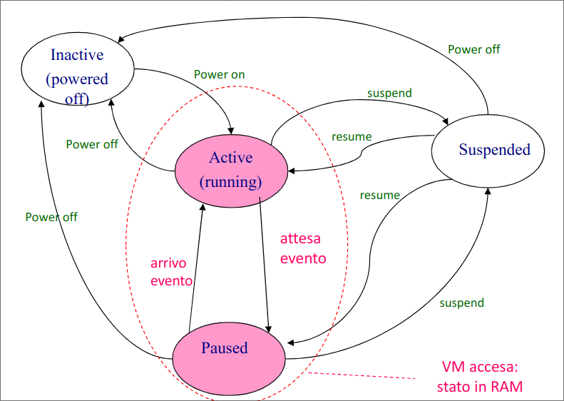

## Migrazione di VM

In datacenter di server virtualizzati è sempre più sentita la necessità di una gestione agile delle VM per fare fronte a:

- Veriazioni dinaimce del carico: load balancing, consolidamento
- Manutenzione "online" dei server
- Gestione finalizzata al risparmio energetico
- Tolleranza ai guasti/disaster recovery

In tutti questi asi la possibilità di muovere VM tra server è un meccanismo fondamentale per la soluzione.

Le macchine virtuali possono essere spostate da un server fisico a un altro senza essere spente.

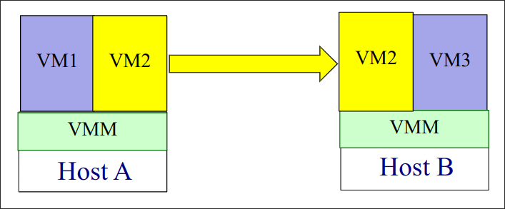

### Suspend / Resume

Il VMM può mettere in stand by una VM tramite l'operazione suspend: lo stato della macchina viene salvato inmemoria secondaria.

Una VM suspended può riprendere l'esecuzione a partire dallo stato in cui si trovava quando è stata sospesa tramite l'operazione resume. Lo stato salvato viene ripristinato in memoria centrale.

> Poichè una VM è quasi completamente indipendente dal server fisico su cui è allocata la resume può avvenire su un nodo diverso da quello in cui era prima della sospensione.

### Realizzazione della live migration

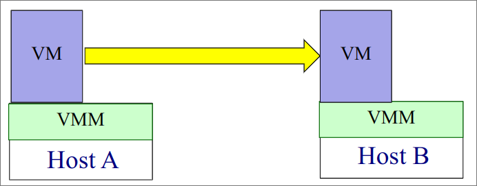

È desiderabile minimizzare:

- **Downtime**
- **Tempo di migrazione**
- **Consumo di banda**
  
> Se il file system è condiviso tra A e B non c'è bisogno di copiare il file immagine.

#### Soluzione: Precopy

La migrazione viene realizzata in 6 passi:

1. **Pre-migrazione**: individuazione della VM da migrare e dell'host di destinazione
2. **Reservation**: Viene inizializata un VM container sul server di destinazione
3. **Pre-copia iterativa delle pagine**: viene eseguita una copia nell'host B di tutte le pagine allocate in memoria sull'host A per la VM da migrare. Successivamente vengono iterativamente copiate da A a B tutte le pagine modificate fino a quando il numero di dirty pages è inferiore a una soglia data
4. **Sospensione della VM e copia dello stato + dirty pages**: da A a B
5. **Commit**: la VM viene eliminata dal server A
6. **Resume**: la VM viene attivata nel server B

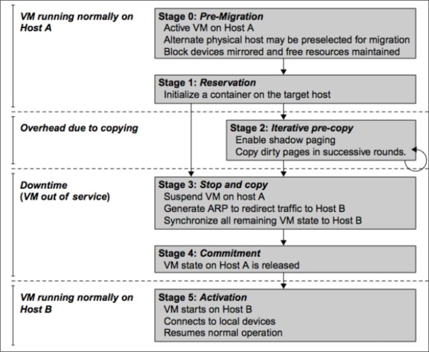

**Precopy: risultati sperimentali**

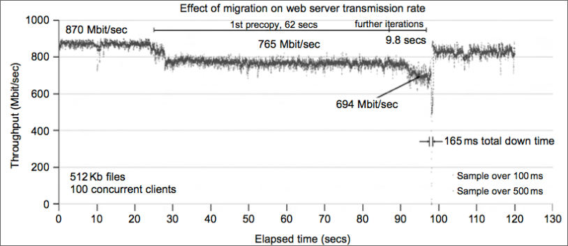

In alternativa a precopy si può fare **post copy**:
la macchina virtuale viene sospesa e vengono copiate pagine e stato. Tempo di migrazione più basso ma downtime molto più elevato.

# XEN

## Architettura di Xen

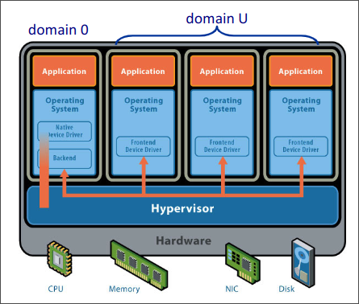

## Organizzazione

## Realizzazione

## Caratteristiche

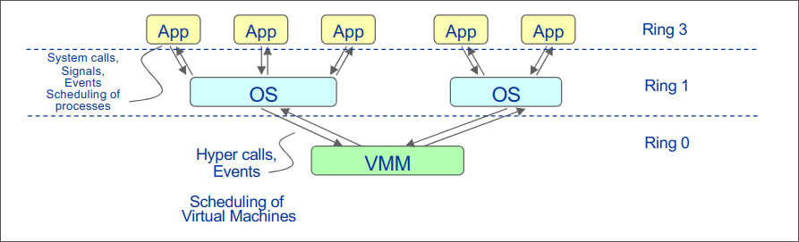

## Gestione della memoria e paginazione

## Protezione

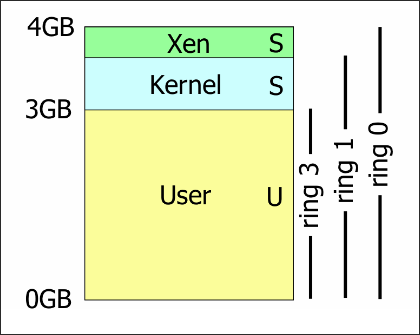

## Gestione della memoria

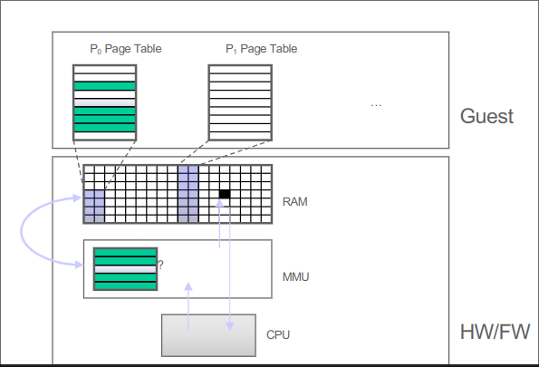

## Creazione di un processo

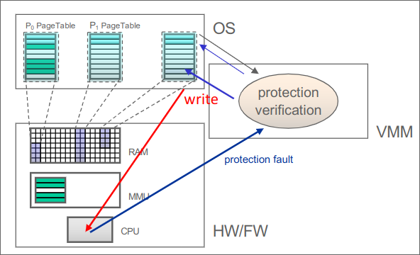

Ecco un paragrafo di riepilogo per ciascuna delle slide a partire dalla 57 riguardanti Xen.

---

**Slide 57: Xen**  
Xen è un VMM open-source basato su paravirtualizzazione, sviluppato dall'Università di Cambridge nel 2003. Utilizza una API chiamata hypercall per la gestione delle risorse e necessita di una modifica del kernel del sistema operativo guest. Xen è utilizzato da molte distribuzioni Linux e Citrix ne ha acquisito i diritti nel 2007 per utilizzarlo nelle proprie soluzioni di virtualizzazione e cloud.

---

**Slide 58: Architettura di Xen**  
L'architettura di Xen include un componente chiamato "domain 0" o "dom0", che è una VM speciale per la gestione e il controllo del sistema. Dom0 è l'unico dominio che può interagire direttamente con l’hypervisor, mentre gli altri domini (domU) operano come VM standard. Questa architettura separa i meccanismi dalle politiche di gestione delle risorse.

---

**Slide 59: Xen - Realizzazione**  
Xen supporta la virtualizzazione di CPU, memoria e I/O per ogni dominio. L'hypervisor gestisce l’allocazione e la divisione delle risorse tra i vari domini. Xen utilizza paravirtualizzazione per permettere alle VM di accedere direttamente alle istruzioni non privilegiate mentre le operazioni privilegiate sono gestite tramite hypercalls.

---

**Slide 60: Xen – Caratteristiche**  
Xen si basa sulla paravirtualizzazione: le macchine virtuali guest eseguono direttamente le istruzioni non privilegiate, mentre le istruzioni privilegiate vengono processate attraverso hypercalls. L’architettura x86 colloca i sistemi operativi guest nel ring 1, mentre l'hypervisor Xen risiede nel ring 0, garantendo una protezione multilivello.

---

**Slide 61: Xen – Gestione della memoria**  
I sistemi operativi guest in Xen gestiscono la memoria virtuale attraverso tradizionali politiche di paginazione. Xen utilizza shadow page tables per mappare la memoria fisica, proteggendo l’accesso in scrittura da parte dei kernel guest, e permette aggiornamenti solo validati dal VMM per garantire la sicurezza.

---

**Slide 62: Protezione in Xen**  
Xen implementa una divisione della memoria virtuale per separare Xen e il kernel dei guest. Questo approccio consente una protezione efficace senza necessitare di un flush TLB per ogni hypercall, incrementando l’efficienza della gestione della memoria.

---

**Slide 63: Xen – Gestione della memoria e balloon process**  
Xen introduce un processo chiamato "balloon process" per gestire dinamicamente la memoria, chiedendo ai guest di liberare pagine in caso di necessità. Questo processo consente al VMM di ottimizzare la distribuzione della memoria e supportare l’attivazione di nuove VM in modo efficiente.

---

**Slide 64: Xen – Virtualizzazione della CPU**  
Xen fornisce un'architettura virtuale della CPU in cui le istruzioni privilegiate vengono sostituite da hypercalls. L'hypervisor gestisce lo scheduling delle VM attraverso l’algoritmo Borrowed Virtual Time, che consente una gestione efficiente delle risorse e una schedulazione temporale adatta anche a sistemi real-time.

---

**Slide 65: Xen – Virtualizzazione dell'I/O**  
Xen adotta una struttura I/O basata su driver di tipo back-end e front-end. I driver back-end risiedono nel dom0 e gestiscono direttamente i dispositivi hardware, mentre i driver front-end nelle VM guest accedono ai dispositivi tramite comunicazione asincrona con il back-end, assicurando isolamento e portabilità.

---

**Slide 66: Xen – Gestione delle interruzioni e delle eccezioni**  
Xen virtualizza la gestione delle interruzioni con un vettore che punta direttamente alle routine del kernel guest. La gestione delle page-fault richiede il coinvolgimento dell'hypervisor per l'accesso al registro CR2, necessario per il corretto funzionamento del sistema.

---

**Slide 67: Xen – Gestione del page-fault**  
In caso di page-fault, l’handler di Xen nel ring 0 legge il contenuto del registro CR2 e lo trasferisce a una variabile nel guest, garantendo il corretto accesso a tale informazione. Successivamente, il controllo ritorna al guest, che può completare la gestione del page-fault in sicurezza.

---

**Slide 68: Xen – Migrazione live**  
La migrazione live delle VM in Xen è gestita attraverso una migrazione basata su pre-copy. Un demone in dom0 esegue il comando di migrazione, trasferendo le pagine in modo iterativo e comprimendo i dati per minimizzare l'occupazione di banda, mantenendo attiva la VM durante il trasferimento.