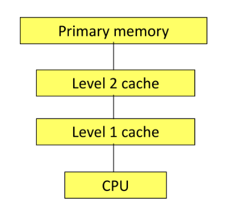
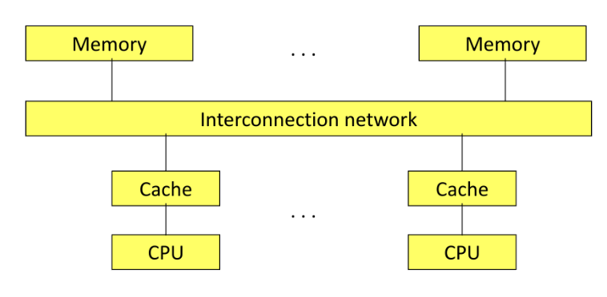
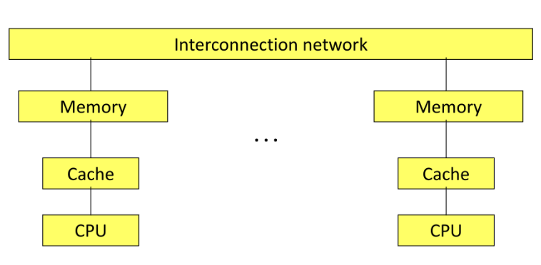
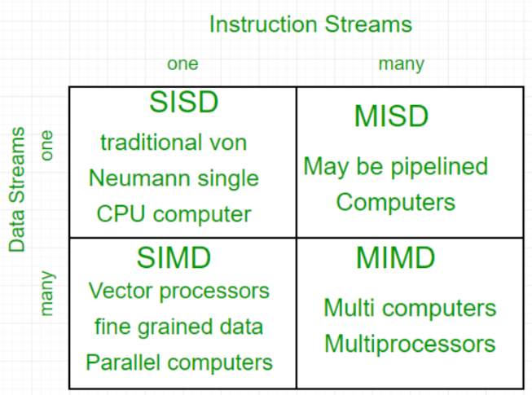
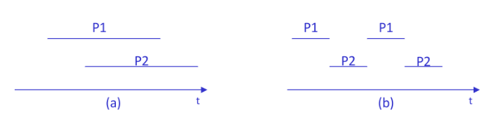

# Programmazione Concorrente

[Return](./README.md)

---

# Indice

- [Introduzione](#00-introduzione)
- [Tipi di architettura](#tipi-di-architettura)
  - [Single Processor](#single-processor)
  - [Shared Memory Multiprocessor](#shared-memory-multiprocessor)
  - [Sistemi Multiprocessore](#sistemi-multiprocessore)
  - [Distributed Memory Multiprocessor](#distributed-memory-multiprocessor)


---

## [[00.Introduzione]]

La programmazione concorrente è l'insieme delle tecniche, metodologie e strumenti per il supporto all'esecuzione di sistemi software composti da insiemi di attività svolte simultaneamente.

## Tipi di architettura:

### Single Processor



### Shared Memory Multiprocessor



Memoria interconnessa, ogni CPU può accedere ad ogni parte della ram.

## Sistemi Multiprocessore

**Classificazione**

- **UMA** (Uniform Memory Access) : Numero ridotto di processori, tempo di accesso alla memoria uniforme tra le CPU, una qualsiasi CPU una qualsiasi locazione di memoria.
- **NUMA** (Non Uniform Memory Access) : Ogni CPU ha parti di memoria vicine e lontane, la rete delle memorie è divisa gerarchicamnte per decongestionare il mezzo di connessione tra CPU e RAM.

### Distributed Memory Multiprocessor



Ogni CPU ha la sua memoria privata, mentre prima la memoria era condivisa.

**Due tipi**
- **MultiComputer**: nodi semplici (CPU, CACHE, RAM) e fisicamente vicini, in una stessa struttura interconnessi (CLUESTER, MASSIVELY PARALLEL COMPUTER).
- **Networks Systems**: nodi più complessi e fisicamente distanti

Oggi si hanno nodi con architettura multiprocessori, connessi tra loro con distributed memory.

## [[0.0_Introduzione]]

- **parallelismo a livello di istruzioni**
- **parallelismo a livello di dati**



- **SISD** (Single Instruction Single Data)
- **SIMD** (Single Instruction Multiple Data)
- **MISD** (Multiple Instruction Single Data)
- **MIMD** (Multiple Instruction Multiple Data)

## Tipi di Applicazioni

- **Multithreaded**: applicazioni strutturate come un insieme id processi
- **Multitasking/Distribuiti**: Le componenti dell'applicazione (task), sono eseguiti su nodi diversi
- **Parallele**: Eseguite su architetture ad elevato parallelismo, forte accoppiamento tra HW e SW a differenza delle altre due, è importante conoscere l'architettura HW per scrivere il SW. 

## Elaborazione non sequenziale

Necessaria per l'esecuzione di un processo non sequenziale

- **Elaborazione non sequenziale**: ovvero in grado di eseguire più operazioni contemporaneamente:



- Sistemi mutliprocessore VS sistemi monoprocessore (parallelismo gestito via SW)

-**Linguaggio di programmazione non sequenziale**: caratterizzato da una diversa granularità, ovvero la dimensione minima dell'unità di esecuzione.

## Interazione tra processi

Possibili forme di interazione tra processi concorrenti:

- **Cooperazione**: forma di interazione prevista e desiderata tradotto in scambio di infomrazioni tra processi
- **Competizione**: Interazione non desiderata, coordinamento dei processi nell'accesso a risorse condivise. Necessari meccaniscmi per regolare la competizione.
- **Interferenza**: Interazione causata da errori di programmazione, e.g. Deadlock

## Linguaggi per la programmazione concorrente

- Contengono costrutti per esprimedere moduli di programmi da eseguire come processi sequenziali distinti
- Contiene la possibiltà di esprimere quando un processo va attivato e terminato
- Contiene gli strumenti per specificare le interazioni tra i vari processi

## Architettura di una macchina concorrente

Non sempre la macchina su cui si esegue ha tante unità di elaborazione quanti sono i processi, necessarie quindi tecniche software che simulino una meccanica astratta con abbastanza core.

Un kernel deve contenere:
- Meccanismo di multiprogrammazione, che gestisce le unità di elaborazioni reali, ovvero lo scheduling
- Meccanismo di comunicazione e sincronizzazione
  
## Costrutti Linguistici per la concorrenza

- **Modello Fork-Join**: ```Fork```: creazione processo, ```Join```: padre si sincronizza con la terminazione del figlio.
- **Modello Cobeing-Coend**: Quando viene chiamata ```Cobeing``` tutto il flusso sequenziale diventa parallelo o concorrente, il padre si divide in N figli. ```Coend``` termina il parallelismo.
- **Fork** più generale e granulare, può esprimere un qualcunque grafo di precedenza che descrive un processo non sequenziale.

## Proprietà dei programmi

L'obiettivo di ogni progetto software è il controllo della sua correttezza

- **Stato**: Insieme dei valori delle variabili di un programma e dei registri della CPU.
- **Traccia dell'esecuzione**: Sequenza di stati attraversati dall'elaboratore durante l'esecuzione di un programma
  
- **Programmi sequenziali**: Ogni esecuzione di un programma P su dati D genera sempre la stessa traccia. La verifica della correttezza del programma può essere effettuata con il debugging
- **Programma concorrenti**: L'esecuzione di un programma P sugli stessi dati D può dare tracce diverse. Il debug su poche esecuzioni non da la certezza della correttezza.

### Classificazione

- **Proprietà Safety**: Garantisce che durante l'esecuzione di un porgramma non si entra mai in uno stato errato.
- **Proprietà liveness**: Garantisce che prima o poi durante l'esecuzione si entrerà in uno stato corretto.

