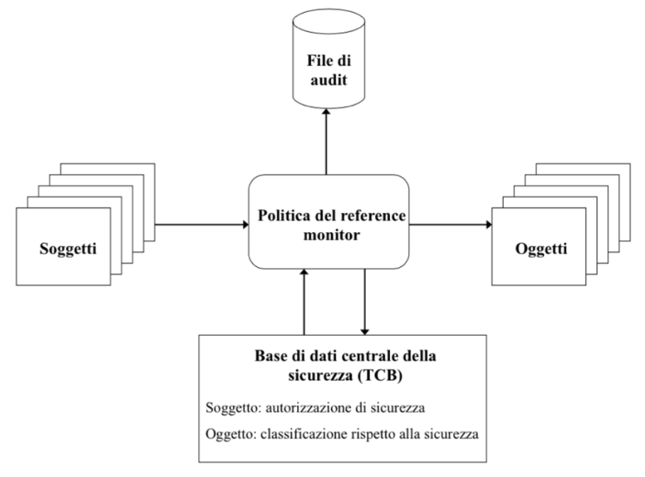

# Protezione nei Sistemi Operativi

[Return](./SistemiOperativi.md)

---

# Indice

- [Protezione nei Sistemi Operativi](#protezione-nei-sistemi-operativi)
- [Indice](#indice)
  - [Protezione e Sicurezza](#protezione-e-sicurezza)
    - [Sicurezza:](#sicurezza)
    - [Protezione:](#protezione)
  - [Modelli](#modelli)
  - [Politiche](#politiche)
    - [Classificazione delle politiche:](#classificazione-delle-politiche)
    - [Principio del privilegio minimo](#principio-del-privilegio-minimo)
  - [Meccanismi](#meccanismi)
    - [Principi di realizzazione](#principi-di-realizzazione)
  - [Dominio di protezione](#dominio-di-protezione)
    - [Domini disgiunti o domini con diritti di accesso in comune](#domini-disgiunti-o-domini-con-diritti-di-accesso-in-comune)
  - [Associazione tra processo e dominio](#associazione-tra-processo-e-dominio)
    - [Statica](#statica)
    - [Dinamica](#dinamica)
      - [Cambio di dominio esempio](#cambio-di-dominio-esempio)
  - [Matrice degli accessi](#matrice-degli-accessi)
  - [Meccanimsi](#meccanimsi)
    - [Verifica del rispetto dei vincoli di accesso:](#verifica-del-rispetto-dei-vincoli-di-accesso)
    - [Modifica dello stato di protezione](#modifica-dello-stato-di-protezione)
    - [Modello di Graham-Denning](#modello-di-graham-denning)
      - [Propagazione dei diritti di accesso](#propagazione-dei-diritti-di-accesso)
      - [Diritto Owner](#diritto-owner)
      - [Diritto Control](#diritto-control)

## Protezione e Sicurezza

### Sicurezza:

Riguarda l'insieme delle **tecniche per regolamentare l'accesso** degli utenti al sistema di elaborazione. La sicurezza impedice accessi non autorizzati al sistema e i conseguenti tentativi dolosi di alterazione e distruzione dei dati.

Le tecnologie di sicurezza di un sistema informatico realizzano meccanismi per **l'identificazione, l'autenticazione** e **l'autorizzazione** di utenti "fidati"

### Protezione:

**Insieme di attività volte a garantire il controllo dell'accesso** alle risorse logiche e fisiche da parte degli utenti autorizzati all'uso di un sistema di elaborazione.

Per ogni utente **identificato, autenticato e autorizzato, è necessario stabilire:**
- quali siano le **risorse** alle quali può accedere
- con quali **operazioni** può accedervi

Questo è stabilito dal **sistema di protezione** tramite le tecniche di **controllo degli accessi**.

In un sistema il **controllo degli accessi** si esprime tramite la definizione di **tre** livelli concettuali:
- **modelli**
- **politiche**
- **meccanismi**

## Modelli

Un **modello di protezione** definisce soggetti, oggetti ai quali si soggetti hanno accesso ed i **diritti** di accesso:
- **oggetti** costituiscono la parte **passiva**, cioè le risorse fisiche e logiche alle quali si può accedere e su cui si può operare. 
    > Esempio: file, processi, dispositivi di I/O

- **soggetti** rappresentano la parte attiva di un sistema, cioè le entità che possono richiedere l'accesso alle risorse.
    > Esempio: utenti, processi

- **diritti di accesso** sono le modalità con cui i soggetti possono accedere agli oggetti.

## Politiche

Le **politiche di protezione** definiscono le regole che determinano quali operazioni possono essere eseguite su quali oggetti da parte di quali soggetti.

### Classificazione delle politiche:

- **Discetional Access Control (DAC)**: il proprietario dell'oggetto decide chi può accedervi e con quali diritti.
- **Mandatory Access Control (MAC)**: il sistema decide chi può accedere a quali oggetti e con quali diritti.
- **Role Based Access Control (RBAC)**: l'accesso è basato sui ruoli che un utente può avere all'interno di un sistema.

### Principio del privilegio minimo

Ad ogni soggetto sono garantiti i diritti di accesso solo agli oggetti strettamente necessari per svolgere il proprio compito.
> **POLA** (Principle of Least Authority)

## Meccanismi

I **meccanismi di protezione** sono le procedure e le strutture dati che implementano le politiche di protezione.

### Principi di realizzazione

- **Flessibilità** del sistema di protezione:
    I meccanismi di protezione devono essere sufficientemente generali per consentire l'applicazione di diverse politiche di protezione.

- **Separazione** tra meccanismi e politiche:
    La politica definisce cosa va fatto ed il meccaniscmo come va fatto.
    È desiderabile la massima indipendenza tra le due componenti

## Dominio di protezione

Ad ogni soggetto è associato un dominio che rappresenta l'ambiente di protezione nel quale il soggetto esegue, il dominio specifica i diritti di accesso posseduti dal soggetto nei confronti di ogni risorsa.

Le operazioni vengono svolte da processi che operano per conto di soggetti (a cui sono associati i domini)

Un dominio di protezione è **unico per ogni soggetto**, mentre un processo può eventualmente **cambiare dominio** durante l'esecuzione.

> DEF: Un dominio definisce un insieme di coppie, ognuna contenente l'identificatore di un oggetto e l'insieme delle operazioni che il soggetto associato al dominio può eseguire su ciascun oggetto (diritti di accesso):

$$ D = \{ <o, diritti> | o\  è\  un\  oggetto, diritti\  è\  un\  insieme\  di\ operazioni \} $$

Ogni dominio è associato ad un **soggetto**, il soggetto può accedere solo agli oggetti definiti nel suo dominio, utilizzando i diritti specificati dal dominio.

### Domini disgiunti o domini con diritti di accesso in comune

Possibilità per due o più soggetti di effettuare alcune operazioni comuni su un oggetto condiviso:

Le operazioni vengono svolte da processi che operano per conto di soggetti (a cui sono associati i domini)

In ogni istante della sua esecuzione, il processo esegue in uno ed un solo dominio.

## Associazione tra processo e dominio

### Statica

L'insieme delle risorse disponibili ad un processo rimane fisso durante il suo tempo di vita.

**Osservazioni**:

- L'insieme globale delle risorse che un processo potrà usare può non essere un'informazione disponibile prima dell'esecuzione del processo.
- L'insieme minimo (politica del minimo privilegio) delle risorse necessarie ad un processo cambia dinamicamente durante l'esecuzione.

> L'associazione statica non è adatta nel caso si voglia limitare per un processo l'uso delle risorse a quello strettamente necessario (privilegio minimo)

### Dinamica

Associazione tra processo e dominio varia durante l'esecuzione del processo.

In questo modo si può mettere in pratica il principio del privilegio minimo, in ogni fase della sua esecuzione il processo acquisisce diritti diversi (solo quelli necessari).

- Occorre un meccanismo per consentire il passaggio da un dominio all'altro del processo.

#### Cambio di dominio esempio

**Standard dual mode** (kernel mode e user mode)

- Cambio di dominio associato alle system call: quando un processo deve eseguire un'istruzione privilegiata avviene un cambio di dominio.

Non realizza la protezione tra utenti ma solo tra kernel e utente.

## Matrice degli accessi

Un sistema di protezione può essere rappresentato a livello astratto utilizzando la matrice degli accessi.

- Ogni riga è associata ad un soggetto (riga=dominio)
- Ogni colonna è associata ad un oggetto

La matrice consente di rappresentare il modello e le politiche valide nel sistema considerato, specificando:

- Soggetti
- Oggetti
- Diritti accordati ai soggetti sugli oggetti
  
Le informazioni contenute nella matrice possono variare nel tempo per effetto di operazione che ne consentono la modifica: (creazione di nuovi soggetti, creazione di nuovi oggetti, modifica dei diritti di accesso)

Le infomrazioni contenute nella matrice all'istante t rappresentano lo stato del sistema di protezione in quel momento.

La matrice degli accessi offre ai meccanismi di protezione le informazioni che consentono di verificare il rispetto dei vincoli di accesso.

## Meccanimsi

Il meccanismo:

- ha il compito di verificare se ogni richiesta di accesso che proviene da un processo che opera in un determinato dominio è consentita oppure no.
- Autorizza l'esecuzione delle richieste consentite e impedisce quelle vietate.
- Esegue la modifica (in modo controllato) dello stato di protezione in seguito ad ogni richiesta autorizzata da parte di un processo.

### Verifica del rispetto dei vincoli di accesso:

Il meccanismo consente di assicurare che un processo che opera nel dominio $D_i$ può accedere solo agli oggetti specificati nella riga $i$ e solo con i diritti di accesso indicati.

Quando un'operazione $M$ deve essere eseguita nel dominio $D_i$ sull'oggetto $O_j$ il meccanismo verifica che l'operazione $M$ sia consentita dal diritto di accesso specificato nella cella $access(i,j)$ della matrice degli accessi.

In caso affermativo l'operazione può essere eseguita. In caso negativo si ha una situazione di errore.

### Modifica dello stato di protezione

Chi può modificare lo stato di protezione?

-**MAC (Mandatory Access Control)**: il sistema decide chi può modificare lo stato di protezione, entità centrale.
-**DAC (Discretionary Access Control)**: il proprietario dell'oggetto può modificare lo stato di protezione.

### Modello di Graham-Denning

Il modello di Graham-Denning è un modello di protezione che definisce un insieme di regole per la protezione delle risorse di un sistema.

**8 Primitive:**

1. create object
2. delete object
3. create subject
4. delete subject
5. read access right
6. grant access right
7. delete access right
8. transfer access right

creazione, eliminazione di righe e colonne (1,2,3,4).
Modifica dei diritti di accesso, cancellazione e propagazione (5,6,7,8).

#### Propagazione dei diritti di accesso

La possibilità di copiare un diritto di accesso per un oggetto da un dominio ad un altro della matrice di accesso è indicato un un asterisco (*), (copy flag):

- Un soggetto $S_i$ può trasferire un diritto di accesso $\alpha$ per un oggetto $X$ ad un altro soggetto $S_j$ solo se $S_i$ possiede il diritto di accesso $\alpha$ per l'oggetto $X$, e $\alpha$ ha il copy flag.

#### Diritto Owner

Assegnazione di un qualunque diritto di acesso su un oggetto $X$ ad un qualunque soggetto $S_j$ da parte di un soggetto $S_i$.

L'operazione è consentita solo se il diritto OWNER appartiene a $A[S_i,X]$.

#### Diritto Control

Eliminazione di un diritto di accesso per un oggetto $X$ nel dominio di $S_j$ da parte di $S_i$.

L'operazione è consentita solo se il diritto CONTROL appartiene a $A[S_i,S_j]$. oppure OWNER appartiene a $A[S_i,X]$.

