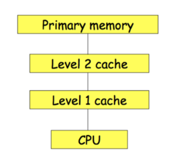
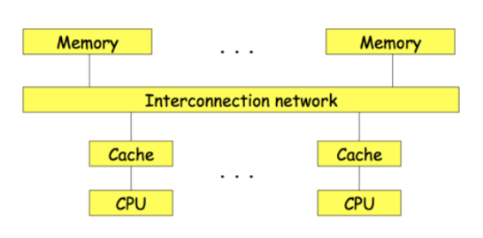
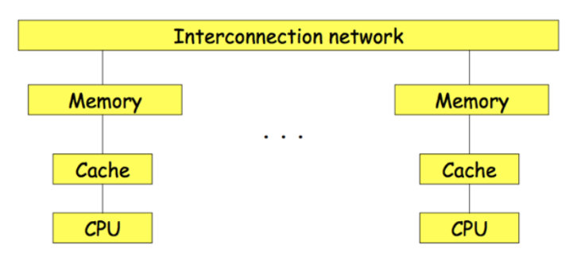
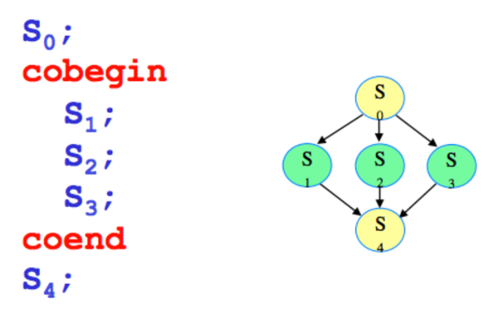

# Sistemi Operativi

# Indice
- [Sistemi Operativi](#sistemi-operativi)
- [Indice](#indice)
  - [Virtualizzazione](#virtualizzazione)
    - [Definizione](#definizione)
    - [Tecnologie di Virtualizzazione](#tecnologie-di-virtualizzazione)
      - [Virtualizzazione di sistema:](#virtualizzazione-di-sistema)
      - [Emulazione:](#emulazione)
        - [Virtual PC:](#virtual-pc)
        - [QEMU:](#qemu)
    - [Realizzazione del VMM:](#realizzazione-del-vmm)
      - [Ring deprivileging:](#ring-deprivileging)
      - [Supporto hardware alla virtualizzazione](#supporto-hardware-alla-virtualizzazione)
      - [Fast Binary Translation](#fast-binary-translation)
      - [Paravirtualizzazione](#paravirtualizzazione)
      - [Protezione nell'architettura x86](#protezione-nellarchitettura-x86)
      - [VMM in x86](#vmm-in-x86)
        - [Problemi del VMM in x86](#problemi-del-vmm-in-x86)
    - [Xen](#xen)
      - [Organizzazione](#organizzazione)
      - [Caratteristiche](#caratteristiche)
        - [Gestione della memoria e paginazione](#gestione-della-memoria-e-paginazione)
        - [Creazione di un processo](#creazione-di-un-processo)
        - [Virtualizzazione della CPU](#virtualizzazione-della-cpu)
        - [Virtualizzazione dell'I/O](#virtualizzazione-dellio)
        - [Gestione interruzioni e eccezioni](#gestione-interruzioni-e-eccezioni)
    - [Gestione VM](#gestione-vm)
      - [Stati di una VM:](#stati-di-una-vm)
      - [Migrazione di VM](#migrazione-di-vm)
  - [Protezione e Sicurezza](#protezione-e-sicurezza)
    - [Modelli di protezione](#modelli-di-protezione)
    - [Politiche](#politiche)
    - [Principio del privilegio minimo](#principio-del-privilegio-minimo)
    - [Dominio di protezione](#dominio-di-protezione)
    - [Associazione tra processo e dominio](#associazione-tra-processo-e-dominio)
    - [Matrice degli accessi](#matrice-degli-accessi)
    - [Modifica dello stato di protezione](#modifica-dello-stato-di-protezione)
    - [Diritti fondamentali](#diritti-fondamentali)
    - [Realizzazione della matrice degli accessi](#realizzazione-della-matrice-degli-accessi)
      - [Access Control List (ACL):](#access-control-list-acl)
      - [Capability List:](#capability-list)
    - [Revoca  dei diritti di accesso](#revoca--dei-diritti-di-accesso)
      - [Revoca per un oggetto e ACL](#revoca-per-un-oggetto-e-acl)
      - [Revoca per un oggetto e Capability List](#revoca-per-un-oggetto-e-capability-list)
        - [ACL vs CL](#acl-vs-cl)
      - [Soluzione mista](#soluzione-mista)
    - [Sicurezza multilivello](#sicurezza-multilivello)
      - [Modelli](#modelli)
        - [Bell-LaPadula](#bell-lapadula)
        - [Biba](#biba)
      - [Reference monitor](#reference-monitor)
  - [Programmazione concorrente](#programmazione-concorrente)
    - [Tipi di archietetture](#tipi-di-archietetture)
    - [Tipi di applicazioni](#tipi-di-applicazioni)
    - [Proocessi non sequenziali](#proocessi-non-sequenziali)
      - [Algoritmo, programma, processo](#algoritmo-programma-processo)
      - [Processi sequenziali e non sequenziali](#processi-sequenziali-e-non-sequenziali)
      - [Interazioni tra processi](#interazioni-tra-processi)
    - [Architetture e linguaggi per la programmazione concorrente](#architetture-e-linguaggi-per-la-programmazione-concorrente)
      - [Proprietà di un linguaggio per la programmazione concorrente](#proprietà-di-un-linguaggio-per-la-programmazione-concorrente)
      - [Architettura di una macchina concorrente](#architettura-di-una-macchina-concorrente)
    - [Costruttu lignuistici per la concorrenza](#costruttu-lignuistici-per-la-concorrenza)
      - [Fork / Join](#fork--join)
      - [Cobeing / Coend](#cobeing--coend)
      - [Processo](#processo)
    - [Realizzazione delle primitive in un sistema a monoprocessore](#realizzazione-delle-primitive-in-un-sistema-a-monoprocessore)
      - [Descrittori dei processi](#descrittori-dei-processi)
      - [Meccanismi realizzati dal Kernel](#meccanismi-realizzati-dal-kernel)
      - [Proprietà dei programmi](#proprietà-dei-programmi)
      - [Definizione di proprietà](#definizione-di-proprietà)
      - [Requisiti](#requisiti)
    - [Modello a memoria comune](#modello-a-memoria-comune)
      - [Gestori di risorse](#gestori-di-risorse)
          - [Classificazione delle risorse](#classificazione-delle-risorse)
        - [Compiti del gestore di una risorsa](#compiti-del-gestore-di-una-risorsa)
        - [Accesso alle risorse](#accesso-alle-risorse)
  - [Strumenti di sincronizzazione](#strumenti-di-sincronizzazione)
    - [Il semaforo](#il-semaforo)
      - [Operazioni P e V](#operazioni-p-e-v)
      - [Proprietà dei semafori](#proprietà-dei-semafori)
      - [Semafori particolari](#semafori-particolari)

## Virtualizzazione

### Definizione

Dato un sistema dotato di Hardware e Software, virtualizzare il sistema significa presentare all'utilizzatore una visione delle risorse del sistema diversa da quella reale. Si ottiene mediante un livello di indirezione tra vista logica e fisica delle risorse.

### Tecnologie di Virtualizzazione

#### Virtualizzazione di sistema:
Introduzione del **VMM** (Virtual Machine Monitor) che si occupa di creare una interfaccia tra una singola piattaforma hardware e software differenti tra di loro.

Il VMM è l'unico mediatore tra hardware e software, garantendo:
- **Isolamento** tra le VM
- Stabilità del sistema

#### Emulazione:
Esecuzione di programmi compilati per un certo **insieme di istruzioni** su un sistema diverso. Vengono emulate interamente le singole istruzioni dell'architettura host.
- **Vantaggi**: interoperabilità tra ambienti diversi
- **Svantaggi**: perdita di prestazioni

2 strade per l'implementazione:
- **Interpretazione**: Grande flessibilità (legge ogni singola istruzione) ma scarsa performance.
- **Compilazione dinamica**: legge il codice a blocchi ottimizzandoli e riutilizzando le parti usate spesso. _Virtual PC, Power PC, QEMU_ utilizzano questa tecnica.

##### Virtual PC:

Virtualizzazione che permette ad un computer con sistema operativo Mac OSX o Windows l'esecuzione di sistemi operativi diversi. Ricrea quasi interamente un ambiente di natura Intel. Destinato all'utilizzo di vecchie applicazioni.

Tool molto vecchio compatibile con i Mac con chip PowerPC, non più utilizzato.

##### QEMU:
Software che permette di ottenere una architettura nuova e disgiunta in un'altra architettura che si occuperà di ospitarla permettendo di eseguire programmi compilati su architetture diverse. È molto veloce.

**Vantaggi della virtualizzazione**:
- uso di più OS sulla stessa macchina fisica
- Ogni macchina virtuale offre un ambiente di esecuzione separato (sandbox)
  - Possibilità di eseguire test
  - Sicurezza: eventuali attacchi sono confinati alla singola VM.
- Consolidamente HW: Più server sullo stesso HW
- Gestione facilitata delle macchine
  - Facile creare nuove macchine virtuali
  - Facile migrare macchine virtuali tra host

### Realizzazione del VMM:
Risorse da offrire:
- CPU
- Memoria
- Dispositivi I/O

**Requisiti e parametri**:

Popek e Goldberg affermano i seguenti **requisiti**:
1. Ambiente di esecuzione identico alla macchina reale
2. Elevata efficienza nell'esecuzione dei programmi
3. Garantire la stabilità e la sicurezza del sistema

**Parametri**:
- **Livello:**
  - **VMM di sistema**: si appoggia direttamente sopra l'hardware della macchina (Xen)
  - **VMM ospitati**: eseguiti come applicazioni su un OS (Parallels, VirtualBox)
- **Modalità di esecuzione:**
  - **virtualizzazione pura**: le macchine virtuali usano la stessa interfaccia dell'hardware (E.g. VMWare utilizza istruzioni macchina per l'hardware su cui è hostato)
  - **paravirtualizzazione**: il VMM ha una interfaccia diversa da quella dell'architettura hardware (E.g. Xen esegue le istruzioni richieste dal VMM)
  
**Realizzazione del VMM di sistema**:
L'architettura  della CPU prevede 2 livelli di protezione (**ring**):
- **Supervisore**: livello 0, ha accesso a tutte le istruzioni e risorse della CPU
- **Utente**: livello 3, ha accesso limitato alle risorse della CPU

**SOLO** il VMM opera a livello 0, L'OS e le applicazioni operano a livello 3.

**Problemi:**
- **ring deprivileging:** l'OS della macchina esegue in uno stato che non è proprio (system calls)
- **ring compression:** se i ring utilizzati sono 2, aplpicazioni e OS della macchina virtuale eseguono allo stesso livello, è necessario proteggere lo spazio tra OS e applicazioni.

#### Ring deprivileging:
Le istruzioni privilegiate non possono essere eseguite (richiederebbero lo stato di supervisore).
**Soluzioni:**
- Se il guest tenta di eseguire una operazione privilegiata, la CPU **notifica una eccezione al VMM** e gli trasferisce il controllo (trap). A questo punto il **VMM controlla la correttezza dell'operazione richiesta** e ne **emula** il comportamento.
- le istruzioni possono essere eseguite direttamente sulla CPU (esecuzione diretta).

#### Supporto hardware alla virtualizzazione
Una architettura CPU si dice **naturalmente virtualizzabile** se prevede l'invio di notifica allo stato supervisore per ogni istruzione privilegiata eseguita da un diverso livello di protezione.
In questo caso la realizzazione del VMM è **semplificata**: per ogni trap viene eseguita una routine di emulazione.
**Non tutte le architetture sono naturalmente virtualizzabili** $\Rarr$ **comportamenti indesiderati o crash del sistema**.

Problema del **ring aliasing**:
Alcune istruzione privilegiate possono modificare dei registri dedicati alla VMM $\Rarr$ **instabilità**.
Se il precessore non supporta nativamente la virtualizzazione è necessario ricorrere a soluzioni software.

**Soluzioni**:
- **Fast Binary Translation**
- **Paravirtualizzazione**

#### Fast Binary Translation
Il VMM scansiona **dinamicamente** il codice degli OS guest prima dell'esecuzione $\Rarr$ sostituirà a run time i blocchi che contengono istruzioni privilegiate in blocchi equivalenti a chiamate al VMM.

- **Vantaggi** la macchina virtuale è una esatta replica della macchina fisica.
- **Svantaggi** traduzione dinamica è costosa.

#### Paravirtualizzazione
Il VMM offre al sistema operativo guest una interfaccia virtuale (hypercall API) con:
- Istruzioi privilegiate verso VMM che le tradurrà al livello sottostante
- I kernel degli OS devono essere modificati per avere accesso all'interfaccia
- VMM semplificata $\Rarr$ no traduzione dinamica delle system call

- **Vantaggi**: prestazioni migliori rispetto a Fast Binary Translation, nessuna traduzione dinamica.
- **Svantaggi**: richiede modifiche al kernel degli OS guest, non è una replica esatta della macchina fisica.

#### Protezione nell'architettura x86
Fino all'80186 x86 non aveva protezione $\Rarr$ sistema guest poteva allocare memoria $\Rarr$ possibili problemi.

Viene introdotto il concetto di protezione $\Rarr$ distinzione tra sistema operativo e applicazioni (possono accedere alla memoria SOLO attraverso il sistema operativo) attraverso il concetto di **ring di protezione**.

**Registro CS**
I due bit meno significativi vengono riservati per rappresentare il **corrente livello di privilegio** (cpl):
- **Ring 0** maggiori privilegi $\Rarr$ Sistema operativo
- **Ring ...**
- **Ring 3** minori privilegi $\Rarr$ Applicazioni

**NON** è permesso a ring diversi dallo 0 di accedere alla CPU

x86 benchè possieda 4 ring di protezione, ne usa solo 2 nella pratica. Gli altri che sono vie di mezzo erano stati pensati per altre parti del sistema operativo ma non sono stati utilizzati quasi mai.

#### VMM in x86
- **Ring deprivileging:** viene dedicato il ring 0 al VMM e il sistema oeprativo vinee messo su ring con privilegi ridotti, si possono verificare 2 casi:
  - VMM su ring 0, OS su ring1, applicazione su ring 3- Non è compatibile con 64bit. L'OS può generare eccezioni che vengono catturate dal VMM.
  - VMM su ring 0, OS e applicazioni su ring 3. Non potendo generare eccezioni, l'OS deve ricorrere ad altri metodi per comunicare con il VMM $\Rarr$ si avvicina alla emulazione.

##### Problemi del VMM in x86

**Ring aliasing**:Paravi
Alcune istruzioni non privilegiate possono modificare registri che non dovrebbero vedere. In x86 a qualsiasi livello è possibile effettuare la chiamata PUSH che permette di salvare il contenuto del registro CS nello stack. In questo modo è possibile per il SO guest mapere su che livello di ring si trova (non 0).

**Mancate eccezioni**:
In x86 esistono alcune istruzioni privilegiate che non lanciano eccezioni se eseguite a ring > 0. Questo rende impossibile l'intervento trasparente del VMM.

### Xen

Xen è un VMM open source che implementa la paravirtualizzazione.

#### Organizzazione
- VMM (hypervisor) si occupa della virtualizzazione della CPU
- Xen dispone di una interfaccia di controllo accessibile solo dal Domain 0 che suddivide le risoerse tra i sistemi guest.
- Nel domain 0 viene eseguita la applicazione che controlla tutta la piattaforma

#### Caratteristiche
- **Paravirtualizzazione:** Sistemi guest eseguono direttamente istruzioni privilegiate, il VMM si occupa di eseguire realmente queste istruzioni.
- **Protezione x86:** I sistemi sono collocati al ring 1, il VMM al ring 0 e le applicazioni al ring 3.

##### Gestione della memoria e paginazione
**Gestione della memoria**:
- memoria virtuale gestita con meccanismi di paginazione normali
- I SO guest si occupano della paginazione ma delegano la scrittura delle page table al VMM
- **Page faults** gestiti direttamente al livello hardware
**Soluzione**: tabelle delle pagine delle VM
- mappate nella memoria fisica del VMM
- non possono essere acceduta in scrittura dai kernel guest ma solo dal VMM
- sono accessibili in modalità read-only anche dai guest
**Memory split**:
- Xen risiede nei primi 64 MB del virtual address space per una maggiore efficienza
- Lo spazio di indirizzamento cirtuale per ogni VM è fatto in modo da contenere xen e il kernel in segmenti separati

##### Creazione di un processo
- Un OS guest richiede una nuova tabella della pagine al VMM
  - Alla tabella vengono aggiunte le pagine relative al segmento Xen
  - **Xen registra la nuova tabella e ne acquisisce il diritto di scrittura esclusiva**
  - Ogni successivo update da parte del guest provocherà un **protection fault** che verrà gestito dal VMM
- Gestione della memoria commune ai sistemi guest attraverso un **balloon process**:
  - su ogni macchina virtuale è in esecuzione un processo che comunica con il VMM.
  - In caso di necessità di nuove pagine, il VMM chiede ad altre VM di liberare memoria:
    - chiede al balloon process di gonfiarsi
    - la VM guest alloca nuove pagine al balloon nprocess che le passerà in seguito al VMM.

##### Virtualizzazione della CPU
- Architettura CPU simile a quella fisica con paravirtualizzazione $\Rarr$ hypercalls
- VMM si occupa dello scheduling delle VM con il Borrowed Virtual Time scheduling algorithm.
- Possiede due clock sinncronizzati tramite:
  - Real-time (sync con il processore)
  - Virtual-time (associato alla VM)
  
##### Virtualizzazione dell'I/O

- **Back end driver**: per ogni dispositivo, il suo driver è isolato in Dom 0 $\Rarr$ accesso diretto all'hardware.
- **Front end driver**: driver semplificato che parla con il back end driver.

**Vantaggi**:
- portabilità, isolamento tra VM e VMM, sicurezza.
**Svantaggi**:
- comunicazione asincrona con back end driver $\Rarr$ produttore e consumatore!

##### Gestione interruzioni e eccezioni
Il vettore delle interruzioni punta direttamente alla routine del kernel task, **tranne page fault**.Questa non può essere delegata al guest perchè richiede accesso al registro CR2 (contiene l'indirizzo che ha generato il page fault) $\Rarr$ accessibile solo dal ring 0 $\Rarr$ il VMM deve gestire le eccezioni.

- Handler del vettore punta a xen (ring 0)
- Xen copia il contenuto di CR2 in uno spazio del guest
- Jump al guest
- Gestione dell'eccezione

### Gestione VM
Compito del VMM è la gestione delle macchine virtuali
- Creazione
- Spegnimento
- Eliminazione
- Migrazione

#### Stati di una VM:
- **running**: la VM è in esecuzione e RAM occupata
- **inactive**: macchina spenta e rappresentata da un file immagine su disco
- **paused**: VM in attesa di un evento
- **suspended**: macchina sospesa dal VMM. Stato e risorse salvate su file immagine

#### Migrazione di VM
Le VM possono essere migrate da un host ad un altro senza interruzione del servizio.

**Soluzione adottata** $\Rarr$ **Precopy** (6 passi):
- **Pre migrazione**: Individuazione della VM da migrare e dell'host di destinazione
- **Reservation**: Viene inizializzata una VM container nello spazio di destinazione
- **pre copia**:
  - vegnono copiate tutte le pagine della VM da migrare sull'host A
  - Vengono copiate tutte le pagine modifcate (dirty pages) da A a B fino a quando il numero di pagine dirty è inferiore ad una soglia 
- **sospensione**: viene sospesa la VM e vengono copiate le derty pages e lo stato da A a B
- **commit**: viene cancellata la VM da A
- **resume**: viene attivata la VM su B

**Soluzione alternativa** $\Rarr$ **Postcopy**:
- La VM viene sospesa e le pagine vengono copiate da A a B
$\Rarr$ tempo di migrazione più breve ma downtime elevato.

## Protezione e Sicurezza

### Modelli di protezione
- **Oggetti**: passivi, risorse del sistema che possono essere manipolate da processi
- **Soggetti**: processi $\Rarr$ ad ogni soggetto è associato un dominio (insieme di oggetti che può manipolare)
- **Diritti d'accesso**: protezioni che un soggetto ha su un oggetto

### Politiche
- **DAC (Discretionary Access Control)**: chi crea ha il diritto di accesso (decentralizzato)
- **MAC (Mandatory Access Control)**: il sistema impone le regole di accesso, dati centralizzati, alta sicurezza.
- **RBAC (Role Based Access Control)**: i diritti di accesso sono associati a ruoli, non a soggetti.

### Principio del privilegio minimo

Ogni soggetto deve avere il minimo set di privilegi necessari per svolgere il proprio compito. Questo riduce il rischio di danni in caso di compromissione del soggetto.

Distinzione tra POLITICA (cosa va fatto) e MECCANISMO (come va fatto).
Il principio del privilegio minimo è una politica di sicurezza che deve essere implementata attraverso meccanismi adeguati.

### Dominio di protezione
**Definizione:** Un dominio definisce un insieme di coppie, ognuna contenente l'identificatore di un oggetto e l'insieme delle operazioni che il soggetto associato al dominio può eseguire su ciascuno oggetto. 

### Associazione tra processo e dominio
**Statica** insieme di risorse disponibili ad un processo fisse nel tempo.
- non adatta se si vuole limitare le risorse ad un processo (privilegio minimo)
- non è dato che si posseggano tutte le informazioni sulla vita di un porcesso prima che parta
- l'insieme delle risorse necessarie ad un progetto cambia durante la sua vita

**Dinamica** associazione tra processo e dominio cambia durante la sua vita.
- cambiando dinamicamente un dominio si può mettere in pratica il principio del privilegio minimo.
- Esempio1: **dual mode**(dominio user e dominio kernel) $\Rarr$ cambio di dominio associato alle system calls. (protezione solo tra kernel ed utente, non tra più utenti)
- Esempio2: Dominio associato all'utente. Cambio di UID = cambio di dominio $\Rarr$ se un utente A inizia l'esecuzione di un file P il cui proprietario è B e il file ha dettato UID = on, allora al processo che esegue P viene assegnato lo user-id di B.

### Matrice degli accessi
- ogni riga è un sogetto (es. utente) $\Rarr$ riga = dominio
- ogni colonna è un oggetto (es. file) $\Rarr$ colonna = risorsa

|                 | **Oggetto 1** | **Oggetto 2** | **Oggetto 3** |
|-----------------|----------------|----------------|----------------|
| **Soggetto 1**  | *read, write*  | *execute*      | *write*        |
| **Soggetto 2**  | *execute*      | *read, write*  | *execute*      |

Il modello specifica lo stato di protezione, si può quindi:
- verificare se una azione è lecita
- modificare dinamincamente gli oggetti e i soggetti
- cambiare dominio ad un processo

### Modifica dello stato di protezione

- **DAC** $\Rarr$ utenti possono modificare la matrice degli accessi
- **MAC** $\Rarr$ il sistema può modificare la matrice degli accessi

La modifica dello stato di protezione si può ottenere con 8 primitive (Graham e Denning):
- create, delete **object**
- create, delete **subject**
- read, grant, delete, transfer **access right**

La possibilità di copiare un diritto di accesso è specificato tramite un * nella matrice degli accessi (**copy flag**).

|                 | **Oggetto 1** | **Oggetto 2** | **Oggetto 3** |
|-----------------|----------------|----------------|----------------|
| **Soggetto 1**  | *read\*, write*  | *execute*      | *write*        |
| **Soggetto 2**  | *execute*      | *read, write\**  | *execute*      |

La propagazione può avvenire per:
- copia di un diritto di accesso
- trasferimento di un diritto di accesso

### Diritti fondamentali
- **owner**: assegnazione di un qualunquue diritto di accesso su un oggetto X ad un soggetto $S_j$ da parte di un sogetto $S_i$.

|                 | **Oggetto 1** | **Oggetto 2** | **Oggetto 3** |
|-----------------|----------------|----------------|----------------|
| **Soggetto 1**  | *read\*, write*  | *execute*      | *write*        |
| **Soggetto 2**  | *execute, **owner***      | *read, write\**  | *execute*      |

Il soggetto 2 può trasferire tutti i diritti che ha sull'oggetto 1 al soggetto 1.

- **control**: eliminazione di un diritto di accesso per un oggetto X nel dominio di un soggetto $S_i$ da parte di un soggetto $S_j$.

|                 | **Oggetto 1** | **Oggetto 2** | **Oggetto 3** |**Soggetto 1** | **Soggetto 2** |
|-----------------|----------------|----------------|----------------|----------------|----------------|
| **Soggetto 1**  | *read\*, write*  | *execute*      | *write*        | | ***control*** |
| **Soggetto 2**  | *execute*      | *read, write\**  | *execute*      | | |

Il Soggetto 1 può revocare a Soggetto 2 il diritto write su Oggetto 2.

- **switch**: un processo che esegue nel dominio del soggetto $S_i$ può commutare al dominio di un altro soggetto $S_j$.
  
|                 | **Oggetto 1** | **Oggetto 2** | **Oggetto 3** |**Soggetto 1** | **Soggetto 2** |
|-----------------|----------------|----------------|----------------|----------------|----------------|
| **Soggetto 1**  | *read\*, write*  | *execute*      | *write*        | | |
| **Soggetto 2**  | *execute*      | *read, write\**  | *execute*      | ***swich***| |

Un processo che esegue nel dominio di Soggetto 2 può trasferirsi al dominio di Soggetto 1

Graham e Denning dimostrano che le regole precedenti danno luogo ad un sistema che può risolvere problemi come:
- propagazione controllata dei diritti di accesso (confinement)
- prevenire la modifica dei diritti di accesso
- uso non corretto dei diritti di accesso di un processo da parte di un altro

### Realizzazione della matrice degli accessi

**Access Control List (ACL):**
- memorizzazione per colonne
- Ogni oggetto è associato ad una lista di soggetti che vi possono accedere

Oggetto $\rarr$ {Soggetti, Diritti}

**Capability list:**
- Memorizzazione per righe
- Ogni soggetto è associato ad una lista di oggetti a cui può accedere.

Soggetto $\rarr$ {Oggetti, Diritti}

#### Access Control List (ACL):
- ACL definita per singoli utenti.
- Possibilità di operare su gruppi di utenti
  - in questo caso è necessario specificare anche il gruppo di appertenenza $UID_1, GID_1:<diritti>$
  - lo stesso utente può appartenere a più gruppi $\rarr$ ruoli
  - possibilità di specificare diritti non legati al gruppo: $UID_1,*:<diritti>$

#### Capability List:
Quando un processo vuole eseguire una operazione su un soggetto $O_i$ il sistema controlla che nella lista sia presente un riferimento esistente per il soggetto in corso.

Le liste devono essere protette da manomissioni. Si ottiene se:
- La capability list è gestita solo dall'OS e l'utente fa riferimento alla risorsa con un riferimento alla sua posizione nella lista
- Architettura etichettata. Soluzione applicata a livello hardware

|                 |  |  |  |  |  |
|-----------------|----------------|----------------|----------------|----------------|----------------|
| | F1 | F2 | F3 | F4 | F5 |
| **Soggetto S**  | - | - | R | RWE | W |

Lista di tutti gli oggetti a cui può accedere un singolo soggetto.

### Revoca  dei diritti di accesso
La revoca dei diritti di accesso per un oggetto può essere:
- **generale o selettiva**: calere per tutti gli utenti che hanno quel diritto o solo per un gruppo
- **parziale o totale**: riguardare solo un sottoinsieme di diritti o tutti
- **temporanea o permanente**: diritto non più disponibile oppure può essere riottenuto

#### Revoca per un oggetto e ACL
Se si fa riferimento ad una ACL associata ad un oggetto e si cancellano i diritti di accesso che si vogliono revocare.

#### Revoca per un oggetto e Capability List
Operazione più complessa. Bisogna verificare ogni dominio se contiene la capability con riferimento all'oggetto indicato.

##### ACL vs CL
- **ACL**: informazizone sui diritti di un soggetto sparsa nelle varie ACL
- **CL**: informazione sui diritti su un oggetto sparsa nelle varie CL

#### Soluzione mista
ACL memorizzata su supporto permanente. Se un soggetto tenta di accedere ad un oggetto per la prima volta:
- si analizza la ACL
- se esiste una entry con il nome del soggetto e è presente il diritto richiesto, viene fornita la CL in memoria volatile.
- Si può quindi accedere più volte all'oggetto senza dover accedere alla ACL tutte le volte.
- Dopo l'ultimo accesso la CL viene eliminata.

### Sicurezza multilivello
In alcune situazioni la politica DAC (ognuno può lettere i propri files) può non bastare. In questo caso si utilizza una politica MAC (il sistema impone le regole di accesso).

#### Modelli
I modelli di sicurezza multilivello più usati sono 2. In entrambi i modelli i soggetti (utenti) e oggetti (files) sono classificati in livelli (classi di accesso)::
1. livelli per i soggetti (**Clearence**)
2. livelli per gli oggetti (**Sensitivity**)

I modelli sono 2:

##### Bell-LaPadula
**Obiettivo**: garantire la confidenzialità delle informazioni.
- utilizzato in ambito militare
- associa ad un modello DAC, 2 regole di sicurezza MAC
- ha 4 livelli di sensibilità dei documenti:
  - **Unclassified**: informazioni non classificate
  - **Confidential**: informazioni riservate
  - **Secret**: informazioni segrete
  - **Top Secret**: informazioni riservatissime
- 4 livelli per i sogegtti di clearence:
- Regole di sicurezza stabiliscono come le informazioni possono circolare
  - **proprietà di semplice sicurezza**: un processo in esecuzione ad un livello di sicurezza K può leggere solo oggetti del suo livello o livelli inferiori.
  - **proprietà * (star)**: un processo in esecuzione ad un livello k può scrivere solo oggetti al suo livello o livelli superiori.
- I processi possono scrivere verso l'alto e leggere verso il basso ma non il contrario.
- Modello concepito per mantenere i segreti, non per l'integrità dei dati, infatti è possible sovrascrivere i dati di un livello superiore.
- Esempio: difesa da un cavallo di troia.

##### Biba
**Obiettivo**: garantire l'integrità delle informazioni.
- Regole di sicurezza stabiliscono come le informazioni possono circolare:
  - **proprietà di semplice sicurezza**: un processo in esecuzione ad un livello k può òscrivere solo al suo livello o inferiore.
  - **proprietà di integrità**: un processo può leggere solo verso l'alto.

#### Reference monitor
RM è la realizzazione del modello bell Lapadula, impone no read-up e no write-down. Ha due proprietà:
- **Mediazione completa**: le regole di sicurezza sono applicate ad ogni accesso (non solo in apertura di un file)
- **Isolamento**: il monitor è protetto (a livello hardware) rispetto alle modifiche non autorizzate.


> **audit file**: contiene eventi importanti per la sicurezza (violazioni, ecc...)

## Programmazione concorrente

### Tipi di archietetture
**Single processor**



**Shared Memory Multiprocessor**



In sistemi con un ridotto numero di processori (da 2 a 30):
- rete di interconnesione realizzata da un memoy bus o da crossbar switch
- **UMA** (uniform memory access): tempo di accesso uniforme da ogni processore ad ogni locazione di memoria.

In sistemi con un numero elevato di processori:
- memoria organizzata in maniera gerarchica per evitare congestione del bus
- la rete di interconnessione è un insieme di switches e memorie strutturato ad albero.
- **NUMA** (non uniform access time)

**Distrubuted memory multicomputers and networks**



**classificazione:**
- multicomputer: processori e rete fisicamente vicini
- network systems: nodi sono collegati da una rete locale o da una geografica
  
### Tipi di applicazioni
**Multithreaded**: applicazioni strutturate come un insieme di processi schedulati ed eseguiti indipendentemente.
**Sistemi distribuiti/multitasking**: le componenti della applicazione vengono eseguiti su nodi collegati tramite canali di comunicazione. I processi comunicano scambiandosi messaggi. Il singolo node è spesso multithreaded.
**Applicazioni parallele**: Obiettivo: risolvere un problema velocemente $\Rarr$ processori parallelli con algoritmi paralleli.

### Proocessi non sequenziali

#### Algoritmo, programma, processo
**Algoritmo**: procedimento logico che viene eseguito per risolvere un problema.
**Programma**: Descrizione di un algoritmo mediante un formalismo che lo rende compresibile all'elaboratore.
**Processo**: insieme ordinato di eventi che l'elaboratore genera sotto il controllo del programma.

#### Processi sequenziali e non sequenziali
**Processo sequenziale**: può essere rappresentato da un grafo di precedenza in cui
- nodi: singoli eventi
- archi: precedenze temporali
e ad ordinamento totale (ogni nodo ha esattamente un predecessore e un successore).

**Processo non sequenziale**:
- grafo ad ordinamento parziale
  - elaboratore non sequenziale (in grado di effettuare più operazioni contemporaneamente)
  - linguaggio di programmazione non sequenziale
- è necessario individuare dei vincoli di sincronizzazione o di precedenza tra processi interagenti

#### Interazioni tra processi
**Cooperazione**: comprende tutte le interazioni prevedibili e desiderate, comprende:
- scambi di informazioni:
  - segnali temporali
  - dati
- sincronizzazione
  
**Competizione**: Coordinamento dei processi nell'accesso alle risorse coondivise (mutex). Sono comportamenti prevedibili, non desiderati ma necessari.
- Esempio: mutua esclusione
- L'ordine non è importante, bisogna solo evitare di accedere alla stessa risorsa contemporaneamente.
- **sezione critica**: sequenza di istruzioni con le quali richiede l'accesso ad un oggetto condiviso con altri processi. Sezioni ciritiche appartenenti alla stessa classe devono escludersi mutualmente nel tempo.
**interferenza**: interazione provocata da errori di programmazione. Situazione non prevista e non desiderata:
- dipende dalla velocità relativa di esecuzione dei processi
- errori dipendenti dal tempo
- **classi di interferenza**:
  - primo tipo: solo P deve operare su una risorsa R ma per errore viene inserita in Q una istruzione che modifica R $\Rarr$ la condizione di errore si presenta solo a certe velocità
  - secondo tipo: P e Q competono per una stampante comune (mutex gestito male $\Rarr$ errore).

### Architetture e linguaggi per la programmazione concorrente
Disponendo di un calcolatore concorrente e di linguaggi di programmazione che possono descrivere algoritmi non sequenziali possiamo definire l'elaborazione complessiva come **processi sequenziali asincroni interagenti**.

#### Proprietà di un linguaggio per la programmazione concorrente
un linguaggio deve:
- contenere costrutti per specificare processi distinti
- avere costrutti per specificare se un processo deve essere attivato o terminato
- avere costrutti per specificare le interazioni tra processi

#### Architettura di una macchina concorrente
- M è una macchina astratta ottenuta con tecniche software basandosi su una macchina fisica M' più semplice.
- Deve prevedere dei sistemi di protezione:
  - utile ad individuare eventuali anomalie e interferenze
  - può essere implementato in hardware o software
  - capabilities e liste di controllo degli accessi
- Nel Kernel devono essere presenti:
  - meccanismo di multiprogrammazione
  - meccanismo di sincronizzazione e comunicazione
- A seconda dell'organizzazione logica della macchina le due macchine definiscono due modelli di interazione tra i processi:
  - modello a memoria comune: le interazioni tra i proceessi avvengono su oggetti contenuti sulla memoria comune
  - modello a scambio di messaggi: comunicazione tra i processi tramite messaggi sulla rete che collega gli elaboratori.

### Costruttu lignuistici per la concorrenza

#### Fork / Join
**fork**: creazione e attivazione di un processo che inizia la propria esecuzione in parallelo con quella del processo chiamante

**Join**: consente di determinare quando un processo creato trmaite fork ha terminato il suo compito

#### Cobeing / Coend


Istruzioni S1, S2 e S3 eseguite in parallelo, ogni Si può contenere altre cobeing/coend al suo interno.

#### Processo
Costrutto linguistico per identificare quali moduli di un programma possono essere eseguiti come processi autonomi.

### Realizzazione delle primitive in un sistema a monoprocessore

#### Descrittori dei processi
Ogni processo viene identificato con:
- Un intero (PID). A questo scopo il kernel definisce una funzione **assegna_nome** che  all'atto della creazione del proceesso restituisce il suo PID.
- una modalità di servizio composta da:
  - priorità
  - delta_t
- contesto di esecuzione
- stato del processo (ready, running, blocked, suspended)
- PID del padre
- numero figli
- lista dei figli, ogni figlio ha:
  - PID
  - terminato (booleano)
- puntatore al processo successivo

I descrittori sono organizzati in opportune code del tipo
```
typedef struct {
  p_des primo,
  p_des ultimo
} coda_des;
```
#### Meccanismi realizzati dal Kernel
**cambio di contesto:**
- Si salva lo stato tramite i valori contenuti nei registri della CPU nel contesto di esecuzione del descrittore del processo
- Si rispristina lo stato dei registri con il valore contenuto nel contesto di esecuzione del descrittore del processo
**Scheduling dei processi:**
- Finchè non ci sono processi pronti aspetto
- Appena ho un processo pronto:
  - lo prelevo dalla coda dei descrittori
  - imposto il suo stato su running
  - lo metto in esecuzione
  - imposto il registro temporizzatore della CPU con il `delta_t` della modalità di servizio
**Attivazione di un processo:**
- Dopo una fase di sospensione, porta P nello stato di pronto (coda dei processi pronti). Nel caso il sistema preveda preemption, il processo, se ha maggiore priorità, ne prende il posto. In caso contrario lo stato viene settato su ready e viene inserito nella coda dei processi pronti.
**Fork:**
- Se non ci sono descrittori liberi ritorna una eccezione
- Altrimenti il processo:
  - prelevo un descrittore libero p*
  - Lo inizializzo assegnandogli un PID
  - Metto il mio PID come PID del padre
  - Inserisco p* nei miei figli e metto `terminato` a false
  - incremento il numero di figli
  - richiedo l'attivazione del processo
**Join:**
- prelevo il figlio da joinare dalla mia lista di figli
- se il figlio ha terminato = false
  - mi sospendo in attesa che il figlio termini
  - chiedo l'assegnazione della CPU
**Quit:**
- prelevo il PID di mio padre
- setto il mio stato a terminato nella lista di descrittori del padre
- inserisco il mio handle nella coda dei descrittori liberi
- Se il padre è sospeso
  - inserisco mio padre nella lista dei processi pronti
  - imposto il suo stato a pronto
**Time Sharing**
- Per consentire modalità di servizio a divisione di tempo occorre revocare ad intervalli fissi di tempo la CPU al processo in esecuzione e di assegnarla ad un nuovo pricesso pronto

#### Proprietà dei programmi
Attività più importante per il programmatore è seguire:
- la traccia dell'esecuzione ovvero la sequenza di stati attraversati dal sistema durante l'esecuzione del programma
- lo stato di esecuzione ovvero l'insieme dei valori delle variabili definite dal prorgamma e delle variabili implicite

**Programmi sequenziali** $\rarr$ ogni esecuzione di un programma P su un insieme di dati D produce sempre la stessa traccia
**Programmi concorrenti** $\rarr$ l'esito dipende dall'effettiva sequenza cronologica di esecuzione. In generale producono tracce diverse

#### Definizione di proprietà
Una proprietà di un programma è un attributo che è sempre vero in ogni possibile traccia generata dall'esecuzione di P.

#### Requisiti
Per ogni programma sequenziale devono essere:
- Correttezza del risultato finale: per ogni esecuzione il risultato ottenuto è giusto
- Terminazione: il programma prima o poi termina l'esecuzione

Per ogni programma concorrente devono essere:
- Mutua esclusione nell'accesso a risorse condivise: per ogni esecuzione non accadrà mai che più di un processo acceda alla stessa risorsa contemporaneamente
- Assenza di deadlock: per ogni esecuzione non si creeranno mai situazioni di blocco
- Assenza di starvation: prima o poi ogni processo potrà accedere alla risorsa richiesta

### Modello a memoria comune
Ogni interazione avviene tramite oggetti contenuti nella memoria comune.
**Risorsa:** qualunque oggetto, fisico, logico che un processo necessita per portarea a termine il suo compito.
  - sono raggruppate in classi. Una classe identica l'insieme di tutte le operazioni che un processo può eseguire su riisorse di quella classe
  - struttura dati allocata nella memoria comune
  
Necessità di creare un meccanismo di controllo degli accessi

#### Gestori di risorse

Per ogni risorsa R definiamo un **Gestore(R)** che definisce in ogni istante t l'insieme $\Sigma R(t)$ di processi che, in un certo istante t, hanno diritto di operare su R.

###### Classificazione delle risorse
Risorsa R:
- **dedicata**: se $\Sigma R(t) \leq 1$ $\Rarr$ può essere utilizzata da un solo processo alla volta
- **condivisa**: se $\Sigma R(t) > 1$ $\Rarr$ può essere utilizzata da più processi contemporaneamente
- **allocata staticamente**: se $\Sigma R(t)$ non cambia nel tempo
- **allocata dinamicamente**: se $\Sigma R(t)$ può cambiare nel tempo

| | **Risorse dedicate** | **Risorse condivise** |
|-----------------|----------------|----------------|
| **Allocate staticamente** | Risorse private | Risorse comuni |
| **Allocate dinamicamente** | Risorse comuni | Risorse comuni |

Il gestore di una risorsa è il programmatore.

##### Compiti del gestore di una risorsa
1. Mantenere aggiornato $\Sigma R(t)$ ovvero lo stato di allocazione di quella risorsa
2. Fornire i meccanismi che un processo può utilizzare per acquisire il diritto di accedere ad una risorsa ed entrare a fare parte di $\Sigma R(t)$
3. Implementare la strategia di allocazione della risorsa, ovvero definire quando, a chi e per quanto tempo allocare la risorsa.
  
Data una risorsa R il suo gestore $G_R$ è costituito da:
- **Risorsa condivisa**: nel caso di un sistema a memoria comune
- **processo**: nel caso di un sistema a scambio di messaggi

##### Accesso alle risorse
- Se R è allocata staticamente a P allora il processo possiede il diritto di operare in qualunque istante
- Se R è allocata dinamicamente a P allora il gestore dovrà prevedere un meccanismo di richiesta e rislascio della risorsa.
- Se R è allocata come risorsa condivisa è necessario che gli accessi avvengano in modo atomico
- Se R è allocata come risorsa dedicata non è necessario prevedere nessun tipo di sincronizzazione (un solo processo può accedervi).

## Strumenti di sincronizzazione

### Il semaforo
- Strumento linguistico di basso livello per risolvere problemi di sincronizzazione nel modello a memoria comune.
- Realizzato dal kernel della macchina
- Usato per costruire strumenti più di alto livello

**Definizione:**
Un semaforo è una variabile intera non negativa a cui è possibile accedere solo tramite due operazioni **P** e **V**.

#### Operazioni P e V
Un oggetto di tipo semaforo è condivisibile tra 2 o più thread che operano su di esso attraverso le operazioni P e V.
- **P**: `region<<when(val_s>0)val_s --);>>`
- **V**: `region<<val_s++;>>`

Il semaforo viene utilizzato per sospensione e risveglio dei processi: 
- **Sospensione**: $P(s), val_s == 0$
- **Risveglio**: $V(s)$ se c'è almeno un processo sospeso.

#### Proprietà dei semafori
**Relazione di invarianza**
- Ad ogni istante possiamo esprimere il valore del semaforo come $val_s = l_s + nv_s - np_s$ $\Rarr$ $np_s \leq l_s + nv_s$
- La relazione di invarianza è sempre verificata per ogni semaforo.

#### Semafori particolari
**Semaforo binario (mutua esclusione)**:
- può assumere solo i valori 0 e 1
- soddisfa la proprietà di mutua esclusione
**Semaforo per mutua esclusione di gruppi di processi**:
- Necessari 2 semafori di mutua esclusione.
- Blocco il primo
- Incremento un contatore (coda)
- Se il contatore == 1
  - blocco il secondo mutex
  - libero il primo mutex
- eseguo l'operazione i-esima
- blocco il primo
- decrementoo il contatore
- se il contatore == 0
  - libero il secondo mutex
  - libero il primo mutex
  