# Hard Real Time Task Scheduling
[back](./SistemiRealTime.md)

[Link Piter](https://liveunibo-my.sharepoint.com/:o:/r/personal/pietro_focaccia_studio_unibo_it/_layouts/15/Doc.aspx?sourcedoc=%7BD195ED30-F39F-489F-8CD5-2DEA70483705%7D&file=SOM&action=edit&mobileredirect=true&wdorigin=Sharepoint&RootFolder=%2Fpersonal%2Fpietro_focaccia_studio_unibo_it%2FDocuments%2FSOM&d=wd195ed30f39f489f8cd52dea70483705&e=5%3Afa3c89b441c04712b7ed303d1b15acda&sharingv2=true&fromShare=true&at=9&CID=590ccd21-1d7c-4a1a-b106-5cff1daeaf26)

## Indice

- [Hard Real Time Task Schedulingback](#hard-real-time-task-schedulingback)
  - [Indice](#indice)
  - [Assunti](#assunti)
  - [Teorema sulla schedulabilità](#teorema-sulla-schedulabilità)
  - [Schedulazione clock-driven](#schedulazione-clock-driven)
  - [Timer-driven scheduling](#timer-driven-scheduling)
  - [Ambiente di esecuzione](#ambiente-di-esecuzione)
    - [Sequenziale](#sequenziale)
  - [Cyclic Executive](#cyclic-executive)
    - [Approccio Cyclic Executive](#approccio-cyclic-executive)
    - [Approccio Barker - Shaw](#approccio-barker---shaw)
    - [Costruzione di un feasable schedule](#costruzione-di-un-feasable-schedule)
  - [Schedulazione Priority Driven](#schedulazione-priority-driven)
    - [Algoritmo Rate Monotonic Priority Ordering (RMPO)](#algoritmo-rate-monotonic-priority-ordering-rmpo)
  - [Test di schedulabilità LIU-LAYLAND](#test-di-schedulabilità-liu-layland)
    - [Corollario](#corollario)

## Assunti

$N$ processi $P_i$ con $i = 1, 2, ..., N$ indipendenti
- Senza vincoli di precedenza
- Senza risorse condivise

Ogni processo $P_j$ con $j = 1, 2, ..., N$
- è periodico, con periodo $T_j$ prefissato
- è caratterizzato da un tempo massimo di esecuzione $C_j$ con $C_j < T_j$
- è caratterizzato da una deadline $D_j$ con $D_j = T_j$

L'esecuzione dei processi è affidata a un sistema di elaborazione monoprocessore. Il tempo impiegato dal processore per operare una commutazione di contesto tra processi è trascurabile.

## Teorema sulla schedulabilità

> Condizione necessaria perchè $N$ precessi siano schedulabili
>
> $U = \sum_{j=1}^{N} U_j = \sum_{j=1}^{N} \frac{C_j}{T_j} \leq 1$

$U$ è il **fattore di utilizzazione** del processore

> Il $j$-esimo termine della sommatoria $C_j/T_j = (C_j(H/T_j)) / H$ rappresenta la frazione dell'iperperiodo $H = mcm(T_1, T_2, ..., T_N)$ impiegata dal processo $P_j$

## Schedulazione clock-driven

Schedulazione di tipo:
- offline
- guaranteed
- non preemptive

Non idonea in contesti che implicano dinamicità e flessibilità.

I parametri temporali sei processi si intendono noti a priori e non soggetti a variazioni runtime.

Tutti i vincoli temporali vengono soddisfatti a priori in sede di costruzione di un feasable schedule.

associate a processi NP-hard

lo schedule viene fatto su un iperperiodo in istanti decisionali predefiniti.

> Ipotesi per un corretto funzionamento: **non job overrun**.

## Timer-driven scheduling

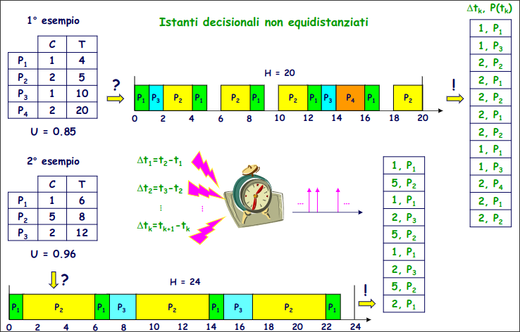

## Ambiente di esecuzione

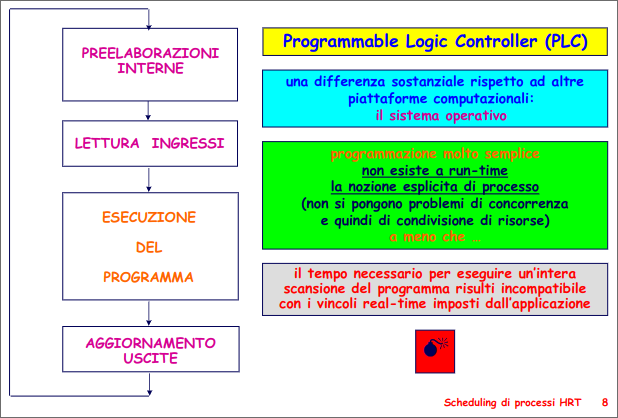

### Sequenziale

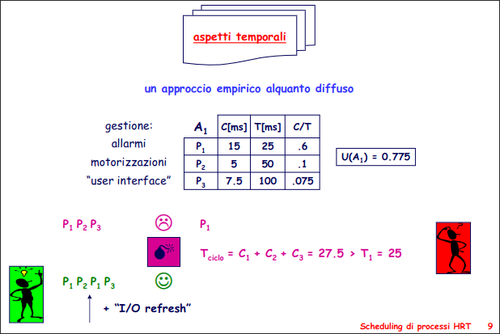

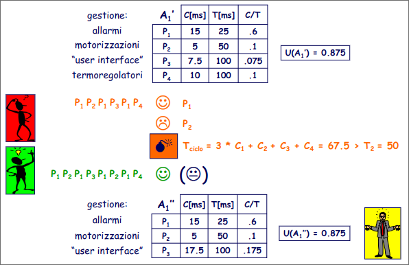

## Cyclic Executive

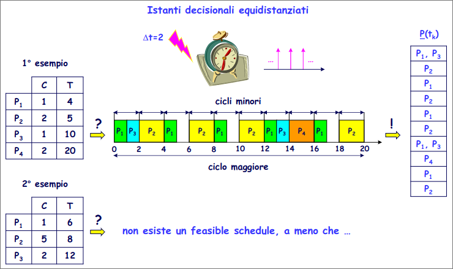

### Approccio Cyclic Executive

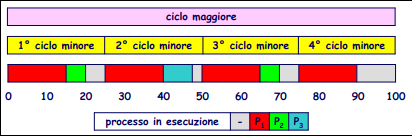

Supponiamo tre processi con periodi armonici 25, 50 e 100 ms. (20 50 100 non sono armonici)

**Ciclio Maggiore**: Periodo Maggiore
**Ciclio Minore**: Periodo Minore

In questo caso avremo tre cicli minori

Un Task $P_1$ per ogni ciclo Minore
Un Task $P_2$ per ogni due cicli Minore
Un Tast $P_3$ in un solo ciclo Minore

**PRO**: Molto semplice
**CONTRO**: Macchinoso con grandi differenze di periodo, poco applicabile

Si può aggiungere il job slicing (frammentazione di un task)

### Approccio Barker - Shaw

**Cliclo maggiore**: $mcm(T_1, T_2, ..., T_N)$

**Ciclio minore (Frame)**:

- $n mod m = 0$ un ciclo maggiore composto da un numero intero di cicli minori
- $m \geq c , \forall i$ no job preemption
- $m \leq T_i , \forall i$ in ogni ciclo maggiore vanno eseguiti tutti i task

- $2m - MCD(m,T_i) \leq T_i , \forall i \ |\  (T_i mod m) > 0$

### Costruzione di un feasable schedule

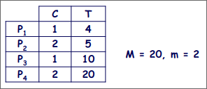

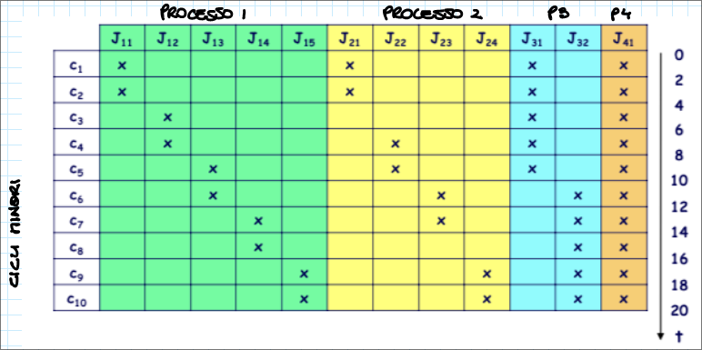

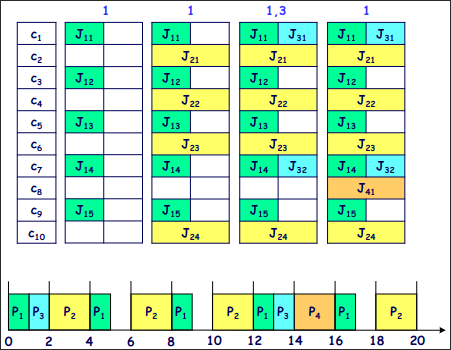

**Job Slicing**: Si può adottare dividendo i job con un tempo di elaborazione più lungo, finche non si rispetta il vincolo 5.

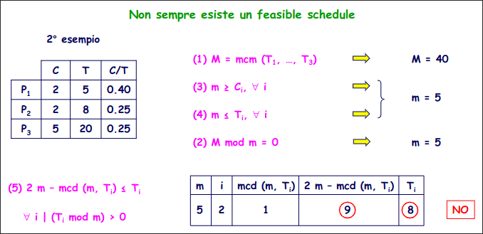

> Dopo avere identificato $n$ e $m$ si applicano criteri euristici che possono portare a risultati differenti

## Schedulazione Priority Driven

Ad ogni processo è associata una priorità statica o dinamica

Ogni processo può essere in stato:
- **Ready**: pronto per essere eseguito
- **Running**: in esecuzione
- **Idle**: in attesa di un evento

c'è preemption

### Algoritmo Rate Monotonic Priority Ordering (RMPO)

Ad ogni processo è associata una priorità statica, direttamente proporzionale alla frequenza di esecuzione.

**Algoritmo Ottimo**: Un insieme id processi a priorità astatica se non è schedulabile con RMPO non è schedulabile

## Test di schedulabilità LIU-LAYLAND

> Condizione sufficiente affinchè un insieme di $N$ processi con RMPO:
> $U \leq U_{RMPO}(N) = N(2^{\frac{1}{N}} -1)$

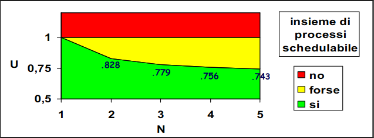

> $\lim_{N\rarr\inf} U_{RMPO}(N)=\ln 2 = 0.693$

### Corollario

Test meno stringente del teorema (che fallisce spesso)

> $U_{RMPO} = \prod_{i=1}^{N} (1+U_j)\leq 2$

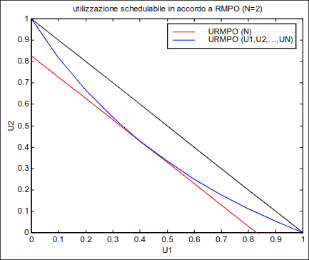

**(Caso con due processi)**

Quando i due fattori di utilizzazione sono simili il corollario da risultati simili al teorema.

Quando c'è differenza il corollario è meno stringente.

