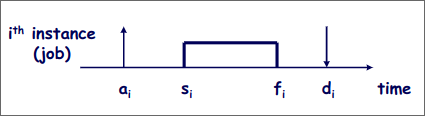
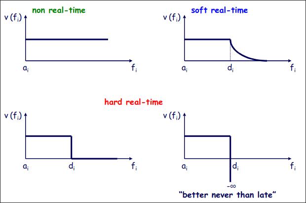

# [[00.Introduzione]]

[Link Piter](https://liveunibo-my.sharepoint.com/:o:/r/personal/pietro_focaccia_studio_unibo_it/_layouts/15/Doc.aspx?sourcedoc=%7BD195ED30-F39F-489F-8CD5-2DEA70483705%7D&file=SOM&action=edit&mobileredirect=true&wdorigin=Sharepoint&RootFolder=%2Fpersonal%2Fpietro_focaccia_studio_unibo_it%2FDocuments%2FSOM&d=wd195ed30f39f489f8cd52dea70483705&e=5%3Afa3c89b441c04712b7ed303d1b15acda&sharingv2=true&fromShare=true&at=9&CID=590ccd21-1d7c-4a1a-b106-5cff1daeaf26)

[Return](./README.md)

---

# Indice

- [\[\[00.Introduzione\]\]](#00introduzione)
- [Indice](#indice)
  - [Sistemi di elaborazione in tempo reale](#sistemi-di-elaborazione-in-tempo-reale)
  - [Sistemi in tempo reale: Aspetti principali](#sistemi-in-tempo-reale-aspetti-principali)
    - [Caratteristiche fondamentali](#caratteristiche-fondamentali)
    - [Obiettivi principali nella progettazione del software](#obiettivi-principali-nella-progettazione-del-software)
  - [Metodologia di progetto](#metodologia-di-progetto)
    - [Approccio "Top-Down"](#approccio-top-down)
  - [Aspetti temporali nei sistemi real-time](#aspetti-temporali-nei-sistemi-real-time)
    - [Vincoli temporali principali](#vincoli-temporali-principali)
    - [Tipologie di schedulazione](#tipologie-di-schedulazione)
      - [Classificazione della schedulazione](#classificazione-della-schedulazione)
  - [Tipologie di processi](#tipologie-di-processi)
  - [Parametri temporali](#parametri-temporali)
    - [Processi periodici:](#processi-periodici)
    - [Processi sporadici:](#processi-sporadici)
  - [Funzioni di utilità di un processo](#funzioni-di-utilità-di-un-processo)
  - [Problematiche nei sistemi real-time](#problematiche-nei-sistemi-real-time)
    - [Tempi di blocco](#tempi-di-blocco)
  - [Soluzioni: Protocolli di accesso](#soluzioni-protocolli-di-accesso)
    - [Obiettivi](#obiettivi)
    - [Strategie](#strategie)

## Sistemi di elaborazione in tempo reale

Un sistema di elaborazione opera in tempo reale soltanto se fornisce i risultati attesi entro prestabiliti limiti temporali (dipendenti dal contesto applicativo).

## Sistemi in tempo reale: Aspetti principali

### Caratteristiche fondamentali

- **Correttezza e affidabilità**
- **Predicibilità**: Un requisito essenziale nei sistemi critici.
- **Efficienza e flessibilità**

### Obiettivi principali nella progettazione del software

1. Rispetto dei vincoli temporali.
2. Capacità di operare in contesti applicativi complessi come l'automazione industriale (es. "Packaging Valley" in Emilia Romagna).

## Metodologia di progetto

### Approccio "Top-Down"

La progettazione di un sistema complesso si basa su una decomposizione gerarchica su più livelli (approggio "divide et impera"):

1. **Livelli funzionali**: Ogni livello individua entità con ruoli e interazioni ben definiti.
2. **Riduzione della complessità**: Man mano che si scende nella gerarchia, il numero di componenti cresce, ma la complessità di ciascun componente diminuisce.

## Aspetti temporali nei sistemi real-time

### Vincoli temporali principali

- Frequenza massima di esecuzione.
- Tempo massimo di elaborazione per ogni task.
- Deadlines rigorose.

### Tipologie di schedulazione

1. **Off-line**: Pianificazione a priori.
2. **On-line**: Pianificazione dinamica durante l'esecuzione.

#### Classificazione della schedulazione

- **Garantita**: Rispetta tutti i vincoli temporali.
- **Best-effort**: Ottimizza le prestazioni medie senza garanzie rigide.
- **Preemptive**: Consente la sospensione di un processo.
- **Non-preemptive**: I processi non possono essere interrotti.

## Tipologie di processi

1. **Real-time con vincoli temporali**:
   - **Hard real-time**: Vincoli sempre rispettati.
   - **Soft real-time**: Vincoli rispettati in condizioni di carico normale.
2. **Non real-time**: Nessun vincolo temporale rigoroso.
3. **Periodici**: Esecuzione con frequenza costante.
4. **Sporadici o Aperiodici**: Esecuzione variabile o irregolare.

## Parametri temporali

Per ogni processo $i$, vengono definiti:

- **Arrival Time ($a_i$)**: Istante di rilascio del task.
- **Start time ($s_i$)** e **Finish time ($f_i$)**.
- **Deadline ($d_i$)**: Vincolo temporale massimo.
- **Latenza ($L_i$)** e **Slack time ($X_i$)**.

- $C_i = f_i - s_i$ **computation time**.
- $D_i = d_i - a_i$ **relative deadline**.
- $R_i = f_i - a_i$ **response time**.
- $L_i = f_i - d_i$ **lateness**.
- $E_i = max(0, L_i)$ **tardiness (exceeding time)**.
- $X_i = D_i - C_i$ **laxity (slack time)**: Tempo massimo in cui si può differire un task senza problemi.

### Processi periodici: 
- $a_(i+1) - a_i = T$ (periodo)
- $D_i = T$
- $a_1 = \varphi$ (fase)
  
### Processi sporadici:
- $a_(i+1) - a_o \geq MIT$ (minimum interarrival time)
- $D_i \leq MIT$

## Funzioni di utilità di un processo

## Problematiche nei sistemi real-time

1. **Inversione di priorità**: Quando processi a bassa priorità bloccano quelli ad alta priorità.
    Per evitare si usa l'ereditarietà delle priorità, se un processo a minor priorità blocca un task a maggior priorità eredita la sua priorità.
2. **Concatenazione di blocchi**: Multipli processi si bloccano a vicenda su risorse condivise.
3. **Deadlock**: Situazioni in cui due o più processi sono in stallo permanente a causa di risorse condivise.
    **Tipi di blocchi**:
    - **Inevitabile**: Accesso mutualmente esclusivo.
    - **Evitabile**: Concatenazione di blocchi.
    - **Da evitare**: Inversione di priorità incontrollata.

### Tempi di blocco

- **Concatenazione di blocchi**: $\rarr$ Limitati, ma potenzialmente significativi.
- **Inversione di priorità**: $\rarr$ Illimitati.
- **Deadlock**: $\rarr$ Infiniti

## Soluzioni: Protocolli di accesso

### Obiettivi

- Limitare i tempi di blocco dei processi.
- Evitare inversioni di priorità e deadlock.
- Garantire un accesso efficiente alle risorse condivise.

### Strategie

1. Gestione delle priorità.
2. Regole di ordinamento per accessi a risorse condivise.
3. Utilizzo di semafori e protocolli avanzati per sincronizzazione.

